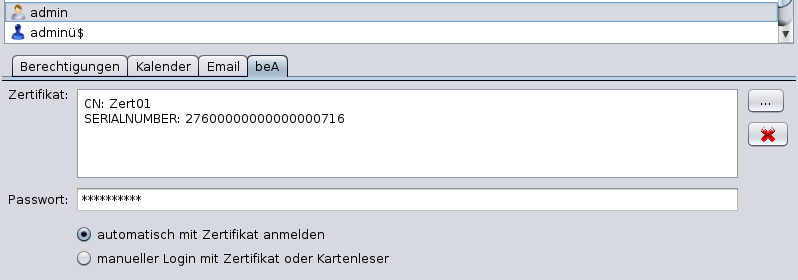

# Add-Ons: besonderes elektronisches Anwaltspostfach beA

### Allgemeines zur beA-Integration

j-lawyer.org ermöglicht eine grundsätzliche Arbeit mit einem oder mehreren beA-Postfächern direkt aus der Anwendung heraus:
- Zugriff auf ein oder mehrere Postfächer

- Empfangen von Nachrichten

- Export von Nachrichten in eine Akte

- Senden von Nachrichten

- Anfordern, Abgeben oder Zurückweisen von elektronischen Empfangsbekenntnissen (eEB)

- Zugriff auf das beA-Adressverzeichnis

- Import von Gerichtsadressen

- Übernahme von Safe-IDs in vorhandene Adressen

Hinweis: j-lawyer.org-Anwender nutzen die Integration auf eigenes Risiko. Das bedingt dass bspw. der korrekte Versand und Empfang nach Bedarf über die beA-Weboberfläche kontrolliert werden.

### Voraussetzungen {#voraussetzungen}

Aktuell ist für den Zugang zum beA ein Softwarezertifikat notwendig. Es ersetzt in der Nutzung weitgehend die beA Smartcards, und ist im Allgemeinen komfortabler anzuwenden. Bei der Nutzung in j-lawyer.org werden die Zertifikate nutzerspezifisch hinterlegt und weder Zertifikat noch Passwort gelangen in den Besitz der Nutzer der Kanzleisoftware.

Ein Zugang per Smartcard ist für Version 1.11 geplant.

Weitere Voraussetzungen im Überblick:
- Vollständig in Betrieb genommenes beA-Postfach (hier nicht weiter ausgeführt, da bereits eine passive Nutzungspflicht besteht (“Empfangsbereitschaft”)).

- beA Softwarezertifikat. Das Softwarezertifikat ist nicht zum Signieren von Schriftsätzen gedacht, es ersetzt vielmehr das Hantieren mit Smartcard und Kartenleser zwecks Anmeldung am beA. Es kann zu einem Jahrespreis von 4,90 EUR unter der Bezeichnung “beA-Softwarezertifikat” bei der Bundesnotarkammer bezogen werden: <https://bea.bnotk.de/bestellung/#/products/18393998> Der Erstellprozess ist hier detailliert beschrieben: <https://bea.bnotk.de/documents/Anleitung_Erstellung-Softwarezertifikate.pdf> Bitte unbedingt das beim Generieren des Zertifikats verwendete Passwort notieren.

- Einrichtung des Softwarezertifikats als zusätzlicher Sicherheitstoken für ein Postfach: <https://www.brak.de/zur-rechtspolitik/newsletter/bea-newsletter/2016/ausgabe-2-2016-v-14122016.news.html#hl75740>

Wiederholt konnte beobachtet werden, dass die beA Clientsecurity das bei der Bundesnotarkammer genutzte Zertifikatspasswort nicht akzeptierte und so ein Import des Softwarezertifikates nicht möglich war. In diesem Fall gibt es eine “Notlösung”, das Zertifikatspasswort mit Hilfe von Mozilla Firefox zu ändern. Der Prozess wurde durch die Bundesnotarkammer hier dokumentiert: <https://bea.bnotk.de/documents/Softwarezertifikate_PIN_aendern_190730.pdf>

Sind alle Voraussetzungen erfüllt, so kann mit der Inbetriebnahme im j-lawyer.org Client fortgefahren werden.

### Inbetriebnahme in j-lawyer.org {#inbetriebnahme}

Im Folgenden werden die Schritte zur vollständigen Inbetriebnahme der beA-Integration beschrieben:
- Starten Sie den j-lawyer.org Client mit einem Nutzer der über administrative Berechtigungen verfügt.

- Öffnen Sie die globalen beA-Einstellungen über das Menü "Einstellungen" und den Menüpunkt "beA (Anwaltspostfach)". Stellen Sie die bea-Integration dort auf "an".

- Öffnen Sie die Nutzerverwaltung: Menü “Einstellungen”, Menüpunkt “Nutzerverwaltung”.

- Markieren Sie den Nutzer, welcher mit einem oder mehreren beA-Postfächern arbeiten soll.

- Im Tab “beA” kann nun über den “...”-Knopf (“Zertifikat uploaden”) das Softwarezertifikat samt PIN/Passwort hinterlegt werden. Ist der Upload erfolgreich, so werden Seriennummer und weitere Informationen angezeigt.

- Abschließend aktivieren Sie die automatische oder manuelle Anmeldung. Bei automatischer Anmeldung wird das beA-Postfach bereits beim Start des j-lawyer.org Clients geöffnet und auf neu eingegangene Nachrichten geprüft. Bei manueller Anmeldung muss das Postfach explizit geöffnet werden (durch Navigation zur Posteingangssicht im linken Navigationsbaum). In diesem Fall findet eine Nachfrage statt, ob mit dem hinterlegten Softwarezertifikat oder der Smartcard angemeldet werden soll.

### Anzeige des Übermittlungsstatus

Im Kopf einer angezeigten beA-Nachricht wird rechten Teil der Übermittlungsstatus angezeigt. Der Status wird durch eine Farbe angezeigt. Details zum angezeigten Status sind als Mouse-Over-Text des Icons verfügbar.

Die Anzeige folgt folgenden Regeln:
- empfangene Nachricht: neutral

- versendete Nachricht mit "gutem" Journal an Nicht-EGVP: grün

- versendete Nachricht mit "schlechtem" Journal an Nicht-EGVP: rot

- versendete Nachricht mit "gutem" Journal und gutem Laufzettel an EGVP: grün

- versendete Nachricht mit "gutem" Journal und fehlendem Laufzettel an EGVP: orange

- versendete Nachricht mit "schlechtem" Journal oder schlechtem Laufzettel an EGVP: rot

Hinweis: EGVP-Laufzettel sind in der Regel nur in der gesendeten beA-Nachricht, welche zur Akte gespeichert wurde, verfügbar. Die Anzeige der Nachricht im „Gesendet“-Ordner des beA-Posteingangs hat keinen Zugriff auf die Laufzettel.

### Beschränkungen bei Nutzung der beA-Integration

Die Nutzung von beA-Postfächern in j-lawyer.org unterliegt folgenden Beschränkungen:
- Der Status “gelesen” / “ungelesen” bezieht sich ausschließlich auf das Abrufen / Lesen der Nachrichten über die beA-Weboberfläche. Ein Abruf von Nachrichten über die von der BRAK zur Verfügung gestellte Schnittstelle wird nicht als Lesevorgang gewertet. Außerdem ist ein explizites Setzen des “gelesen” / “ungelesen”-Status über die Schnittstelle nicht möglich. Es handelt sich hier um Beschränkungen der von der BRAK bereitgestellten Schnittstelle – j-lawyer.org kann diesbezüglich keine Verbesserung implementieren.
