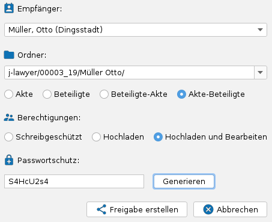

# Add-Ons: Nextcloud-Integration {#nextcloud}

Nextcloud (<https://nextcloud.com>) ist eine Open Source Cloudlösung, die sich auch selbst installieren und betreiben lässt. Sie beinhaltet u.a. Dateispeicherung und -freigaben, Kalender, Kontakte, E-Mail, u.v.m.

## Nextcloud-Installation für Dokumentfreigaben nutzen {#konfiguration}

Die Verbindungs- und Zugangsinformationen werden über die Nutzerverwaltung an den gewünschten Nutzerkonten hinterlegt.

### Erforderliche Angaben

| Feld | Beschreibung |
|------|--------------|
| **Servername** | Name des Servers ohne Protokoll (ohne http / https), z.B. `www.advobox.com` |
| **Port** | 443 wenn der Server HTTPS unterstützt, ansonsten in der Regel 80 oder 8080 |
| **Pfad** | Unterverzeichnis, in welchem die Nextcloud installiert ist |
| **SSL** | Aktivieren, wenn der Server HTTPS unterstützt, ansonsten inaktiv setzen |
| **Nutzername** | Benutzername für diese Nextcloud |
| **Passwort** | Passwort des Nutzers |

!!! info "Hinweise zur Pfad-Angabe"
    - Ist die Nextcloud direkt unter einer Domain abrufbar (z.B. `https://cloud.musterkanzlei-12345.de`), bleibt die Pfadangabe **leer**.
    - Wird die Nextcloud über ein Unterverzeichnis abgerufen (z.B. `https://www.musterkanzlei-12345.de/meinecloud`), ist der Wert `meinecloud` (ohne Anführungszeichen) als Pfad anzugeben.

### Flexible Nutzerkonfiguration

Die Verknüpfung mit dem Nutzer der Kanzleisoftware bietet größtmögliche Flexibilität:

- Gemeinsame Nutzung eines Nextcloud-Zugangs für alle Mitarbeiter der Kanzlei
- Nutzung separater Nextcloud-Zugänge je Kanzleisoftwarenutzer (unterschiedliche Berechtigungen / Inhalte)
- Nutzung völlig unterschiedlicher Nextcloud-Installationen (z.B. in Bürogemeinschaften)

## Freigeben von Dokumenten {#dokumente-freigeben}

Nach erfolgreicher Verknüpfung eines Nextcloud-Zugangs können aus der Akte heraus Dokumente freigegeben werden.

### Dokumente zur Freigabe auswählen

1. Öffnen Sie die gewünschte Akte
2. Wählen Sie im Dokumentenbereich ein oder mehrere Dokumente aus
3. Klicken Sie auf das Aktionsmenü und wählen Sie **Freigabe senden**

### Der Freigabe-Dialog

Im Freigabe-Dialog haben Sie zwei Möglichkeiten:

- **Vorhandene Freigabe nutzen**: Wählen Sie eine bereits existierende Freigabe aus der Liste und laden Sie die Dokumente dorthin hoch
- **Neue Freigabe erstellen**: Erstellen Sie eine neue Freigabe mit individuellen Einstellungen

#### Bestehende Freigaben durchsuchen

Die Liste zeigt alle vorhandenen Ordner-Freigaben an. Mit dem Suchfeld können Sie die Liste filtern, um schnell die gewünschte Freigabe zu finden.

### Neue Freigabe erstellen

Beim Erstellen einer neuen Freigabe stehen folgende Optionen zur Verfügung:

#### Empfänger auswählen

Wählen Sie einen der Beteiligten der Akte als Empfänger der Freigabe aus. Der Empfänger wird für die automatische Ordnerstruktur verwendet.

#### Ordnerstruktur

Die Ordnerstruktur kann automatisch basierend auf Aktenzeichen und/oder Empfänger generiert werden:

| Option | Beispiel-Struktur |
|--------|-------------------|
| **Akte** | `j-lawyer/12345-2024/` |
| **Beteiligte** | `j-lawyer/Müller, Max/` |
| **Akte-Beteiligte** | `j-lawyer/12345-2024/Müller, Max/` |
| **Beteiligte-Akte** | `j-lawyer/Müller, Max/12345-2024/` |

Alternativ können Sie auch einen bestehenden Ordner aus der Dropdown-Liste auswählen oder einen eigenen Pfad eingeben.

!!! warning "Bereits freigegebene Ordner"
    Wenn ein Ordner bereits freigegeben ist, wird dies durch einen roten Hinweis angezeigt. In diesem Fall sollten Sie die bestehende Freigabe verwenden.

#### Berechtigungen

| Option | Beschreibung |
|--------|--------------|
| **Schreibgeschützt** | Der Empfänger kann nur lesen und herunterladen (Standard) |
| **Hochladen** | Der Empfänger kann zusätzlich neue Dateien hochladen |
| **Hochladen und Bearbeiten** | Der Empfänger kann hochladen und vorhandene Dateien bearbeiten |

#### Passwortschutz

Optional kann die Freigabe mit einem Passwort geschützt werden:

- Lassen Sie das Feld leer für eine Freigabe ohne Passwort
- Klicken Sie auf **Generieren**, um ein zufälliges, sicheres Passwort zu erstellen
- Oder geben Sie ein eigenes Passwort ein

!!! info "Automatische Passwortübernahme"
    Wurde für den ausgewählten Beteiligten bereits ein individuelles Passwort hinterlegt (über das Schloss-Symbol im Kopfbereich eines Adressbucheintrages, siehe [Dokumente verschlüsselt versenden](dokumentenmanagement/verschluesselung.md)), wird dieses Passwort automatisch in das Passwortfeld übernommen. So können für einen Mandanten sowohl verschlüsselte PDFs als auch Cloud-Freigaben mit demselben Passwort geschützt werden.

!!! tip "Empfehlung: Passwort bei Mandatsaufnahme vergeben"
    Es kann sinnvoll sein, die Vergabe eines individuellen Passworts zum Standardprozedere bei der Aufnahme neuer Mandantinnen und Mandanten zu machen. So steht das Passwort später für verschlüsselte Dokumente und Cloud-Freigaben sofort zur Verfügung.

!!! note "Sicherheitshinweis"
    Die Freigabelinks in Nextcloud sind willkürliche Ziffer-Buchstaben-Kombinationen, die nicht zu erraten sind. Eine Freigabe ohne Passwort ist daher akzeptabel, wenn der Freigabelink auf sicherem Weg übertragen wird (z.B. per verschlüsselter E-Mail oder Messenger wie Signal oder WhatsApp).

### Freigabelink versenden

Nach dem Erstellen der Freigabe gibt es zwei Möglichkeiten, den Link zu übermitteln:

| Option | Beschreibung |
|--------|--------------|
| **Freigeben (Zwischenablage)** | Der Freigabelink wird in die Zwischenablage kopiert |
| **Freigeben (E-Mail)** | Es öffnet sich ein E-Mail-Versandfenster mit voreingetragenem Link |

!!! info "Platzhalter in E-Mail-Vorlagen"
    Soll für den Versand per E-Mail eine Vorlage verwendet werden, kann der Freigabelink als Platzhalter `{{CLOUD_LINK}}` eingebunden werden.

### Gültigkeitsdauer

Die voreingestellte Gültigkeitsdauer für Freigaben beträgt **30 Tage**.

### Benachrichtigungen bei Downloads

Nextcloud kann E-Mail-Benachrichtigungen versenden, wenn ein Empfänger Daten aus einer Freigabe herunterlädt. So können Sie nachvollziehen, ob und wann ein Mandant die freigegebenen Dokumente abgerufen hat.

!!! info "Konfiguration in Nextcloud"
    Die Benachrichtigungen werden nicht in j-lawyer.org, sondern direkt in der Nextcloud-Oberfläche konfiguriert. Melden Sie sich in Ihrer Nextcloud an und öffnen Sie die **Einstellungen** → **Benachrichtigungen**. Dort können Sie festlegen, für welche Ereignisse Sie per E-Mail benachrichtigt werden möchten. Die relevanteste Benachrichtigung ist "Öffentlich oder per E-Mail geteilte Datei oder geteilter Ordner wurde heruntergeladen" - dort sollte die Benachrichtigung per E-Mail aktiviert werden.

## Synchronisieren des Adressbuchs {#adressbuch-sync}

Adressen einer j-lawyer.org Installation können in eine Nextcloud synchronisiert werden. Dabei werden alle Adressbucheinträge synchronisiert, die in mindestens einer Akte als Beteiligte geführt sind.

### Vorbereitung

Legen Sie in der Oberfläche der Nextcloud ein separates Adressbuch an, welches ausschließlich in Verbindung mit j-lawyer.org verwendet wird. So kann das Adressbuch bei Bedarf vollständig neu synchronisiert oder neu aufgebaut werden, ohne andere Adressdaten zu beeinflussen.

### Konfiguration

1. Öffnen Sie **Einstellungen** → **Adressen** → **Synchronisation konfigurieren**
2. Stellen Sie die Verbindung zur Nextcloud-Installation her
3. Wählen Sie das gewünschte Zieladressbuch aus
4. Optional: Deaktivieren Sie das Synchronisieren von Geburtsdaten (um überflüssige Geburtstagsbenachrichtigungen an mobilen Geräten zu vermeiden)

### Synchronisation durchführen

- **Erstsynchronisation**: Menü **Einstellungen** → **Adressen** → **Synchronisation ausführen**
- **Laufende Synchronisation**: Alle weiteren Datenänderungen werden automatisch im Hintergrund in die Nextcloud übertragen

### Mobile Geräte anbinden

Bzgl. des Anbindens mobiler Geräte und Mailprogramme, um die Adressdaten auch dort im Zugriff zu haben, konsultieren Sie bitte die Nextcloud-Dokumentation: <https://docs.nextcloud.com/server/latest/user_manual/de/groupware/contacts.html>

## Synchronisieren der Kalender {#kalender-sync}

Termine, Wiedervorlagen und Fristen einer j-lawyer.org Installation können in eine Nextcloud synchronisiert werden. Dabei werden alle offenen / noch nicht erledigten Einträge synchronisiert; erledigte Einträge werden aus Nextcloud entfernt.

### Vorbereitung

Legen Sie in der Oberfläche der Nextcloud separate Kalender an, welche ausschließlich in Verbindung mit j-lawyer.org verwendet werden. So können diese Kalender bei Bedarf vollständig neu synchronisiert oder neu aufgebaut werden, ohne andere Kalenderdaten zu beeinflussen.

### Konfiguration

Es ist möglich:

- Für jeden Kalender der Kanzleisoftware einen eigenen Nextcloud-Kalender anzubinden
- Mehrere Kanzleisoftwarekalender in denselben Nextcloud-Kalender zu synchronisieren

**Einrichtung:**

1. Öffnen Sie **Einstellungen** → **Kalender** → **Kalender und Synchronisation konfigurieren**
2. Verknüpfen Sie die gewünschten Kalender

### Synchronisation durchführen

- **Erstsynchronisation**: Menü **Einstellungen** → **Kalender** → **Synchronisation ausführen**
- **Laufende Synchronisation**: Alle weiteren Datenänderungen werden automatisch im Hintergrund in die Nextcloud übertragen

### Verhalten bei erledigten Einträgen

Das "erledigt"-Setzen von Kalendereinträgen führt standardmäßig zum Löschen des dazugehörigen Eintrages im Nextcloud-Kalender.

!!! tip "Option deaktivieren"
    Ist dieses Verhalten nicht erwünscht, kann in den Einstellungen des Kalenders die Option **"erledigte Termine aus Nextcloud löschen"** deaktiviert werden.

### Mobile Geräte anbinden

Bzgl. des Anbindens mobiler Geräte und Mailprogramme konsultieren Sie bitte die Nextcloud-Dokumentation: <https://docs.nextcloud.com/server/latest/user_manual/de/groupware/calendar.html>
