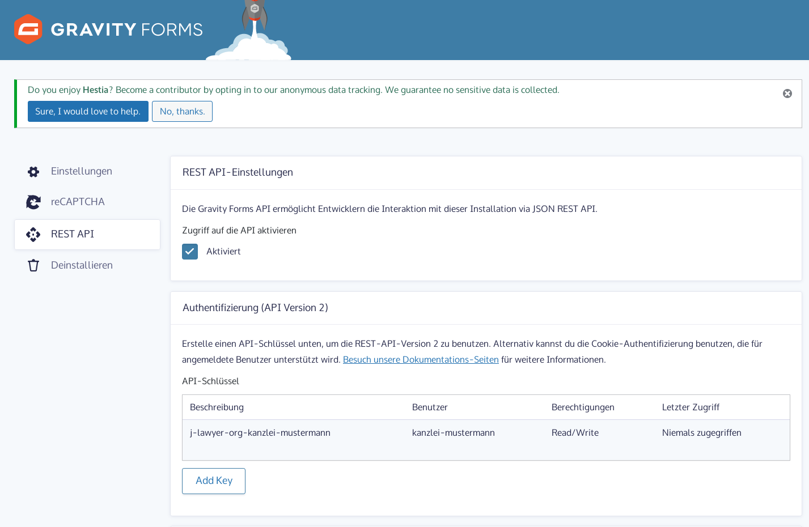
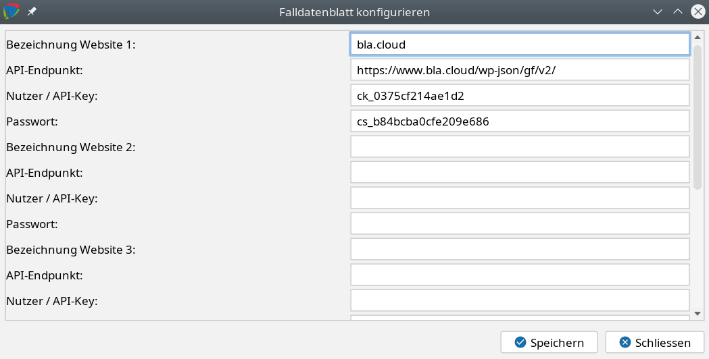
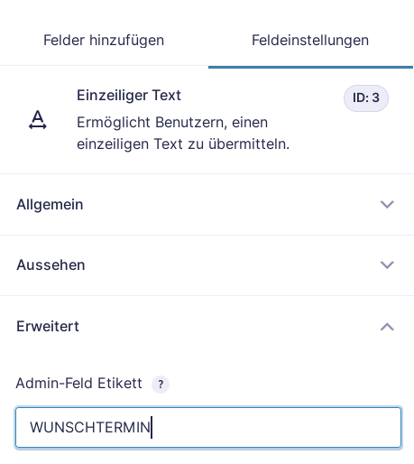

# Systemadministration

### Aktenzeichen bearbeiten / ändern {#aktenzeichen-bearbeiten}

In Ausnahmefällen kann es notwendig sein, ein automatisch vergebenes Aktenzeichen manuell anzupassen. Für diese Fälle kann wie folgt verfahren werden:
- Menü “Einstellungen”, Menüpunkt “Administrator-Konsole”
- Eingabe des Befehls setrefno ALTESAZ NEUESAZ, bspw
- setrefno 00345/18 00348/17

Dabei werden keine eventuell in Dokumenten vorhandene Aktenzeichen angepasst, und es findet keine Prüfung des neuen Aktenzeichens statt. Stellen Sie sicher dass es noch nicht vergeben ist.

Die Änderung arbeitet ausschließlich mit den “einfachen” Aktenzeichen. Ist im Aktenzeichenschema die Aktenzeichenerweiterung aktiviert, so ist eine Änderung des Aktenzeichens möglich, unter Beibehaltung der aktuellen Aktenzeichenerweiterung der betroffenen Akte.

Seit Version 2.6 ist die Änderung des Aktenzeichens zusätzlich auch direkt in der Akte möglich (Stiftsymbol hinter dem Aktenzeichen). Auch hier ist die Funktionalität Nutzern mit administrativen Rechten vorbehalten.

### Passwortkomplexität {#passwortkomplexitaet}

Im Menü “Einstellungen”, Menüpunkt “Sicherheit” kann eingestellt werden, dass Nutzer ausschließlich Passwörter mit einer hohen Komplexität vergeben können. Komplexe Passwörter sind in den Voreinstellungen aktiviert.

Als hinreichend komplex gelten Passwörter die die folgenden Kriterien erfüllen:
- mindestens 8 Zeichen lang
- enthält Kleinbuchstaben
- enthält Großbuchstaben
- enthält Ziffern
- enthält mindestens eines der folgenden Sonderzeichen: -_@#$%^&+=

Der Dialog zur Passworterstellung / -änderung zeigt an, ob die Komplexität schwach, mittel oder stark ist.

### Netzwerkeinstellungen für Mehrbenutzerbetrieb

Wird das System mit mehren Arbeitsplätzen im Netzwerk verwendet, so sind folgende Voraussetzungen zu erfüllen:
- Das Gerät mit dem j-lawyer.org Server sollte über eine feste IPv4 verfügen. Es empfiehlt sich diese Einstellung am DHCP-Server vorzunehmen, in kleinen Netzwerken ist diese Funktion bspw. in gängige Router integriert.
- Für alle Client-Versionen bis einschliesslich 1.9: Der j-lawyer.org Server muss an die feste IP “gebunden” werden. Verbinden Sie dazu mit einem lokal laufenden j-lawyer.org Client und öffnen Sie “Einstellungen” - “Administratorkonsole”. Rufen Sie den Befehl “getbindings” auf.  Im Fall einer falschen Konfiguration erscheint eine Ausgabe wie folgt:
- server misconfigured! use setbindings command to correct.
 setbindings 192.168.178.24
- Führen Sie dann den in der zweiten Zeile angegebenen Befehl aus und starten Sie anschließend den j-lawyer.org Server neu.

### Portkonflikte beheben

Der j-lawyer.org Server “lauscht” an verschiedenen Ports auf eingehende Netzwerkverbindungen, so bspw. auch auf Port 8080. Eine vollständige Liste der verwendeten Ports findet man im Installationsverzeichnis des Servers, dort unter \wildfly\standalone\configuration\standalone.xml:

Sollte es einen Portkonflikt geben, so kann entweder der betroffene Port direkt geändert werden, oder es kann ein “Offset” definiert werden, bspw. “100” um auf alle Portkonfigurationen den Wert 100 zu addieren. Die Angabe erfolgt in der obersten dargestellten Zeile, bspw. Wie folgt:

<socket-binding-group name="standard-sockets" default-interface="public" port-offset="${jboss.socket.binding.port-offset:0}">

ändern in

<socket-binding-group name="standard-sockets" default-interface="public" port-offset="${jboss.socket.binding.port-offset:100}">

Die Änderung erfordert einen Neustart des j-lawyer.org Servers.

### Datensicherung und -synchronisation {#datensicherung}

j-lawyer kann sämtliche Daten iterativ in einem bestimmten Ordner zusammenstellen. Von dort kann die Sicherung bspw. auf USB-Stick kopiert werden.

Um die automatische Datensicherung zu nutzen, können alle erforderlichen Einstellungen direkt im j-lawyer Client unter „Administration“ – „Datensicherung“ vorgenommen werden.

Im gleichen Dialog kann ein Sofort-Backup erstellt werden.

Sofern ein Verschlüsselungspasswort angegeben wird, werden alle ZIP-Archive der Datensicherung verschlüsselt und passwortgeschützt. Stellen Sie sicher dass das Passwort nicht verloren geht – nur mit diesem Passwort ist eine Rücksicherung möglich.

Es wird empfohlen eine Administrator-Email (unter „Administration“ – „Systempostfach“ sowie „Administration“ – „Servermonitoring“ - „Einstellungen“) zu hinterlegen – Sie erhalten dann eine Zusammenfassung per E-Mail, sobald die Datensicherung abgeschlossen ist.

Es ist dringend empfohlen, die Datensicherungen regelmäßig auf einem externen Speicher abzulegen und nicht ausschließlich auf dem j-lawyer.org Server zu archivieren (bspw. für den Fall eines Festplattendefekts). Dazu kann in der Registerkarte “Synchronisation” ein Abgleich mit einem externen Speicherort eingestellt werden. Unterstützt werden
- Windows-Freigaben
- Samba-Freigaben
- SFTP (SSH)-Server
- anderer lokaler Ordner (sinnvoll bspw. wenn es auf dem j-lawyer.org Server ein Verzeichnis gibt, das mit Clouddiensten synchronisiert wird).

Konfigurationsbeispiel: Windows-Freigabe

Nach dem Anlegen einer Freigabe – entweder passwortgeschützt oder anonym nutzbar – bitte zuerst prüfen, ob die Freigabe korrekt aufrufbar ist. Der sogenannte UNC-Pfad ist wie folgt aufgebaut: \\RECHNERNAME\FREIGABENAME, also bspw. \\meinpc\meinefreigabe. Bitte zuerst prüfen, ob auf diesen Pfad zugegriffen werden kann, bspw. durch Kopieren des Pfades in den Windows Explorer.

Anschließend kann die Freigabe wie folgt im j-lawyer.org Client eingetragen werden:

Konfigurationsbeispiel: Synchronisation per SSH

Die Synchronisation per SFTP / SSH eignet sich insbesondere für die Spiegelung auf ein Linux oder macOS-Gerät. Ggf. ist vorab ein extra Nutzer zu erstellen. Von der Verwendung von „root“ wird aus Sicherheitsgründen abgeraten.

Soll mit dem Nutzer „anwalt“ per SSH zum Gerät mit IP 192.168.178.10 verbunden werden und in dessen Ordner „/home/anwalt/datensicherung“ synchronisiert werden, so kann der Zugang vorab wie folgt geprüft werden: im Terminal

ssh anwalt@192.168.178.10

(Passwort eingeben)

cd /home/anwalt/datensicherung

Sind die Verbindung und der Verzeichniswechsel ohne Fehlermeldung möglich, so werden die Daten wie wie folgt im j-lawyer.org Client eingetragen:

Konfigurationsbeispiel: anderer lokaler Ordner

Soll die Datensicherung innerhalb des Servers in ein anderes Verzeichnis synchronisiert werden, so ist der vollständige Pfad anzugeben. Da es sich um einen lokalen Zugriff handelt, sind Rechnername, Nutzername und Passwort leer zu lassen.

Stellen Sie in jedem Fall sicher, daß der externe Speicherplatz vor Fremdzugriffen ausreichend gesichert ist! Nutzen Sie idealerweise die Möglichkeit, Datensicherungen automatisch zu verschlüsseln / mit einem Passwort zu schützen. 
Auch wenn die Synchronisation direkt nach der Datensicherung ausgeführt wird, ist es nicht zwingend notwendig, dass der externe Speicher zum Zeitpunkt der Datensicherung verfügbar ist. Das System wird stündlich eine Synchronisation probieren. So ist es möglich, in einem Kanzleinetzwerk eine Synchronisation auf einen “normalen” Arbeitsplatzrechner durchzuführen der nur zur üblichen Bürozeiten eingeschaltet ist.

### Datensicherung auf USB-Medien

Hinweis zur Sicherung auf USB-Medien unter Windows: je nachdem welche und wieviele USB-Geräte an einem PC verwendet werden, ist ein USB-Speichermedium unter verschiedenen Laufwerksbuchstaben eingebunden. Somit ist eine Synchronisation bspw. nach E:\Datensicherung unter Umständen keine zuverlässig funktionierende Konfiguration.

Abhilfe kann wie folgt geschaffen werden: Via "Rechte Maustaste auf die Start-Taste / Computerverwaltung / Datenspeicher / Datenträgerverwaltung / eingesteckten USB-Stick auswählen / rechte Maustaste ‚Laufwerksbuchstaben und -pfade ändern‘ / erneut auf ‚Ändern‘ klicken / ‚Folgenden Laufwerksbuchstaben zuweisen‘“ wird dem USB-Speichermedium ein fester Laufwerksbuchstabe zugewiesen. Es empfiehlt sich einen Buchstaben weiter hinten im Alphabet zu verwenden, bspw. ab I:\.

Auch bei regelmäßigem Entfernen des USB-Speichers sowie bei Verwendung weiterer USB-Geräte ist so sichergestellt, dass das Speichermedium immer den selben Laufwerksbuchstaben erhält.

### Daten aus einer Sicherung wiederherstellen (über Backupmanager)

Eine Wiederherstellung Ihrer Daten aus einem Backup ist über die separate Anwendung “j-lawyer.org Backupmanager” möglich:
- Stoppen Sie den j-lawyer – Server
- Kopieren Sie die Datensicherung auf das Gerät, auf welchem der j-lawyer.org Server läuft
- Starten Sie den Backupmanager über das Startmenü. Sollte die Installation nicht über eine grafische Oberfläche verfügen (bspw. Minimalinstallation eines Linuxservers), so öffnen Sie eine Konsole, wechseln Sie in das Verzeichnis Ihrer j-lawyer.org Serverinstallation, Unterverzeichnis “backupmgr”, und starten dort “java -jar j-lawyer-backupmgr.jar -console”
- Geben Sie die Pfade zu den Verzeichnissen mit der einzuspielenden Datensicherung sowie dem aktuell genutzten Datenverzeichnis des j-lawyer.org Servers an, sowie das MySQL-root-Passwort und optional das Verschlüsselungspasswort, mit welchem die Datensicherung verschlüsselt wurde.
- Folgen Sie den Anweisungen.

Abschließend starten Sie Ihren j-lawyer.org Server neu. Wurde der Backupmanager mit einem anderen Nutzer ausgeführt, als für die Ausführung des j-lawyer.org Servers verwendet wird, so sind ggf. Berechtigungen auf das Datenverzeichnis anzupassen. Der Nutzer des j-lawyer.org Servers muss Schreibberechtigungen im Datenverzeichnis haben.

macOS: Auf macOS muss der Backupmanager als administrativer Nutzer (root-Rechte) gestartet werden. Nutzen Sie daher einen Nutzer mit administrativen Rechten zum Starten des Backupmanagers, oder starten Sie die Anwendung über “sudo”:
- Terminal öffnen
- cd /Applications/j-lawyer-server/j-lawyer-backupmgr/j-lawyer-backupmgr.app/Contents/MacOS
- sudo ./JavaApplicationStub

Danach wählen Sie den Ordner in welchem die Datensicherung liegt, bspw. “/Users/anwalt123/Downloads/j-lawyer-backup”, geben das Datenbankpasswort und optional das Passwort ein, welches zur Verschlüsselung der Datensicherung genutzt wurde. Das j-lawyer.org Datenverzeichnis lautet “/Applications/j-lawyer-server/j-lawyer-data”. Über “Wiederherstellen” startet der Wiederherstellungsvorgang.

Wurde der Backupmanager mit einem anderen Nutzer ausgeführt, als für die Ausführung des j-lawyer.org Servers verwendet wird, so sind ggf. Berechtigungen auf das Datenverzeichnis anzupassen. Der Nutzer des j-lawyer.org Servers muss Schreibberechtigungen im Datenverzeichnis haben.

Achtung: Haben sie zwischen dem Zeitpunkt der Erstellung der Datensicherung und dem Zeitpunkt des Rückspielens der Datensicherung ein oder mehrere j-lawyer-Versionsupdates eingespielt, so müssen Sie die Datenbank-Updatescripts auf die wiederhergestellte Datenbank anwenden.

### Daten aus einer Sicherung wiederherstellen (j-lawyer.BOX)

Für Nutzer einer j-lawyer.BOX ist das Wiederherstellen aus einem Backup direkt über den Logindialog des j-lawyer.org Clients möglich:
- Kopieren Sie alle zur Sicherung gehörenden Dateien und Verzeichnisse in ein Verzeichnis “restore” in der Dateifreigabe “j-lawyer-share” der j-lawyer.BOX. Existiert das Verzeichnis “restore” noch nicht, so erstellen Sie es.
- Öffnen Sie einen j-lawyer.org Client. Im Logindialog tragen Sie die Verbindungsinformationen der j-lawyer.BOX ein. Anschließend wird im Tab “j-lawyer.BOX” das root-Passwort (Betriebssystemnutzer der j-lawyer.BOX) eingegeben und der Button “j-lawyer.BOX mittels Datenrücksicherung resetten” genutzt. Auf Rückfrage geben Sie das Datenbankpasswort und optional das Verschlüsselungspasswort Ihrer Datensicherung ein. Anschließend beginnt die Rücksicherung und der Dienst der j-lawyer.BOX wird automatisch neu gestartet.
- Die Rücksicherung wird in einer Datei “restore.log” im Wurzelverzeichnis der Dateifreigaben der j-lawyer.BOX protokolliert. Im Fehlerfall sowie zur Kontrolle kann der Inhalt der Datei geprüft werden.

Achtung: Haben sie zwischen dem Zeitpunkt der Erstellung der Datensicherung und dem Zeitpunkt des Rückspielens der Datensicherung ein oder mehrere j-lawyer-Versionsupdates eingespielt, so müssen Sie die Datenbank-Updatescripts auf die wiederhergestellte Datenbank anwenden.

### Daten aus einer Sicherung wiederherstellen (manuell)

Eine Wiederherstellung Ihrer Daten aus einem Backup ist über folgende Schritte möglich:
- Stoppen Sie den j-lawyer – Server
- Entpacken Sie die vom j-lawyer.org Server erstellte(n) Backup-ZIP-Datei(en)

Unter Linux nutzen Sie Ihr favorisiertes Packprogramm ihres Window Managers oder nutzen das Terminal:

unzip <Dateiname>

Unter Windows kann ich das kostenlose Programm 7zip empfehlen.
- Datenbank einspielen

Öffnen Sie eine Eingabeaufforderung / Terminal und wechseln Sie in das Verzeichnis, in welches Sie die ZIP-Datei entpackt haben. Von dort starten Sie den MySQL-Kommandozeilen-Client

mysql -u root -p

Geben Sie das Passwort des „root“-Nutzers Ihrer MySQL-Installation ein, wenn Sie danach gefragt werden. Anschließend wird über die folgenden Befehle zuerst eine evtl. bestehende j-lawyer – Datenbank entfernt und dann aus dem Backup wiederhergestellt:

drop database if exists jlawyerdb;

create database jlawyerdb;

use jlawyerdb;

source jlawyerdb-dump.sql;

commit;

quit;

Abschließend kopieren Sie alle aus der ZIP-Datei entpackten Verzeichnisse in das „j-lawyer-data“-Verzeichnis Ihrer j-lawyer – Serverinstallation und starten Sie Ihren Server.

Wurde die Wiederherstellung mit einem anderen Nutzer ausgeführt, als für die Ausführung des j-lawyer.org Servers verwendet wird, so sind ggf. Berechtigungen auf das Datenverzeichnis anzupassen. Der Nutzer des j-lawyer.org Servers muss Schreibberechtigungen im Datenverzeichnis haben.

Achtung: Haben sie zwischen dem Zeitpunkt der Erstellung der Datensicherung und dem Zeitpunkt des Rückspielens der Datensicherung ein oder mehrere j-lawyer-Versionsupdates eingespielt, so müssen Sie die Datenbank-Updatescripts auf die wiederhergestellte Datenbank anwenden.

### Automatischer HTML-Export

Für den Fall von Problemen mit dem System (j-lawyer.org Serverdienst und/oder j-lawyer.org Client) oder für eine Offline-Nutzung Ihrer Daten ohne Software (abgesehen von einem gängigen Internetbrowser) können Sie mit jeder Datensicherung einen Export aller Aktendaten in das HTML-Format konfigurieren. In den Einstellungen zur automatischen Datensicherungen geben Sie dazu in der Registerkarte “HTML-Export” ein Zielverzeichnis auf dem Server an. Jede Akte wird in einen Unterordner exportiert – das Aktenzeichen fungiert dabei als Ordnername. Direkt im Zielverzeichnis befindet sich auch eine LibreOffice-Datei mit allen Wiedervorlagen und Fristen, sodass keine Fälligkeit verpasst werden kann.

### Monitoring {#monitoring}

Sie können eine automatische Überwachung des j-lawyer Servers konfigurieren. Überwacht werden können Festplattenfüllstand, CPU-Auslastung, genutzter Arbeitsspeicher und Speicher der Java-VM. Unter „Einstellungen“ – „Servermonitoring“ können dazu Schwellwerte und optional eine Emailbenachrichtigungsfunktion eingestellt werden. Sollen Benachrichtigungen an mehrere Empfänger gesendet werden, so sind die Empfängeradressen durch Komma getrennt anzugeben.

Es ist möglich nur bestimmte Hardwareparameter zu überwachen und andere zu ignorieren.

Seit Version 1.8 wird bei der RAM-Überwachung die Summe aus physischem Arbeitsspeicher und Auslagerungsdatei überwacht. Schwellwerte sind entsprechend zu setzen. Beispiel:

Der Server verfügt über 4GB RAM und 2GB Auslagerungsdatei/Swap. Wenn bei Nutzung der Auslagerungsdatei gewarnt werden soll, so wäre das Limit bei 66% zu setzen (gesamt 2GB+4GB Speicher, Warnung bei 4GB, d.h. 4/6=66%).

### Logdateien / Fehlerberichte {#logdateien}

In den folgenden Dateien werden eventuell auftretende Fehler protokolliert:

Server:
- Windows: „server.log“ in C:\Programme\j-lawyer-server\wildfly\standalone\log
- Linux: „server.log“ in /opt/j-lawyer-server/wildfly/standalone/log oder /usr/local/j-lawyer-server/wildfly/standalone/log
- macOS: „server.log“ in /Applications/j-lawyer-server/wildfly/standalone/log

Client:
- Windows: „client.log“ in C:\Benutzer\EIGENERNUTZERNAME\.j-lawyer-client\log
- Linux: „client.log“ in /home/EIGENERNUTZERNAME/.j-lawyer-client/log
- Mac OS: „client.log“ in /Users/EIGENERNUTZERNAME/.j-lawyer-client/log
