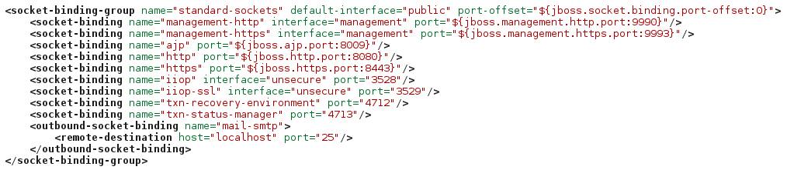

# Systemadministration

### Aktenzeichen bearbeiten / ändern {#aktenzeichen-bearbeiten}

In Ausnahmefällen kann es notwendig sein, ein automatisch vergebenes Aktenzeichen manuell anzupassen. Für diese Fälle kann wie folgt verfahren werden:
- Menü “Einstellungen”, Menüpunkt “Administrator-Konsole”

- Eingabe des Befehls setrefno ALTESAZ NEUESAZ, bspw

- setrefno 00345/18 00348/17

Dabei werden keine eventuell in Dokumenten vorhandene Aktenzeichen angepasst, und es findet keine Prüfung des neuen Aktenzeichens statt. Stellen Sie sicher dass es noch nicht vergeben ist.

Die Änderung arbeitet ausschließlich mit den “einfachen” Aktenzeichen. Ist im Aktenzeichenschema die Aktenzeichenerweiterung aktiviert, so ist eine Änderung des Aktenzeichens möglich, unter Beibehaltung der aktuellen Aktenzeichenerweiterung der betroffenen Akte.

Seit Version 2.6 ist die Änderung des Aktenzeichens zusätzlich auch direkt in der Akte möglich (Stiftsymbol hinter dem Aktenzeichen). Auch hier ist die Funktionalität Nutzern mit administrativen Rechten vorbehalten.

### Passwortkomplexität {#passwortkomplexitaet}

Im Menü “Einstellungen”, Menüpunkt “Sicherheit” kann eingestellt werden, dass Nutzer ausschließlich Passwörter mit einer hohen Komplexität vergeben können. Komplexe Passwörter sind in den Voreinstellungen aktiviert.

Als hinreichend komplex gelten Passwörter die die folgenden Kriterien erfüllen:
- mindestens 8 Zeichen lang

- enthält Kleinbuchstaben

- enthält Großbuchstaben

- enthält Ziffern

- enthält mindestens eines der folgenden Sonderzeichen: -_@#$%^&+=

Der Dialog zur Passworterstellung / -änderung zeigt an, ob die Komplexität schwach, mittel oder stark ist.

### Netzwerkeinstellungen für Mehrbenutzerbetrieb

Wird das System mit mehren Arbeitsplätzen im Netzwerk verwendet, so sind folgende Voraussetzungen zu erfüllen:
- Das Gerät mit dem j-lawyer.org Server sollte über eine feste IPv4 verfügen. Es empfiehlt sich diese Einstellung am DHCP-Server vorzunehmen, in kleinen Netzwerken ist diese Funktion bspw. in gängige Router integriert.

- Für alle Client-Versionen bis einschliesslich 1.9: Der j-lawyer.org Server muss an die feste IP “gebunden” werden. Verbinden Sie dazu mit einem lokal laufenden j-lawyer.org Client und öffnen Sie “Einstellungen” - “Administratorkonsole”. Rufen Sie den Befehl “getbindings” auf.  Im Fall einer falschen Konfiguration erscheint eine Ausgabe wie folgt:

- server misconfigured! use setbindings command to correct.
 setbindings 192.168.178.24
- Führen Sie dann den in der zweiten Zeile angegebenen Befehl aus und starten Sie anschließend den j-lawyer.org Server neu.

### Portkonflikte beheben

Der j-lawyer.org Server “lauscht” an verschiedenen Ports auf eingehende Netzwerkverbindungen, so bspw. auch auf Port 8080. Eine vollständige Liste der verwendeten Ports findet man im Installationsverzeichnis des Servers, dort unter \wildfly\standalone\configuration\standalone.xml:

Sollte es einen Portkonflikt geben, so kann entweder der betroffene Port direkt geändert werden, oder es kann ein “Offset” definiert werden, bspw. “100” um auf alle Portkonfigurationen den Wert 100 zu addieren. Die Angabe erfolgt in der obersten dargestellten Zeile, bspw. Wie folgt:

<socket-binding-group name="standard-sockets" default-interface="public" port-offset="${jboss.socket.binding.port-offset:0}">

ändern in

<socket-binding-group name="standard-sockets" default-interface="public" port-offset="${jboss.socket.binding.port-offset:100}">

Die Änderung erfordert einen Neustart des j-lawyer.org Servers.

### Monitoring {#monitoring}

Sie können eine automatische Überwachung des j-lawyer Servers konfigurieren. Überwacht werden können Festplattenfüllstand, CPU-Auslastung, genutzter Arbeitsspeicher und Speicher der Java-VM. Unter „Einstellungen“ – „Servermonitoring“ können dazu Schwellwerte und optional eine Emailbenachrichtigungsfunktion eingestellt werden. Sollen Benachrichtigungen an mehrere Empfänger gesendet werden, so sind die Empfängeradressen durch Komma getrennt anzugeben.

Es ist möglich nur bestimmte Hardwareparameter zu überwachen und andere zu ignorieren.

Seit Version 1.8 wird bei der RAM-Überwachung die Summe aus physischem Arbeitsspeicher und Auslagerungsdatei überwacht. Schwellwerte sind entsprechend zu setzen. Beispiel:

Der Server verfügt über 4GB RAM und 2GB Auslagerungsdatei/Swap. Wenn bei Nutzung der Auslagerungsdatei gewarnt werden soll, so wäre das Limit bei 66% zu setzen (gesamt 2GB+4GB Speicher, Warnung bei 4GB, d.h. 4/6=66%).

### Logdateien / Fehlerberichte {#logdateien}

In den folgenden Dateien werden eventuell auftretende Fehler protokolliert:

Server:
- Windows: „server.log“ in C:\Programme\j-lawyer-server\wildfly\standalone\log

- Linux: „server.log“ in /opt/j-lawyer-server/wildfly/standalone/log oder /usr/local/j-lawyer-server/wildfly/standalone/log

- macOS: „server.log“ in /Applications/j-lawyer-server/wildfly/standalone/log

Client:
- Windows: „client.log“ in C:\Benutzer\EIGENERNUTZERNAME\.j-lawyer-client\log

- Linux: „client.log“ in /home/EIGENERNUTZERNAME/.j-lawyer-client/log

- Mac OS: „client.log“ in /Users/EIGENERNUTZERNAME/.j-lawyer-client/log
