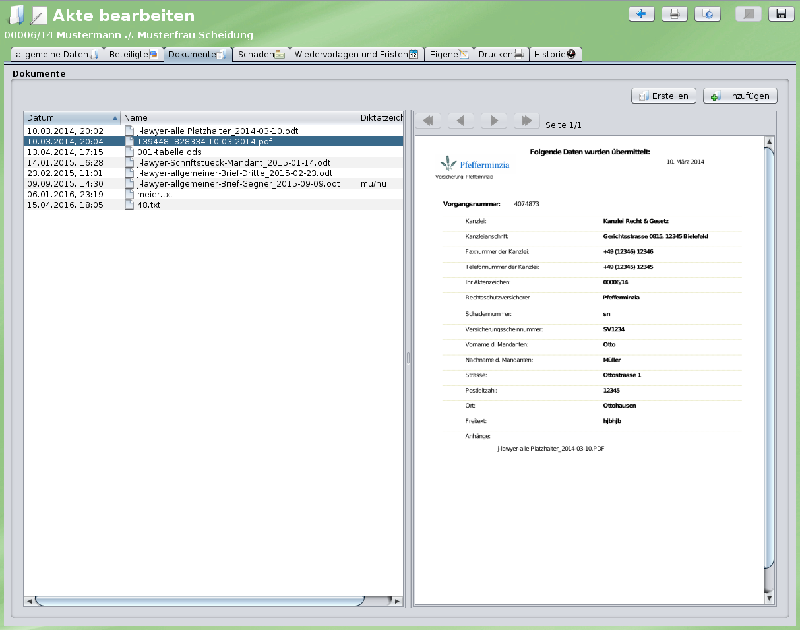
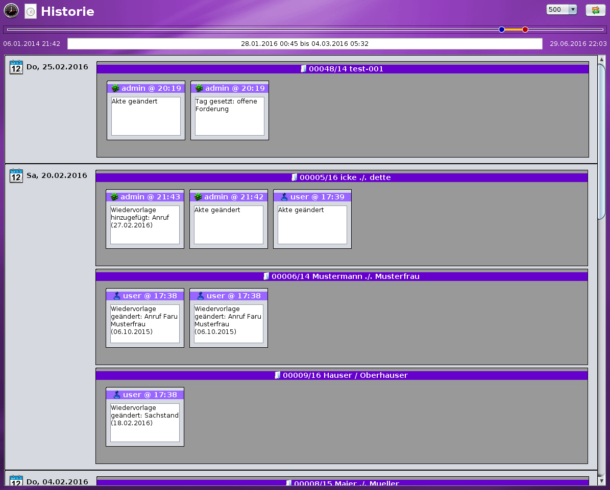
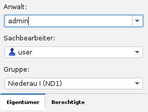
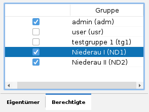

# Aktenverwaltung

### Akten suchen {#suchen}

Im Navigationsbaum am linken Bildschirmrand unter “suchen” können Sie Akten über eine Schnellsuche finden. Durchsucht werden
- Aktenzeichen
- Kurzrubrum
- wegen
- eigene Felder (alle)

Zusätzlich ist eine Einschränkung über Etiketten möglich.

Voreingestellt ist eine Suche ohne archivierte Akten – soll das Archiv mit durchsucht werden, so ist die Option “Archivsuche” zu aktivieren.

### Aktenanlage {#anlegen}

Eine Aktenanlage ist im linken Navigationsbereich unter “Akten” – “neu” möglich. Es ist sinnvoll, vorab zu prüfen ob alle Beteiligten in der Adressverwaltung existieren. Innerhalb der Akte unter dem Reiter “Beteiligte” ist ggf. auch eine Schnellerfassung noch nicht vorhandener Kontakte möglich. In diesem Fall sollten die Adressdaten nach Schnellerfassung weiter verfeinert werden, der Arbeitsfluss wird so jedoch nicht unterbrochen.

Im Reiter Allgemeine Daten können im Bereich „Aktenkopf“ u.a.
- das Kurzrubrum,
- „wegen“ und
- das Sachgebiet

eingetragen werden. Im mittleren Bereich können Etiketten aktiviert und im unteren Bereich Notizen eingetragen werden.

Im Reiter “Beteiligte” auf “+” klicken um Beteiligte hinzuzufügen. Daraufhin ist eine Suche in der Adressverwaltung möglich. Nach einem Klick auf “Übernehmen” wird der selektierte Beteiligte in die Akte übernommen und es kann ein Zeichen (das des Beteiligten) eingetragen werden. Die “Rolle” des Beteiligten lässt sich über ein Auswahlfeld angeben. Zusätzliche Rollen lassen sich über das Menü “Einstellungen” – “Modul ‘Adressen’” – “Beteiligtentypen” erstellen. Ein Aktionsknopf am Beteiligten ermöglich u.a. das Senden von E-Mails und das Initiieren von Anrufen.

### Aktenzeichen {#aktenzeichen}

j-lawyer vergibt automatisch Aktenzeichen im Format „fünfstellige lfd. Nummer + / + zweistellige Jahreszahl“, also bspw. 00123/12. Für Umsteiger kann es hilfreich sein, das „Start-Aktenzeichen“ einstellen zu können.

Ab Version 1.8 kann über Menü “Einstellungen” - “Akten” - “Aktenzeichen-Schema” definiert werden, wie Aktenzeichen automatisch gebildet werden.

Es sind folgende Werte nutzbar:

C – zufälliger Buchstabe

R – Zufallsziffer

N – unabhängig laufende Nummer

n – innerhalb anderer Kriterien laufende Nummer

Daraus lassen sich für individuelle Anforderungen passende Aktenzeichen-Schemata definieren, bspw.
- nnnnn/YY – 5-stellige laufende Nummer innerhalb eines Jahres, gefolgt von fixem Schrägstrich, gefolgt von 2-stelliger Jahreszahl
- YY-CCCCC – 2-stellige Jahreszahl, gefolgt von fixem Bindestrich, gefolgt von 5 zufälligen Buchstaben
- NNNNN/YYYYMMDD – 5-stellige unabhängig laufende Nummer, gefolgt von fixem Schrägstrich, gefolgt von 4-stelliger Jahreszahl, gefolgt von 2-stelliger Monatsangabe, gefolgt von 2-stelliger Tagesangabe

Monat und Tag können wahlweise als M oder MM bzw. D oder DD angegeben werden. Bei einfachem Buchstaben M oder D werden einstellige Zahlenwerte auch nur einstellig übernommen, bei Nutzung von MM oder DD werden ggf. führende Nullen eingefügt.

In jedem Fall wird j-lawyer.org die Eindeutigkeit des Aktenzeichens forcieren.

### Erweiterte Aktenzeichen

Über das Menü “Einstellungen” - “Akten” - “Aktenzeichen-Schema” lassen sich auch erweiterte Aktenzeichen aktivieren. Die Aktenzeichenerweiterung wird grundsätzlich als Suffix ans Ende des Aktenzeichens angefügt. Folgende Werte können in die Erweiterungsangabe aufgenommen werden:
- eine beliebige feste Angabe am Beginn der Aktenzeichenerweiterung
- das Kürzel des Anwalts, der als Eigentümer einer Akte angegeben wird
- das Kürzel der Gruppe, welche als Eigentümergruppe einer Akte angegeben wird
- eine beliebige feste Angabe am Ende der Aktenzeichenerweiterung

Es ist möglich, die Trennzeichen (zwischen Aktenzeichen und Erweiterung, sowie zwischen den einzelnen Angaben innerhalb der Erweiterung) zu definieren.

Grundsätzlich gilt: das Aktenzeichen ist dafür verantwortlich, die Akte eindeutig zu identifizieren – es ist ohne Erweiterung immer einmalig. Die Erweiterungen gelten als zusätzliche Informationen. Werden die erweiterten Aktenzeichen genutzt, so sind ab diesem Zeitpunkt die gewählten Angaben verpflichtend – d.h. bei einer Aktenzeichenerweiterung mit Angabe der Eigentümergruppe, müssen für neue oder aktualisierte Akten zwingend die Gruppen gepflegt werden. Bestandsdaten werden nicht automatisch angepasst.

### Dokumente in Ordnern organisieren {#ordner}

Grundsätzlich werden alle Dateien einer Akte in einem “Dokumente”-Ordner gespeichert. Soll eine detailliertere Strukturierung genutzt werden, so können
- Ordner direkt in der Akte hinzugefügt, umbenannt und gelöscht werden sowie
- vorgefertigte Ordnerstrukturen zu einer Akte hinzugefügt werden.

Die sogenannten Ordnervorlagen können unter Menü “Einstellungen” - “Modul ‘Akten’” - “Dokumentordner” hinterlegt werden.

Innerhalb einer Akte ist das Anwendern der Ordnervorlagen über das Zahnradsymbol direkt über der Ordneranzeige möglich. Dabei werden niemals vorhandene Ordner entfernt, es werden stets nur Ordner hinzufügt, welche in der Ordnervorlage enthalten, in der Akte jedoch noch nicht vorhanden sind.

Somit ist es leicht möglich, mehrere Ordnervorlagen nacheinander auf eine Akte anzuwenden: bspw. einmal eine Vorlage “Finanzen” mit den Ordnern “Rechnungen” und “Angebote”, gefolgt von der Übernahme bspw. sachgebietsspezifischer Ordnervorlagen.

### Dokumentvorschau

Innerhalb der Akte wird durch einen einfachen Klick auf das Dokument eine Vorschau angezeigt. Folgende Formate werden unterstützt:
- Direkte Anzeige (Inhalt und Layout): GIF, JPG, PDF, PNG, TIF
- Textanzeige (Inhalt des Dokumentes als Textextrakt): alle Dokumente mit Textinformationen
- keine Vorschau: alle weiteren Binärformate

Ein Doppelklick öffnet das Dokument im entsprechenden Editor.

Dokumentvorschau
        Direkte Anzeige einens Dokumentes am Beispiel eines PDFs
       Abbildung 5: Direkte Anzeige eines Dokumentes am Beispiel eines PDFs

### Aktenhistorie {#historie}

<todo>

### Aktenübergreifende Historie

Neben der in jeder Akte angezeigten spezifischen Historie, gibt es eine aktenübergreifende Historie über alle Änderungen des aktuellen Nutzers oder aller Nutzer der Software (“Aktenhistorie” in der Navigationsleiste).

So lassen sich schnell eigene Änderungen auffinden oder von Kollegen bearbeitete Fälle auffinden.

Im oberen Bereich des Dialogs ist ein Zeistrahl abgebildet, der die gesamte im System erfasste Historie umfasst. Durch Bewegung der blauen (ab...) und roten (bis...) Markierungen kann auf einen Zeitraum eingeschränkt werden. Ebenfalls im oberen Bereich befindet sich ein Auswahlfeld zur Einschränkung der Treffermenge. Voreingestellt ist eine Beschränkung auf 500 Einträge.

Die Ergebnismenge visualisiert – nach Kalendertagen gruppiert – die geänderten Akten sowie welcher Nutzer welche Änderung vorgenommen hat. Ein Klick auf Aktennummer oder Kurzrubrum navigiert direkt zur jeweiligen Akte.

### Aktenablage / Archivierung {#archivierung}

Im Tab “allgemeine Daten” einer Akte kann eine Archivierung durchgeführt werden. Die Akte ist somit aus dem “aktiven” Datenbestand heraus – sie ist dann in Suchdialogen nur dann auffindbar, wenn explizit eine Suche im Archiv aktiviert wird.

Werden zusätlich noch Papierakten geführt, so kann über ein Plugin eine neue Archivnummer generiert werden. Über das Menü “Berechnungen” und den Menüpunkt “Archivnummern-Generator” wird die Nummer erstellt und kann dann in das Notizfeld einer Akte oder in eines der “Eigenen Felder” kopiert werden. So ist eine konsistente Nummerierung gewährleistet.

### Zugriff auf Akten beschränken {#berechtigungen}

Der Zugriff auf Akten kann auf bestimmte Personenkreise (Gruppen) beschränkt werden. Voraussetzung ist das Vorhandensein von Gruppen (“Einstellungen” - “Gruppen” zur Anlage der Gruppen) sowie die Aufnahme von Nutzern in keine, eine oder mehrere Gruppen (“Einstellungen” - “Nutzer” - Nutzer auswählen – Tab “Kürzel und Gruppen”). Die Erstellung von Gruppen folgt dabei den Anforderungen der jeweiligen Kanzlei – bspw. wäre es möglich eine Gruppe pro Standort, eine Gruppe pro Anwalt, oder eine besondere Gruppe für Personalakten zu erstellen.

Sind Gruppen und Mitgliedschaften gepflegt, so können Akten vor ungewünschten Zugriffen geschützt werden. Unterschieden werden Eigentümer und Berechtigte.

Eigentümer:

Als Eigentümer gelten der unter “Anwalt” geführte Nutzer, sowie alle Mitglieder der Eigentümergruppe (bspw. “Niederau I” im unten abgebildeten Screenshot).

Nur die Eigentümer sind berechtigt, weitere Gruppe über den Tab “Berechtigte” hinzuzufügen oder Gruppen vom Zugriff auszuschliessen. Auch das Ändern der Eigentümergruppe ist möglich – jedoch nur auf eine Gruppe, in welcher der aktuelle Nutzer auch Mitglied ist.

Berechtigte:

Im Tab “Berechtigte” werden alle Gruppen aktiviert, welche Zugriff auf die Akte haben sollen.
- Wird KEINE Gruppe gewählt, so ist der Zugriffsschutz für die Akte deaktiviert, es haben alle Nutzer Zugriff!
- Wird mindestens eine Gruppe gewählt, so haben nur solche Nutzer Zugriff auf die Akte, die in mindestens einer der ausgewählten Gruppen Mitglied sind.

Die Angabe berechtigter Gruppen bestimmt ausschließlich die Sichtbarkeit / Zugriffsmöglichkeit auf eine Akte. Welche Aktionen innerhalb der Akte möglich sind, leitet sich aus den Berechtigungen des Nutzers in der Nutzerverwaltung ab.

### Akten löschen {#loeschen}

Im Navigationsbaum am linken Bildschirmrand unter “suchen” können Sie die zu löschende(n) Akte(n) über eine Schnellsuche finden. In der Ergebnisliste werden anschließend eine oder mehrere Akten markiert und per Rechtsklick und Menüpunkt „löschen“ unwiderruflich entfernt.
