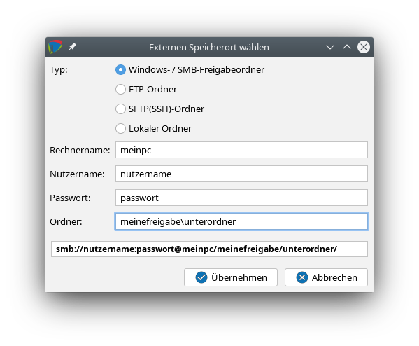
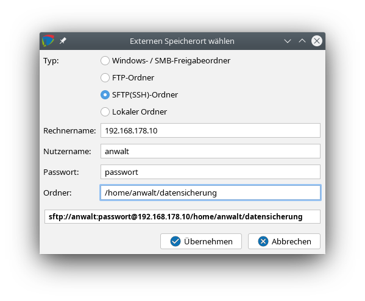
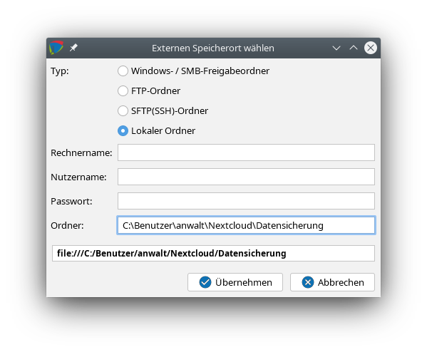

# Backup / Wiederherstellung

### Datensicherung und -synchronisation {#datensicherung}


j-lawyer kann sämtliche Daten iterativ in einem bestimmten Ordner zusammenstellen. Von dort kann die Sicherung bspw. auf USB-Stick kopiert werden.

Um die automatische Datensicherung zu nutzen, können alle erforderlichen Einstellungen direkt im j-lawyer Client unter „Administration" – „Datensicherung" vorgenommen werden.

Im gleichen Dialog kann ein Sofort-Backup erstellt werden.

Sofern ein Verschlüsselungspasswort angegeben wird, werden alle ZIP-Archive der Datensicherung verschlüsselt und passwortgeschützt. Stellen Sie sicher dass das Passwort nicht verloren geht – nur mit diesem Passwort ist eine Rücksicherung möglich.

Es wird empfohlen eine Administrator-Email (unter „Administration" – „Systempostfach" sowie „Administration" – „Servermonitoring" - „Einstellungen") zu hinterlegen – Sie erhalten dann eine Zusammenfassung per E-Mail, sobald die Datensicherung abgeschlossen ist.

Es ist dringend empfohlen, die Datensicherungen regelmäßig auf einem externen Speicher abzulegen und nicht ausschließlich auf dem j-lawyer.org Server zu archivieren (bspw. für den Fall eines Festplattendefekts). Dazu kann in der Registerkarte "Synchronisation" ein Abgleich mit einem externen Speicherort eingestellt werden. Unterstützt werden
- Windows-Freigaben

- Samba-Freigaben

- SFTP (SSH)-Server

- anderer lokaler Ordner (sinnvoll bspw. wenn es auf dem j-lawyer.org Server ein Verzeichnis gibt, das mit Clouddiensten synchronisiert wird).

Konfigurationsbeispiel: Windows-Freigabe

Nach dem Anlegen einer Freigabe – entweder passwortgeschützt oder anonym nutzbar – bitte zuerst prüfen, ob die Freigabe korrekt aufrufbar ist. Der sogenannte UNC-Pfad ist wie folgt aufgebaut: \\RECHNERNAME\FREIGABENAME, also bspw. \\meinpc\meinefreigabe. Bitte zuerst prüfen, ob auf diesen Pfad zugegriffen werden kann, bspw. durch Kopieren des Pfades in den Windows Explorer.

Anschließend kann die Freigabe wie folgt im j-lawyer.org Client eingetragen werden:




Konfigurationsbeispiel: Synchronisation per SSH

Die Synchronisation per SFTP / SSH eignet sich insbesondere für die Spiegelung auf ein Linux oder macOS-Gerät. Ggf. ist vorab ein extra Nutzer zu erstellen. Von der Verwendung von „root" wird aus Sicherheitsgründen abgeraten.

Soll mit dem Nutzer „anwalt" per SSH zum Gerät mit IP 192.168.178.10 verbunden werden und in dessen Ordner „/home/anwalt/datensicherung" synchronisiert werden, so kann der Zugang vorab wie folgt geprüft werden: im Terminal

ssh anwalt@192.168.178.10

(Passwort eingeben)

cd /home/anwalt/datensicherung

Sind die Verbindung und der Verzeichniswechsel ohne Fehlermeldung möglich, so werden die Daten wie wie folgt im j-lawyer.org Client eingetragen:




Konfigurationsbeispiel: anderer lokaler Ordner

Soll die Datensicherung innerhalb des Servers in ein anderes Verzeichnis synchronisiert werden, so ist der vollständige Pfad anzugeben. Da es sich um einen lokalen Zugriff handelt, sind Rechnername, Nutzername und Passwort leer zu lassen.




Stellen Sie in jedem Fall sicher, daß der externe Speicherplatz vor Fremdzugriffen ausreichend gesichert ist! Nutzen Sie idealerweise die Möglichkeit, Datensicherungen automatisch zu verschlüsseln / mit einem Passwort zu schützen.
Auch wenn die Synchronisation direkt nach der Datensicherung ausgeführt wird, ist es nicht zwingend notwendig, dass der externe Speicher zum Zeitpunkt der Datensicherung verfügbar ist. Das System wird stündlich eine Synchronisation probieren. So ist es möglich, in einem Kanzleinetzwerk eine Synchronisation auf einen "normalen" Arbeitsplatzrechner durchzuführen der nur zur üblichen Bürozeiten eingeschaltet ist.

### Datensicherung auf USB-Medien


Hinweis zur Sicherung auf USB-Medien unter Windows: je nachdem welche und wieviele USB-Geräte an einem PC verwendet werden, ist ein USB-Speichermedium unter verschiedenen Laufwerksbuchstaben eingebunden. Somit ist eine Synchronisation bspw. nach E:\Datensicherung unter Umständen keine zuverlässig funktionierende Konfiguration.

Abhilfe kann wie folgt geschaffen werden: Via "Rechte Maustaste auf die Start-Taste / Computerverwaltung / Datenspeicher / Datenträgerverwaltung / eingesteckten USB-Stick auswählen / rechte Maustaste ‚Laufwerksbuchstaben und -pfade ändern' / erneut auf ‚Ändern' klicken / ‚Folgenden Laufwerksbuchstaben zuweisen'" wird dem USB-Speichermedium ein fester Laufwerksbuchstabe zugewiesen. Es empfiehlt sich einen Buchstaben weiter hinten im Alphabet zu verwenden, bspw. ab I:\.

Auch bei regelmäßigem Entfernen des USB-Speichers sowie bei Verwendung weiterer USB-Geräte ist so sichergestellt, dass das Speichermedium immer den selben Laufwerksbuchstaben erhält.

### Daten aus einer Sicherung wiederherstellen (über Backupmanager)


Eine Wiederherstellung Ihrer Daten aus einem Backup ist über die separate Anwendung "j-lawyer.org Backupmanager" möglich:
- Stoppen Sie den j-lawyer – Server

- Kopieren Sie die Datensicherung auf das Gerät, auf welchem der j-lawyer.org Server läuft

- Starten Sie den Backupmanager über das Startmenü. Sollte die Installation nicht über eine grafische Oberfläche verfügen (bspw. Minimalinstallation eines Linuxservers), so öffnen Sie eine Konsole, wechseln Sie in das Verzeichnis Ihrer j-lawyer.org Serverinstallation, Unterverzeichnis "backupmgr", und starten dort "java -jar j-lawyer-backupmgr.jar -console"

- Geben Sie die Pfade zu den Verzeichnissen mit der einzuspielenden Datensicherung sowie dem aktuell genutzten Datenverzeichnis des j-lawyer.org Servers an, sowie das MySQL-root-Passwort und optional das Verschlüsselungspasswort, mit welchem die Datensicherung verschlüsselt wurde.

- Folgen Sie den Anweisungen.

Abschließend starten Sie Ihren j-lawyer.org Server neu. Wurde der Backupmanager mit einem anderen Nutzer ausgeführt, als für die Ausführung des j-lawyer.org Servers verwendet wird, so sind ggf. Berechtigungen auf das Datenverzeichnis anzupassen. Der Nutzer des j-lawyer.org Servers muss Schreibberechtigungen im Datenverzeichnis haben.

macOS: Auf macOS muss der Backupmanager als administrativer Nutzer (root-Rechte) gestartet werden. Nutzen Sie daher einen Nutzer mit administrativen Rechten zum Starten des Backupmanagers, oder starten Sie die Anwendung über "sudo":
- Terminal öffnen

- cd /Applications/j-lawyer-server/j-lawyer-backupmgr/j-lawyer-backupmgr.app/Contents/MacOS

- sudo ./JavaApplicationStub

Danach wählen Sie den Ordner in welchem die Datensicherung liegt, bspw. "/Users/anwalt123/Downloads/j-lawyer-backup", geben das Datenbankpasswort und optional das Passwort ein, welches zur Verschlüsselung der Datensicherung genutzt wurde. Das j-lawyer.org Datenverzeichnis lautet "/Applications/j-lawyer-server/j-lawyer-data". Über "Wiederherstellen" startet der Wiederherstellungsvorgang.

Wurde der Backupmanager mit einem anderen Nutzer ausgeführt, als für die Ausführung des j-lawyer.org Servers verwendet wird, so sind ggf. Berechtigungen auf das Datenverzeichnis anzupassen. Der Nutzer des j-lawyer.org Servers muss Schreibberechtigungen im Datenverzeichnis haben.

Achtung: Haben sie zwischen dem Zeitpunkt der Erstellung der Datensicherung und dem Zeitpunkt des Rückspielens der Datensicherung ein oder mehrere j-lawyer-Versionsupdates eingespielt, so müssen Sie die Datenbank-Updatescripts auf die wiederhergestellte Datenbank anwenden.

### Daten aus einer Sicherung wiederherstellen (j-lawyer.BOX)


Für Nutzer einer j-lawyer.BOX ist das Wiederherstellen aus einem Backup direkt über den Logindialog des j-lawyer.org Clients möglich:
- Kopieren Sie alle zur Sicherung gehörenden Dateien und Verzeichnisse in ein Verzeichnis "restore" in der Dateifreigabe "j-lawyer-share" der j-lawyer.BOX. Existiert das Verzeichnis "restore" noch nicht, so erstellen Sie es.

- Öffnen Sie einen j-lawyer.org Client. Im Logindialog tragen Sie die Verbindungsinformationen der j-lawyer.BOX ein. Anschließend wird im Tab "j-lawyer.BOX" das root-Passwort (Betriebssystemnutzer der j-lawyer.BOX) eingegeben und der Button "j-lawyer.BOX mittels Datenrücksicherung resetten" genutzt. Auf Rückfrage geben Sie das Datenbankpasswort und optional das Verschlüsselungspasswort Ihrer Datensicherung ein. Anschließend beginnt die Rücksicherung und der Dienst der j-lawyer.BOX wird automatisch neu gestartet.

- Die Rücksicherung wird in einer Datei "restore.log" im Wurzelverzeichnis der Dateifreigaben der j-lawyer.BOX protokolliert. Im Fehlerfall sowie zur Kontrolle kann der Inhalt der Datei geprüft werden.

Achtung: Haben sie zwischen dem Zeitpunkt der Erstellung der Datensicherung und dem Zeitpunkt des Rückspielens der Datensicherung ein oder mehrere j-lawyer-Versionsupdates eingespielt, so müssen Sie die Datenbank-Updatescripts auf die wiederhergestellte Datenbank anwenden.

### Daten aus einer Sicherung wiederherstellen (manuell)


Eine Wiederherstellung Ihrer Daten aus einem Backup ist über folgende Schritte möglich:
- Stoppen Sie den j-lawyer – Server

- Entpacken Sie die vom j-lawyer.org Server erstellte(n) Backup-ZIP-Datei(en)

Unter Linux nutzen Sie Ihr favorisiertes Packprogramm ihres Window Managers oder nutzen das Terminal:

unzip <Dateiname>

Unter Windows kann ich das kostenlose Programm 7zip empfehlen.
- Datenbank einspielen

Öffnen Sie eine Eingabeaufforderung / Terminal und wechseln Sie in das Verzeichnis, in welches Sie die ZIP-Datei entpackt haben. Von dort starten Sie den MySQL-Kommandozeilen-Client

mysql -u root -p

Geben Sie das Passwort des „root"-Nutzers Ihrer MySQL-Installation ein, wenn Sie danach gefragt werden. Anschließend wird über die folgenden Befehle zuerst eine evtl. bestehende j-lawyer – Datenbank entfernt und dann aus dem Backup wiederhergestellt:

drop database if exists jlawyerdb;

create database jlawyerdb;

use jlawyerdb;

source jlawyerdb-dump.sql;

commit;

quit;

Abschließend kopieren Sie alle aus der ZIP-Datei entpackten Verzeichnisse in das „j-lawyer-data"-Verzeichnis Ihrer j-lawyer – Serverinstallation und starten Sie Ihren Server.

Wurde die Wiederherstellung mit einem anderen Nutzer ausgeführt, als für die Ausführung des j-lawyer.org Servers verwendet wird, so sind ggf. Berechtigungen auf das Datenverzeichnis anzupassen. Der Nutzer des j-lawyer.org Servers muss Schreibberechtigungen im Datenverzeichnis haben.

Achtung: Haben sie zwischen dem Zeitpunkt der Erstellung der Datensicherung und dem Zeitpunkt des Rückspielens der Datensicherung ein oder mehrere j-lawyer-Versionsupdates eingespielt, so müssen Sie die Datenbank-Updatescripts auf die wiederhergestellte Datenbank anwenden.

### Daten aus einer Sicherung wiederherstellen (Docker)

Für Docker-Installationen ist das Wiederherstellen aus einem Backup über den Backupmanager möglich. Gehen Sie wie folgt vor:

- Stoppen Sie den j-lawyer.org Docker-Container:

```
docker compose down
```

- Kopieren Sie die Datensicherung auf das Gerät, auf welchem die Docker-Installation läuft.

- Starten Sie den Backupmanager. Java 8 oder höher ist erforderlich:

```
sudo java -jar j-lawyer-backupmgr-<VERSION>.jar -console
```

- Geben Sie die erforderlichen Parameter an:
    - Pfad zur einzuspielenden Datensicherung
    - Pfad zum Datenverzeichnis der Docker-Installation (üblicherweise das gemountete Volume, z.B. `/opt/j-lawyer-data` oder das in `docker-compose.yml` konfigurierte Verzeichnis)
    - MySQL-root-Passwort
    - Optional: Verschlüsselungspasswort der Datensicherung

- Folgen Sie den Anweisungen des Backupmanagers.

- Nachdem die Wiederherstellung abgeschlossen ist, müssen die Dateiberechtigungen im Container angepasst werden. Starten Sie dazu den Container und führen Sie folgende Befehle aus:

```
docker compose up -d
sudo docker exec -u root -it docker_server_1 /bin/bash
chown -R jboss:jboss /opt/jboss/j-lawyer-data/
exit
```

- Starten Sie den Container neu, um sicherzustellen dass alle Änderungen übernommen werden:

```
docker compose restart
```

Hinweis: Der Containername (`docker_server_1`) kann je nach Konfiguration abweichen. Prüfen Sie den korrekten Namen mit `docker ps`.

### Encoding-Fehler bei Wiederherstellung (MySQL nach MariaDB) {#encoding-fehler-backup}

Beim Einspielen eines MySQL-Backups in eine MariaDB-Instanz kann es zu einem Encoding-Fehler kommen. MySQL 8 verwendet standardmäßig die Kollation `utf8mb4_0900_ai_ci`, die in MariaDB nicht existiert. Der Import schlägt dadurch teilweise fehl.

**Symptome:**

- Der Backupmanager zeigt eine Warnung, meldet aber insgesamt Erfolg.
- Es fehlt mindestens eine Tabelle (z.B. werden nur 38 von 39 Tabellen importiert).
- Der Server meldet eine alte Version (oder "unknown"), obwohl eine höhere Version installiert ist.

**Lösung:**

Vor dem Einspielen des Backups muss die Kollation im SQL-Dump ersetzt werden:

```
sed -i 's/utf8mb4_0900_ai_ci/utf8mb4_general_ci/g' jlawyerdb-dump.sql
```

Danach kann der Dump wie gewohnt eingespielt werden.

### Automatischer HTML-Export


Für den Fall von Problemen mit dem System (j-lawyer.org Serverdienst und/oder j-lawyer.org Client) oder für eine Offline-Nutzung Ihrer Daten ohne Software (abgesehen von einem gängigen Internetbrowser) können Sie mit jeder Datensicherung einen Export aller Aktendaten in das HTML-Format konfigurieren. In den Einstellungen zur automatischen Datensicherungen geben Sie dazu in der Registerkarte "HTML-Export" ein Zielverzeichnis auf dem Server an. Jede Akte wird in einen Unterordner exportiert – das Aktenzeichen fungiert dabei als Ordnername. Direkt im Zielverzeichnis befindet sich auch eine LibreOffice-Datei mit allen Wiedervorlagen und Fristen, sodass keine Fälligkeit verpasst werden kann.
