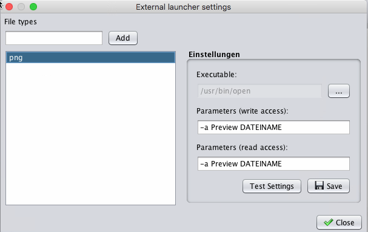
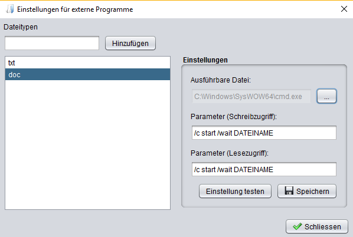
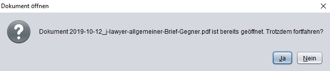
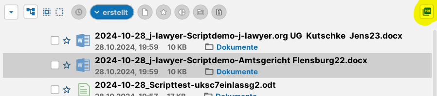
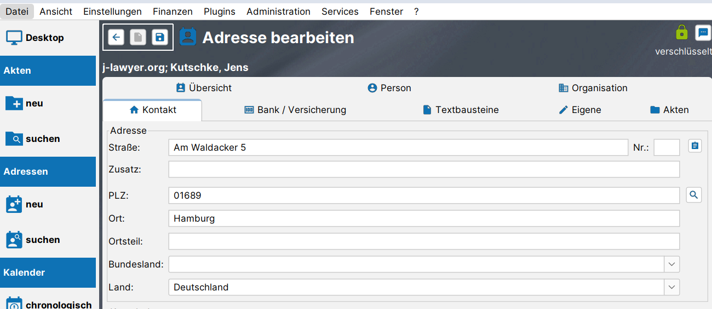
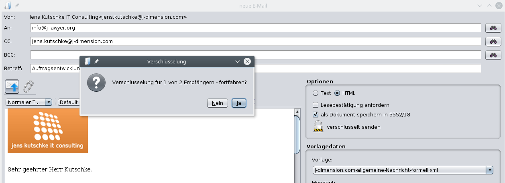

# Dokumentenmanagement

### Auswahl der Textverarbeitung: Microsoft Word / LibreOffice {#textverarbeitung}

Sollen .doc / .docx – Dokumente mit Microsoft Office bearbeitet werden (anstelle von LibreOffice), so ist der vollständig Pfad zur “winword.exe” in die Umgebungsvariable PATH des Windowssystems aufzunehmen. Über eine Dateisuche findet man die winword.exe, der Pfad wird kopiert und dann im PATH hinzugefügt (da die Vorgehensweise hierbei zwischen verschiedenen Windows-Versionen variiert, wird auf Google verwiesen). Unter macOS sind keine besonderen Vorkehrungen zu treffen.

Anschließend kann nach einem Neustart des j-lawyer.org Clients im Menü “Einstellungen” - Menüpunkte “Dokumente” und “Textverarbeitung” - der primär zu verwendende Editor ausgewählt werden.  Die Einstellung ist nutzer- und geräteabhängig. So kann ein Kanzleisoftwarenutzer “Otto” auf dem PC primär mit Microsoft Office arbeiten, auf seinem Linuxlaptop mit LibreOffice.

In der Dokumentenansicht einer Akte wird mit Doppelklick dann die ausgewählte Textverarbeitung genutzt. Soll ein bestimmtes Dokument mit einer anderen Textverarbeitung geöffnet werden, so kann per Rechtsklick und “öffnen mit” der gewünschte Editor angefordert werden.

LibreOffice muss weiterhin installiert bleiben, da es im Hintergrund bspw. für Konvertierungsaufgaben verwendet wird (insbesondere PDF-Konvertierung).

HINWEIS: aktuell wird von der Verwendung von Textfeldern in .docx-Vorlagen  abgeraten. Verwendung vieler Textfelder führt zu sehr langen Zeiten bei der Ermittlung der in der Vorlage verwendeten Platzhalter sowie deren Ersetzung.

### Allgemeine Hinweise zur Dokumentbearbeitung

Mit Version 1.8.1 wurde eine vollständig überarbeitete Anwendungsanbindung für LibreOffice und andere externe Applikationen geliefert. Folgendes ist bei der Arbeit mit Dokumenten zu beachten:
- es können beliebig viele Dokumente gleichzeitig geöffnet werden

- es können Dokumente verschiedener Akten gleichzeitig geöffnet werden

- Dokumente müssen gespeichert und geschlossen werden, bevor der j-lawyer.org Client beendet wird – anderenfalls findet keine Rückspeicherung in die Akte(n) statt

Wird der j-lawyer.org Client geschlossen während noch Dokumente geöffnet sind, so wird ein Dialog mit den als noch offen erkannten Dokumenten angezeigt. Speichern und schließen Sie dann alle Dokumente und beenden Sie dann den j-lawyer.org Client.

Der genannte Dialog ist auch jederzeit über das Menü “?”, Menüpunkt “Dokumentmonitor” zu öffnen und zeigt aktuell “überwachte” Dokumente an:
- Dateiname

- schreibgeschützt ja/nein

- geöffnet (Zeit)

- zuletzt gespeichert (Zeit)

- Starttyp

- Speichertyp

- Status

### Dokumentvorlagen {#vorlagen}

Unterstützt werden Vorlagen in den folgenden Formaten:
- ODT (LibreOffice-Textverarbeitung)

- ODS (LibreOffice-Tabellenkalkulation) – jedoch ohne Verwendung von Scripts

- DOCX (Microsoft Office-Textverarbeitung)

- XLSX (Microsoft Office-Tabellenkalkulation) – jedoch ohne Verwendung von Scripts

- PDF – PDF-Dateien, die Formulare enthalten; jedoch ohne Verwendung von Scripts

#### Platzhalter {#platzhalter}

Folgende Platzhalterinhalte einer Dokumentvorlage werden beim Erstellen eines neuen Dokumentes aus einer Akte heraus automatisch mit Werten befüllt. Der Beteiligte / die Beteiligten in der Akte, deren Daten in das Dokument übernommen werden sollen, können entweder vorher markiert oder direkt im Dokument-erstellen-Dialog gewählt werden.

#### Platzhalter für das Kanzleiprofil

{{PROFIL_FIRMA}}	Profildaten: Firmenbezeichnung

{{PROFIL_STRASSE}}	Profildaten: Strasse

{{PROFIL_STRASSE2}}	Profildaten: Adresszusatz

{{PROFIL_PLZ}}	Profildaten: Postleitzahl

{{PROFIL_ORT}}	Profildaten: Ort

{{PROFIL_LAND}}	Profildaten: Land

{{PROFIL_TEL}}	Profildaten: Telefonnummer

{{PROFIL_FAX}}	Profildaten: Faxnummer

{{PROFIL_MOBIL}}	Profildaten: Mobilnummer

{{PROFIL_EMAIL}}	Profildaten: E-Mailadresse

{{PROFIL_WWW}}	Profildaten: Internetadresse

{{PROFIL_STNR}}	Profildaten: Steuernummer

{{PROFIL_USTIDNR}}	Profildaten: USt-IdNr.

{{PROFIL_BANK}}	Profildaten: Bank

{{PROFIL_KONTONR}}	Profildaten: Kontonummer

{{PROFIL_BLZ}}	Profildaten: Bankleitzahl

{{PROFIL_BANK_AK}}	Profildaten: Bank (Anderkonto)

{{PROFIL_KONTONR_AK}}	Profildaten: Kontonummer (Anderkonto)

{{PROFIL_BLZ_AK}}	Profildaten: Bankleitzahl (Anderkonto)

#### Platzhalter für die angemeldete Person

{{USER_AN}}	Nutzerdaten: Anzeigename

{{USER_KRZ}}	Nutzerdaten: Kürzel

{{USER_VORNAME}}	Nutzerdaten: Vorname

{{USER_NAME}}	Nutzerdaten: Name

{{USER_UNTERNEHMEN}}	Nutzerdaten: Firmenbezeichnung

{{USER_FKT}}	Nutzerdaten: Funktion

{{USER_STRASSE}}	Nutzerdaten: Strasse

{{USER_ZUSATZ}}	Nutzerdaten: Adresszusatz

{{USER_PLZ}}	Nutzerdaten: Postleitzahl

{{USER_ORT}}	Nutzerdaten: Ort

{{USER_LAND}}	Nutzerdaten: Land

{{USER_TEL}}	Nutzerdaten: Telefonnummer

{{USER_FAX}}	Nutzerdaten: Faxnummer

{{USER_MOBIL}}	Nutzerdaten: Mobilnummer

{{USER_EMAIL}}	Nutzerdaten: E-Mailadresse

{{USER_WWW}}	Nutzerdaten: Internetadresse

{{USER_STEUERNR}}	Nutzerdaten: Steuernummer

{{USER_USTIDNR}}	Nutzerdaten: USt-IdNr.

{{USER_BANK}}	Nutzerdaten: Bank

{{USER_IBAN}}	Nutzerdaten: IBAN

{{USER_BIC}}	Nutzerdaten: BIC

#### Allgemeine Platzhalter

{{KURZDATUM}}	Datum in der Form TT.MM.JJJJ

{{LANGDATUM}}	Datum in der Form Wochentag, TT.MM.JJJJ

{{DOK_DZ}}	Diktatzeichen des Dokuments

{{AUTOR_AN}}	Autor des Dokuments / der Nachricht

(Anzeigename)

{{AUTOR_KRZ}}	Kürzel des Autors des Dokuments / der Nachricht

{{AUTOR_EMAIL}}	E-Mail-Adresse des Autors

#### Platzhalter für Beteiligte

Die hier dargestellten Platzhalter sind für alle Beteiligtentypen verfügbar. Für GEGNER lauten diese dann bspw. {{GEGNER_NAME}} statt {{MANDANT_NAME}}.

{{MANDANT_NAME}}	Name des Mandanten

{{MANDANT_VORNAME}}	Vorname / Rufname des Mandanten

{{MANDANT_VORNAME2}}	weitere Vornamen des Mandanten

{{MANDANT_GESCHLECHT}}	Geschlecht des Mandanten

{{MANDANT_INITIAL}}	Initialen des Mandanten

{{MANDANT_AGRAD1}}	akademischer Grad des Mandanten, vor dem Namen

{{MANDANT_AGRAD2}}	akademischer Grad des Mandanten, nach dem Namen

{{MANDANT_BERUF}}	Beruf des Mandanten

{{MANDANT_FKT}}	Funktion des Mandanten

{{MANDANT_ZUSATZ}}	Adresszusatz des Mandanten

{{MANDANT_NOTIZ}}	Notiz des Mandanten

{{MANDANT_STA}}	Staatsangehörigkeit des Mandanten

{{MANDANT_ABTLG}}	Abteilung des Mandanten

{{MANDANT_UNTERNEHMEN}}	Unternehmensbezeichnung

{{MANDANT_USTIDNR}}	Umsatzsteuer-Ident-Nr. des Mandanten

{{MANDANT_STEUERNR}}	Steuernummer / TIN des Mandanten

{{MANDANT_RFORM}}	Rechtsform des Mandanten

{{MANDANT_REGNR}} 	Registernummer des Mandanten (juristische Person)

{{MANDANT_REGGERICHT}}	Registergericht des Mandanten (juristische Person)

{{MANDANT_ANREDE1}}	Anrede des Mandanten

{{MANDANT_ANREDE2}}	Briefanrede des Mandanten, bspw. „Herrn“ statt „Herr“

{{MANDANT_BEGRUESSUNG}}	Begrüßung in Briefanrede des Mandanten

{{MANDANT_NACHTEXT}}	Nachtext des Mandanten

{{MANDANT_STRASSE}}	Strasse des Mandanten

{{MANDANT_HAUSNR}}	Hausnummer des Mandanten

{{MANDANT_ORTSTEIL}}	Ortsteil des Mandanten

{{MANDANT_ORT}}	Ort des Mandanten

{{MANDANT_PLZ}}	Postleitzahl des Mandanten

{{MANDANT_LAND}}	Land des Mandanten

{{MANDANT_TEL}}	Telefonnummer des Mandanten

{{MANDANT_MOBIL}}	Mobilnummer des Mandanten

{{MANDANT_FAX}}	Faxnummer des Mandanten

{{MANDANT_EMAIL}}	Emailadresse des Mandanten

{{MANDANT_WWW}}	Homepage des Mandanten

{{MANDANT_BANK}}	Bank des Mandanten

{{MANDANT_BLZ}}	Bankleitzahl der Bank des Mandanten

{{MANDANT_KONTONR}}	Kontonummer des Mandanten

{{MANDANT_RECHTSSCHUTZ}}	Rechtsschutz des Mandanten

{{MANDANT_VRECHTSSCHUTZ}}	Verkehrsrechtsschutz des Mandanten

{{MANDANT_EIGENE1}}	Eigenes Feld 1

{{MANDANT_EIGENE2}}	Eigenes Feld 2

{{MANDANT_EIGENE3}}	Eigenes Feld 3

{{MANDANT_GEB}}	Geburtsdatum des Mandanten

{{MANDANT_GEBNAME}}	Geburtsname des Mandanten

{{MANDANT_ALTER}}	Alter des Mandanten

{{MANDANT_GEBORT}}	Geburtsort des Mandanten

{{MANDANT_GEST}}	Sterbedatum des Mandanten

{{MANDANT_AKTE_KONTAKT}}	Ansprechpartner des Mandanten innerhalb einer Akte

{{MANDANT_AKTE_ZEICHEN}}	AZ1/Referenz des Mandanten innerhalb einer Akte

{{MANDANT_AKTE_EIGENE1}}	Eigenes Feld 1 des Mandanten innerhalb einer Akte

{{MANDANT_AKTE_EIGENE2}}	Eigenes Feld 2 des Mandanten innerhalb einer Akte

{{MANDANT_AKTE_EIGENE3}}	Eigenes Feld 3 des Mandanten innerhalb einer Akte

#### Platzhalter für die Akte

{{AKTE_NR}}	Aktennummer

{{AKTE_ERSTELLT}}	Erstellungsdatum der Akte

{{AKTE_ZEICHEN}}	Aktenzeichen

{{AKTE_KURZRUBRUM}}	Bezeichnung der Akte

{{AKTE_NOTIZ}}	Notiz zur Akte

{{AKTE_SCHADENNR}}	Schadennummer zur Akte

{{AKTE_GEGENSTANDSWERT}}	Gegenstandswert

{{AKTE_WEGEN}}	wegen

{{AKTE_ANWALT}}	Anwalt (Nutzername)

{{AKTE_ANWALT_AN}}	Anwalt (Anzeigename)

{{AKTE_ANWALT_KRZ}}	Kürzel des verantwortlichen Anwalts

{{AKTE_SACHBEARBEITER}}	Bearbeiter (Nutzername)

{{AKTE_SACHBEARBEITER_AN}}	Bearbeiter (Anzeigename)

{{AKTE_SACHBEARBEITER_KRZ}}	Kürzel des verantwortlichen Sachbearbeiters

{{AKTE_EIGENE1}}	Eigenes Feld 1

{{AKTE_EIGENE2}}	Eigenes Feld 2

{{AKTE_EIGENE3}}	Eigenes Feld 3

#### Platzhalter für Berechnungsergebnisse / RVG

Zum Übernehmen von Ergebnistabellen aus Plugins (bspw. RVG-Plugins) wird eine Tabelle mit exakt einer Zelle erstellt und ein Platzhalter wie folgt eingefügt:

| {{TABELLE_1}} |
| --- |

#### Platzhalter für Belege / Rechnungen

{{BEL_NR}}	Belegnummer

{{BEL_TYP}}	Art des Belegs, bspw. „Rechnung“, „Angebot“

{{BEL_NAME}}	Name / Bezeichnung des Belegs

{{BEL_BESCHR}}	Beschreibung des Belegs

{{BEL_DTFAELLIG}}	Fälligkeitsdatum

{{BEL_DTLZVON}}	Datum, Beginn des Leistungszeitraumes

{{BEL_DTLZBIS}}	Datum, Ende des Leistungszeitraumes

{{BEL_DTERSTELLT}}	Erstellungsdatum des Belegs

{{BEL_TOTAL}}	Gesamtbetrag des Belegs

{{BEL_WHRG}}	Währung des Belegs

Geldbeträge und Datumsangaben werden dabei entsprechend der Spracheinstellungen des Belegs formatiert.

Zum Übernehmen der Belegpositionen in Form einer Tabelle wird eine Tabelle mit exakt einer Zelle erstellt und ein Platzhalter wie folgt eingefügt:

| {{BEL_TABELLE}} |
| --- |

ab Version 2.6.1:

Zum Übernehmen der Belegpositionen in Form einer Tabelle wird eine Tabelle mit exakt einer Zelle erstellt und ein Platzhalter wie folgt eingefügt:

| {{BEL_TABELLE}} |
| --- |

Die Spalten der Belegtabelle lassen sich derzeit nicht über die Tabelleneinstellungen anpassen. Stattdessen ist es möglich, eine Tabelle mit der korrekten Anzahl an Spalten und deren Breite zu erstellen. Beispielsweise wie folgt (es ist unerheblich, in welcher Zelle sich der Platzhalter {{BEL_TABELLE}} befindet):

|  | {{BEL_TABELLE}} |  |  |  |  |
| --- | --- | --- | --- | --- | --- |

Darüber hinaus ist es möglich, die Tabelle um weitere Zeilen (mit und ohne Inhalte) zu ergänzen. So lassen sich Bezeichnungen ergänzen, damit beim Bearbeiten direkt sichtbar ist, welche Breite welcher Spalte hier gerade geändert wird. Eventuell eingefügter Text wird im Anschluss durch den Text überschrieben, der in das jeweilige Feld gehört. Ein Umbenennen / Umsortieren / Weglassen von Spalten folgt in einer der nächsten Versionen.

|  |  |  |  |  |  |
| --- | --- | --- | --- | --- | --- |
|  | {{BEL_TABELLE}} |  |  |  |  |

Oder:

|  | Beschreibung | Menge | Einzel | USt. | Betrag |
| --- | --- | --- | --- | --- | --- |
|  | {{BEL_TABELLE}} |  |  |  |  |

Sollte aus einer Vorlage ein Dokument erstellt werden, bleiben die Spaltenbreiten erhalten.

#### Platzhalter für Zeiterfassung

Zum Übernehmen gebuchter Zeiten eines Zeiterfassungsprojektes in Form einer Tabelle (=Leistungsnachweis, Spalten: Person, Datum, Dauer, Stundensatz, Total, Beschreibung) wird eine Tabelle mit exakt einer Zelle erstellt und ein Platzhalter wie folgt eingefügt:

| {{ZE_TABELLE}} |
| --- |

Wird eine pro Person aufsummierte Aufstellung der geleisteten Zeiten benötigt (Person, geleistete Zeit, Wert), so kann ein Tabellenplatzhalter wie folgt verwendet werden:

| {{ZE_SUMMEN}} |
| --- |

Geldbeträge und Datumsangaben werden dabei entsprechend der Spracheinstellungen des Belegs formatiert.

#### Umgang mit leeren Platzhalterwerten

Gegeben sei eine beispielhafte Anrede in einem Schriftsatz, die wie folgt in der Vorlage abgebildet ist:

{{MANDANT_ANREDE}} {{MANDANT_AGRAD1}} {{MANDANT_NAME}},

Sind alle Daten des Mandanten gepflegt, so ergibt sich bei Dokumenterstellung  bspw.

Sehr geehrter Herr Prof. Dr. Müller,

Ist nun kein akademischer Grad vorhanden, so entsteht im Dokument ein doppeltes Leerzeichen:

Sehr geehrter Herr  Müller,

Um solche Konstellationen zu vermeiden, kann das Leerzeichen zwischen Platzhaltern weggelassen werden, die Vorlage würde dann wie folgt aussehen:

{{MANDANT_ANREDE}}{{MANDANT_AGRAD1}}{{MANDANT_NAME}},

Die Anwendung hat für diese Fälle eine „Intelligenz“ und fügt automatisch Leerzeichen an benötigten Stellen ein, bspw. zwischen den Platzhaltern, aber keines vor einem Komma.

#### Platzhalter für Texte aus KI-Assistenzfunktionen („Assistent Ingo“)

{{INGO_TEXT}}	Ergebnistext des jeweiligen Dialogs (bspw. KI-Assistenten oder Sprachmemo)

#### PDF-Formulare als Vorlagen verwenden

PDF-Dateien, die Formulare enthalten, können als Vorlage verwendet werden. Dabei können in allen Textfeldern ein oder mehrere Platzhalter eingegeben werden, also bspw. {{MANDANT_VORNAME}} {{MANDANT_NAME}}

Alternativ kann ein Platzhaltername als Name des Formularfeldes genutzt werden, bspw. hat das Feld dann den Bezeichner MANDANT_NAME. In diesem Fall kann das Feld jedoch nur einen einzelnen Platzhalterwert aufnehmen. Die Empfehlung ist daher die Anwendung von Variante 1 (direkte Aufnahme von Platzhaltern in die Textfelder).

Weitere Arten von Formularfeldern (bspw. anklickbare ja/nein – Felder) werden nicht unterstützt.

Die Nutzung von Skriptfunktionen in PDF-Vorlagen wird nicht unterstützt.

#### Aussehen generierter Tabellen konfigurieren

Über das Menü „Plugins“, „Tabelleneinstellungen“ kann das Aussehen der über das Vorlagensystem generierten Tabellen beeinflusst werden, bspw.
- Schriftart und -größe

- Tabellenlinien

- fett / kursiv / unterstrichen

- weitere

Ebenso kann das Format von in der Tabelle enthaltenen Geldbeträgen konfiguriert werden. Dazu kann das gewünschte Format in einer bestimmten Syntax definiert werden:

| Format | Beispiel |
| --- | --- |
| 0.00 | 12345,67 |
| 0.0 | 12345,7 |
| 0.000 | 12345,671 |
| #,##0.00 | 12.345,67 |
| ###,##0.00 | 12.345,67 |
| 000,000.00 | 012.345,67 |

Eine Dokumentation zu weiteren Formatmöglichkeiten ist hier zu finden: https://docs.oracle.com/javase/8/docs/api/java/text/DecimalFormat.html

#### Flexible Nutzung von Vorlagen für verschiedene Beteiligtentypen

Es ist nicht notwendig, für jeden möglichen Beteiligtentyp eigene Vorlagen zu erstellen. Auch wenn eine Vorlage mit Platzhaltern {{MANDANT_…}} belegt ist, so kann zum Zeitpunkt der Dokumenterstellung aus dieser Vorlage eine beliebige Beteiligte auf diese Platzhalterkategorie verknüpft werden.

Nach Auswahl einer Vorlage wird auf Vorhandensein von Platzhaltern geprüft, und die in der Vorlage verwendeten Beteiligtentypen werden angezeigt (Spalten). Zusätzlich werden alle in der Akte geführten Beteiligten angezeigt und deren Beteiligtentyp ist vorausgewählt. Es ist nun problemlos möglich, eine als Mandantin geführte Beteiligte nur für die Erstellung eines Dokuments als Gegner o.a. zu verwenden.  Ein Klick in der Tabelle genügt. Eine Beteiligte kann dabei auch mehreren Beteiligtentypen zugeordnet werden (bspw. “Kundin” und “Lieferant”), aber es kann immer nur eine Beteiligte pro Typ geben (also bspw. kein zwei Beteiligte die als “Versicherung” genutzt werden sollen), da sonst keine eindeutige Befüllung der Platzhalter möglich wäre.

#### Verwendung einfacher Logik / Funktionen in Vorlagen

Die Nutzung herkömmlicher Platzhalter ermöglicht eine grundlegende Automatisierung der Dokumenterstellung. Für fortgeschrittene Szenarien ist jedoch eine manuelle Nachbearbeitung notwendig, bspw. um geschlechterspezifische Formulierungen zu automatisieren, oder auf Basis vorhandender Daten aus der Akte, den Beteiligten oder einem Falldatenblatt Varianten bestimmter Inhalte hinzuzufügen.

Zu diesem Zweck können einfache Logiken / Programmcode („Skripte“) in einer Vorlage verwendet werden. Skripte werden über einen eigenen Platzhalter eingefügt, der wie folgt aussieht:

[[SCRIPT:…]]

Anstelle des rot markierten Teils wird die eigentliche Logik – bspw. eine Funktion oder eine Kombination mehrerer Funktionen - eingefügt. Das Ergebnis eines Skriptes muss immer eine Zeichenkette (also ein Text) sein.

Innerhalb eines Skriptes können Standardplatzhalter verwendet werden, bspw. als Parameter. In diesem Fall werden die doppelt geschweiften Klammern weggelassen.

Innerhalb von Werten sind keine Absatzumbrüche zu verwenden (Enter). Zeilenumbrüche sind zulässig (Shift+Enter).

Werden über Platzhalter die Werte mehrzeiliger Eingabefelder übernommen, so sind die Platzhalternamen in 2fache doppelte Anführungszeiten aufzunehmen, also bspw.

[[SCRIPT: WENNGLEICH(UKSC_7EINLASSGJANEIN,"ja",""UKSC_7EINLASSGINH"");]]

Zeilenumbrüche können ebenfalls mittels "\n" eingefügt werden, Einrückungen mittels "\t". Der Wert

"Hallo hier folgt eine neue Zeile,\nund das folgende Wort ist eingerückt:
\teingerückt"

ergibt die Ausgabe

"Hallo hier folgt eine neue Zeile,
und das folgende Wort ist eingerückt:	eingerückt"

Ist ein Skriptausdruck der einzige Inhalt einer Zeile, und ergibt einen leeren Wert, so wird die Zeile aus dem Dokument entfernt.

Datum / Zeit: Funktion DATUMZEIT

Gibt das aktuelle Datum und / oder die aktuelle Zeit im gewünschten Format aus.

| Signatur | DATUMZEIT(Format) |  |
| --- | --- | --- |
| Parameter: Format | Format, in welchem Datum / Zeit ausgegeben werden sollen | "EEEEE, dd. MMMMM yyyy" |
| Rückgabewert: | Datum / Zeit im angegebenen Format | Freitag, 11. Februar 2022 |

Folgende Buchstaben können im Format verwendet werden:

y 	Jahr

M 	Monat im Jahr

w 	Woche im Jahr

W 	Woche im Monat

D 	Tag im Jahr

d 	Tag im Monat

E 	Name des Wochentages

a 	am/pm

H 	Stunde (0-23)

k 	Stunde (1-24)

K 	Stunde in am/pm (0-11)

h 	Stunde in am/pm (0-12)

m 	Minute

s 	Sekunde

z 	Zeitzone

Z 	Zeitzone

X 	Zeitzone

Beispiel: 14 Tage nach aktuellem Datum

Als Frist habe ich mir den [[SCRIPT:FRIST(KURZDATUM,"14");]] notiert.

Beispiel: 10 Tage nach fixem Datum

Als Frist habe ich mir den [[SCRIPT:FRIST("01.01.2022","10");]] notiert.

Beispiel: Fr., 11.02.2022

[[SCRIPT:DATUMZEIT("EEE, dd.MM.yyyy");]]

Beispiel: Fr., 11. Februar 2022 15:30

[[SCRIPT:DATUMZEIT("EEE, dd. MMMMM yyyy HH:mm");]]

Beispiel: Freitag, 11. Februar 2022

[[SCRIPT:DATUMZEIT("EEEEE, dd. MMMMM yyyy");]]

Details zu Formatmöglichkeiten: https://docs.oracle.com/javase/7/docs/api/java/text/SimpleDateFormat.html

Fristen: Funktion FRIST

Gibt ein errechnetes Datum x Tage nach einem gegebenen Datum zurück.

| Signatur | FRIST(Referenzdatum, Tage) FRIST(Referenzdatum, Tage, Format) |  |
| --- | --- | --- |
| Parameter: Referenzdatum | Referenzdatum, welches für die Berechnung verwendet wird. | “31.12.2021” KURZDATUM KSCHUTZ_ZUGANGK |
| Parameter: Tage | Anzahl der zu addierenden Tage, angegeben in Hochkommata | “14” |
| Parameter: Format | Gewünschtes Datumsformat, siehe Funktion DATUMZEIT |  |
| Rückgabewert: | Das errechnete Datum im Format “TT.MM.JJJJ”. | 13.01.2022 |

Beispiel: 14 Tage nach aktuellem Datum

Als Frist habe ich mir den [[SCRIPT:FRIST(KURZDATUM,"14");]] notiert.

Beispiel: 10 Tage nach fixem Datum

Als Frist habe ich mir den [[SCRIPT:FRIST("01.01.2022","10");]] notiert.

Fristen: Funktion FRISTBANKTAG

Gibt ein errechnetes Datum x Tage nach einem gegebenen Datum zurück. Fällt das errechnete Datum auf einen Samstag oder Sonntag, wird der darauf folgende Montag zurückgegeben.

| Signatur | FRISTBANKTAG(Referenzdatum, Tage) FRISTBANKTAG(Referenzdatum, Tage, Format) |  |
| --- | --- | --- |
| Parameter: Referenzdatum | Referenzdatum, welches für die Berechnung verwendet wird. | “31.12.2021” KURZDATUM KSCHUTZ_ZUGANGK |
| Parameter: Tage | Anzahl der zu addierenden Tage, angegeben in Hochkommata | “14” |
| Parameter: Format | Gewünschtes Datumsformat, siehe Funktion DATUMZEIT |  |
| Rückgabewert: | Das errechnete Datum im Format “TT.MM.JJJJ”. | 13.01.2022 |

Beispiel: 14 Tage nach aktuellem Datum

Als Frist habe ich mir den [[SCRIPT:FRISTBANKTAG(KURZDATUM,"14");]] notiert.

Beispiel: 10 Tage nach fixem Datum

Als Frist habe ich mir den [[SCRIPT:FRISTBANKTAG("01.01.2022","10");]] notiert.

Text: Funktion MWDJU

Gibt in Abhängigkeit eines Geschlechts einen vorgegebenen Text zurück.

| Signatur | MWDJU(g, m, w, d, j, u) |  |
| --- | --- | --- |
| Parameter: g | Referenzwert für Geschlecht, welcher für den Vergleich verwendet wird. Wird in der Regel über einen Platzhalter definiert. | “weiblich” “männlich” MANDANT_GESCHLECHT |
| Parameter: m | Ergebnis des Skriptes, wenn der Referenzwert “männlich” ist, angegeben in Hochkommata |  |
| Parameter: w | Ergebnis des Skriptes, wenn der Referenzwert “weiblich” ist, angegeben in Hochkommata |  |
| Parameter: d | Ergebnis des Skriptes, wenn der Referenzwert “divers” ist, angegeben in Hochkommata |  |
| Parameter: j | Ergebnis des Skriptes, wenn der Referenzwert “juristische Person” ist, angegeben in Hochkommata |  |
| Parameter: u | Ergebnis des Skriptes, wenn der Referenzwert “undefiniert” ist, angegeben in Hochkommata |  |
| Rückgabewert: | Der Wert eines der Parameter m, w, d, j oder u als Zeichenkette |  |

Beispiel: eine Anrede die dynamisch erstellt wird, je nachdem ob die Mandantin weiblich / männlich / divers / juristische Person / undefiniert ist

[[SCRIPT:MWDJU(MANDANT_GESCHLECHT,"Sehr geehrter Herr " + MANDANT_NAME,"Sehr geehrte Frau " + MANDANT_NAME,"Guten Tag, " + MANDANT_VORNAME + " " + MANDANT_NAME, "Sehr geehrte Damen und Herren", "Sehr geehrte Damen und Herren");]]

Text: Funktion GROSS

Wandelt einen gegebenen Text in Großschreibung um, bspw. weil der Wert eines Platzhalters an einem Satzanfang verwendet werden soll.

| Signatur | GROSS(Text) |  |
| --- | --- | --- |
| Parameter: Text | Text, welcher in Großschreibung zurückgegeben werden soll. | MANDANT_GESCHLECHT |
| Rückgabewert: | Der gegebene Text in Großschreibung. | Weiblich |

Beispiel

[[SCRIPT:GROSS(MANDANT_GESCHLECHT);]] ist in der Akte kleingeschrieben, hier im Text aber gross.

Text: Funktion KLEIN

Wandelt einen gegebenen Text in Kleinschreibung um.

| Signatur | KLEIN(Text) |  |
| --- | --- | --- |
| Parameter: Text | Text, welcher in Kleinschreibung zurückgegeben werden soll. | MANDANT_GESCHLECHT |
| Rückgabewert: | Der gegebene Text in Kleinschreibung. | weiblich |

Beispiel

[[SCRIPT:KLEIN(MANDANT_GESCHLECHT);]] erscheint hier im Text klein.

Text: Funktion WENNGLEICH

Gibt einen Text aus, wenn ein Referenzwert einem Vergleichswert entspricht, oder optional einen anderen Wert, wenn die Werte voneinander abweichen.

| Signatur | WENNGLEICH(Referenz, Vergleichswert, Gleichheitswert) WENNGLEICH(Referenz, Vergleichswert, Gleichheitswert, Ungleichheitswert) |  |
| --- | --- | --- |
| Parameter: Referenz | Text, welcher als Referenz für den Vergleich genutzt wird. | MANDANT_ORT |
| Parameter:  Vergleichswert | Text, welcher mit dem Referenzwert verglichen wird. | “Hamburg” PROFIL_ORT |
| Parameter:  Gleichheitswert | Text, welcher ausgegeben wird wenn Referenzwert und Vergleichswert übereinstimmen. Unterschiede in Gross- und Kleinschreibung werden als Gleichheit gewertet. | “Moin Moin” |
| Parameter:  Ungleichheitswert | Optional. Text, welcher ausgegeben wird wenn Referenzwert und Vergleichswert voneinander abweichen. Unterschiede in Gross- und Kleinschreibung werden als Gleichheit gewertet. | “Guten Tag” |
| Rückgabewert: | Der Gleichheitswert oder Ungleichheitswert als Text. Stimmen Referenz und Vergleichswert nicht überein und es ist kein Ungleichheitswert angegeben, so wird ein leerer Text zurückgegeben. |  |

Beispiel

[[SCRIPT:WENNGLEICH(MANDANT_ORT, "Hamburg", "Moin moin " + MANDANT_VORNAME + " " + MANDANT_NAME);]]

[[SCRIPT:WENNGLEICH(MANDANT_ORT, "Hamburg", "Moin moin " + MANDANT_VORNAME + " " + MANDANT_NAME, "Guten Tag " + MANDANT_VORNAME + " " + MANDANT_NAME);]]

Text: Funktion WENNENTHAELT

Gibt einen Text aus, wenn ein Referenzwert einen Vergleichswert enthält, oder optional einen anderen Wert, wenn der Vergleichswert nicht enthalten ist.

| Signatur | WENNENTHAELT(Referenz, Vergleichswert, WennEnthalten) WENNENTHAELT(Referenz, Vergleichswert, WennEnthalten, WennNichtEnthalten) |  |
| --- | --- | --- |
| Parameter: Referenz | Text, welcher als Referenz für die Suche genutzt wird. | MANDANT_STA |
| Parameter:  Vergleichswert | Text, welcher im Referenzwert gesucht wird. | “deutsch” |
| Parameter:   WennEnthalten | Text, welcher ausgegeben wird wenn der Vergleichswert im Referenzwert enthalten ist. Unterschiede in Gross- und Kleinschreibung werden ignoriert. | "Die Person hat die deutsche Staatsangehörigkeit." |
| Parameter:   WennNichtEnthalten | Optional. Text, welcher ausgegeben wird wenn der Vergleichswert nicht im Referenzwert enthalten ist. Unterschiede in Gross- und Kleinschreibung werden ignoriert. | "Die Person verfügt nicht über die deutsche Staatsangehörigkeit." |
| Rückgabewert: | Der Wert von WennEnthalten oder WennNichtEnthalten als Text. Wird der Vergleichswert nicht gefunden und es ist kein WennNichtEnthalten angegeben, so wird ein leerer Text zurückgegeben. |  |

Beispiel

[[SCRIPT:WENNENTHAELT(MANDANT_STA, "deutsch", "Die Person hat die deutsche Staatsangehörigkeit.");]]

[[SCRIPT:WENNENTHAELT(MANDANT_STA, "deutsch", "Die Person hat die deutsche Staatsangehörigkeit.", "Die Person verfügt nicht über die deutsche Staatsangehörigkeit.");]]

Text: Funktion WENNLEER

Gibt einen Text aus, wenn ein Referenzwert leer ist, oder optional einen anderen Wert, wenn der Referenzwert nicht leer ist.

| Signatur | WENNLEER(Referenz, WennLeer) WENNLEER(Referenz, WennLeer, WennNichtLeer) |  |
| --- | --- | --- |
| Parameter: Referenz | Text, welcher als auf Vorhandensein geprüft wird. | KSCHUTZ_GRUNDK |
| Parameter:    WennLeer | Text, welcher ausgegeben wird wenn der Referenzwert leer ist. |  |
| Parameter:    WennNichtLeer | Optional. Text, welcher ausgegeben wird wenn der Referenzwert nicht leer ist. |  |
| Rückgabewert: | Der Wert von WennLeer oder WennNichtLeer als Text. Ist der Referenzwert nicht leer und es ist kein WennNichtLeer angegeben, so wird ein leerer Text zurückgegeben. |  |

Beispiel

[[SCRIPT:WENNLEER(KSCHUTZ_GRUNDK, "Ein Grund für die Kündigung wurde nicht mitgeteilt.");]]

[[SCRIPT:WENNLEER(KSCHUTZ_GRUNDK, "Ein Grund für die Kündigung wurde nicht mitgeteilt.", "Eine Begründung der Kündigung liegt uns vor.");]]

Text: Funktion WENNGROESSER

Gibt einen Text aus, wenn ein Referenzwert ein numerisches Limit übersteigt, oder optional einen anderen Wert, wenn der Referenzwert unterhalb des Limits liegt oder identisch ist.

| Signatur | WENNGROESSER(Vergleichswert, Limit, WennGroesser) WENNGROESSER(Vergleichswert, Limit, WennGroesser, Anderenfalls) |  |
| --- | --- | --- |
| Parameter: Vergleichswert | Text, welcher mit dem Limit verglichen wird. | AKTE_GEGENSTANDSWERT |
| Parameter:      Limit | Text, welcher das numerische Limit definiert. | “50000” |
| Parameter:     WennGroesser | Text, welcher ausgegeben wird wenn der Vergleichswert größer ist. |  |
| Parameter:     Anderenfalls | Optional. Text, welcher ausgegeben wird wenn der Vergleichswert kleiner oder gleich ist. |  |
| Rückgabewert: | Der Wert von WennGroesser oder Anderenfalls als Text. Ist der Vergleichswert nicht größer und es ist kein Anderenfalls angegeben, so wird ein leerer Text zurückgegeben. |  |

Beispiel

[[SCRIPT:WENNGROESSER(AKTE_GEGENSTANDSWERT, "50000", "Das wird ein tolles Mandat!");]]

[[SCRIPT:WENNGROESSER(AKTE_GEGENSTANDSWERT, "50000", "Das wird ein tolles Mandat!", "Manche Dinge müssen halt einfach erledigt werden.");]]

Text: Funktion WENNFALLDATEN

Gibt einen Text aus, wenn ein Falldatenblatt in der betroffenen Akte vorhanden ist, oder optional einen anderen Wert, wenn das Falldatenblatt nicht existiert.

| Signatur | WENNFALLDATEN(Präfix, WennVorhanden) WENNFALLDATEN(Präfix, WennVorhanden, WennNichtVorhanden) |  |
| --- | --- | --- |
| Parameter: Präfix | Platzhalterpräfix des Falldatenblattes. | FAMR |
| Parameter:     WennVorhanden | Text, welcher ausgegeben wird wenn ein Falldatenblatt mit diesem Präfix in der Akte vorhanden ist. |  |
| Parameter:     WennNichtVorhanden | Optional. Text, welcher ausgegeben wird wenn das Falldatenblatt nicht vorhanden ist. |  |
| Rückgabewert: | Der Wert von WennVorhanden oder WennNichtVorhanden als Text. |  |

Hinweis: Im Gegensatz zu den anderen Funktionsaufrufen wird der Präfix-Parameter hier in Hochkommata angegeben.

Beispiel

[[SCRIPT:WENNFALLDATEN("UKBEA", "Falldaten UKBEA vorhanden", "Falldaten UKBEA nicht vorhanden");]]

Text: Funktion GENDERN

Gibt einen geschlechts- und fallspezifischen Wert für einen Begiff aus.

| Signatur | GENDERN(Begriff, Geschlecht, Fall) |  |
| --- | --- | --- |
| Parameter: Begriff | Text, für welchen ein geschlechts- und fallspezifischer Wert ausgegeben werden soll. | “Kläger” |
| Parameter:      Geschlecht | Geschlecht, bspw. “weiblich”, “männlich”, “divers”, “juristische Person”, “undefiniert” | “weiblich” MANDANT_GESCHLECHT |
| Parameter:     Fall | Fall | “Nominativ” “Genitiv” “Dativ” “Akkusativ” |
| Rückgabewert: | Der gegenderte Wert des gegebenen Begriffes. |  |

Beispiel

Die weibliche Form von „Kläger“ lautet   [[SCRIPT:GENDERN("Kläger","weiblich","Nominativ");]].

[[SCRIPT:GENDERN("Kläger",MANDANT_GESCHLECHT,"Nominativ");]].

Text: Funktion ZUORDNEN

Gibt anhand eines, zweier oder dreier Kriterien einen passenden Wert aus.

| Signatur | ZUORDNEN(Zuordnungstabelle, Schlüssel1, Schlüssel2, Schlüssel3) ZUORDNEN(Zuordnungstabelle, Schlüssel1, Schlüssel2) ZUORDNEN(Zuordnungstabelle, Schlüssel1) |  |
| --- | --- | --- |
| Parameter: Zuordnungstabelle | Name der Zuordnungstabelle. Pflege der Tabelle im Menü “Einstellungen” – “Dokumente” – “Zuordungstabelle” und “Zuordnungsregeln” | “Tabelle xyz” |
| Parameter:      Schlüssel1, Schlüssel2, Schlüssel3 | Wert der Kriterien |  |
| Rückgabewert: | Der Wert, der anhand der gegebenen Schlüssel in der Zuordnungstabelle gefunden wird. |  |

Beispiel

Zuordnungstabelle
- Name: Gesellschaftsform

- Schlüssel 1: Rechtsform

Zuordnungsregeln

| Rechtsform | Wert |
| --- | --- |
| GmbH | Kapitalgesellschaft |
| GbR | Personengesellschaft |
| AG | Kapitalgesellschaft |

Mein Mandant leitet eine [[SCRIPT:ZUORDNEN("Gesellschaftsform",MANDANT_RFORM);]].

Ergibt (wenn in den Stammdaten des Mandanten die Rechtsform „GmbH“ ausgewählt ist):
Mein Mandant leitet eine Kapitalgesellschaft.

Akte: Funktion WENNETIKETT

Gibt einen Wert aus, sofern für die Akte ein bestimmtes Etikett gesetzt ist.

| Signatur | WENNETIKETT(Etikett, WennVorhanden) WENNETIKETT(Etikett, WennVorhanden, Anderenfalls) |  |
| --- | --- | --- |
| Parameter: Etikett | Name des Etiketts, auf dessen Vorhandensein geprüft wird. | “VIP” |
| Parameter:      WennVorhanden | Text, welcher ausgegeben wird wenn das Etikett gesetzt ist. |  |
| Parameter:     Anderenfalls | Optional. Text, welcher ausgegeben wird wenn das Etikett nicht gesetzt ist. |  |
| Rückgabewert: | Der Wert von WennVorhanden oder Anderenfalls als Text. Ist das Etikett nicht vorhanden und es ist kein Anderenfalls angegeben, so wird ein leerer Text zurückgegeben. |  |

Beispiel

[[SCRIPT:WENNETIKETT("bevorzugtes Mandat", "Gern biete ich Ihnen einen kurzfristigen Termin an.", "Einen Termin können wir gern für die übernächste Woche vereinbaren.");]]

Funktionen schachteln

Funktionen können ineinander geschachtelt werden, bspw. MWDJU innerhalb von WENNGLEICH, um bei Gleichheit zweier Werte einen geschlechterspezifischen Ausgabetext zu erhalten. Zu diesem Zweck können Parameter einer übergeordneten Funktion durch die Angabe einer inneren Funktion definiert werden.

Beispiel: wenn laut Falldatenblatt „Kündigungsschutz“ ein Betriebsrat vorhanden ist, gib einen  geschlechterspezifischen Wert aus

[[SCRIPT:WENNGLEICH(KSCHUTZ_BTRAT,"Betriebsrat vorhanden",MWDJU(GEGNER_GESCHLECHT," Beim Beklagten ","Bei der Beklagten " ,"Bei der beklagten Partei ", "Bei den Beklagten ", "Bei der beklagten Partei ") + "ist ein Betriebsrat gebildet. Die ordnungsgemäße Anhörung des Betriebsrats wird (hilfsweise mit Nichtwissen) bestritten.","Es ist kein Betriebsrat gebildet");]]

Mehrere Bedingungen in einem Skript, UND / ODER

In einigen Fällen kann eine Prüfung mehrerer Bedingungen notwendig sein. Die Syntax hierfür ist noch nicht anwenderfreundlich umgesetzt, kann aber bereits realisiert werden.

Anwendungsfall: Wenn Bedingungen 1 UND 2 erfüllt sind, gib Wert 1 aus, anderenfalls Wert 2
Syntax: Bedingung1 && Bedingung2 ? Wert1 : Wert2
Beispiel: 
[[SCRIPT:(MANDANT_NAME.equals("Müller") && MANDANT_ORT.equals("Dingsstadt")) ? "Frau Müller aus Dingsstadt" : "jemand anderes";]]

Anwendungsfall: Wenn Bedingung 1 ODER 2 erfüllt sind, gib Wert 1 aus, anderenfalls Wert 2
Syntax: Bedingung1 || Bedingung2 ? Wert1 : Wert2
Beispiel: 
[[SCRIPT:(MANDANT_NAME.equals("Müller") || MANDANT_NAME.equals("Meier")) ? "Müller oder Meier" : "jemand anderes";]]

### Dateinamen-Automatik

Im Menüpunkt „Einstellungen“ – „Dokumente“ – „Dateinamen“ lassen sich ein oder mehrere Dateinamenskonventionen konfigurieren.

Mit den Voreinstellungen wird j-lawyer.org Dateinamen in dieser Form nutzen:

2024-10-30_Schriftsatz.odt

Im Einstellungsdialog lassen sich sowohl das Standardschema anpassen, als auch weitere Bildungsvorschriften für Dateinamen definieren. Dateinamen können dabei aus Platzhaltern generiert werden:
- Platzhalter für Zeitangaben – in eckigen Klammern
    - y = Jahr
    - m = Monat
    - d = Tag
    - M = Minute
    - H = Stunde
- Platzhalter für ursprünglichen Dateinamen
    - DATEINAME
- Weitere Platzhalter analog Vorlagensystem
    - bspw. {{MANDANT_NAME}}
    - Für Dokumente, die aus einem Beleg heraus erstellt werden, kann die Belegnummer (sowie weiter BEL-Platzhalter) in den Dateinamen übernommen werden, bspw. die Belegnummer per {{BEL_NR}}

Es sollte auf Groß- und Kleinschreibung geachtet werden.

Beispiele:

Beispielschema für erstellte Vollmachten

[yyyy][mm][dd]_Vollmacht_{{MANDANT_NAME}}

Wird zu

20241030_Vollmacht_Müller.odt

Beispiel für erhaltene E-Mail im Verkehrsrecht:

[yyyy][mm][dd]_DATEINAME_{{AKTE_ZEICHEN}}_{{MANDANT_NAME}}-vs-{{GEGNER_NAME}}_{{VRKHR_KENNZEICHEN}}

wird zu

20241030_Anfrage Schadenregulierung_003-24_Müller-vs-Meier_HH-XY 1234.eml

Nur exakt ein Schema kann das „Standardschema“ sein (Option „als Standard verwenden“ ist aktiv).

Im Dialog zur Zuordnung von Dokumenten kann das Dateinamensschema für alle Dokumente oder einzelne Dokumente angepasst werden:

Eine entsprechende Einstellmöglichkeit gibt es im Rahmen der Erstellung von Dokumenten aus einer Vorlage.

### Dokument aus einer Vorlage erstellen {#dokument-erstellen}

Über den Knopf  “Erstellen” im Reiter “Dokumente” eine Akte können neue Dateien erstellt werden. Es erscheint folgendes Fenster:

Im linken Bereich des Fensters wird die Vorlage ausgewählt. Es kann auch nach einer Vorlage gesucht werden (in dem Feld neben „Filter“).

Der Dateiname und das Diktatzeichen können eingegeben bzw. ausgewählt werden.

Daten der Beteiligten können übernommen werden. Dazu wird der Beteiligte / die Beteiligten ausgewählt. Wenn mehr als ein Beteiligter in einer Rolle (Mandant, Gegner, Dritte) vorhanden ist, kann durch Umsetzen des Hakens der zu verwendende Beteiligte ausgewählt werden.

Im unteren Bereich des Fensters kann optional eine Wiedervorlage / Frist gesetzt werden.

Nach Auswahl einer Vorlage und der Beteiligten erscheint auf der rechten Seite im Bereich Platzhalter / Wert eine Vorschau der Daten, die übernommen werden. Diese Tabelle mit Platzhalter und ihren Werten kann bearbeitet werden. Fehlt ein Platzhalter, oder ist eine Anpassung notwendig, so kann dies direkt in der dargestellten Tabelle durch Doppelklick durchgeführt werden.

Zum Schluss wird auf “Erstellen” geklickt.

Das Dokument ist nun im Reiter “Dokumente” vorhanden und kann durch Doppelklick geöffnet und editiert werden. Ein Rechtsklick auf den Namen des Dokuments bietet folgende Optionen:

### Vorhandene Dokumente zu einer Akte hinzufügen

Mit einem Klick auf  “Hinzufügen” werden vorhandene Dateien einer Akte hinzugefügt. Es öffnet sich ein Dialogfenster, wo man die Datei(en) auswählt und mit einem Klick auf „öffnen“ in die Akte übernimmt. Alternativ können die Dateien per Drag&Drop in den Bereich der Tabelle (Datum, Name, Diktatzeichen, Größe) gezogen werden.

### Dokumente aus dem Papierkorb wiederherstellen

Werden Dokumente aus einer Akte gelöscht, so werden Sie zunächst im Papierkorb abgelegt. Dabei
- bleibt der Aktenbezug erhalten

- wird die Zugehörigkeit zu einem bestimmten Ordner der Akte zurückgesetzt

- bleibt der Dateiname des Dokuments für die betroffene Akte “reserviert” und kann erst durch endgültige Löschen aus dem Papierkorb wiederverwendet werden.

Über das Menü “Datei” – “Papierkorb” kann der Papierkorb verwaltet werden. Selektierte Dokumente lassen sich endgültig löschen oder wiederherstellen. Bei einer Wiederherstellung werden die Dokumente in den obersten Ordner der Akte einsortiert.

Die Vorhaltezeit des Papierkorbs lässt sich in verschiedenen Stufen zwischen drei und 30 Tagen einstellen.

### Dokumente sperren

Dokumente können automatisch gesperrt werden, um zeitgleiche Bearbeitung durch mehrere Nutzer zu verhindern. Die Funktionalität kann nutzerspezifisch aktiviert oder deaktiviert werden:

Menü “Administration” – “Nutzer” – Nutzer selektieren – Option auf dem ersten Tab ganz unten “Dokumente bei Bearbeitung automatisch sperren” aktivieren oder deaktivieren.

Im Falle einer aktiven Sperrung wird die Anwendung eine Warnung ausgeben. Es obliegt dem Nutzer, ob nach Anzeige der Warnung trotzdem fortgefahren werden soll.

### Scanner integrieren – zentraler Scanordner {#scanner}

j-lawyer bietet eine einfache Möglichkeit, gescannte oder andere bereits vorhandene Dokumente halbautomatisch zu Akten zuzuordnen. Dazu überwacht die Anwendung einen Ordner auf dem Server und zeigt an den Arbeitsplätzen die Dokumente in diesem Ordner an, sowie eine Liste möglicher Aktionen: Dokument löschen, Dokument einer der zuletzt geänderten Akten zuordnen, Dokument einer Akte zuordnen, deren Aktennummer oder Kurzrubrum Ähnlichkeit mit dem Dokumentnamen hat, oder Suchen einer Akte mit anschließender Zuordnung. Heißt das Dokument bspw. „387.pdf“, so wird bspw. das Zuordnen zu einer Akte 00387/12 vorgeschlagen; heißt das Dokument „meier.pdf“, würde bspw. die Akte „Schulze ./. Meier“ vorgeschlagen werden.

Konfigurieren Sie Ihren Scanner so, daß alle Scans automatisch in diesem Ordner abgelegt werden, haben Sie so eine komfortable Möglichkeit, direkt im j-lawyer auf die Dokumente zuzugreifen.

Um diese Funktionalität zu nutzen, bearbeiten Sie die Einstellung direkt im j-lawyer Client unter „Einstellungen“ – „Modul ‚Dokumente'“ – „Scannerintegration“, bpsw für Linux

/home/<Nutzer>/<Verzeichnis>

(Nutzer und Verzeichnis entsprechend ersetzen, bspw. /home/j-lawyer/j-lawyer-server/scans)

Oder für Windows:

<Laufwerk>:/<Verzeichnis>

(Laufwerk und Verzeichnis entsprechend ersetzen, bspw. C:/j-lawyer-server/scans)

Im „Scans“-Dialog im j-lawyer Client klicken Sie dann auf das gewünschte Dokument (Doppelklick öffnet es), und klicken Sie doppelt auf einen Aktionsvorschlag um ihn auszuführen.

### Scanner integrieren – lokaler Scanordner

Zusätzlich zu einem zentralen Scanordner lässt sich an jedem Arbeitsplatz ein Verzeichnis überwachen. Die Einstellung ist direkt im Scaneingang zu aktivieren. Die Einstellung wird für den Arbeitsplatz gespeichert. Wechselt der Nutzer an ein anderes Gerät, ist dort die Konfiguration eines anderen Ordners auf diesem Gerät möglich.

Das Verhalten des lokalen Scanordners ist wie folgt:
- das Verzeichnis wird zyklisch auf neue Dokumente überwacht

- alle Dokumente in diesem Ordner werden anschließend in den zentralen Scanordner transferiert

- und aus dem lokalen Verzeichnis gelöscht

Somit sind verschiedene Anwendungsszenarien abbildbar, bspw. ein Arbeiten aller Mitarbeiter im Home Office, bei gleichzeitiger zentraler Abarbeitung der Dokumente durch eine definierte Person.

### Scanner integrieren – automatische Texterkennung / OCR

Dokumente im zentralen Scaneingang können automatisch eine Texterkennung durchlaufen.

Für die OCR-Funktionalität wird ein externes Programm aufgerufen. Der Aufruf kann unter Einstellungen - Dokumente - Scannerintegration konfiguriert werden. Für Linux-basierte Server kann bspw. "ocrmypdf" installiert und dann mittels folgendem Aufruf genutzt werden:

/usr/bin/ocrmypdf --skip-text DATEIEIN DATEIAUS

Die beiden letzten Parameter müssen zwingend im Aufruf enthalten sein, auch wenn eine andere OCR-Software genutzt wird. j-lawyer.org wird die Platzhalter bei Aufruf ersetzen.
- DATEIEIN ist der volle Pfad zu einer Datei, für welche die Texterkennung ausgeführt werden soll

- DATEIAUS ist der volle Pfad zur Ergebnisdatei / zu erstellenden Datei

Der Texterkennungsstatus wird im Scaneingang in der Spalte „OCR“ angezeigt:
- Status „gelb“: OCR läuft

- Status „grün“: OCR ist erfolgreich abgeschlossen

- Status „rot“: OCR nicht möglich, fehlgeschlagen, oder nicht konfiguriert

Ist der Status rot, so kann per Klick im Aktionsmenü erneut eine Texterkennung für das Dokument angefordert werden (bspw. weil zum Zeitpunkt der Texterkennung eine fehlende Konfiguration bestand).

### Volltextsuche {#volltextsuche}

j-lawyer beinhaltet eine integrierte Suchmaschine, mit der Sie alle textbasierten Dokumente durchsuchen können. Dabei stehen folgende durchsuchbare Felder zur Verfügung:
- text: Text des Dokumentes (Standardfeld)

- dateiname: Dateiname des Dokumentes

- autor: Nutzername des Autors des Dokumentes

- akte: Rubrum der Akte, die das Dokument enthält

- az: Aktenzeichen der Akte, die das Dokument enthält

Bei einfacher Eingabe eines Suchbegriffs wird immer der Text der Dokumente durchsucht (Standardfeld). Suche in anderen Feldern ist durch Voranstellen des Feldnamens möglich. Bspw. sucht „autor:anwalt1“ nach allen Dokumenten, die von einem Nutzer mit dem Nutzernamen „anwalt1“ erstellt wurden.

Suchen nach Wortgruppen sind über Hochkommata möglich, bspw. „Klage gegen Müller“. Suchen in mehreren Feldern sind durch Nutzung der Operatoren AND und OR möglich, bspw. „text:klage AND autor:anwalt1“ oder einfach „klage AND autor:anwalt1“.

Es werden Wildcards unterstützt, Suche nach „te?t“ sucht bspw. nach text und test, test* sucht nach allen Wörtern die mit „test“ beginnen – also: ? als Wildcard für EIN Zeichen, * als Wildcard für beliebig viele Zeichen.

Volltextsuche deaktivieren / aktivieren

In manchen Situationen kann es hilfreich sein, die Indexierung neuer Dokumente zu unterbinden – bspw. wenn im Rahmen einer Datenmigration in sehr kurzer Zeit viele Dokumente hinzugefügt werden. In diesen Fällen ist das vollständige Indexieren des Datenbestandes zu einem definierten / späteren Zeitpunkt die bessere Lösung.

Zum Deaktivieren der Indexierung neuer Dokumente kann in „Administration“ – „Administrator-Konsole“ folgender Befehl genutzt werden:

setsetting jlawyer.server.searchindex.skip true

Zum Aktivieren:

setsetting jlawyer.server.searchindex.skip false

Die Einstellung beeinflusst ausschließlich neu hinzugefügte Dokumente. Dokumentänderungen oder -löschungen werden weiterhin abgearbeitet (d.h. dass in diesen Situationen weiterhin der Volltextindex aktualisiert wird).

### Dokumente in externen Programmen öffnen

j-lawyer geht wie folgt vor, um Dokumente zum Einsehen oder Bearbeiten zu öffnen:
- wenn das Dateiformat von LibreOffice unterstützt wird, dann wird es mit LibreOffice geöffnet

- alle anderen Dateiformate werden mit der im Betriebssystem definierten Standardapplikation geöffnet

Es kann Situationen geben, wo von LibreOffice unterstützte Formate zwingend mit einer anderen Applikation geöffnet werden sollen. Dazu gibt es unter „Einstellungen“ – „Dokumente“ – „externe Programme“ entsprechende Konfigurationen. Fügen Sie zuerst eine Anwendung per frei wählbarem Namen hinzu, bspw. „Adobe PDF Reader“. Daraufhin können Sie eine ausführbare Datei auswählen und Parameter, die beim Öffnen zum Lesen bzw. zum Editieren an das ausgewählte Programm übergeben werden. Der (voreingestellte) Parameter DATEINAME wird dabei von j-lawyer automatisch ersetzt und sollte in jedem Fall erhalten bleiben und bei Bedarf lediglich um weitere Parameter ergänzt werden.

Auf Mac OS gibt es einen “Universalstarter” namens “open”, der zum Öffnen von Dateien mit vorhandenen Programmen verwendet werden kann. Zu finden ist er unter /usr/bin/open, er erwartet als Parameter unter anderem auch den Namen des auszuführenden Programmes. Um bspw. PNG-Dateien mit “Preview” bzgw. “Vorschau” zu öffnen, lauten die Einstellungen im j-lawyer.org Client wie folgt:

Ein ähnliches “Universalstarter”-Verhalten kann unter Windows mit cmd.exe und dem “start”-Befehl erreicht werden. Dies ist insbesondere auch dann hilfreich, wenn bspw. Microsoft Word für .doc / .docx – Dokumente verwendet werden soll:

Hinweis: sollte es mit den Einstellungen oben Probleme beim Öffnen von Dateien mit Leerzeichen im Dateinamen geben, so sind die Parameter zu ändern von “/c start /wait DATEINAME” nach “/c DATEINAME”.

Ab Version 2.1.0 können für einen Dateityp mehrere verschiedene Anwendungen konfiguriert werden, bspw. für PDFs einen schnell öffnenden Reader und eine weitere Anwendung für die PDF-Bearbeitung. Für diese Fälle gibt es die Einstellung „Standardprogramm“. Die als „Standardprogramm“ markierte Anwendung wird bei Doppelklick auf ein passendes Dokument genutzt. Die Standardanwendung als auch alle weiteren Anwendungen für den Dateityp sind per Kontextmenü „Öffnen mit…“ aufrufbar.

### PDFs bearbeiten mit Foxit Reader

j-lawyer.org öffnet Dokumenttypen in LibreOffice, sofern unterstützt. Alle anderen Dokumenttypen werden mit dem auf dem System installierten “Standardprogramm” geöffnet. Dabei ist es dann vom Verhalten des externen Programmes abhängig, ob Änderugen am Dokument verlässlich in der Akte gespeichert werden.

Am Beispiel von PDFs auf Windows wird hier beschrieben, wie mit der kostenlosen Anwendung “Foxit Reader” (https://www.foxitsoftware.com/de/pdf-reader/) in PDF eingefügte Lesezeichen und Kommentare direkt ind er Akte gespeichert werden können.

Zuerst wird die Anwendung heruntergeladen und installiert. Nach dem Öffnen wird über Menü “Datei” und “Einstellungen” in der Kategorie “Dokumente” die oberste Option “Mehrere Instanzen zulassen” aktiviert und anschließend der Einstellungsdialog und die Anwendung beendet.

Im j-lawyer.org Client öffnet man das Menü “Einstellungen” - “Modul ‘Dokumente’” - “externe Programme”. Im Eingabefeld “Dateitypen” gibt man

pdf

ohne führenden Punkt ein und klickt anschließend “Hinzufügen”. In der Liste im linken Bereich erscheint nun pdf als Auswahlmöglichkeit. Man wählt den Eintrag aus und klickt dann auf den […]-Knopf hinter “Ausführbare Datei”. Navigieren Sie zur Datei “FoxitReader.exe”, der Standardpfad ist unten im Bild exemplarisch gezeigt.

Nach erfolgter Auswahl wird der Dialog mit “Speichern”, gefolgt von “Schliessen” beendet. Foxit Reader ist nun als externe Anwendung zur Bearbeitung von PDFs registriert.

Aus einer Akte heraus öffnet ein Doppelklick auf ein PDF-Dokument nun Foxit Reader. Dort vorgenommene Änderungen werden in der Akte gespeichert.

Unter Umständen kann der j-lawyer.org Client das Schliessen von Dokumenten nicht korrekt erkennen. Wird das selbe Dokument dann erneut geöffnet, so erscheint folgende Meldung:

Die Frage kann dann einfach mit “Ja” quittiert werden.

Hinweis: die Einstellung ist an jedem Arbeitsplatz durchzuführen. Sie wird im Windows-Nutzerprofil gespeichert.

### PDF-Konvertierung {#pdf-konvertierung}

j-lawyer.org ist in der Lage, die meisten Dokumentenformate automatisch im Hintergrund nach PDF zu konvertieren, insbesondere bei
- Versand von Dokumenten via Email

- Versand von Dokumenten über die Drebis-Schnittstelle

- Versand von Dokumenten als Fax via Sipgate

Die Konvertierung wird dabei für den Nutzer nicht direkt sichtbar im Hintergrund durchgeführt.

### Akte / ausgewählte Dokumente als ein PDF exportieren

Mittels eines Buttons oberhalb der Dokumentenliste lassen sich alle ausgewählten Dokumente in ein einzelnes PDF exportieren. Die relevanten Dokumente können mittels Dokumentselektion und Ordnerselektion bestimmt werden.

Die Sortierung der Dokumente wird in das PDF übernommen, daher empfiehlt sich das bewusste Sortieren nach dem gewünschten Kriterium, bevor der Exportprozess gestartet wird.

Der Exportprozess läuft wie folgt ab:
- Prüfung der Dateiformate: nicht unterstützte Formate (bspw. können Sprachmemos nicht in PDF konvertiert werden) werden ausgegeben. E-Mails werden samt Ihrer Anlagen konvertiert, sofern der Anlagentyp nach PDF konvertiert werden kann.

- Die einzelnen Dokumente werden in einer Übersicht dargestellt, samt Seitenzahlen und Dateigrößen. Für das zu erstellende Gesamt-PDF werden die Summen für beide Wert ausgegeben. In diesem Schritt können die Dokumente mittels auf-/ab-Tasten in eine abweichende Reihenfolge gebracht werden.

- Im nächsten Schritt werden zwei Seiten generiert: eine mit den Stammdaten der Akte, sowie eine weitere mit einem Inhaltsverzeichnis. Das Ergebnis kann als Vorschau betrachtet werden. In diesem Schritt kann der Export in die Akte, in ein Verzeichnis auf dem Arbeitsplatz, oder beides gewählt werden.

Bei sehr vielen und / oder sehr umfangreichen Dokumenten kann der Export eine Weile in Anspruch nehmen.

Das Gesamt-PDF ist mit Lesezeichen versehen, um schnell zwischen den ehemaligen Einzeldokumenten springen zu können.

### PDFs schwärzen / anonymisieren

Über das Kontextmenü auf ein PDF („PDF und Konvertierung“ – „PDF schwärzen“) lassen sich PDF-Dokumente anonymisieren, d.h. es werden Inhalte und Metadaten angepasst:
- Anmerkungen können automatisch entfernt werden

- Metadaten, bspw. Autor, Titel, Betreff, Schlüsselwörter, erstellende Anwendung, Erstellungsdatum und Änderungsdatum werden entfernt oder auf einen Standardwert gesetzt

- Wörter werden im PDF geschwärzt und der ursprüngliche Inhalt entfernt. Eine Suche nach diesen Wörtern ist dann nicht mehr möglich.

Zum Entfernen mehrerer Wörter können diese durch Komma separiert angegeben werden. Voreingestellt sind
- Aktenzeichen

- Beteiligtendaten: Bankverbindung, beA Safe-ID, Geburtsdatum und -name, Anschrift, Unternehmen und Abteilung, Sterbedatum, Kontaktdaten, Versicherungsinformationen, TIN und UstId

Es gibt im Dialog die Möglichkeit, weitere anonymisierungswürdige Terme KI-gestützt extrahieren zu lassen.

Das anonymisierte Dokument kann dann zur Akte gespeichert werden.

Hinweis: Die Qualität der Anonymisierung ist bei OCR-erkannten Texten stark abhängig von der Qualität der Texterkennung. Bitte prüfen Sie das Resultat vor einer weiteren Verwendung sorgfältig!

### Dokumente verschlüsselt versenden

Vertrauliche Dokumente können aus der Akte heraus verschlüsselt versendet werden, bspw. per E-Mail. Voraussetzung dafür ist, dass einmalig pro Kontakt ein individuelles Passwort vergeben wird.

Passwort vergeben

Um ein Passwort zu vergeben, einzusehen oder zu ändern, wird der Kontakt über die Adressverwaltung geöffnet. Im Kopfbereich (oben rechts) befindet sich ein Verschlüsselungssymbol.

Bei einem Klick auf das Symbol kann ein Passwort vergeben (oder zurückgesetzt) werden. Das Symbol wechselt die Farbe. Verweilt der Mauszeiger über dem Symbol, so wird das Passwort angezeigt. So können Sie einem Mandanten bspw. auf Rückfrage auch das aktuelle Passwort bspw. telefonisch mitteilen. Sofern die Voice-over-IP-Schnittstelle aktiviert ist, kann man das Passwort auch mit einem Klick per SMS an den Kontakt senden. Senden Sie niemals verschlüsseltes Dokument und Passwort in einer E-Mail.

Dokument(e) verschlüsselt senden

Voraussetzung ist, dass Dokumente per PDF verschickt werden. Über die Dokumentansicht innerhalb einer Akte lassen sich bspw. ein oder mehrere Dokumente markieren und per Rechtsklick „als PDF senden“. Im E-Mail senden-Dialog gibt es nun eine Verschlüsselungsoption. Sollen die Anlagen verschlüsselt werden, so ist hier durch einen einfachen Klick die Verschlüsselung zu aktivieren. Unmittelbar vor dem Versand werden die Anlagen dann mit dem individuellen Passwort des Empfängers verschlüsselt.

Hinweise: Die Verschlüsselung ist empfängerspezifisch implementiert. Werden Dokumente an mehrere Empfänger versendet, so werden
- separate E-Mails pro Empfänger verschickt, mit individueller Verschlüsselung

- die Dokumente nur für diejenigen Emfpänger verschlüsselt, für welche ein Passwort vergeben ist

All dies geschieht vollautomatisch. Ist die Verschlüsselungsoption aktiviert, aber nur für einige der Empfänger ein Passwort hinterlegt, so erscheint eine Rückfrage für den Anwender, wie verfahren werden soll.

### LibreOffice Auto-Texte zentral im Netzwerk nutzen

Die AutoText-Funktionalität von LibreOffice ist eine Möglichkeit, über Kürzel ganze Textbausteine einzufügen und so Tipparbeit zu reduzieren. Dazu können Kürzel und Inhalte den Anforderungen entsprechend konfiguriert werden.

Hier eine kurze beispielhafte Beschreibung, wie Auto-Texte zentral auf einer j-lawyer.BOX abgelegt und auf Windows-Arbeitsplätzen genutzt werden können:
- Über den Explorer ein Netzlaufwerk J:\ verbinden, für den Pfad 
\\j-lawyer-box\j-lawyer-share\daten. Dabei die Option aktivieren, das Netzlaufwerk automatisch bei Anmeldung zu verbinden.
- Im Verzeichnis “daten” der j-lawyer.BOX wird ein neues Verzeichnis angelegt: libreoffice-autotext

- LibreOffice öffnen

- Menü “Bearbeiten”, Menüpunkt “AutoText”

- Im Dialog einmal auf “Pfad” gehen und dieses Verzeichnis hinzufügen: J:\daten\libreoffice-autotext

- Dann im Dialog auf “Kategorien” gehen und eine neue Kategorie anlegen, mit Namen “j-lawyer” und Nutzung des eben angelegten Pfades. Mit “Neu” bestätigen. Nun hat man eine zentrale AutoText-Ablage für alle Auto-Texte, die in der Kategorie “j-lawyer” angelegt werden.
