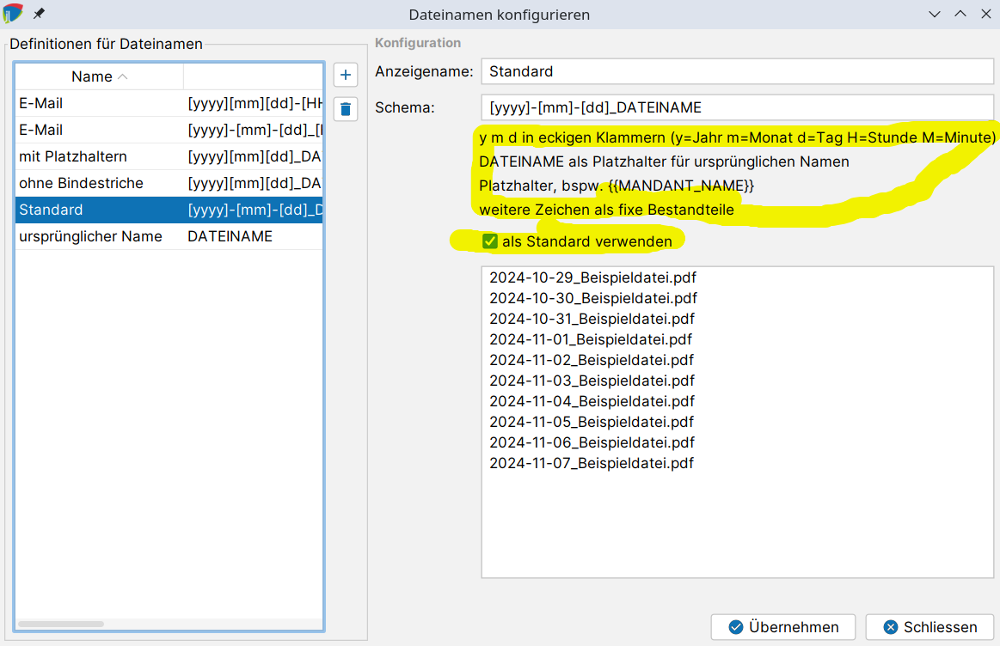
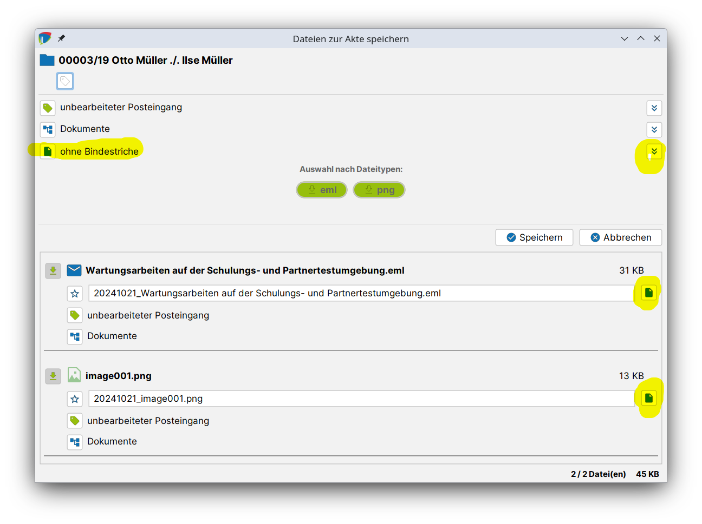
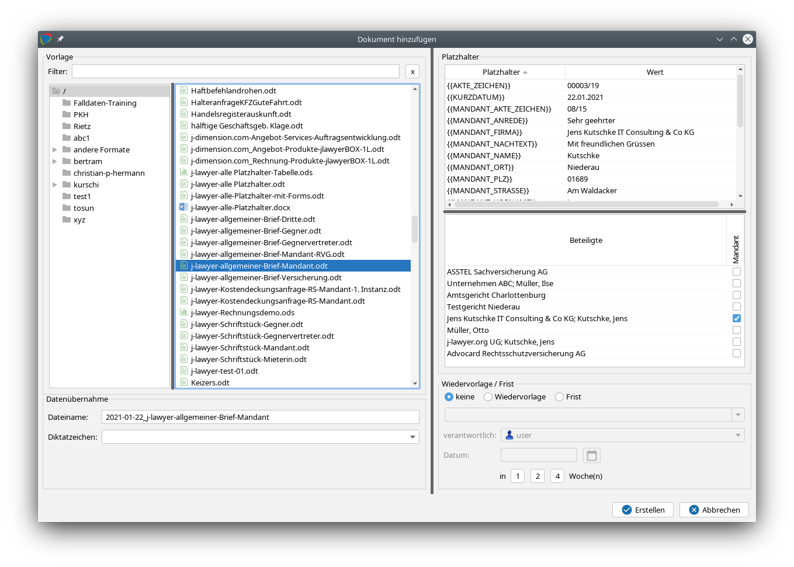
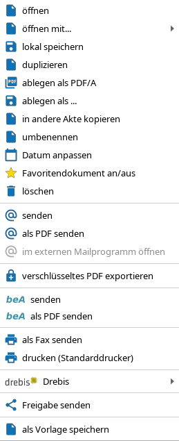

# Dokumente erstellen und hinzufügen {#dokument-erstellen}

## Dateinamen-Automatik {#dateinamen}

Im Menüpunkt „Einstellungen" – „Dokumente" – „Dateinamen" lassen sich ein oder mehrere Dateinamenskonventionen konfigurieren.



Mit den Voreinstellungen wird j-lawyer.org Dateinamen in dieser Form nutzen:

```
2024-10-30_Schriftsatz.odt
```

Im Einstellungsdialog lassen sich sowohl das Standardschema anpassen, als auch weitere Bildungsvorschriften für Dateinamen definieren. Dateinamen können dabei aus Platzhaltern generiert werden:

- Platzhalter für Zeitangaben – in eckigen Klammern
    - y = Jahr
    - m = Monat
    - d = Tag
    - M = Minute
    - H = Stunde
- Platzhalter für ursprünglichen Dateinamen
    - DATEINAME
- Weitere Platzhalter analog Vorlagensystem
    - bspw. {{MANDANT_NAME}}
    - Für Dokumente, die aus einem Beleg heraus erstellt werden, kann die Belegnummer (sowie weiter BEL-Platzhalter) in den Dateinamen übernommen werden, bspw. die Belegnummer per {{BEL_NR}}

Es sollte auf Groß- und Kleinschreibung geachtet werden.

### Beispiele

**Beispielschema für erstellte Vollmachten:**

```
[yyyy][mm][dd]_Vollmacht_{{MANDANT_NAME}}
```

Wird zu:

```
20241030_Vollmacht_Müller.odt
```

**Beispiel für erhaltene E-Mail im Verkehrsrecht:**

```
[yyyy][mm][dd]_DATEINAME_{{AKTE_ZEICHEN}}_{{MANDANT_NAME}}-vs-{{GEGNER_NAME}}_{{VRKHR_KENNZEICHEN}}
```

wird zu:

```
20241030_Anfrage Schadenregulierung_003-24_Müller-vs-Meier_HH-XY 1234.eml
```

Nur exakt ein Schema kann das „Standardschema" sein (Option „als Standard verwenden" ist aktiv).

Im Dialog zur Zuordnung von Dokumenten kann das Dateinamensschema für alle Dokumente oder einzelne Dokumente angepasst werden:



Eine entsprechende Einstellmöglichkeit gibt es im Rahmen der Erstellung von Dokumenten aus einer Vorlage.

## Dokument aus einer Vorlage erstellen

Über den Knopf "Erstellen" im Reiter "Dokumente" eine Akte können neue Dateien erstellt werden. Es erscheint folgendes Fenster:



Im linken Bereich des Fensters wird die Vorlage ausgewählt. Es kann auch nach einer Vorlage gesucht werden (in dem Feld neben „Filter").

Der Dateiname und das Diktatzeichen können eingegeben bzw. ausgewählt werden.

Daten der Beteiligten können übernommen werden. Dazu wird der Beteiligte / die Beteiligten ausgewählt. Wenn mehr als ein Beteiligter in einer Rolle (Mandant, Gegner, Dritte) vorhanden ist, kann durch Umsetzen des Hakens der zu verwendende Beteiligte ausgewählt werden.

Im unteren Bereich des Fensters kann optional eine Wiedervorlage / Frist gesetzt werden.

Nach Auswahl einer Vorlage und der Beteiligten erscheint auf der rechten Seite im Bereich Platzhalter / Wert eine Vorschau der Daten, die übernommen werden. Diese Tabelle mit Platzhalter und ihren Werten kann bearbeitet werden. Fehlt ein Platzhalter, oder ist eine Anpassung notwendig, so kann dies direkt in der dargestellten Tabelle durch Doppelklick durchgeführt werden.

Zum Schluss wird auf "Erstellen" geklickt.

Das Dokument ist nun im Reiter "Dokumente" vorhanden und kann durch Doppelklick geöffnet und editiert werden. Ein Rechtsklick auf den Namen des Dokuments bietet folgende Optionen:



## Vorhandene Dokumente zu einer Akte hinzufügen

Mit einem Klick auf "Hinzufügen" werden vorhandene Dateien einer Akte hinzugefügt. Es öffnet sich ein Dialogfenster, wo man die Datei(en) auswählt und mit einem Klick auf „öffnen" in die Akte übernimmt. Alternativ können die Dateien per Drag&Drop in den Bereich der Tabelle (Datum, Name, Diktatzeichen, Größe) gezogen werden.

## Dokumente aus dem Papierkorb wiederherstellen

Werden Dokumente aus einer Akte gelöscht, so werden Sie zunächst im Papierkorb abgelegt. Dabei:

- bleibt der Aktenbezug erhalten
- wird die Zugehörigkeit zu einem bestimmten Ordner der Akte zurückgesetzt
- bleibt der Dateiname des Dokuments für die betroffene Akte "reserviert" und kann erst durch endgültige Löschen aus dem Papierkorb wiederverwendet werden.

Über das Menü "Datei" – "Papierkorb" kann der Papierkorb verwaltet werden. Selektierte Dokumente lassen sich endgültig löschen oder wiederherstellen. Bei einer Wiederherstellung werden die Dokumente in den obersten Ordner der Akte einsortiert.

Die Vorhaltezeit des Papierkorbs lässt sich in verschiedenen Stufen zwischen drei und 30 Tagen einstellen.

## Dokumente sperren

Dokumente können automatisch gesperrt werden, um zeitgleiche Bearbeitung durch mehrere Nutzer zu verhindern. Die Funktionalität kann nutzerspezifisch aktiviert oder deaktiviert werden:

Menü "Administration" – "Nutzer" – Nutzer selektieren – Option auf dem ersten Tab ganz unten "Dokumente bei Bearbeitung automatisch sperren" aktivieren oder deaktivieren.

Im Falle einer aktiven Sperrung wird die Anwendung eine Warnung ausgeben. Es obliegt dem Nutzer, ob nach Anzeige der Warnung trotzdem fortgefahren werden soll.
