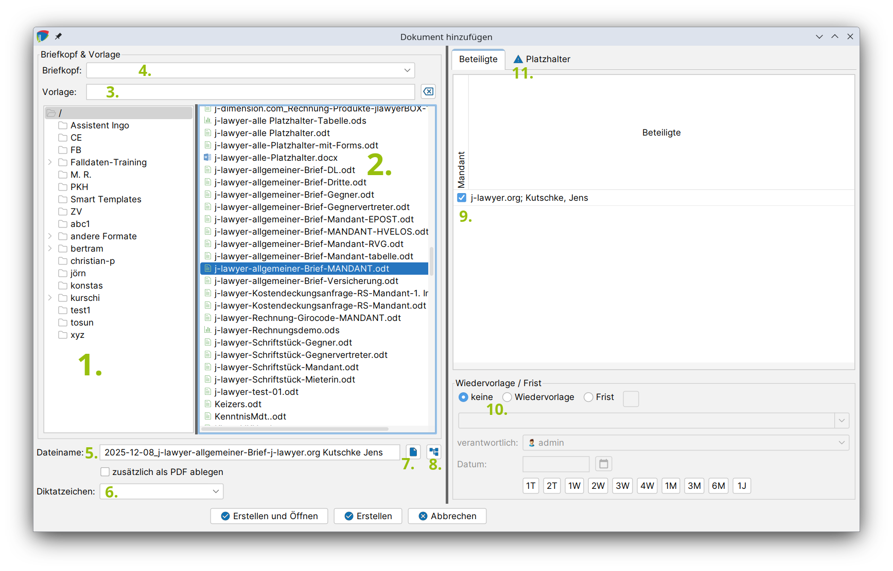

# Dokumente erstellen und hinzufügen {#dokument-erstellen}

## Dokument aus einer Vorlage erstellen

Über den Knopf "Erstellen" im Reiter "Dokumente" einer Akte können neue Dateien erstellt werden. Es erscheint folgendes Fenster:

Im linken Bereich des Fensters werden (1.) der Vorlagenordner und (2.) die Vorlage ausgewählt. Es kann auch nach einer Vorlage gesucht werden (3.).

**Optional:** Bei Nutzung der [Briefkopffunktion](briefkoepfe.md#briefkoepfe-erstellen) wird im obersten Dropdown (4.) der gewünschte Briefkopf selektiert.

**Optional:** Der Dateiname (5.) und das Diktatzeichen (6.) können angepasst bzw. ausgewählt werden. Dazu können auch [Dateinamensvorschriften](dateinamen.md) angewandt werden (7.).

**Optional:** Soll das neue Dokument direkt in einem bestimmten Ordner der Akte gelegt werden, so kann unter (8.) eine Ordnerauswahl getroffen werden.

**Optional:** Daten der Beteiligten können übernommen werden. Dazu wird der Beteiligte / werden die Beteiligten ausgewählt (9.). Wenn mehr als ein Beteiligter in einer Rolle (Mandant, Gegner, Dritte) vorhanden ist, kann durch Umsetzen des Hakens der für diese Dokumenterstellung zu verwendende Beteiligte ausgewählt werden.

**Optional:** Im unteren Bereich des Fensters kann (10.) eine Wiedervorlage / Frist gesetzt werden.

Nach Auswahl einer Vorlage und der Beteiligten erscheint auf der rechten Seite im Bereich Platzhalter eine Vorschau der Daten, die übernommen werden. Fehlen Daten in Akte oder Beteiligten, die von der Vorlage erwartet werden, so erscheint ein Hinweis in Form eines blauen Dreiecks (11.). Die in dem Tab "Platzhalter" dargestellte Tabelle kann bearbeitet werden. Fehlt ein Platzhalter, oder ist eine Anpassung notwendig, so kann dies direkt in der dargestellten Tabelle durch Doppelklick durchgeführt werden.

### PDF automatisch erstellen

Mit der Option "Als PDF speichern" kann zusätzlich zum erstellten Dokument automatisch eine PDF-Version generiert werden. Diese Einstellung wird pro Vorlage gespeichert und beim nächsten Mal vorausgewählt.

### Wiedervorlage oder Frist setzen

Im unteren Bereich des Dialogs kann eine Wiedervorlage oder Frist erstellt werden:

- **Keine**: Standardeinstellung, es wird keine Wiedervorlage/Frist erstellt
- **Wiedervorlage**: Erstellt eine Wiedervorlage zum angegebenen Datum
- **Frist**: Erstellt eine Frist zum angegebenen Datum

Für die Wiedervorlage/Frist können folgende Angaben gemacht werden:

- **Verantwortlicher**: Die Person, die für die Wiedervorlage/Frist zuständig ist (standardmäßig der Sachbearbeiter der Akte)
- **Grund**: Auswählbar aus vordefinierten Gründen oder frei eingebbar
- **Datum**: Kann manuell eingegeben, über den Kalender-Dialog oder über die Schnellauswahl-Buttons gewählt werden

### Dokument erstellen

Zum Abschluss stehen zwei Optionen zur Verfügung:

- **Erstellen**: Das Dokument wird erstellt und in der Akte gespeichert
- **Erstellen und öffnen**: Das Dokument wird erstellt und direkt zur Bearbeitung geöffnet

Das Dokument ist nun im Reiter "Dokumente" vorhanden und kann durch Doppelklick geöffnet und editiert werden. Ein Rechtsklick auf den Namen des Dokuments bietet folgende Optionen:

## Vorhandene Dokumente zu einer Akte hinzufügen

Mit einem Klick auf "Hinzufügen" werden vorhandene Dateien einer Akte hinzugefügt. Es öffnet sich ein Dialogfenster, wo man die Datei(en) auswählt und mit einem Klick auf „öffnen" in die Akte übernimmt. Alternativ können die Dateien per Drag&Drop in den Bereich der Tabelle (Datum, Name, Diktatzeichen, Größe) gezogen werden.
