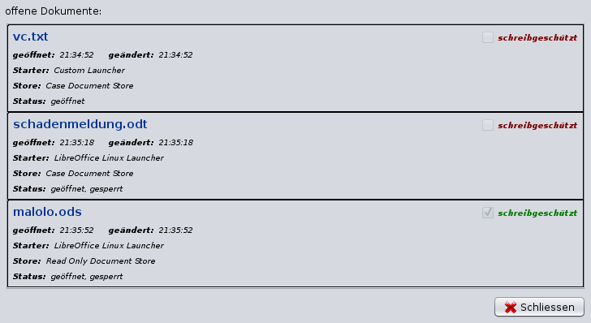

# Textverarbeitung {#textverarbeitung}

## Auswahl der Textverarbeitung: Microsoft Word / LibreOffice

Sollen .doc / .docx – Dokumente mit Microsoft Office bearbeitet werden (anstelle von LibreOffice), so ist der vollständig Pfad zur "winword.exe" in die Umgebungsvariable PATH des Windowssystems aufzunehmen. Über eine Dateisuche findet man die winword.exe, der Pfad wird kopiert und dann im PATH hinzugefügt (da die Vorgehensweise hierbei zwischen verschiedenen Windows-Versionen variiert, wird auf Google verwiesen). Unter macOS sind keine besonderen Vorkehrungen zu treffen.

Anschließend kann nach einem Neustart des j-lawyer.org Clients im Menü "Einstellungen" - "Dokumente" - "Office Suite" - der primär zu verwendende Editor ausgewählt werden.  Die Einstellung ist nutzer- und geräteabhängig. So kann ein Kanzleisoftwarenutzer "Otto" auf dem PC primär mit Microsoft Office arbeiten, auf seinem Linuxlaptop mit LibreOffice.

In der Dokumentenansicht einer Akte wird mit Doppelklick dann die ausgewählte Textverarbeitung genutzt. Soll ein bestimmtes Dokument mit einer anderen Textverarbeitung geöffnet werden, so kann per Rechtsklick und "öffnen mit" der gewünschte Editor angefordert werden.

LibreOffice muss weiterhin installiert bleiben, da es im Hintergrund bspw. für Konvertierungsaufgaben verwendet wird (insbesondere PDF-Konvertierung).

!!! warning "Hinweis"
    Aktuell wird von der Verwendung von Textfeldern in .docx-Vorlagen abgeraten. Verwendung vieler Textfelder führt zu sehr langen Zeiten bei der Ermittlung der in der Vorlage verwendeten Platzhalter sowie deren Ersetzung.

## Allgemeine Hinweise zur Dokumentbearbeitung

Folgendes ist bei der Arbeit mit Dokumenten zu beachten:

- es können beliebig viele Dokumente gleichzeitig geöffnet werden
- es können Dokumente verschiedener Akten gleichzeitig geöffnet werden
- Dokumente müssen gespeichert und geschlossen werden, bevor der j-lawyer.org Client beendet wird – anderenfalls findet keine Rückspeicherung in die Akte(n) statt

Wird der j-lawyer.org Client geschlossen während noch Dokumente geöffnet sind, so wird ein Dialog mit den als noch offen erkannten Dokumenten angezeigt. Speichern und schließen Sie dann alle Dokumente und beenden Sie dann den j-lawyer.org Client.

Der genannte Dialog ist auch jederzeit über das Menü "?", Menüpunkt "Dokumentmonitor" zu öffnen und zeigt aktuell "überwachte" Dokumente an:

- Dateiname
- schreibgeschützt ja/nein
- geöffnet (Zeit)
- zuletzt gespeichert (Zeit)
- Starttyp
- Speichertyp
- Status

## LibreOffice Auto-Texte zentral im Netzwerk nutzen

Die AutoText-Funktionalität von LibreOffice ist eine Möglichkeit, über Kürzel ganze Textbausteine einzufügen und so Tipparbeit zu reduzieren. Dazu können Kürzel und Inhalte den Anforderungen entsprechend konfiguriert werden.

Hier eine kurze beispielhafte Beschreibung, wie Auto-Texte zentral auf einer j-lawyer.BOX abgelegt und auf Windows-Arbeitsplätzen genutzt werden können:

1. Über den Explorer ein Netzlaufwerk J:\ verbinden, für den Pfad `\\j-lawyer-box\j-lawyer-share\daten`. Dabei die Option aktivieren, das Netzlaufwerk automatisch bei Anmeldung zu verbinden.
2. Im Verzeichnis "daten" der j-lawyer.BOX wird ein neues Verzeichnis angelegt: `libreoffice-autotext`
3. LibreOffice öffnen
4. Menü "Bearbeiten", Menüpunkt "AutoText"
5. Im Dialog einmal auf "Pfad" gehen und dieses Verzeichnis hinzufügen: `J:\daten\libreoffice-autotext`
6. Dann im Dialog auf "Kategorien" gehen und eine neue Kategorie anlegen, mit Namen "j-lawyer" und Nutzung des eben angelegten Pfades. Mit "Neu" bestätigen. Nun hat man eine zentrale AutoText-Ablage für alle Auto-Texte, die in der Kategorie "j-lawyer" angelegt werden.
