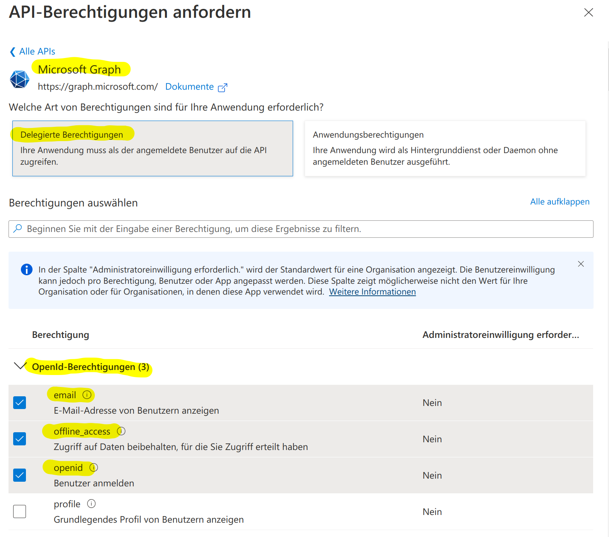
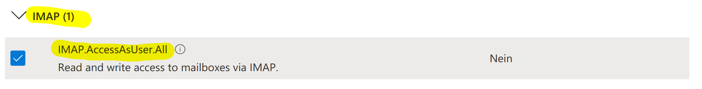
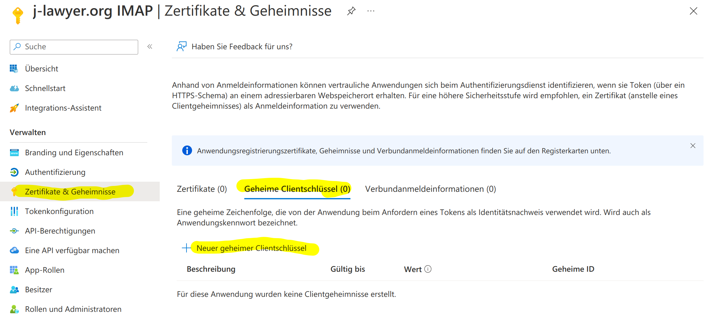
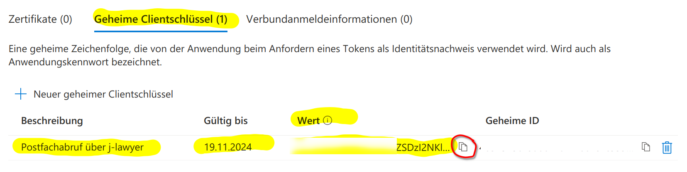
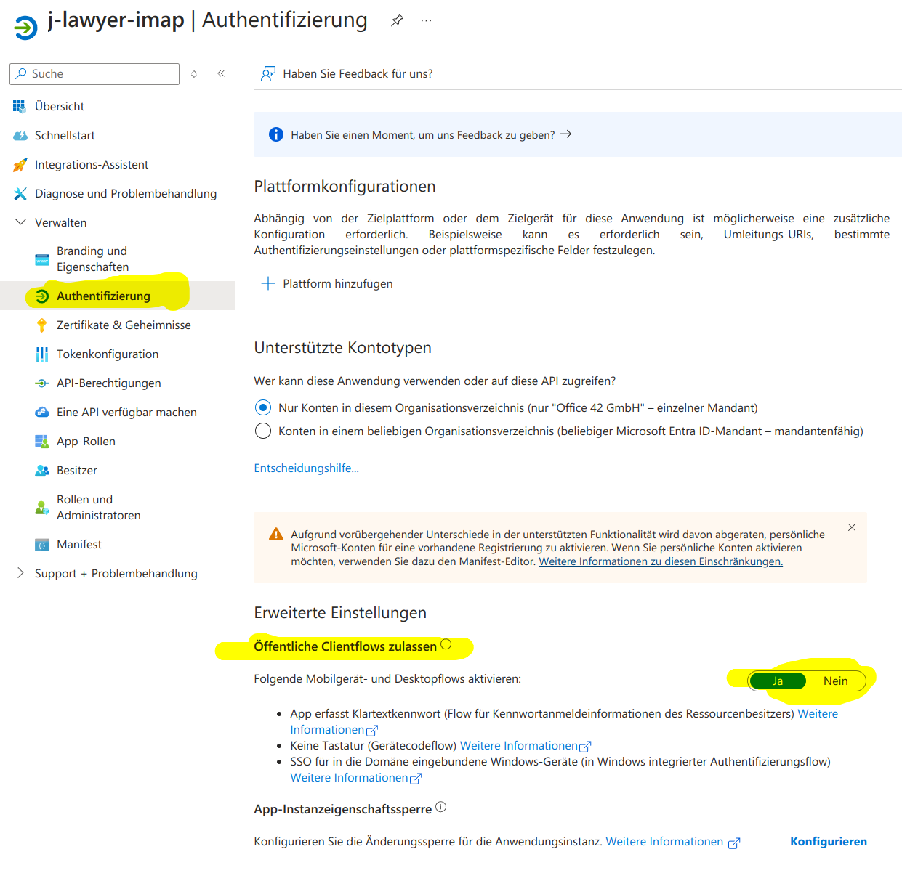
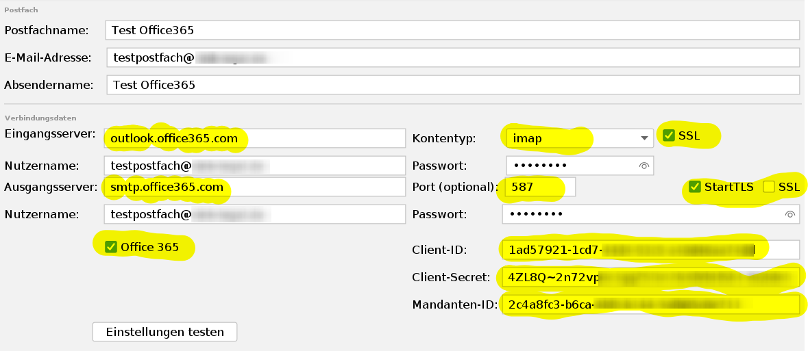

# E-Mail-Integration


E-Mail-Postfächer können im Menü „Einstellungen“ – „E-Mail – Postfächer“ konfiguriert werden. Die Zugangs- und Verbindungsdaten werden dort an zentraler Stelle hinterlegt.

Über die Nutzerverwaltung („Einstellungen" – „Nutzer") kann einem oder mehreren Nutzern Zugriff auf eines oder mehrere zentral konfigurierte Postfächer gewährt werden.

### Anbindung von IMAP-Postfächern {#imap-postfaecher}

Für die Anbindung eines Standard-IMAP- oder POP3-Postfachs (z. B. bei IONOS, Strato, All-Inkl oder einem eigenen Mailserver) benötigen Sie lediglich die Zugangsdaten Ihres E-Mail-Anbieters. Die Einrichtung erfolgt im Menü **Einstellungen** → **E-Mail – Postfächer**.

#### Übersicht des Dialogs

Der Konfigurationsdialog ist zweigeteilt:

- **Linke Seite**: Liste aller konfigurierten Postfächer mit den Schaltflächen **+** (neues Postfach anlegen), **Entfernen** und **Duplizieren**.
- **Rechte Seite**: Tabs mit den Einstellungen des ausgewählten Postfachs.

#### Schritt 1: Neues Postfach anlegen

Klicken Sie auf **+**, um ein neues Postfach anzulegen. Wechseln Sie anschließend zum Tab **Postfach** und füllen Sie die folgenden Felder aus:

| Feld | Beschreibung |
|------|-------------|
| Postfachname | Anzeigename des Postfachs in der Postfachliste |
| E-Mail-Adresse | Die E-Mail-Adresse des Postfachs (Pflichtfeld) |
| Absendername | Name, der beim Empfänger als Absender angezeigt wird |

#### Schritt 2: Verbindungsdaten konfigurieren

Wechseln Sie zum Tab **Verbindung**. Hier konfigurieren Sie die Server für den Posteingang und den Postausgang.

**Posteingang**

| Feld | Beschreibung |
|------|-------------|
| Eingangsserver | Hostname des IMAP- oder POP3-Servers (Pflichtfeld) |
| Nutzername | Benutzername für die Anmeldung am Eingangsserver (Pflichtfeld) |
| Kontentyp | Protokoll des Eingangsservers: `imap` oder `pop3`. IMAP ist die bevorzugte Variante. |
| Passwort | Passwort für die Anmeldung am Eingangsserver (Pflichtfeld) |
| SSL/TLS | Verschlüsselte Verbindung verwenden (Standard: aktiv) |

**Postausgang**

| Feld | Beschreibung |
|------|-------------|
| Ausgangsserver | Hostname des SMTP-Servers |
| Nutzername | Benutzername für die Anmeldung am Ausgangsserver |
| Port (optional) | SMTP-Port, falls vom Standard abweichend |
| Passwort | Passwort für die Anmeldung am Ausgangsserver |
| StartTLS | StartTLS-Verschlüsselung verwenden |
| SSL/TLS | SSL/TLS-Verschlüsselung verwenden (Standard: aktiv) |

!!! note "Office 365"
    Für die Anbindung von Office 365-Postfächern nutzen Sie die Felder im Bereich „Office 365" desselben Tabs. Die ausführliche Anleitung finden Sie im Abschnitt [Anbindung von Postfächern mit Azure AD](#azure-ad).

Über die Schaltfläche **Einstellungen testen** können Sie die eingegebenen Verbindungsdaten prüfen. j-lawyer.org versucht dabei, eine Verbindung zum Eingangs- und Ausgangsserver aufzubauen und meldet Erfolg oder Fehler.

#### Schritt 3: Signaturen einrichten (optional)

Im Tab **Signatur (HTML)** können Sie eine HTML-formatierte Signatur erstellen, die beim Verfassen neuer E-Mails automatisch angefügt wird. Der integrierte Editor bietet grundlegende Formatierungsmöglichkeiten.

Alternativ oder ergänzend können Sie im Tab **Signatur (Text)** eine reine Textsignatur hinterlegen, die in reinen Textnachrichten verwendet wird.

#### Schritt 4: Erweiterte Einstellungen (optional)

Der Tab **Erweitert** bietet jeweils einen Bereich für **Posteingang** und **Postausgang**, in dem benutzerdefinierte Konfigurationsparameter im Java-Properties-Format hinterlegt werden können. Dies ist nur in Ausnahmefällen notwendig, z. B. bei ungewöhnlichen Serverkonfigurationen.

#### Schritt 5: Speichern und Zugriff freigeben

Klicken Sie auf **Übernehmen**, um die Einstellungen zu speichern. Damit andere Nutzer auf das Postfach zugreifen können, muss der Zugriff anschließend in der Nutzerverwaltung (**Einstellungen** → **Nutzer**) freigegeben werden.

#### Typische Servereinstellungen

Die folgende Tabelle listet die Serveradressen gängiger deutscher E-Mail-Anbieter auf:

| Anbieter | Eingangsserver (IMAP) | Ausgangsserver (SMTP) |
|----------|----------------------|----------------------|
| IONOS (1&1) | imap.ionos.de | smtp.ionos.de |
| Strato | imap.strato.de | smtp.strato.de |
| All-Inkl | imap.all-inkl.com | smtp.all-inkl.com |
| T-Online | secureimap.t-online.de | securesmtp.t-online.de |

Bei allen Anbietern sollte **SSL/TLS** aktiviert sein. Benutzername und Passwort entsprechen in der Regel den Zugangsdaten, die Sie von Ihrem Anbieter erhalten haben.

### Anbindung von Postfächern mit Azure AD (Office 365) {#azure-ad}


Ab Version 3.1 unterstützt j-lawyer.org eine Anbindung von Office 365-Postfächern mit oder ohne Zweifaktor-Authentifizierung. Die Einrichtung erfordert folgende Schritte:

1. IMAP und SMTP erlauben

Microsoft 365 Admin Center öffnen: <https://admin.microsoft.com/>

Links auf „Benutzer“, danach „Aktive Benutzer“.


Für jeden Nutzer wird in den Einstellungen (vgl. Screenshots) die Anmeldung mittels SMTP erlaubt. Dazu einmal auf den jeweiligen Account klicken und anschließend auf „E-Mail“, gefolgt von „E-Mail-Apps verwalten“:


Stellen Sie sicher, dass „IMAP“ und „Authentifiziertes SMTP“ aktiviert sind:


2. optional: Konten ohne Zweifaktor-Authentifizierung erlauben

Sollen Konten ohne Zweifaktor-Authentifizierung angebunden werden, so sind Einstellungen entsprechend der untenstehenden Screenshots vorzunehmen.

Einstellungen öffnen: <https://entra.microsoft.com/#home>


3. Moderne Authentifizierung konfigurieren

Microsoft 365 Admin Center öffnen: <https://admin.microsoft.com/>

Links im Menü auf „Alle anzeigen“, dann auf „Einstellungen“ und „Einstellungen der Organisation“. Dort unter „Moderne Authentifizierung“ die Option „Authentifiziertes SMTP“ aktivieren:


4. App erstellen

Anmeldung im Azure Portal

<https://portal.azure.com/#view/Microsoft_AAD_IAM/ActiveDirectoryMenuBlade/~/Overview>

Nach erfolgreichem Login sollte man eine Übersichtsseite erhalten, welche Basisinformation wie bspw. die Mandanten-ID beinhaltet:


Die Mandanten-ID sollte kopiert werden – sie wird später für die Konfiguration im j-lawyer.org Client benötigt.

Neue App registrieren

Im linken Navigationsbereich auf „App-Berechtigungen“, anschließend auf „Neue Registrierung“.


Im ersten Schritt wird ein Name für die App angegeben, bspw. „j-lawyer.org IMAP“ oder „j-lawyer.org E-Mail“:


Anschließend per Klick auf „Registrieren“ eine leere App-Hülle erstellen.

Berechtigungen vergeben

Im Folgenden werden der App Berechtigungen gegeben und es wird ein App-spezifisches Passwort vergeben.

Zunächst notiert / kopiert man sich die „Anwendungs-ID“ (auch Client-ID genannt) zur späteren Nutzung im j-lawyer.org Client:


Nach einem Klick auf „API-Berechtigungen“ sollte die App bereits über das Recht „User.Read“ verfügen:


Nach einem Klick auf „Berechtigung hinzufügen“ wählt man „Microsoft Graph“ aus:


Nach Auswahl von „Delegierte Berechtigungen“ werden in der Kategorie „OpenID-Berechtigungen“ die Werte
- email

- offline_access

- openid

ausgewählt.




Im selben Dialog wird in der Kategorie „IMAP“ die folgende Berechtigung gewählt:




Analog verfahren für „SMTP.Send“ in der Kategorie „SMTP“.

Der Dialog wird mit einem Klick auf „Berechtigungen hinzufügen“ abgeschlossen.

Passwort erstellen

Im letzten Schritt wird für die App ein eigenes Passwort vergeben, das sogenannte „Client Secret“.

Dazu zunächst im linken Navigationsbereich auf „Zertifikate und Geheimnisse“, anschließend auf „Neuer geheimer Clientschlüssel“:




Im daraufhin erscheinenden Detail-Dialog vergeben Sie eine Beschreibung, bspw. „Zugriff auf das Postfach über j-lawyer“ o.ä., sowie eine Gültigkeitsdauer. Wer Aufwand sparen möchte, nutzt die maximal möglichen 24 Monate. Es ist empfehlenswert, sich einen Termin ein paar Wochen vor Ablauf im Kalender zu vermerken: „Azure AD Client Secret erneuern“. Zu diesem Zeitpunkt muss Punkt (4) dieser Anleitung erneut ausgeführ und das neue Client Secret im j-lawyer.org Client hinterlegt werden.

Nach Bestätigung erhält man das eigentliche Client Secret:




Relevant ist der „Wert“, nicht die „Geheime ID“. Den Wert daher für die spätere Nutzung kopieren. Anschließend wird die Einrichtung im j-lawyer.org Client abgeschlossen.

Abschließend unter „Authentifizierung“ der App die Option „Öffentliche Clientflows zulassen“ aktivieren:




5. Einbinden des Postfaches im j-lawyer.org Client

Im Client im Menü „Einstellungen“ – „E-Mail – Postfächer“ wird über den „+“-Knopf ein Postfach hinzugefügt und wie folgt konfiguriert:




Die Servernamen sind hier kopierbar aufgeführt:
- Eingangsserver: outlook.office365.com

- Ausgangsserver: smtp.office365.com

Danach mittels des Buttons hinter „Client-ID“ das Postfach koppeln. Nach Anmeldung im Browser findet die Verknüpfung des Konto mit der App statt.

Nach erfolgreichem Test kann das Postfach über die Nutzerverwaltung für die gewünschten j-lawyer.org-Nutzer freigegeben und nach Neustart des Clients genutzt werden.

### Anbindung von Google Mail-Postfächern {#google-mail}


Google Mail-Postfächer können mittels eines sogenannten App-Passworts angebunden werden. Bedingung ist, dass für den Account eine 2-Faktor-Authentifizierung (2FA) aktiv ist.

2FA aktivieren
- Zu den Kontoeinstellungen wechseln: <https://myaccount.google.com/>

- Wählen Sie „Sicherheit“ aus

- Wählen Sie unter „Bei Google anmelden“ die Option für 2-Faktor-Authentifizierung aus

Ist die Einstellung bei Google Workspace-Konten nicht zu finden, so muss sie vorab vom Administrator aktiviert / freigegeben werden (<https://admin.google.com/ac/security/2sv>).

App-Passwort erstellen
- Öffnen Sie die Seite zur Erstellung von App-Passwörtern: <https://myaccount.google.com/apppasswords>

- Nutzen Sie einen leicht identifizierbaren Namen für das App-Passwort. Es sollte den Zweck widerspiegeln, bspw. „j-lawyer-mail“.

- Nach Klick auf „Erstellen“ wird das App-Passwort angezeigt. Es besteht aus 4 Gruppen mit je 4 Zeichen, getrennt durch Leerzeichen und sollte in die Zwischenablage übernommen oder anderweitig gespeichert werden.

- Abschließend nutzen Sie dieses App-Passwort anstelle des Google-Account-Passworts in den Einstellen des E-Mail-Postfaches im j-lawyer.org Client.

### Bei Verbindungsproblemen: Mailserver als vertrauenswürdig deklarieren {#mailserver-vertrauen}


Unter Windows gibt es verschiedene Hersteller von „Sicherheitssoftware", deren Produkte verschlüsselte Verbindungen aufbrechen um darin nach Viren etc. zu suchen. Der j-lawyer.org Client vertraut den dabei untergeschobenen SSL-Zertifikaten nicht und verwehrt eine Verbindung.

Ist man sich sicher, dass eine Verbindung zu einem Mailserver vertrauenswürdig ist, kann man über eine Konfiguration den jeweiligen Server whitelisten: Menü „Administration" – „Administrator-Konsole". Dort folgenden Befehl eingeben:

```bash
setsetting mail.imaps.ssl.trust NAMEDESMAILSERVERS
```

NAMEDESMAILSERVERS durch den Namen des SMTP / IMAP-Servers ersetzen, bspw.

```bash
setsetting mail.imaps.ssl.trust mail.your-server.de
```

Es können – durch Komma getrennt – mehrere Server angegeben werden.

### Automatische Veraktung {#automatische-veraktung}

j-lawyer.org kann E-Mails automatisch zur passenden Akte speichern. Der Server prüft regelmäßig die konfigurierten Postfächer und ordnet eingehende E-Mails anhand verschiedener Kriterien der richtigen Akte zu.

#### Einstellungen in der Postfachkonfiguration

Die automatische Veraktung wird pro Postfach im Menü **Einstellungen** → **E-Mail – Postfächer** konfiguriert. Wählen Sie ein Postfach aus und wechseln Sie zum Tab **Automation**.

| Einstellung | Beschreibung |
|-------------|--------------|
| Posteingang scannen | Aktiviert die automatische Veraktung für dieses Postfach |
| Zeitraum (Tage) | Nur E-Mails der letzten X Tage werden geprüft (Standard: 2 Tage) |
| Dokumenten-Etiketten | Etiketten, die automatisch gespeicherten Dokumenten zugewiesen werden |
| Blacklist Dateitypen | Anhang-Dateitypen, die nicht gespeichert werden sollen (z.B. exe, bat) |
| Ausschlussliste | E-Mail-Adressen, die vom Scan ausgeschlossen werden (Absender oder Empfänger) |
| Mindestgröße Anhänge | Anhänge unterhalb dieser Größe werden ignoriert |
| Inline-Anhänge ignorieren | Eingebettete Bilder in der E-Mail nicht als separate Dokumente speichern |
| Standard-Akte | Fallback-Akte für E-Mails, die keiner Akte zugeordnet werden können |

#### Wie die Aktenzuordnung funktioniert

Der Server versucht, eingehende E-Mails automatisch einer Akte zuzuordnen. Dabei werden folgende Kriterien in dieser Reihenfolge geprüft:

1. **Aktenzeichen im Betreff**: Enthält der Betreff ein bekanntes Aktenzeichen, wird die E-Mail dieser Akte zugeordnet.

2. **Aktenzeichen im Text**: Enthält der E-Mail-Text ein bekanntes Aktenzeichen, wird die E-Mail dieser Akte zugeordnet.

3. **Absender (FROM)**: Ist die Absender-Adresse eindeutig einem Kontakt zugeordnet, der nur in einer aktiven Akte beteiligt ist, wird die E-Mail dieser Akte zugeordnet.

4. **CC-Empfänger**: Ist eine CC-Adresse eindeutig einem Kontakt zugeordnet, der nur in einer aktiven Akte beteiligt ist, wird die E-Mail dieser Akte zugeordnet.

5. **TO-Empfänger**: Ist eine Empfänger-Adresse eindeutig einem Kontakt zugeordnet, der nur in einer aktiven Akte beteiligt ist, wird die E-Mail dieser Akte zugeordnet.

6. **Standard-Akte**: Kann keine Zuordnung gefunden werden und ist eine Standard-Akte konfiguriert, wird die E-Mail dort gespeichert.

Archivierte Akten werden bei der Zuordnung nicht berücksichtigt.

#### Verarbeitung und Ablage

Nach erfolgreicher Zuordnung wird die E-Mail:

- Als .eml-Datei in der Akte gespeichert
- Mit den konfigurierten Dokumenten-Etiketten versehen
- Anhänge werden als separate Dokumente gespeichert (sofern nicht auf der Blacklist oder zu klein)
- Im Postfach in den Unterordner **in Akte importiert** verschoben

#### Tipps für die Praxis

- Bitten Sie Mandanten und Gegner, das Aktenzeichen im Betreff anzugeben – dies ermöglicht die zuverlässigste Zuordnung
- Nutzen Sie die Ausschlussliste für Newsletter oder Systembenachrichtigungen
- Konfigurieren Sie passende Dokumenten-Etiketten wie „E-Mail" oder „Eingang", um importierte E-Mails schnell zu erkennen
- Prüfen Sie regelmäßig den Ordner „in Akte importiert" im Postfach, um die korrekte Zuordnung zu kontrollieren

## Thunderbird-Erweiterung {#thunderbird}

Für den E-Mail-Client Thunderbird steht eine Erweiterung zur Verfügung, die eine direkte Integration mit j-lawyer.org ermöglicht. Mit dieser Erweiterung können E-Mails direkt aus Thunderbird an den j-lawyer.org Server gesendet und dort in Akten gespeichert werden.

### Funktionen

- **E-Mail-Veraktung**: Komplette Nachricht inkl. Anhänge, nur Nachricht oder nur Anhänge in eine Akte hochladen
- **Mehrfachauswahl**: Mehrere markierte Nachrichten per Rechtsklick an eine Akte senden
- **Bildverarbeitung**: Bilder zuschneiden, Reihenfolge festlegen, umbenennen und als ein PDF zusammenfassen
- **Automatische Tags**: Gespeicherte Nachrichten werden automatisch mit dem Tag „veraktet" versehen
- **Zielordner-Auswahl**: Dokumente können in bestimmte Ordner innerhalb der Aktenstruktur abgelegt werden
- **Kalenderintegration** (ab j-lawyer.org 2.6): Termine, Fristen und Wiedervorlagen direkt aus Thunderbird erstellen
- **Vorlagen im Verfassen-Modus**: Beim Schreiben von E-Mails Vorlagen mit Platzhaltern einfügen und Dokumente aus der Akte als Anhang hinzufügen
- **Automatische Aktenzeichen-Erkennung**: Aktenzeichen in der Betreffzeile werden automatisch erkannt
- **Datensynchronisation**: Automatischer täglicher Datenabgleich mit dem j-lawyer.org Server
- **Optionales Aufräumen**: E-Mails nach dem Upload automatisch verschieben oder löschen

### Installation

Die Erweiterung ist im offiziellen Thunderbird Add-ons-Verzeichnis verfügbar:

<https://services.addons.thunderbird.net/de/thunderbird/addon/j-lawyer-org-tb-extension/>

**Systemvoraussetzungen:** Thunderbird 125.0 oder neuer

### Quellcode

Der Quellcode der Erweiterung ist öffentlich auf GitHub verfügbar:

<https://github.com/jlawyerorg/j-lawyer-tbaddon>
