# E-Mail-Integration

E-Mail-Postfächer können im Menü „Einstellungen“ – „E-Mail – Postfächer“ konfiguriert werden. Die Zugangs- und Verbindungsdaten werden dort an zentraler Stelle hinterlegt.

Über die Nutzerverwaltung („Einstellungen“ – „Nutzer“) kann einem oder mehreren Nutzern Zugriff auf eines oder mehrere zentral konfigurierte Postfächer gewährt werden.

### Anbindung von Postfächern mit Azure AD (Office 365) {#azure-ad}

Ab Version 3.1 unterstützt j-lawyer.org eine Anbindung von Office 365-Postfächern mit oder ohne Zweifaktor-Authentifizierung. Die Einrichtung erfordert folgende Schritte:

1. IMAP und SMTP erlauben

Microsoft 365 Admin Center öffnen: https://admin.microsoft.com/

Links auf „Benutzer“, danach „Aktive Benutzer“.

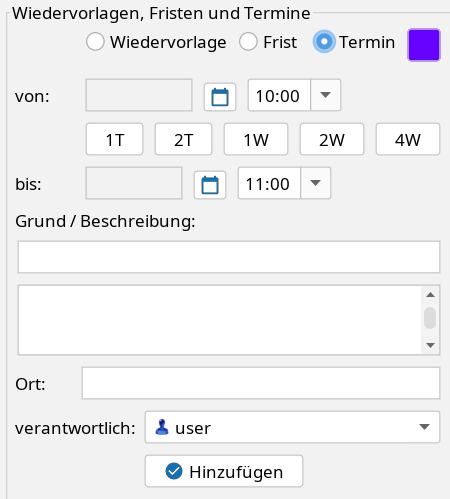

Abbildung 26: Microsoft 365 Admin Center, Benutzer

Für jeden Nutzer wird in den Einstellungen (vgl. Screenshots) die Anmeldung mittels SMTP erlaubt. Dazu einmal auf den jeweiligen Account klicken und anschließend auf „E-Mail“, gefolgt von „E-Mail-Apps verwalten“:

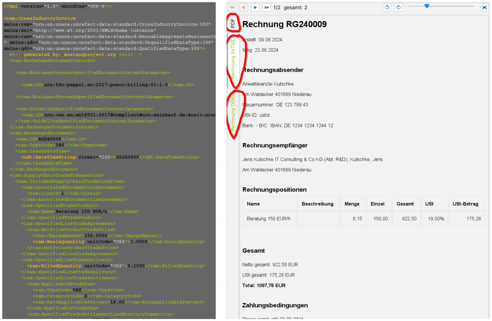

Abbildung 27: Microsoft 365 Admin Center, E-Mail-Einstellungen eines Accounts

Stellen Sie sicher, dass „IMAP“ und „Authentifiziertes SMTP“ aktiviert sind:

Abbildung 28: Microsoft 365 Admin Center, IMAP und SMTP aktivieren

2. optional: Konten ohne Zweifaktor-Authentifizierung erlauben

Sollen Konten ohne Zweifaktor-Authentifizierung angebunden werden, so sind Einstellungen entsprechend der untenstehenden Screenshots vorzunehmen.

Einstellungen öffnen: https://entra.microsoft.com/#home

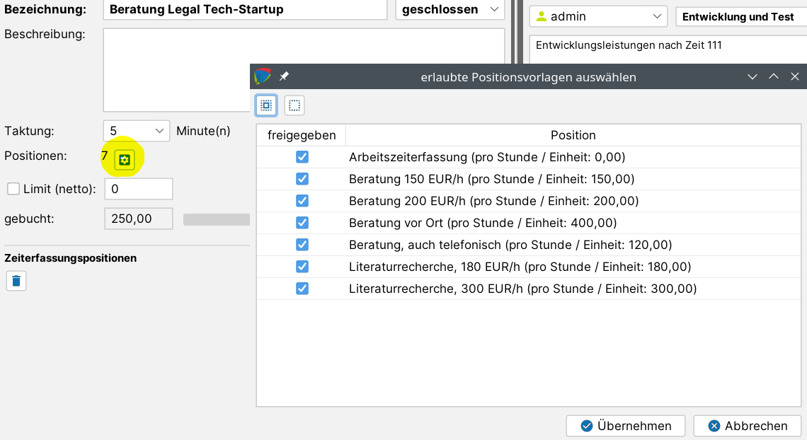

Abbildung 29: Microsoft Entra ID - Einstellungen

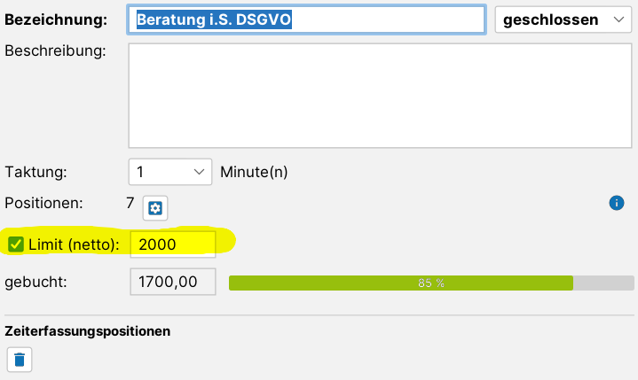

Abbildung 30: Microsoft Entra ID – Einstellungen, Sicherheitsstandards

3. Moderne Authentifizierung konfigurieren

Microsoft 365 Admin Center öffnen: https://admin.microsoft.com/

Links im Menü auf „Alle anzeigen“, dann auf „Einstellungen“ und „Einstellungen der Organisation“. Dort unter „Moderne Authentifizierung“ die Option „Authentifiziertes SMTP“ aktivieren:

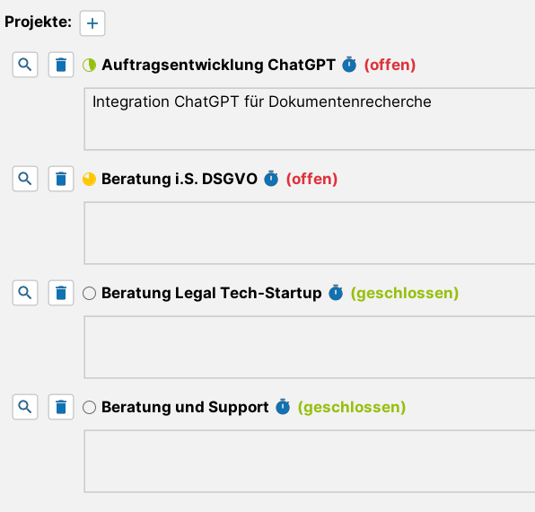

Abbildung 31: Microsoft 365 Admin Center, Moderne Authentifizierung

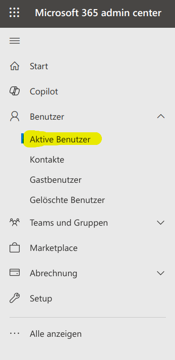

Abbildung 32: Microsoft 365 Admin Center, Moderne Authentifizierung – authentifiziertes SMTP

4. App erstellen

Anmeldung im Azure Portal

https://portal.azure.com/#view/Microsoft_AAD_IAM/ActiveDirectoryMenuBlade/~/Overview

Nach erfolgreichem Login sollte man eine Übersichtsseite erhalten, welche Basisinformation wie bspw. die Mandanten-ID beinhaltet:

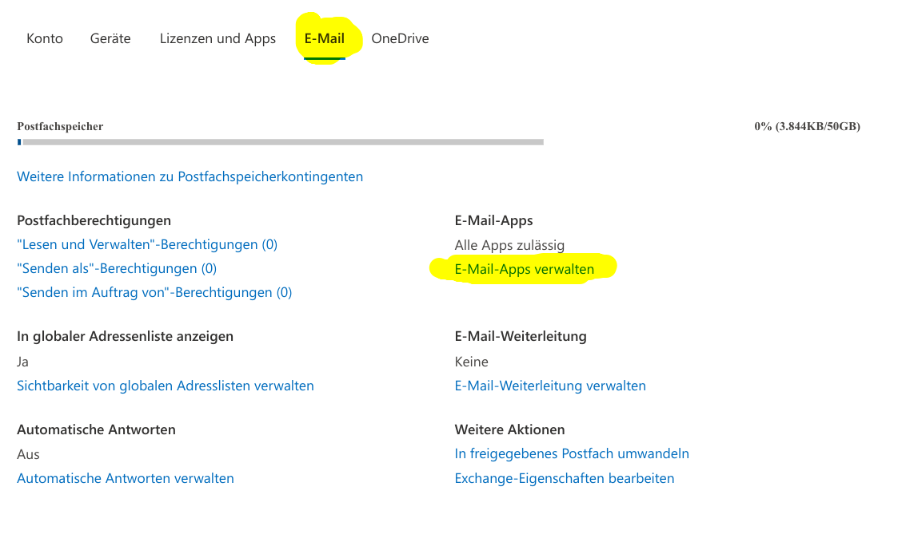

Abbildung 33: Azure Active Directory, Übersichtsseite

Die Mandanten-ID sollte kopiert werden – sie wird später für die Konfiguration im j-lawyer.org Client benötigt.

Neue App registrieren

Im linken Navigationsbereich auf „App-Berechtigungen“, anschließend auf „Neue Registrierung“.

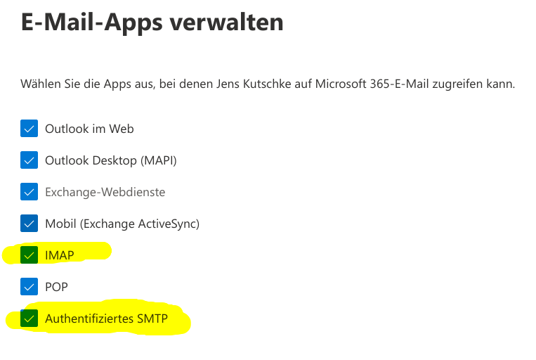

Abbildung 34: Azure Active Directory, App-Registrierungen

Im ersten Schritt wird ein Name für die App angegeben, bspw. „j-lawyer.org IMAP“ oder „j-lawyer.org E-Mail“:

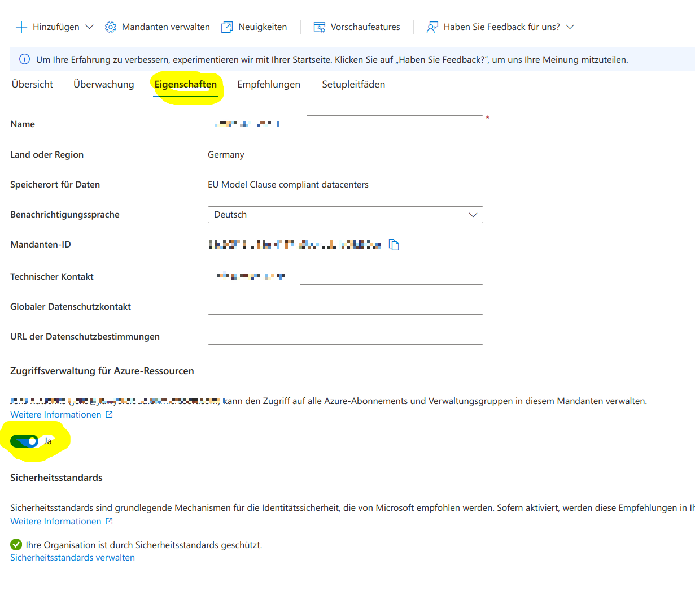

Abbildung 35: Azure Active Directory, App-Name

Anschließend per Klick auf „Registrieren“ eine leere App-Hülle erstellen.

Berechtigungen vergeben

Im Folgenden werden der App Berechtigungen gegeben und es wird ein App-spezifisches Passwort vergeben.

Zunächst notiert / kopiert man sich die „Anwendungs-ID“ (auch Client-ID genannt) zur späteren Nutzung im j-lawyer.org Client:

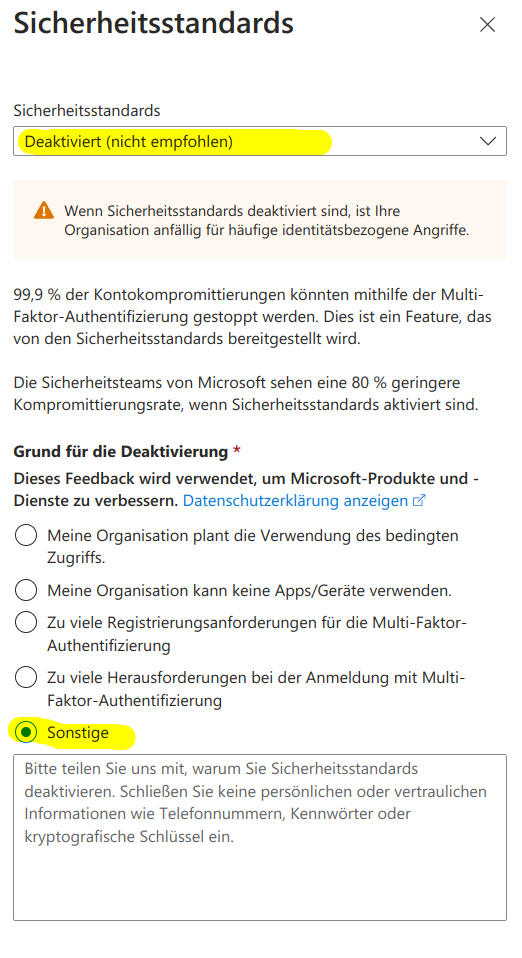

Abbildung 36: Azure Active Directory, Client-ID ermitteln

Nach einem Klick auf „API-Berechtigungen“ sollte die App bereits über das Recht „User.Read“ verfügen:

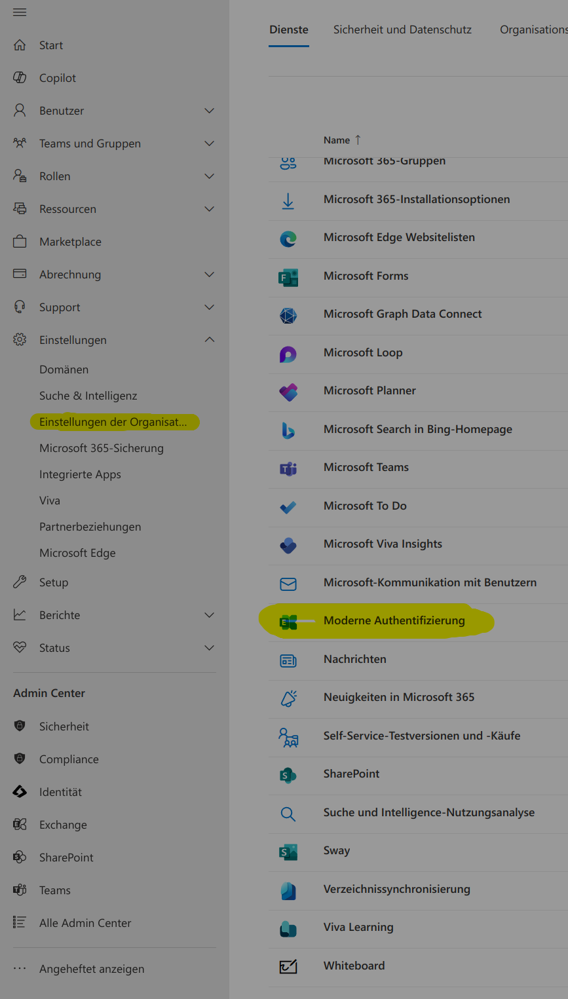

Abbildung 37: Azure Active Directory, initiale App-Berechtigungen

Nach einem Klick auf „Berechtigung hinzufügen“ wählt man „Microsoft Graph“ aus:

Abbildung 38: Azure Active Directory, Berechtigungen hinzufügen

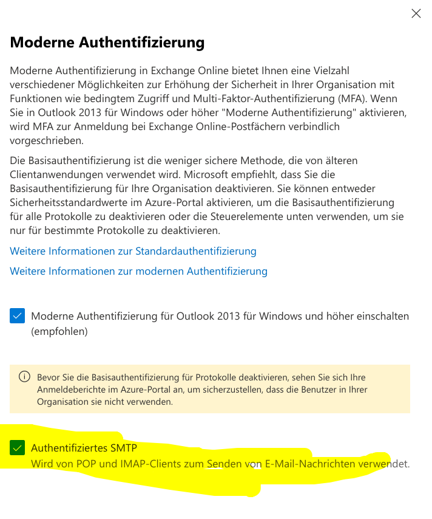

Abbildung 39: Azure Active Directory, Microsoft Graph-Berechtigungen

Nach Auswahl von „Delegierte Berechtigungen“ werden in der Kategorie „OpenID-Berechtigungen“ die Werte
- email
- offline_access
- openid

ausgewählt.

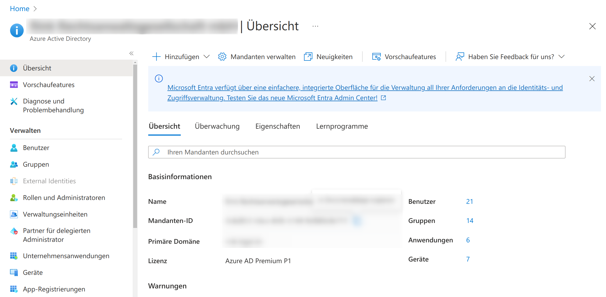

Abbildung 40: Azure Active Directory, Berechtigungen Open-ID

Im selben Dialog wird in der Kategorie „IMAP“ die folgende Berechtigung gewählt:

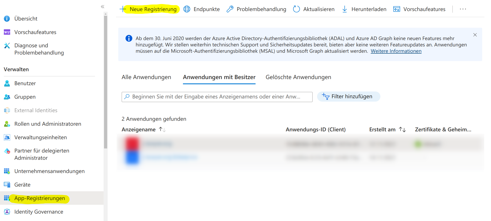

Abbildung 41: Azure Active Directory, Berechtigungen IMAP

Analog verfahren für „SMTP.Send“ in der Kategorie „SMTP“.

Der Dialog wird mit einem Klick auf „Berechtigungen hinzufügen“ abgeschlossen.

Passwort erstellen

Im letzten Schritt wird für die App ein eigenes Passwort vergeben, das sogenannte „Client Secret“.

Dazu zunächst im linken Navigationsbereich auf „Zertifikate und Geheimnisse“, anschließend auf „Neuer geheimer Clientschlüssel“:

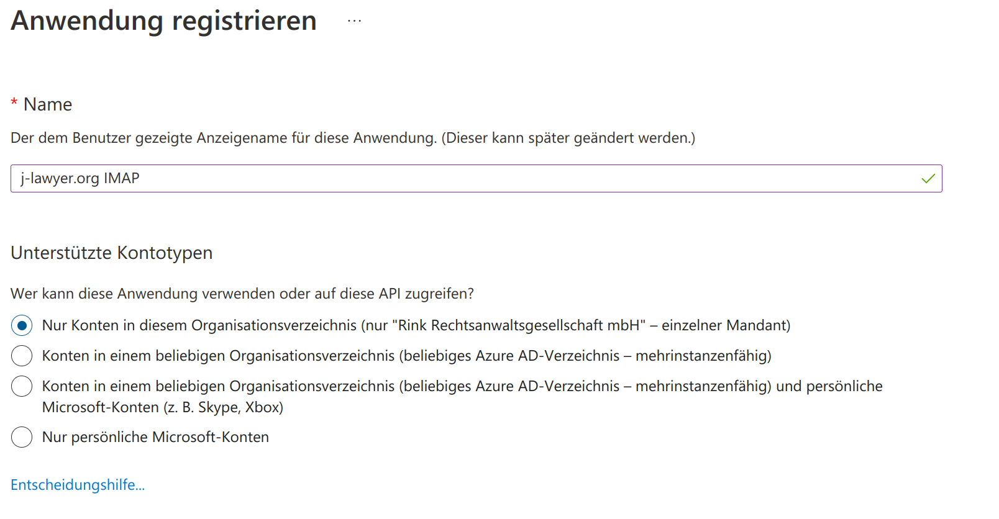

Abbildung 42: Azure Active Directory, neues Client Secret

Im daraufhin erscheinenden Detail-Dialog vergeben Sie eine Beschreibung, bspw. „Zugriff auf das Postfach über j-lawyer“ o.ä., sowie eine Gültigkeitsdauer. Wer Aufwand sparen möchte, nutzt die maximal möglichen 24 Monate. Es ist empfehlenswert, sich einen Termin ein paar Wochen vor Ablauf im Kalender zu vermerken: „Azure AD Client Secret erneuern“. Zu diesem Zeitpunkt muss Punkt (4) dieser Anleitung erneut ausgeführ und das neue Client Secret im j-lawyer.org Client hinterlegt werden.

Nach Bestätigung erhält man das eigentliche Client Secret:

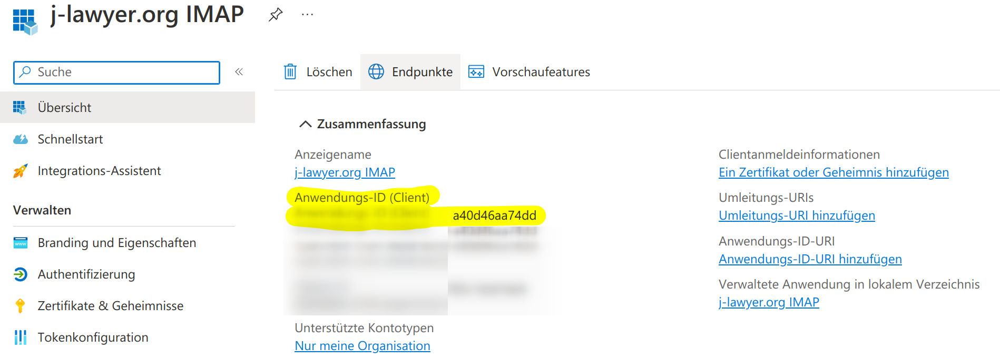

Abbildung 43: Azure Active Directory, Client Secret ermitteln

Relevant ist der „Wert“, nicht die „Geheime ID“. Den Wert daher für die spätere Nutzung kopieren. Anschließend wird die Einrichtung im j-lawyer.org Client abgeschlossen.

Abschließend unter „Authentifizierung“ der App die Option „Öffentliche Clientflows zulassen“ aktivieren:

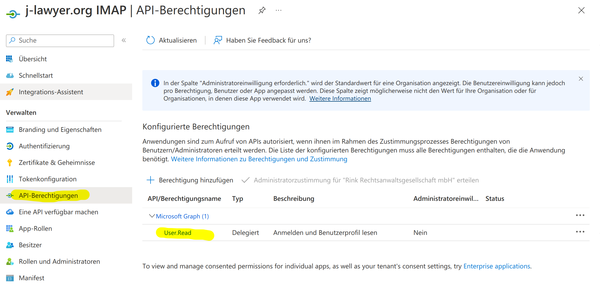

Abbildung 44: Azure Active Directory, Öffentliche Clientflows zulassen

5. Einbinden des Postfaches im j-lawyer.org Client

Im Client im Menü „Einstellungen“ – „E-Mail – Postfächer“ wird über den „+“-Knopf ein Postfach hinzugefügt und wie folgt konfiguriert:

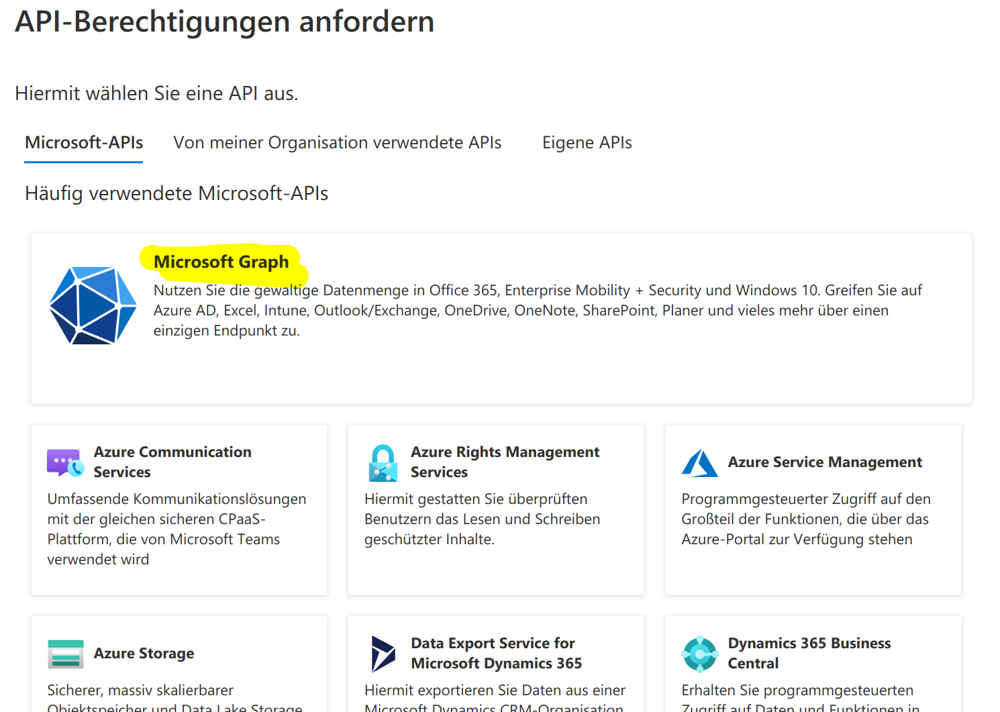

Abbildung 45: j-lawyer.org Client, Office 365-Postfach einrichten

Die Servernamen sind hier kopierbar aufgeführt:
- Eingangsserver: outlook.office365.com
- Ausgangsserver: smtp.office365.com

Danach mittels des Buttons hinter „Client-ID“ das Postfach koppeln. Nach Anmeldung im Browser findet die Verknüpfung des Konto mit der App statt.

Nach erfolgreichem Test kann das Postfach über die Nutzerverwaltung für die gewünschten j-lawyer.org-Nutzer freigegeben und nach Neustart des Clients genutzt werden.

### Anbindung von Google Mail-Postfächern {#google-mail}

Google Mail-Postfächer können mittels eines sogenannten App-Passworts angebunden werden. Bedingung ist, dass für den Account eine 2-Faktor-Authentifizierung (2FA) aktiv ist.

2FA aktivieren
- Zu den Kontoeinstellungen wechseln: https://myaccount.google.com/
- Wählen Sie „Sicherheit“ aus
- Wählen Sie unter „Bei Google anmelden“ die Option für 2-Faktor-Authentifizierung aus

Ist die Einstellung bei Google Workspace-Konten nicht zu finden, so muss sie vorab vom Administrator aktiviert / freigegeben werden (https://admin.google.com/ac/security/2sv).

App-Passwort erstellen
- Öffnen Sie die Seite zur Erstellung von App-Passwörtern: https://myaccount.google.com/apppasswords
- Nutzen Sie einen leicht identifizierbaren Namen für das App-Passwort. Es sollte den Zweck widerspiegeln, bspw. „j-lawyer-mail“.
- Nach Klick auf „Erstellen“ wird das App-Passwort angezeigt. Es besteht aus 4 Gruppen mit je 4 Zeichen, getrennt durch Leerzeichen und sollte in die Zwischenablage übernommen oder anderweitig gespeichert werden.
- Abschließend nutzen Sie dieses App-Passwort anstelle des Google-Account-Passworts in den Einstellen des E-Mail-Postfaches im j-lawyer.org Client.

### Bei Verbindungsproblemen: Mailserver als vertrauenswürdig deklarieren {#mailserver-vertrauen}

Unter Windows gibt es verschiedene Hersteller von „Sicherheitssoftware“, deren Produkte verschlüsselte Verbindungen aufbrechen um darin nach Viren etc. zu suchen. Der j-lawyer.org Client vertraut den dabei untergeschobenen SSL-Zertifikaten nicht und verwehrt eine Verbindung.

Ist man sich sicher, dass eine Verbindung zu einem Mailserver vertrauenswürdig ist, kann man über eine Konfiguration den jeweiligen Server whitelisten: Menü „Administration“ – „Administrator-Konsole“. Dort folgenden Befehl eingeben:

setsetting mail.imaps.ssl.trust NAMEDESMAILSERVERS

NAMEDESMAILSERVERS durch den Namen des SMTP / IMAP-Servers ersetzen, bspw.

setsetting mail.imaps.ssl.trust mail.your-server.de

Es können – durch Komma getrennt – mehrere Server angegeben werden.
