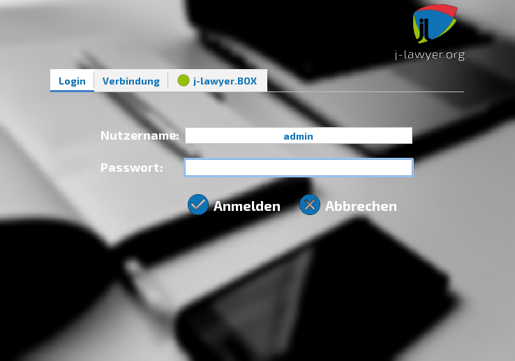
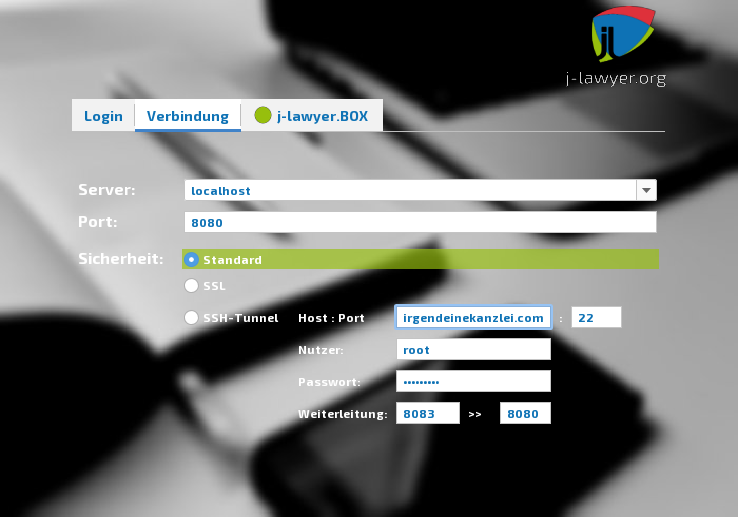
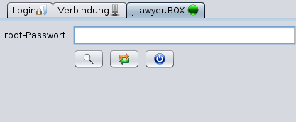

# Installation

## Installation Server/Client {#server-client}

### Installation auf Windows-Systemen {#windows}

Die Installation auf Windowssystemen ist hier beschrieben: <http://www.j-lawyer.org/?page_id=100>

### Installation auf macOS-Systemen {#macos}

Die Installation auf macOS-Systemen ist hier beschrieben: <http://www.j-lawyer.org/?page_id=355>

### Installation auf Linux-Systemen {#linux}

Die Installation auf Windowssystemen ist hier beschrieben: <http://www.j-lawyer.org/?page_id=93>

## Installation beA-Anbindung {#bea}

### Grundlagen {#bea-grundlagen}

Die beA-Anbindung von j-lawyer.org läuft als eigenständiger Docker-Container (Image `jlawyerorg/beastie:latest`) und ist vom j-lawyer.org-Server entkoppelt. Die Kommunikation zwischen Kanzleisoftware und beA-Container erfolgt über HTTP auf Port 7080.

Diese Trennung bringt mehrere wesentliche Vorteile:

- **Separat aktualisierbar**: Ändert sich die beA-Schnittstelle – etwa durch Anpassungen auf Seiten der BRAK – muss lediglich der Container der beA-Anbindung aktualisiert werden. Ein Update des gesamten j-lawyer.org-Servers ist nicht erforderlich.
- **Prozesstrennung**: Eine Störung des beA-Backends oder der Anbindung beeinträchtigt den laufenden Betrieb der Kanzleisoftware nicht. Die Kernfunktionen bleiben verfügbar, auch wenn die beA-Kommunikation vorübergehend nicht möglich ist.
- **Entlastung der Arbeitsplatzrechner**: Die CPU-intensive Kryptographie (Ver- und Entschlüsselung, Signaturprüfung) findet nicht mehr auf den Arbeitsplatzrechnern statt, sondern zentral auf dem Server.
- Zusätzlich können Ergebnisse gecacht werden, sodass wiederholte Zugriffe auf dieselben Nachrichten deutlich schneller erfolgen.

Das Datenverzeichnis des Containers (Zertifikate, Nachrichten, Kommandos und Logs) wird per Volume-Mount auf dem Host-System persistiert und bleibt bei Updates oder Neuinstallationen des Containers erhalten.

!!! tip "Empfohlener Installationsort"
    Der beAstie-Container sollte idealerweise auf demselben Server installiert werden, auf dem auch der j-lawyer.org-Server läuft. Das minimiert Netzwerklatenz zwischen beiden Komponenten und vereinfacht die Konfiguration.

### Installation {#bea-installation}

Die Einrichtung erfolgt in zwei Schritten: Zunächst wird die Docker-Runtime auf dem Host installiert, anschließend der beA-Container gestartet.

#### Installation auf Windows-Systemen {#bea-windows}

1. **Docker-Runtime installieren**: Download und Installation von *Docker Desktop for Windows* über <https://www.docker.com/products/docker-desktop/>. Setzt WSL 2 voraus, was der Installer bei Bedarf automatisch einrichtet. Nach der Installation Docker Desktop einmal starten und die Lizenzbedingungen akzeptieren.
2. **Container starten** (PowerShell):

```
docker run -d --name beastie --restart unless-stopped -p 7080:7080 -v ${env:USERPROFILE}\beAstie:/opt/beastie/data jlawyerorg/beastie:latest
```

Unter Windows entfällt der `--user`-Parameter, da Docker Desktop die Dateiberechtigungen auf Host-Ebene transparent abbildet.

#### Installation auf macOS-Systemen {#bea-macos}

1. **Docker-Runtime installieren**: Download und Installation von *Docker Desktop for Mac* über <https://www.docker.com/products/docker-desktop/>. Es gibt separate Installationspakete für Intel- und Apple-Silicon-Prozessoren. Nach der Installation Docker Desktop einmal starten und die Lizenzbedingungen akzeptieren.
2. **Container starten** (Terminal):

```
docker run -d --name beastie --restart unless-stopped -p 7080:7080 -v ~/beAstie:/opt/beastie/data --user $(id -u):$(id -g) jlawyerorg/beastie:latest
```

#### Installation auf Linux-Systemen {#bea-linux}

1. **Docker-Runtime installieren**: Installation der Docker Engine je nach Distribution. Beispiel für Ubuntu/Debian:

```
sudo apt update
sudo apt install docker.io
sudo systemctl enable --now docker
sudo usermod -aG docker $USER
```

Nach dem `usermod`-Aufruf ist eine Neuanmeldung des Nutzers erforderlich, damit die Gruppenmitgliedschaft wirksam wird. Alternativ kann Docker Desktop for Linux verwendet werden.

2. **Container starten** (Terminal):

```
docker run -d --name beastie --restart unless-stopped -p 7080:7080 -v ~/beAstie:/opt/beastie/data --user $(id -u):$(id -g) jlawyerorg/beastie:latest
```

#### Gängige Aktionen {#bea-aktionen}

Die folgenden Kommandos sind auf allen drei Betriebssystemen identisch und werden im Terminal bzw. in der PowerShell ausgeführt:

| Aktion | Kommando |
|---|---|
| Status prüfen | `docker ps -a --filter name=beastie` |
| Logs anzeigen | `docker logs beastie` (mit `-f` für Live-Verfolgung) |
| Container stoppen | `docker stop beastie` |
| Container starten | `docker start beastie` |
| Container neu starten | `docker restart beastie` |
| Container löschen | `docker rm -f beastie` |

Beim Löschen des Containers bleibt das Datenverzeichnis im Volume erhalten; Zertifikate und Konfiguration gehen nicht verloren.

### Update {#bea-update}

Ein Update der beA-Anbindung besteht aus drei Schritten: das neueste Image herunterladen, den alten Container entfernen und mit dem ursprünglichen Startkommando neu starten. Das Datenverzeichnis im Volume (`~/beAstie` unter Linux/macOS bzw. `%USERPROFILE%\beAstie` unter Windows) bleibt dabei erhalten.

#### Update unter Windows {#bea-update-windows}

PowerShell:

```
docker pull jlawyerorg/beastie:latest
docker stop beastie
docker rm beastie
docker run -d --name beastie --restart unless-stopped -p 7080:7080 -v ${env:USERPROFILE}\beAstie:/opt/beastie/data jlawyerorg/beastie:latest
```

#### Update unter macOS {#bea-update-macos}

Terminal:

```
docker pull jlawyerorg/beastie:latest
docker stop beastie
docker rm beastie
docker run -d --name beastie --restart unless-stopped -p 7080:7080 -v ~/beAstie:/opt/beastie/data --user $(id -u):$(id -g) jlawyerorg/beastie:latest
```

#### Update unter Linux {#bea-update-linux}

Terminal:

```
docker pull jlawyerorg/beastie:latest
docker stop beastie
docker rm beastie
docker run -d --name beastie --restart unless-stopped -p 7080:7080 -v ~/beAstie:/opt/beastie/data --user $(id -u):$(id -g) jlawyerorg/beastie:latest
```

## Start der Anwendung {#start}

### Start und Stoppen des j-lawyer.org Servers {#server-start}


Windows:
- im Startmenü nach “Dienste” suchen und diese Anwendung starten, es erscheint eine Liste von installierten Diensten

- Scrollen zum Dienst “j-lawyer.org-Server”

- via Rechtsklick auf den Dienst kann dieser beendet / gestartet werden

Linux:
- Terminal öffnen

- Kommando zum Starten des Dienstes: sudo service j-lawyer-server start

- Kommando zum Stoppen des Dienstes: sudo service j-lawyer-server stop

- Kommando zum Neustarten des Dienstes: sudo service j-lawyer-server restart

- Kommando zum Ermitteln des Dienststatus: sudo service j-lawyer-server status

macOS:
- Terminal öffnen

- Kommando zum Starten des Dienstes:

cd /Library/LaunchDaemons

sudo launchctl start j-lawyer-server
- Kommando zum Stoppen des Dienstes:

cd /Library/LaunchDaemons

sudo launchctl unload /Library/LaunchDaemons/j-lawyer-server.plist

### Start des j-lawyer.org Clients {#client-start}


Nach dem Start des j-lawyer.org Clients ist zwingend eine Anmeldung mit gültigen Nutzerdaten notwendig. Handelt es sich um eine Neuinstallation, so gibt es folgende voreingestellte Nutzer:
- Nutzer “user”, Passwort “u” - Nutzer mit eingeschränkten Rechten

- Nutzer “admin”, Passwort “a” - Nutzer mit vollen administrativen Rechten




Vor einer Anmeldung ist im Falle einer ersten Nutzung unter “Verbindung” der Name oder die IP des Servers einzutragen (bzw. “localhost”, wenn j-lawyer.org Server und j-lawyer.org Client auf dem selben Gerät genutzt werden) sowie der zu verwendende Netzwerkport (in der Regel 8080).




Folgende Verbindungsarten sind verfügbar:
- Standard: die Daten zwischen j-lawyer.org Client und Server werden unverschlüsselt übertragen. Diese Option ist innerhalb eines lokalen Unternehmensnetzwerkes in der Regel akzeptabel.

- SSL: der j-lawyer.org Server selbst wurde mit einem SSL-Verschlüsselungszertifikat ausgestattet oder befindet sich hinter einem sogenannten Reverse Proxy, welcher Verschlüsselung beherrscht. Diese Option nutzt Transportverschlüsselung und bietet eine hohe Sicherheit, auch wenn die Daten über öffentliche Netze (wie das Internet) übertragen werden. Diese Variante erfordert zusätzliche Konfigurationen auf Serverseite.

- SSH-Tunnel: der j-lawyer.org Client verbindet sich über eine verschlüsselte SSH-Verbindung mit dem j-lawyer.org Server. Auf dem Gerät, auf welchem der j-lawyer.org Server installiert ist, muss ein SSH-Dienst laufen, was bspw. auf Linuxservern gegeben ist. Diese Option nutzt Transportverschlüsselung und bietet eine hohe Sicherheit, auch wenn die Daten über öffentliche Netze (wie das Internet) übertragen werden. Es ist in der Regel keine besondere Konfiguration notwendig. Es empfiehlt sich, einen dedizierten Nutzer für den Aufbau des SSH-Tunnels zu verwenden, der außer einer SSH-Verbindung keine Berechtigungen auf dem Server hat. Gerät der Nutzer in fremde Hände, ist das Risiko beschränkt. Ein solcher Nutzer lässt sich unter Debian oder Ubuntu-Derivaten bspw. per

sudo adduser -r -s /bin/nologin jlawyer oder 
sudo adduser jlawyer --shell=/bin/false –no-create-home

erstellen. Die Verbindungsparameter für den SSH-Tunnel lauten wie folgt:
    - Host, Port: Servername und Port des SSH-Dienstes (in der Regel 22)
    - Nutzer, Passwort: Nutzername und Passwort des SSH-berechtigten Nutzers auf dem Server
    - Server lauscht auf Port: der Netzwerkport auf dem Server, auf welchem der j-lawyer.org Server lauscht – in der Regel 8080.

Anschließend verbindet man sich per Server und Port nicht zum Server selbst,

sondern auf localhost. Die Portangabe unterhalb des Server ist der „Startport“, ab

welchem automatisch ein freier lokaler Port ausgewählt wird. So können mehrere

Clients auf dem selben Gerät über jeweils eigene SSH-Tunnel zum Server

verbinden.

### Direktstart des j-lawyer.org Clients in die Desktopansicht


Der Login-Dialog des j-lawyer.org Clients kann optional übersprungen werden – so ist ein direkter Start bis zur “Mein Desktop”-Ansicht möglich. Dazu müssen beim Start folgende Kommandozeilenparameter übergeben werden:

Option 1: direkte Verbindung (Sicherheit „Standard“)
- Server

- Port

- Nutzername

- Passwort

also bspw. “localhost 8080 admin a”

Option 2: SSL-verschlüsselte Verbindung (Sicherheit „SSL“)
- Server

- Port

- Nutzername

- Passwort

- „ssl“ als Verbindungsmodus

also bspw. “localhost 443 admin a ssl”

Option 3: Verbindung per SSH (Sicherheit „SSH-Tunnel“)
- in der Regel „localhost“

- Port

- Nutzername

- Passwort

- „ssh“ als Verbindungsmodus

- IP oder Name des Servers

- Port des Servers, auf welchem der SSH-Dienst verfügbar ist

- Nutzername des SSH-Nutzers

- Passwort des SSH-Nutzers

- Port auf dem Server, auf welchem der j-lawyer.org Server lauscht

also bspw. “localhost 8080 admin a ssh 84.2.3.4 22 root rootpasswort 8080”

Insbesondere in Umgebungen in denen der Client regelmäßig für verschiedene j-lawyer.org-User oder -Server gestartet wird, kann diese Funktionalität Zeit sparen.

Hinweis: Um die Sicherheit Ihrer Installation zu gewährleisten, stellen Sie sicher dass die Funktionalität nur in kontrollierten und entsprechend abgesicherten Umgebungen genutzt wird. Insbesondere wenn Nutzername und  Passwort in Skripten verwendet werden, so ist sicherzustellen dass kein anderer Nutzer des Betriebssystems das Skript lesen und somit Kenntnis des Passwortes erhalten kann.

