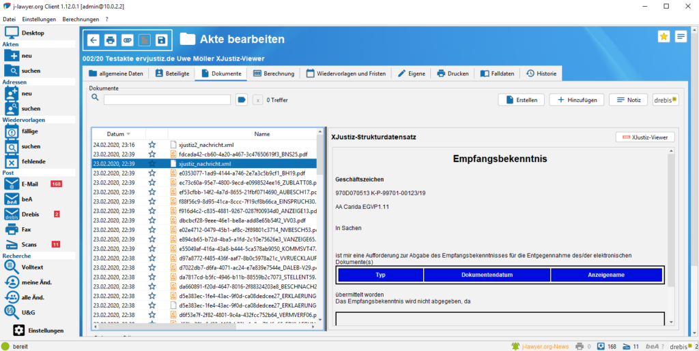
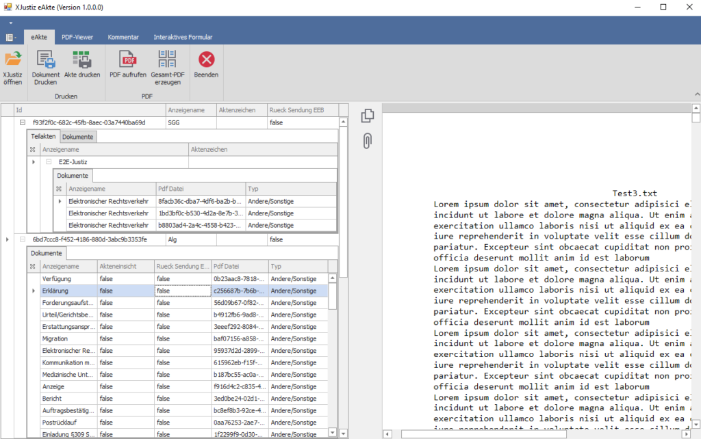
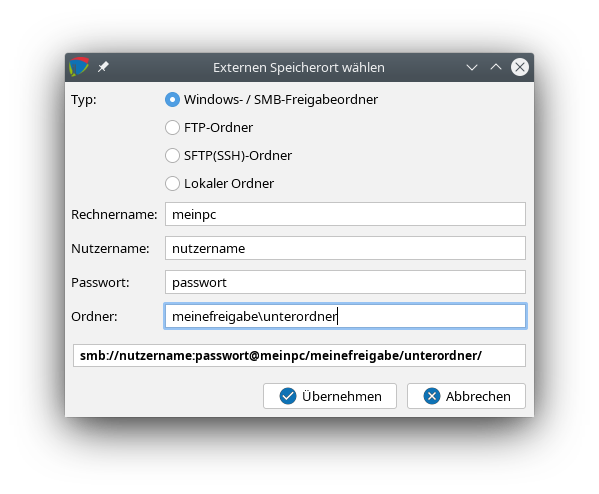
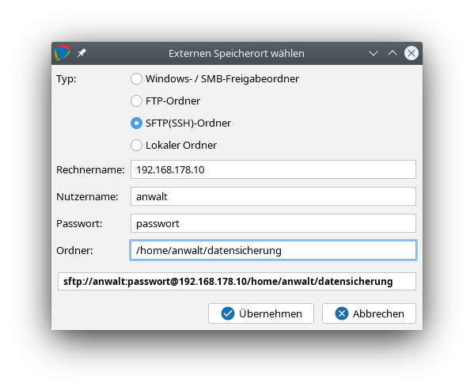

# j-lawyer.BOX

### Verbindung mit einer j-lawyer.BOX {#verbindung}

j-lawyer.BOX ist ein Mini-Server für Installationen mit bis zu 5 Client-Arbeitsplätzen. Die Box wird als komplett vorinstallierter und vorkonfigurierter Server mit j-lawyer.org-Installation, Dateifreigaben u.v.m geliefert.

Im Login-Dialog wird die Erreichbarkeit einer eventuell installierten j-lawer.BOX geprüft und angezeigt (als rote oder grüne Kontrollanzeige). Ein grüner Indikator zeigt an daß die Box erreichbar ist, ein roter Indikator zeigt an dass entweder keine Box installiert oder eine vorhandene Box nicht erreichbar ist.

In der Registerkarte “j-lawyer.BOX” sind folgende Operationen verfügbar:
- Erreichbarkeit und Status des j-lawyer.org Serverdienstes prüfen
- j-lawyer.org Serverdienst neu starten
- j-lawyer.BOX komplett rebooten
- j-lawyer.BOX herunterfahren

Geben Sie zur Ausführung der Kommandos das auf Ihrer mit der j-lawyer.BOX gelieferten “Identity Card” root-Passwort ein.

### Aktualisierung / Einspielen von Updates {#updates}

Die j-lawyer.BOX wird über halbautomatisch über die browserbasierte Administrationsoberfläche (http://j-lawyer-box:8080/j-lawyer.box/) aktualisiert. Ein Login ist mit jedem Nutzer der Kanzleisoftware möglich, sofern der Nutzer administrative Berechtigungen hat. Die initialen Zugangsdaten werden mit der j-lawyer.BOX auf einer “Identity Card” ausgeliefert.

Ist eine Replikation zu einer weiteren j-lawyer.BOX aktiv, so ist zuerst die “Zweit-Box” (d.h. die empfangende Box) zu aktualisieren! Dabei wird zwischen zwei Updatearten unterschieden:

Update der j-lawyer.BOX Management Console

Hiermit werden Updates des Betriebssystems sowie der Administrationsoberfläche selbst durchgeführt.
- Ein Update liegt vor wenn in der Administrationsoberfläche ein Knopf “j-lawyer.BOX-Update verfügbar” angezeigt wird.
- Nach dem Betätigen des Knopfes erhält man Informationen zum Update, in der Regel als Link zum Inhalt des Updates sowie Versionsinformationen (Veröffentlichungsdatum und Versionsnummer).
- Nach einem Klick auf “Aktualisieren” läuft das Update im Hintergrund. Je nach Umfang kann das Update einige Zeit in Anspruch nehmen. Wenn man ganz sicher gehen möchte, dass das Update installiert wurde, so wartet man nach Starten des Updates ca. 5 Minuten und öffnet anschließend die Administrationsoberfläche erneut. Der Knopf “j-lawyer.BOX-Update verfügbar” sollte nun verschwunden sein und die Oberfläche sollte die neue Version im Kopfbereich anzeigen.

Update der j-lawyer.org Serverinstallation

Hiermit werden neue Versionen der Kanzleisoftware installiert.
- Ein Update liegt vor wenn in der Administrationsoberfläche ein Knopf “j-lawyer.org-Serverupdate verfügbar” angezeigt wird.
- Vor dem Installieren eines solchen Updates ist zwingend ein evtl. verfügbares j-lawyer.BOX-Update zu installieren!
- Nach dem Betätigen des Knopfes erhält man Informationen zum Update, in der Regel als Link zum Inhalt des Updates sowie Versionsinformationen (Veröffentlichungsdatum und Versionsnummer für den Softwarestand und die Datenbank).
- Nach einem Klick auf “Installieren” startet das Update und gibt fortlaufend Informationen zum Fortschritt. Je nach Umfang kann das Update mehrere Minuten in Anspruch nehmen. Scrollen Sie innerhalb des Ausgabefensters nach unten. Das Update ist beendet wenn eine Ausgabe wie folgt erscheint:

Im Freigabeverzeichnis "j-lawyer-client" Ihrer Box liegen nun neue Installer fuer Ihre Arbeitsplaetze bereit. Nach deren Installation auf den Clients ist Ihr Update abgeschlossen.

Updateskript erfolgreich ausgefuehrt - Dienst wird neu gestartet...

15s  14s  13s  12s  11s  10s  9s  8s  7s  6s  5s  4s  3s  2s  1s
- Die Box wird nun selbständig den Dienst der j-lawyer.org-Kanzleisoftware neu starten. Dieser Vorgang kann ca. 3 Minuten in Anspruch nehmen.
- Wenn man sicher gehen möchte, dass das Update installiert wurde, so aktualisiert man die Administrationsoberfläche über einen Klick auf “Start” im linken Menü. Der Knopf “j-lawyer.org-Serverupdate verfügbar” sollte nun verschwunden sein.

Die j-lawyer.BOX ist somit vollständig aktualisiert. In den Dateifreigaben der Box finden Sie automatische Installer für die Arbeitsplätze und führen diese aus. Informationen zu den Freigaben finden Sie in der Administrationsoberfläche unter “Freigaben”. Das Verzeichnis “j-lawyer-client” innerhalb der Freigaben enthält die Installer.

Sollte nach Aktualisierung der Arbeitsplätze keine Verbindung zur j-lawyer.BOX möglich sein, so führen Sie einen Reboot / Neustart der Box aus. Dazu wird ein j-lawyer.org Client gestartet und im Reiter “j-lawyer.BOX” ein Neustart der Box initiiert. Dazu ist das root-Passwort (Betriebssystemnutzer) notwendig.

### Synchronisation zweier j-lawyer.BOXen {#synchronisation}

Mit wenigen Einstellungen lässt sich in der Management Console unter “Replikation” ein vollautomatischer Abgleich zwischen zwei j-lawyer.BOXen konfigurieren. Alle Änderungen, d.h. alle Akten, Adressen, Dokumente, Einstellungen etc. werden von der „Quelle“ / Box 1 zum „Ziel“ / Box 2 synchronisiert. Dabei werden ausschließlich Änderungen übertragen, somit ist ein solcher Abgleich auch über schmalbandige Verbindungen möglich.

In der aktuellen Umsetzung handelt es sich um eine Synchronisation in eine Richtung, d.h. sie ist geeignet für Anwendungsfälle wie
- Installation einer „Notfallbox“ – im Falle eines Hardwaredefektes der primären Box kann nahtlos auf der zweiten Box weitergearbeitet werden. Das Einspielen von Datensicherungen entfällt.
- Räumlich verteilte Datensicherung: besteht bspw. eine VPN-Verbindung zwischen Büroräumlichkeiten und einem zweiten Standort, so kann der gesamte Datenbestand vollautomatisch transferiert werden. Im Falle eines Diebstahls oder Brandes sind Ihre Daten am zweiten Standort sofort verfügbar.
- Lesende Nutzung der Daten an zweitem Standort: ebenfalls im Fall einer VPN-Verbindung: Daten können lesend genutzt werden.

Benötigt werden das MySQL-Passwort der Quelle sowie IP, MySQL-Passwort, root-Passwort des Ziels. Synchronisiert wird in Intervallen: montags bis freitags jeweils 10 Uhr, 12 Uhr, 15 Uhr und 17 Uhr.

Im Fall einer aktiven Nutzung der Notfallbox (Ziel), bspw. nach einem Softwareproblem oder Hardwaredefekt der ersten Box (Quelle), sollte die Quelle umgehend vom Netz (Ethernet-Verbindung, nicht Strom) getrennt werden um jegliche weitere Synchronisation zu unterbinden – diese würde ggf. gemachte Änderungen auf der Zielbox überschreiben. j-lawyer.org ab Version 1.9.1 erkennt diese Situation und unterbindet eine weitere Synchronisation automatisch nach einmaliger Bestätigung des Nutzers beim Login.

Vor Beginn einer aktiven Nutzung einer Notfallbox sollte zuerst versucht werden die Quelle wieder zum Laufen zu bekommen, bspw. durch Neustart des j-lawyer.org Serverdienstes (über j-lawyer.org Client-Logindialog) oder Neustart der gesamten Box. Nur wenn dies nicht zum Erfolg führt sollte auf das Notfallsystem gewechselt werden.

Hinweis: Bei Installation von Updates der j-lawyer.BOX Management Console oder der j-lawyer.org Kanzleisoftware, sind in jedem Fall beide Boxen, beginnend mit der “empfangenden” Box, zu aktualisieren!

Anleitung bei Nutzung einer zweiten j-lawyer.BOX als Notfallsystem: Was tun bei einem Ausfall der Kanzleisoftware?

1. Dienstneustart auf der Primärbox
- j-lawyer.org Client starten, Tab „Verbindung“ - unter „Server“ ist die IP der Primärbox einzutragen: ____________________

- Tab „j-lawyer.BOX“: Passwort des Betriebssystemnutzers „root“ eintragen (____________________) und den zweiten Knopf von links nutzen („j-lawyer.org Serverdienst neu starten“)

- Nach einer Wartezeit von 3min mit dem üblichen Einloggen fortfahren.
- Nur wenn ein Login weiter nicht möglich ist:

2. Systemneustart auf der Primärbox
- j-lawyer.org Client starten, Tab „Verbindung“ - unter „Server“ ist die IP der Primärbox einzutragen (s.o.)
- Tab „j-lawyer.BOX“: Passwort des Betriebssystemnutzers „root“ eintragen (s.o.) und den dritten Knopf von links nutzen („j-lawyer.BOX neustarten (Reboot)“)
- Nach einer Wartezeit von 3min mit dem üblichen Einloggen fortfahren.
- Nur wenn ein Login weiter nicht möglich ist:

3. Wechsel auf die Sekundärbox / Notfallbox
- j-lawyer.org Client starten, Tab „Verbindung“ - unter „Server“ ist die IP der Sekundärbox einzutragen: ____________________

- Mit dem üblichen Einloggen fortfahren.
- Die Primärbox vom Netzwerk trennen.

4. Optional: Soll eine Synchronisation von der Primärbox auf die Sekundärbox wieder aktiviert werden, so loggen Sie sich mit einem Nutzer mit Administratorrechten auf der Sekundärbox ein, öffnen über das Menü “Einstellungen”, “Administratorkonsole” und führen Sie folgenden Befehl aus:

boxsync enable

Alle folgenden Synchronisationen von der Primärbox werden nun wieder akzeptiert und verarbeitet. Die gleiche Einstellung ist auch in der Startseite der Management Console der empfangenden Box verfügbar:

Die “sendende” j-lawyer.BOX stellt zu Analysezwecken in der Management Console eine Protokolldatei bzgl. der Replikation bereit (replicate.log für eine zyklische Replikation, replicate-forced.log für eine ad-hoch angeforderte Synchronisation).

### Zusätzliche zugangsgeschützte Freigaben

Im Auslieferungszustand bietet eine j-lawyer.BOX Freigaben für Scans, allgemeine Datenaustauschsordner, Vorlagen und Datensicherungen.

Sollen weitere Freigaben zur Verfügung stehen, welche zusätzlich per Nutzername und Passwort abgesichert sind, so kann wie folgt verfahren werden.
- Eine SSH-Verbindung zur j-lawyer.BOX aufbauen
- Eine neue Gruppe anlegen: sudo addgroup smbgrp
- Einen neuen Nutzer anlegen, welcher Mitglied der neu erstellten Gruppe ist: sudo useradd shares -G smbgrp
- Dem neuen Nutzer ein Passwort geben: sudo smbpasswd -a shares
- Verzeichnis anlegen: sudo mkdir /usr/local/j-lawyer-server/samba-protected
- Berechtigungen für das Verzeichnis anpassen: sudo chmod -R 0770 /usr/local/j-lawyer-server/samba-protected
- Eigentümerschaft des Verzeichnisses anpassen: sudo chown root:smbgrp /usr/local/j-lawyer-server/samba-protected
- Verzeichnis freigeben, dazu wird die Konfigurationsdatei wie folgt bearbeitet: sudo mcedit /etc/samba/smb.conf
- Am Ende der Datei wird folgender Eintrag hinzugefügt:

[j-lawyer-secure]

path = /usr/local/j-lawyer-server/samba-protected

valid users = @smbgrp

browsable = yes

writable = yes

read only = no
- Datei mit F10 verlassen und speichern.
- Freigabedienst neu starten: sudo service smbd restart

Die Freigabe lässt sich nun von anderen Geräten aus benutzen, in dem der Nutzername “shares” und das vergebene Passwort zur Verbindung genutzt werden.
