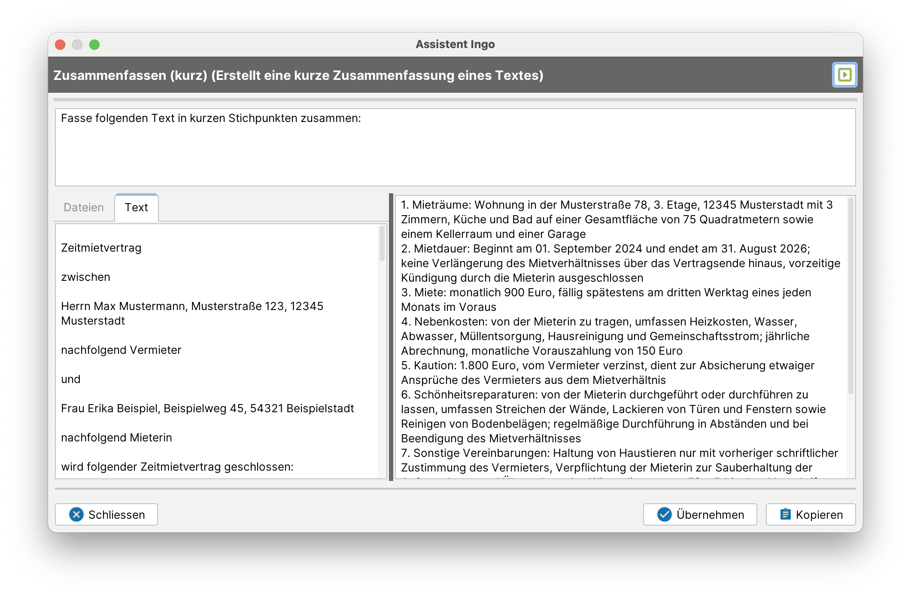
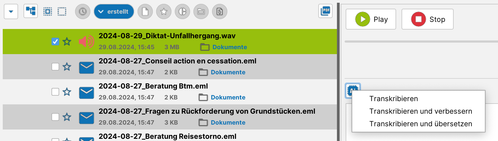
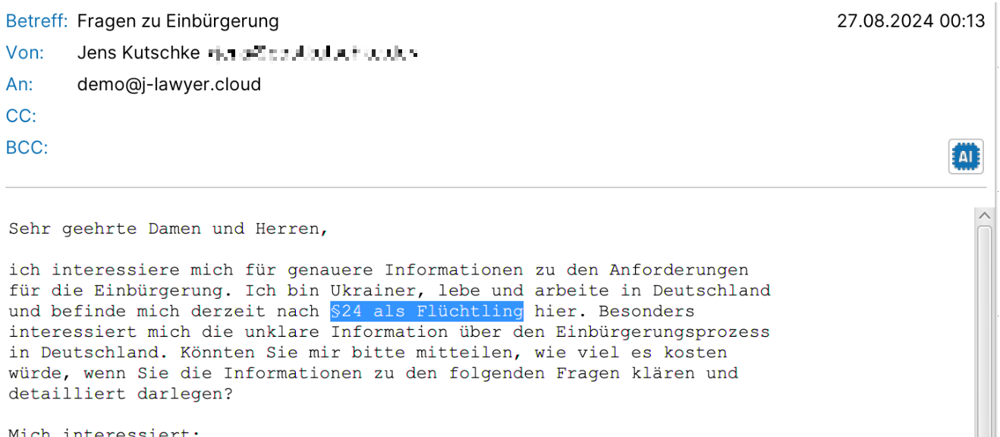
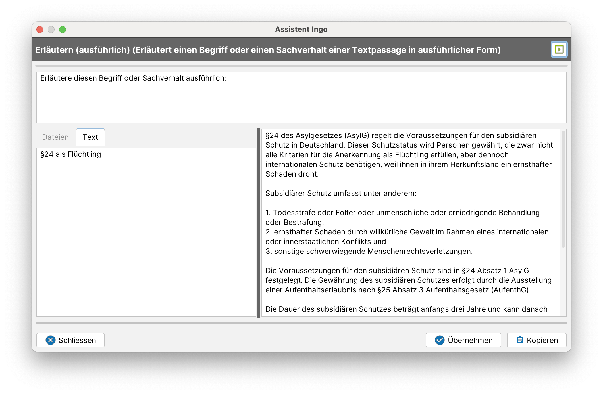
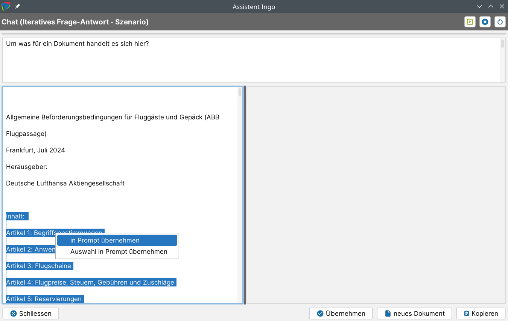
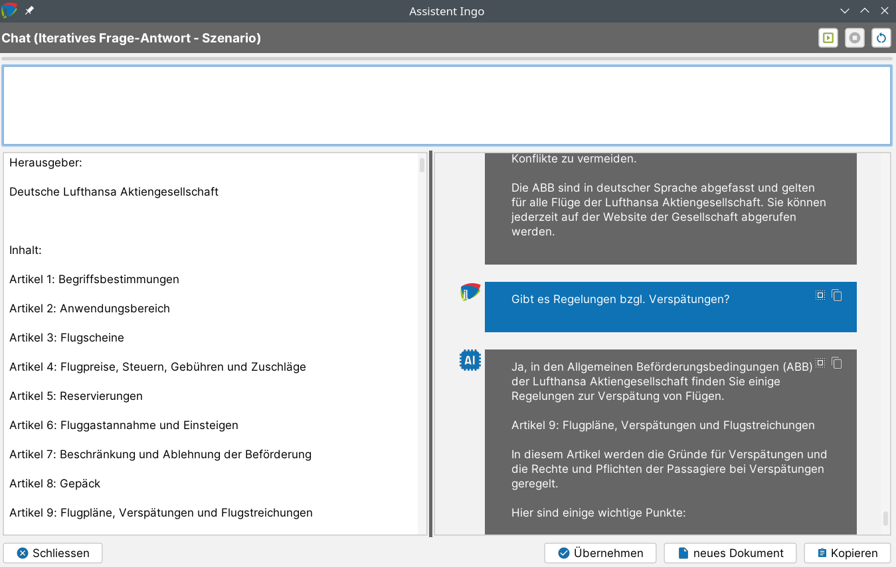
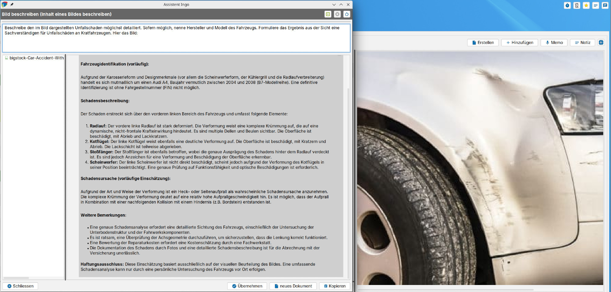
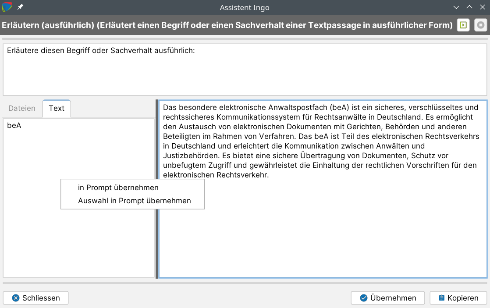

# KI-Assistenzfunktionen (“Assistent Ingo”)

j-lawyer.org verfügt über integrierte KI(„künstliche Intelligenz“)-Funktionen, die unterschiedliche Aufgaben übernehmen oder unterstützen können, so bspw.
- Transkription
- Übersetzung
- Erläutern von Sachverhalten
- Antworten vorformulieren
- Generieren von Inhalten
- Zusammenfassen von Dokumenten
- Befragen von Dokumenten
- Bilder analysieren / beschreiben

Die Integration dieser Funktionen zielt darauf ab, an vielfältigen Stellen im Arbeitsfluss auf KI-basierte Unterstützung zurückgreifen zu können. An den relevanten Stellen ist dazu ein „AI“-Button (AI = „Assistent Ingo“) zu finden.

Der grundsätzliche Aufbau der Dialoge ist dabei immer ähnlich:
- Im Kopfbereich wird die Funktion beschrieben und am rechten Bildschirmrand gibt es einen Button zum (erneuten) Ausführen einer Anfrage
- Direkt unter dem Kopfbereich gibt es eine Fortschrittsanzeige, die anzeigt ob gerade noch eine Anfrage bearbeitet wird
- Unterhalb der Fortschrittsanzeige befindet sich der sogenannte „Prompt“, also eine Anfrage oder Beschreibung der Aufgabe an ein KI-Modell. Der Prompt ist in der Regel bearbeitbar und kann frei verändert werden. Ausnahmen sind bspw. Transkriptionen (Sprache zu Text), welche nicht über ein Promptmöglichkeit verfügen.
- Unter dem Prompt auf der linken Seite gibt es die Eingangsdatenmenge. Das ist in der Regel ein aus Dokumenten oder E-Mails extrahierter Text oder eine Datei. Für Transkriptionen werden Sounddateien als Eingabe verwendet.
- Unter dem Prompt auf der rechten Seite werden die Ergebnisse der Anfrage ausgegeben. Die Ergebnisse werden in der Regel iterativ  dargestellt (es erscheinen also Teilergebnisse, sobald sie vorliegen). Im Fall eines Chats oder einer Befragung von Dokumenten können mehrere Frage-Antwort-Abfolgen entstehen.

### Transkription / Diktieren {#transkription}

Die Funktion kann an folgenden Stellen genutzt werden:
- Diktieren in E-Mail
- Diktieren in eine Notiz
- Sprachmemo in Text umwandeln

Diktieren

Beim Diktieren gibt es ein Dropdown zur Auswahl des Aufnahmegerätes. Hier ist das gewünschte Mikrofon auszuwählen. Die zuletzt getroffene Auswahl wird jeweils automatisch erneut angeboten. Rechts neben dem Dropdown gibt es einen Button zum Starten und Stoppen der Aufnahme. Das Diktieren sollte wie folgt gehandhabt werden:
- Start-/Stoppknopf nutzen, um Aufnahme zu starten. Eine grünfarbige laufende Zeit signalisiert die Aufnahme.
- Diktieren mehrerer Wörter bis hin zu ganzen Textpassagen. Dabei werden keinerlei Satzzeichen diktiert, es wird einfach natürlichsprachig aufgenommen und eine KI übernimmt die Interpunktion, in dem sie den Kontext des gesprochenen Textes insgesamt betrachtet.
- Start-/Stoppknopf erneut nutzen, um Aufnahme zu stoppen. Daraufhin findet die eigentliche Transkription statt und der Text erscheint im Ausgabefenster.

Das Nutzen KI-basierter Transkriptionen hat Vorteile (höhere Erkennungsrate, automatische Interpunktion, hohe mögliche Sprechgeschwindigkeit, …) als auch Nachteile (der erkannte Text sollte korrekturgelesen werden, insbesondere um unerwünschte „Halluzinationen“ auszuschließen).

Transkribieren eines Sprachmemos

Bereits seit längerem können sogenannte Sprachmemos innerhalb einer Akte aufgezeichnet werden.  Dabei werden über den Start/Stop-Knopf ein oder mehrere Audioabschnitte aufgezeichnet. Mit Version 3.1 und den integrierten KI-Funktionen lassen sich diese Sprachmemos nun in Text umwandeln, manuell weiter bearbeiten und schließlich über einen Platzhalter in Schriftsätze übernehmen.

Der Text wird dabei auch direkt am Sprachmemo gespeichert, sodass die Erstellung eines Schriftsatzes auch zu späterem Zeitpunkt erfolgen kann.

Für die Transkription stehen verschiedene Varianten zur Verfügung:
- reine Transkription
- Transkription mit automatischer Verbesserung von Formulierungen
- Transkription mit automatischer Übersetzung in eine andere Sprache

Über den Button „neues Dokument“ wird das Vorlagensystem genutzt, um den Text in einen Schriftsatz zu übernehmen. Der von Assistent Ingo generierte Text wird dabei an die Stelle des Platzhalters {{INGO_TEXT}} gesetzt.

Diktatbausteine und nutzerdefinierte Ersetzungen

Im Menü „Einstellungen“ – „Assistent Ingo“ – „automatische Ersetzungen“ lassen sich erkannte Textinhalte (einzelne Wörter oder Wortgruppen) definieren, bei deren Erkennung ein alternativer Wert (einzelne Wörter, Wortgruppen, komplette Absätze) erscheinen soll. Das ermöglicht bspw.
- das Korrigieren von konsistent falsch erkannten Termen, bspw. Namen (den falsch erkannten „Stefan Laiendecker“ durch den korrekten Namen „Stephan Leijendekker“ ersetzen)
- das effizientere Diktieren häufig wiederkehrerender Passagen, bspw. „Vollmachthinweis“ ersetzen durch „Bitte bringen Sie zum Termin vollständige Unterlagen und die unterschriebene Vollmacht mit.“

### Übersetzung {#uebersetzung}

Assistent Ingo kann Übersetzungsaufgaben übernehmen und unterstützt dazu insgesamt 30 Sprachen:
- bulgarisch
- chinesisch
- dänisch
- deutsch
- englisch (GB)
- englisch (US)
- estnisch
- finnisch
- französisch
- griechisch
- indonesisch
- italienisch
- japanisch
- koreanisch
- lettisch
- litauisch
- niederländisch
- norwegisch (bokmål)
- polnisch
- portugiesisch (BR)
- portugiesisch (PT)
- rumänisch
- russisch
- schwedisch
- slowakisch
- slowenisch
- spanisch
- tschechisch
- türkisch
- ukrainisch

Integriert ist die Übersetzungsfunktion u.a. für Postein- und Postausgang per E-Mail, also das Übersetzen eingehender Nachrichten als auch das Übersetzen vor dem Versand. Die zu übersetzenden Passagen können dabei markiert werden. Ohne Markierung wird der gesamte Text übersetzt.

### Übersetzung mittels DeepL

Assistent Ingo wird jedwede Anfrage ausschließlich in der IT-Infrastruktur der Office 42 GmbH bearbeiten, eine Weiterleitung an Betreiber bekannter KI-Modelle findet nicht statt. Eine Ausnahme stellt die – optionale – Übersetzung mittels DeepL dar. Für besonders herausfordernde Übersetzungsaufgaben mit besonderem Qualitätsanspruch (bspw. für Vertragstexte) kann – zusätzlich zur Übersetzungsfunktion von Ingo – auch DeepL genutzt werden. Dazu wird im Account von DeepL ein Token erstellt und anschließend im j-lawyer.org Client hinterlegt: Menü „Einstellungen“ – „Assistent Ingo“ – „Ingo-Server“. Dort unter „Konfigurationen“ den Token wie folgt eintragen:

DEEPL_TOKEN=9e6037fe-..........:gx

Die DeepL-basierten Übersetzungsfunktionen haben jeweils eigene Kontextmenüeinträge. Dabei werden Daten an den Betreiber von DeepL übertragen.

### Erläutern / Recherchieren

Assistent Ingo kann einzelne Begriffe, Wortgruppen oder ganze Passagen nachschlagen / erläutern / bewerten. Die Funktion ist bspw. im E-Mail-Posteingang integriert:

Die relevanten Passagen können markiert werden. Ohne Markierung wird der gesamte Text betrachtet.

Der Prompt kann optional entsprechend der Erfordernisse angepasst werden, bspw. um das Ausgabeformat zu bestimmen („Stichpunkte“) oder den Umfang zu definieren („in maximal 300 Wörtern“).

### Zusammenfassen {#zusammenfassen}

Assistent Ingo kann Texte zusammenfassen, bspw. umfangreiche E-Mail-Threads oder Dokumente. Die Funktion ist sowohl in E-Mail als auch im Kontextmenü von Dokumenten einer Akte zu finden. Der Dateityp des Dokuments spielt dabei keine Rolle, solange Text extrahierbar ist. Aktuell funktioniert das Zusammenfassen auf umfangreichere Dokumente zuverlässig bis ca. 60-80 typische A4-Seiten.

Das Ergebnis einer Zusammenfassung kann anschließend in eine Notiz übernommen werden.

Der Prompt sollte entsprechend der Erfordernisse angepasst werden, bspw. um das Ausgabeformat zu bestimmen („Stichpunkte“) oder den Umfang zu definieren („in maximal 300 Wörtern“).

### Dokument befragen (“Chat”) {#chat}

Assistent Ingo kann dabei unterstützen, Dokumentinhalte in einem interaktiven Frage-Antwort-Szenario zu erschließen („Chat-Funktion“).

Die Funktion ist im Kontextmenü von Dokumenten einer Akte zu finden. Der Dateityp des Dokuments spielt dabei keine Rolle, solange Text extrahierbar ist. Aktuell funktioniert das Befragen von Dokumenten zuverlässig bis ca. 60-80 typische A4-Seiten. Das Befragen mehrere Dokumente (oder einer ganzen Akte) ist in Arbeit.

Hinweis: Im Gegensatz zu allen anderen KI-Funktionen ist die Eingangsdatenmenge beim Chat nicht automatisch definiert. Per Kontextmenü im linken Eingangsdatenbereich können ausgewählte Passagen oder der gesamte Text in den Prompt übernommen werden. Über den Button oben rechts kann der Prompt dann ausgeführt werden.

Der gesamte Chatverlauf kann sowohl in eine Notiz als auch in ein Dokument übernommen werden.

### Kontaktdaten extrahieren

Die Anlage von Adressen / Kontakten in j-lawyer.org ist eine häufig genutzte Funktion. Oft hat man die Daten bereits vorliegen, bspw. in Form einer E-Mail-Signatur oder aus dem Impressum einer Website. Von dort werden die Daten bspw. feldweise per Copy & Paste übernommen.

Um den Prozess zu vereinfachen und zu beschleunigen, kann Assistent Ingo aus einer längeren Textpassage die meist genutzten Attribute extrahieren und automatisch in einen Adressbucheintrag übernehmen. Man findet die Funktion bei Adressen-Neuanlage über den Zauberstab-/Assistenten-Button.

### Bildanalyse

Assistent Ingo kann bei der Extraktion von Text aus Bildern unterstützen sowie Bildinhalte beschreiben. Die Funktion ist per Rechtsklick auf ein JPEG oder PNG nutzbar, und die Konfiguration eigener Prompts ist möglich (Funktion „vision“), bspw. zur wiederholte Analyse gleichartiger Bilddokumente wie Scans von Formularen oder amtlichen Dokumenten.

### Inhalte in einen Prompt übernehmen

Über das Kontextmenü im linken Teil der Dialoge (Eingangsdaten) kann ein ausgewählter Text oder der gesamte Text in den Prompt übernommen werden. In der Regel ist eine sinnvolle Eingangsdatenmenge automatisch vorgegeben. Im Falle eines Chats ist es oftmals gewünscht, nur Passagen des Textes zu verwenden, daher ist dort stets eine Auswahl zu treffen.

### Konfigurieren eigener Prompts {#eigene-prompts}

Oftmals gibt es den Bedarf, Anfragen an eine KI mehrfach verwenden zu können. Bspw. stellen sich für das Erschließen umfangreicher Verträge immer die selben Fragen. Damit solche Anfragen nicht ständig erneut formuliert werden müssen, lassen Sie sich an zentraler Stelle hinterlegen und dann im jeweiligen Kontext (bspw. einer E-Mail oder per Rechtsklick auf ein Dokument) einfach aufrufen.

Im Menü „Einstellungen“ – „Assistent Ingo“ – „eigene Prompts“ können Anfragen konfiguriert und gespeichert werden. Dazu werden nach einem Klick auf „+“ folgende Wert bereitgestellt:
- Name: der Name der Anfrage – dieser Wert erscheint bspw. in Kontextmenüs und sollte daher bewusst gewählt werden und nicht zu lang sein.
- Funktion: Zeigt an, welche Art einer Anfrage mittels des eigenen Prompts ausgeführt werden soll. Mögliche Werte sind
    - chat: für Prompts, die zur Befragung / für iterative Frage-Antwort-Szenarien verwendet werden können
    - explain: für Prompts, die zu Recherchezwecken verwendet werden können (bspw. Erläutern von Begriffen oder Sachverhalten in E-Mails)
    - generate: für Prompts, die für das Generieren von Texten (bspw. Antworten auf E-Mails oder Generieren von Schriftsätzen) verwendet werden können
    - summarize: für Prompts, die zum Zusammenfassen von Texten (E-Mails, Dokumente) verwendet werden können
    - transcribe: aktuell nicht unterstützt
    - translate: für Prompts, die Texte übersetzen sollen
    - vision: für Prompts, welche eine Bildanalyse durchführen sollen – bspw. Extraktion von Text oder Beschreibung von Bildinhalten
- Prompt: die Anfrage an das für die jeweilige „Funktion“ genutzte KI-Modell. Auch wenn beliebige Formulierungen oftmals zu guten Ergebnissen führen, so ist es doch ratsam, sich mit den Grundlagen für das Prompting vertraut zu machen. Dazu gibt es eine Vielzahl guter Ressourcen, eine davon ist bspw. https://www.promptingguide.ai/de.

Ein Prompt kann beliebige Platzhalter enthalten, welche auch über das Vorlagensystem genutzt werden können (siehe Kapitel „Verwendung von Platzhaltern in Prompts“).

### Verwendung von Platzhaltern in Prompts

Die Ergebnisse einer KI-Anfrage ist maßgeblich abhängig von der Qualität der Eingangsdaten als auch von der Formulierung der Anfrage selbst (des sogenannten Prompts). Je besser der Prompt, umso weniger „Nacharbeiten“ ist notwendig und umso treffender wird die Ergebnismenge sein. Daher kann es sinnvoll sein, möglichst viele relevante Informationen in einen Prompt aufzunehmen – das können bspw. Informationen zur Akte, zu Beteiligten oder fachliche Informationen zum Fall selbst sein.

Anbei ein Beispiel-Prompt zur Anwendung in verkehrsrechtlichen Angelegenheiten:

Du bist {{USER_FKT}} {{USER_AN}}. Generiere aus der untenstehenden Unfallanzeige einen Klageschriftsatz. Gehe dabei wie folgt vor:

1. Ermittle aus der Unfallanzeige die Beteiligten. Dein Mandant ist {{MANDANT_VORNAME}} {{MANDANT_NAME}}. Dieser ist in dem Klageschreiben der "Kläger". Benenne diesen mit vollständigem Namen und Adresse und nimm die Informationen als Absatz in den Klageschriftsatz auf.

2. Ermittle aus dem Text den Gegner, sein Name ist {{GEGNER_VORNAME}} {{GEGNER_NAME}}, und die Versicherung seines Fahrzeugs. Benenne diese als "Beklagte zu 1.", "Beklagte zu 2." und nimm die Informationen als Absatz in den Klageschriftsatz auf.

3. Formuliere Klageanträge, in denen die Beklagten gesamtschuldnerisch zur Zahlung des offenen Schadensersatzes i.H.v. {{VRKHR_SCHADENSUMME}} EUR verurteilt werden zuzüglich Zinsen in Höhe des Basiszinssatzes seit dem Verzugszeitpunkt. Nimm die Klageanträge in den Klageschriftsatz auf.

4. Begründe die Klage. Beginne hierbei zunächst mit den Statusangaben und nenne dabei den Mandanten Kläger, die Fahrerin des anderen Fahrzeugs Beklagte  zu 1., den Halter des anderen Fahrzeugs  Beklagter zu 2. und die Kfz-Haftpflichtversicherung des anderen Fahrzeugs Beklagte zu 3. Teile mit ob der Unfall polizeilich aufgenommen wurde und wenn ja benenne das Polizeirevier und die polizeiliche Tagebuchnummer. Nimm die Begründung in den Klageschriftsatz auf.

5. Übernehme den dargestellten Unfallhergang und benenne den Mandanten Kläger und den Fahrer des anderen Fahrzeuges Beklagter zu 1. und nimm diese Informationen in den Klageschriftsatz auf.

6. Übernehme die Darstellung des Schadens, die dort verwendeten Formulierungen und Tabelle. Nimm diese Informationen in den Klageschriftsatz auf.

7. Übernehme die Formulierung der rechtlichen Ausführungen. Ersetze dabei Mandant oder Mandantschaft als Kläger und nimm diese Informationen in den Klageschriftsatz auf.

Hier der Text der Unfallanzeige:

Wird der Prompt genutzt, so findet vorab automatisch eine Ersetzung der Platzhalter statt.
