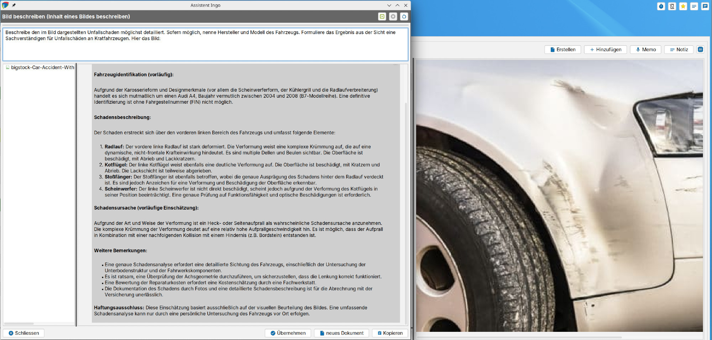

# Bildanalyse

Assistent Ingo kann bei der Extraktion von Text aus Bildern unterstützen sowie Bildinhalte beschreiben. Die Funktion ist per Rechtsklick auf ein JPEG oder PNG nutzbar, und die Konfiguration eigener Prompts ist möglich (Funktion „vision"), bspw. zur wiederholte Analyse gleichartiger Bilddokumente wie Scans von Formularen oder amtlichen Dokumenten.

