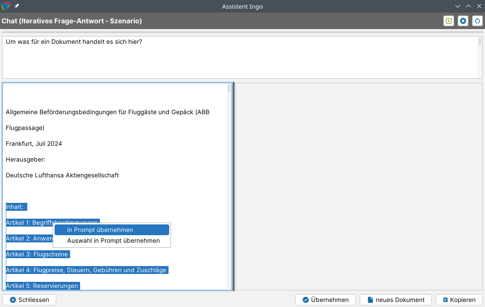
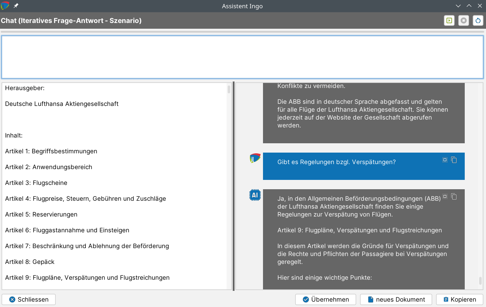

# Dokument befragen ("Chat") {#chat}

Assistent Ingo kann dabei unterstützen, Dokumentinhalte in einem interaktiven Frage-Antwort-Szenario zu erschließen („Chat-Funktion").

Die Funktion ist im Kontextmenü von Dokumenten einer Akte zu finden. Der Dateityp des Dokuments spielt dabei keine Rolle, solange Text extrahierbar ist. Aktuell funktioniert das Befragen von Dokumenten zuverlässig bis ca. 60-80 typische A4-Seiten. Das Befragen mehrere Dokumente (oder einer ganzen Akte) ist in Arbeit.

Hinweis: Im Gegensatz zu allen anderen KI-Funktionen ist die Eingangsdatenmenge beim Chat nicht automatisch definiert. Per Kontextmenü im linken Eingangsdatenbereich können ausgewählte Passagen oder der gesamte Text in den Prompt übernommen werden. Über den Button oben rechts kann der Prompt dann ausgeführt werden.

Der gesamte Chatverlauf kann sowohl in eine Notiz als auch in ein Dokument übernommen werden.
