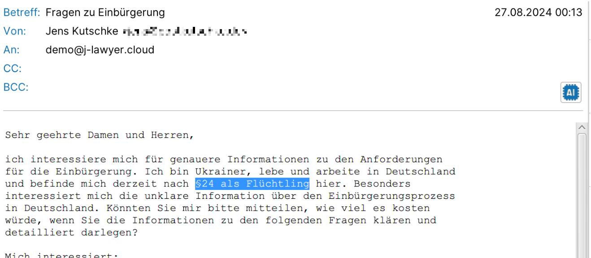
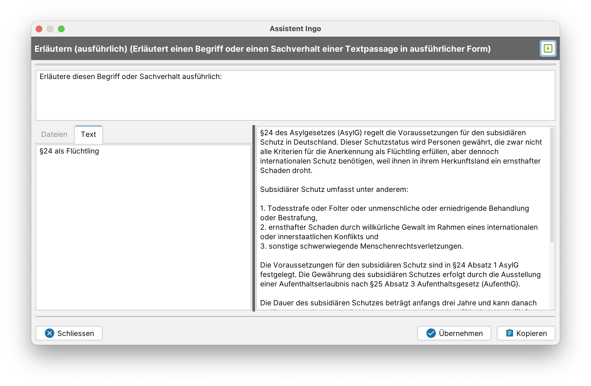

# Erläutern / Recherchieren

Assistent Ingo kann einzelne Begriffe, Wortgruppen oder ganze Passagen nachschlagen / erläutern / bewerten. Die Funktion ist bspw. im E-Mail-Posteingang integriert:

Die relevanten Passagen können markiert werden. Ohne Markierung wird der gesamte Text betrachtet.

Der Prompt kann optional entsprechend der Erfordernisse angepasst werden, bspw. um das Ausgabeformat zu bestimmen („Stichpunkte") oder den Umfang zu definieren („in maximal 300 Wörtern").
