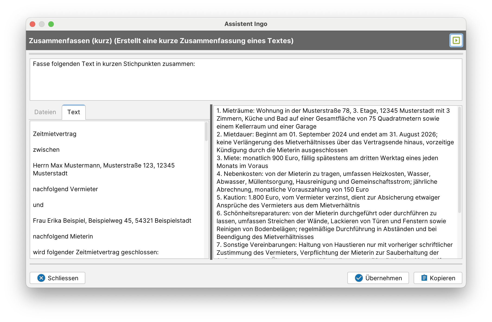
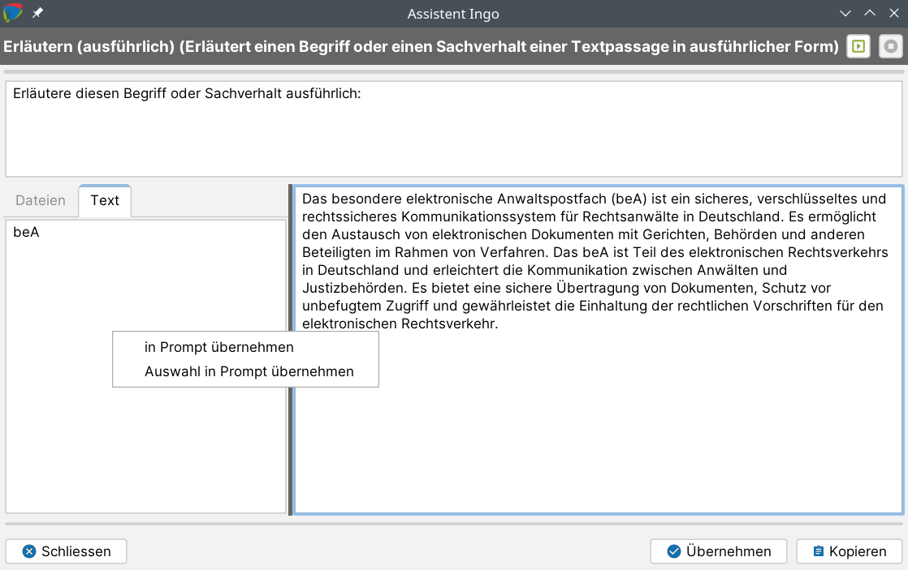

# KI-Assistenzfunktionen ("Assistent Ingo")

j-lawyer.org verfügt über integrierte KI(„künstliche Intelligenz")-Funktionen, die unterschiedliche Aufgaben übernehmen oder unterstützen können, so bspw.
- Transkription

- Übersetzung

- Erläutern von Sachverhalten

- Antworten vorformulieren

- Generieren von Inhalten

- Zusammenfassen von Dokumenten

- Befragen von Dokumenten

- Bilder analysieren / beschreiben

Die Integration dieser Funktionen zielt darauf ab, an vielfältigen Stellen im Arbeitsfluss auf KI-basierte Unterstützung zurückgreifen zu können. An den relevanten Stellen ist dazu ein „AI"-Button (AI = „Assistent Ingo") zu finden.

Der grundsätzliche Aufbau der Dialoge ist dabei immer ähnlich:
- Im Kopfbereich wird die Funktion beschrieben und am rechten Bildschirmrand gibt es einen Button zum (erneuten) Ausführen einer Anfrage

- Direkt unter dem Kopfbereich gibt es eine Fortschrittsanzeige, die anzeigt ob gerade noch eine Anfrage bearbeitet wird

- Unterhalb der Fortschrittsanzeige befindet sich der sogenannte „Prompt", also eine Anfrage oder Beschreibung der Aufgabe an ein KI-Modell. Der Prompt ist in der Regel bearbeitbar und kann frei verändert werden. Ausnahmen sind bspw. Transkriptionen (Sprache zu Text), welche nicht über ein Promptmöglichkeit verfügen.

- Unter dem Prompt auf der linken Seite gibt es die Eingangsdatenmenge. Das ist in der Regel ein aus Dokumenten oder E-Mails extrahierter Text oder eine Datei. Für Transkriptionen werden Sounddateien als Eingabe verwendet.

- Unter dem Prompt auf der rechten Seite werden die Ergebnisse der Anfrage ausgegeben. Die Ergebnisse werden in der Regel iterativ  dargestellt (es erscheinen also Teilergebnisse, sobald sie vorliegen). Im Fall eines Chats oder einer Befragung von Dokumenten können mehrere Frage-Antwort-Abfolgen entstehen.

### Inhalte in einen Prompt übernehmen

Über das Kontextmenü im linken Teil der Dialoge (Eingangsdaten) kann ein ausgewählter Text oder der gesamte Text in den Prompt übernommen werden. In der Regel ist eine sinnvolle Eingangsdatenmenge automatisch vorgegeben. Im Falle eines Chats ist es oftmals gewünscht, nur Passagen des Textes zu verwenden, daher ist dort stets eine Auswahl zu treffen.

