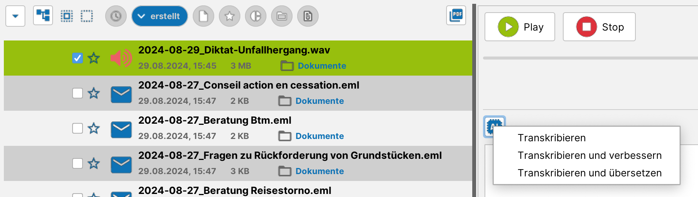

# Transkription / Diktieren {#transkription}

Die Funktion kann an folgenden Stellen genutzt werden:
- Diktieren in E-Mail

- Diktieren in eine Notiz

- Sprachmemo in Text umwandeln

Diktieren

Beim Diktieren gibt es ein Dropdown zur Auswahl des Aufnahmegerätes. Hier ist das gewünschte Mikrofon auszuwählen. Die zuletzt getroffene Auswahl wird jeweils automatisch erneut angeboten. Rechts neben dem Dropdown gibt es einen Button zum Starten und Stoppen der Aufnahme. Das Diktieren sollte wie folgt gehandhabt werden:
- Start-/Stoppknopf nutzen, um Aufnahme zu starten. Eine grünfarbige laufende Zeit signalisiert die Aufnahme.

- Diktieren mehrerer Wörter bis hin zu ganzen Textpassagen. Dabei werden keinerlei Satzzeichen diktiert, es wird einfach natürlichsprachig aufgenommen und eine KI übernimmt die Interpunktion, in dem sie den Kontext des gesprochenen Textes insgesamt betrachtet.

- Start-/Stoppknopf erneut nutzen, um Aufnahme zu stoppen. Daraufhin findet die eigentliche Transkription statt und der Text erscheint im Ausgabefenster.

Das Nutzen KI-basierter Transkriptionen hat Vorteile (höhere Erkennungsrate, automatische Interpunktion, hohe mögliche Sprechgeschwindigkeit, …) als auch Nachteile (der erkannte Text sollte korrekturgelesen werden, insbesondere um unerwünschte „Halluzinationen" auszuschließen).

Transkribieren eines Sprachmemos

Bereits seit längerem können sogenannte Sprachmemos innerhalb einer Akte aufgezeichnet werden.  Dabei werden über den Start/Stop-Knopf ein oder mehrere Audioabschnitte aufgezeichnet. Mit Version 3.1 und den integrierten KI-Funktionen lassen sich diese Sprachmemos nun in Text umwandeln, manuell weiter bearbeiten und schließlich über einen Platzhalter in Schriftsätze übernehmen.

Der Text wird dabei auch direkt am Sprachmemo gespeichert, sodass die Erstellung eines Schriftsatzes auch zu späterem Zeitpunkt erfolgen kann.

Für die Transkription stehen verschiedene Varianten zur Verfügung:
- reine Transkription

- Transkription mit automatischer Verbesserung von Formulierungen

- Transkription mit automatischer Übersetzung in eine andere Sprache

Über den Button „neues Dokument" wird das Vorlagensystem genutzt, um den Text in einen Schriftsatz zu übernehmen. Der von Assistent Ingo generierte Text wird dabei an die Stelle des Platzhalters {{INGO_TEXT}} gesetzt.

## Transkription und Interpunktion {#transkription-interpunktion}

Bei klassischen Diktierlösungen werden Satzzeichen üblicherweise mitgesprochen. Ein typisches Diktat klingt dann beispielsweise so:

*„Sehr geehrte Damen und Herren Komma ich nehme Bezug auf Ihr Schreiben vom 5 Punkt März 2026 Punkt Absatz Mein Mandant weist die Forderung zurück Punkt"*

KI-basierte Transkription – wie sie in j-lawyer.org zum Einsatz kommt – arbeitet grundlegend anders: Das Sprachmodell analysiert den gesprochenen Text im Kontext und setzt Satzzeichen automatisch. Das gleiche Diktat klingt daher natürlichsprachig:

*„Sehr geehrte Damen und Herren, ich nehme Bezug auf Ihr Schreiben vom 5. März 2026. Mein Mandant weist die Forderung zurück."*

Man diktiert also so, wie man spricht – flüssig und ohne Unterbrechung für Satzzeichen. Die Vorteile dieses Ansatzes:

- **Natürliches Sprechen**: Es wird frei und ohne Kommandos gesprochen, was den Diktierprozess deutlich angenehmer macht.
- **Höhere Geschwindigkeit**: Das Weglassen gesprochener Satzzeichen spart spürbar Zeit.
- **Bessere Erkennungsrate**: Da das Modell den gesamten Kontext berücksichtigt, werden Satzzeichen in der Regel korrekt gesetzt.
- **Geringere Fehleranfälligkeit**: Gesprochene Satzzeichen wie „Komma" oder „Punkt" können bei klassischen Systemen selbst fehlerkannt werden – bei KI-basierter Transkription entfällt diese Fehlerquelle.

**Hinweis:** Wer sich nicht umgewöhnen möchte und weiterhin Satzzeichen mitsprechen will, kann die Funktion [automatische Ersetzungen](#automatische-ersetzungen) nutzen. Da Assistent Ingo gesprochene Satzzeichen als Wörter transkribiert (z.B. wird das gesprochene Wort „Punkt" wörtlich als „Punkt" im Text erscheinen), können diese per Ersetzung entfernt werden. Beispiel: Eine Ersetzung von „Punkt" durch einen leeren Wert sorgt dafür, dass das gesprochene Wort „Punkt" aus dem transkribierten Text entfernt wird – die automatisch gesetzte Interpunktion bleibt davon unberührt. Ggf. sind zwei Ersetzungen zu konfigurieren, eine für "Punkt" und eine für "Punkt.".

## Automatische Ersetzungen {#automatische-ersetzungen}

Im Menü „Einstellungen" – „Assistent Ingo" – „automatische Ersetzungen" lassen sich erkannte Textinhalte (einzelne Wörter oder Wortgruppen) definieren, bei deren Erkennung ein alternativer Wert (einzelne Wörter, Wortgruppen, komplette Absätze) erscheinen soll. Für jeden Eintrag kann definiert werden, ob die Erkennung unabhängig von Groß-/Kleinschreibung erfolgen soll. Das ermöglicht bspw.

- das Korrigieren von konsistent falsch erkannten Termen, bspw. Namen (den falsch erkannten „Stefan Laiendecker" durch den korrekten Namen „Stephan Leijendekker" ersetzen)

- das effizientere Diktieren häufig wiederkehrender Passagen, bspw. „Vollmachthinweis" ersetzen durch „Bitte bringen Sie zum Termin vollständige Unterlagen und die unterschriebene Vollmacht mit."

- das Entfernen unerwünschter Wörter aus der Transkription, indem der Ersetzungswert leer gelassen wird
