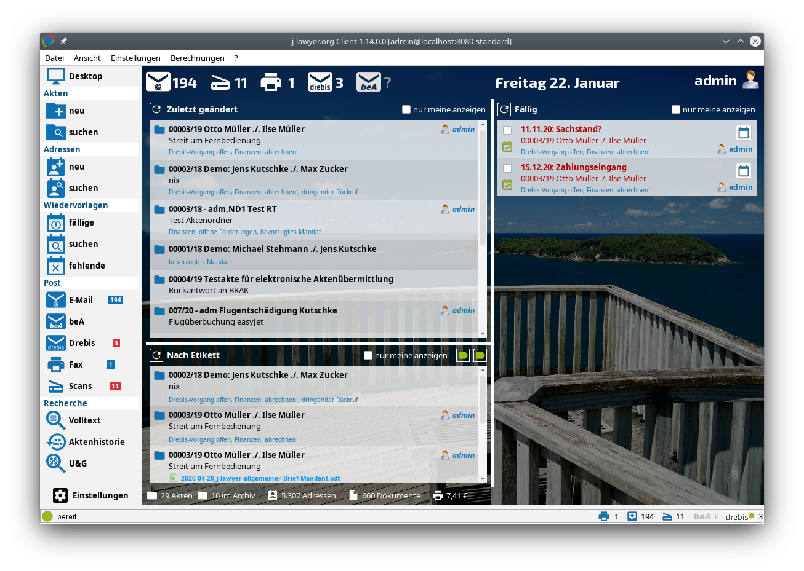

# Aufbau der Programmoberfläche

### Navigation, Aufbau der Programmoberfläche

### “Mein Desktop”

Die “Mein Desktop”-Ansicht bietet alle wichtigen Informationen auf einen Blick und ermöglicht eine Navigation zum jeweiligen Element:
- aktuelles Datum
- ungelesene Emails
- Tipp des Tages
- angemeldeter Nutzer
- Welche Akten wurden zuletzt geändert? Durch wen?
- Welche Fristen und Wiedervorlagen sind fällig oder überfällig? Wer ist zuständig?
- u.v.m.

Der Bereich “Zuletzt geändert” zeigt Informationen zur Akte sowie den für die Akte verantwortlichen Anwalt.

Der Bereich “Fällig” zeigt fällige und überfällige Termine, Fristen und Wiedervorlagen, sortiert nach Fälligkeitsdatum in absteigender Reihenfolge. Es wird der für die Frist oder Wiedervorlage verantwortliche Bearbeiter angezeigt. Die Bedeutung der Icons und Schriftformatierungen im Einzelnen:
- schwarze Beschriftung	heute fällig
- rote Beschriftung	überfällig
- Wiedervorlage, angemeldeter Nutzer ist verantwortlich
- Frist!
- Wiedervorlage, ein anderer Nutzer ist verantwortlich

Ein Verweilen mit der Maus über einer Akte, Wiedervorlage oder Frist blendet weitere Informationen ein. Über Doppelklick können Sie zur Akte navigieren. Fristen und Wiedervorlagen lassen sich durch Klicken der Auswahlkästchens als erledigt markieren und verschwinden beim nächsten Laden der Darstellung aus dem Arbeitsvorrat.

