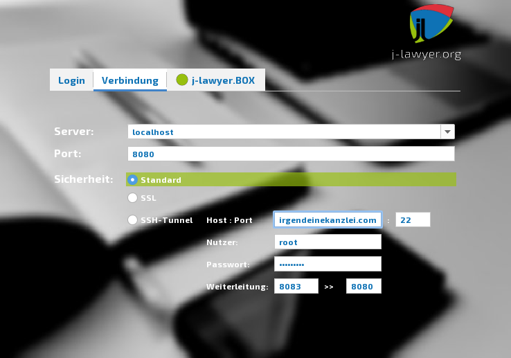
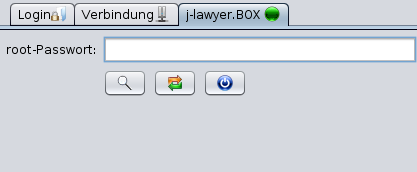

# Benutzerhandbuch

Dies ist das vollständige Benutzerhandbuch für j-lawyer.org.

## Autoren / Mitwirkende

Jens Kutschke – j-lawyer.org, info@j-lawyer.org

## Änderungshistorie

| Version | Date | Editor | Notes |
| --- | --- | --- | --- |
| 0.1 | Jun 24 2016 | Jens Kutschke | Initiale Version, Inhalte aus der aktuellen Dokumentation auf der Website übernommen. |
| 0.2 | Jun 29 2016 | Jens Kutschke | j-lawyer.org 1.8 |
| 0.3 | Aug 1 2016 | Jens Kutschke | Start der Anwendung |
| 0.4 | Sep 21 2016 | Jens Kutschke | Nutzerdefinierte Aktenzeichen |
| 0.5 | Oct 21 2016 | Jens Kutschke | Portkonfiguration |
| 0.6 | Jan 18 2017 | Jens Kutschke | LibreOffice immer im Vordergrund starten |
| 0.61 | Jan 23 2017 | Jens Kutschke | Update Drebis-Editierbarkeit |
| 0.62 | Jan 25 2017 | Jens Kutschke | Netzwerkbindings |
| 0.7 | Feb 10 2017 | Jens Kutschke | Deinstallation |
| 0.8 | Feb 17 2017 | Jens Kutschke | j-lawyer.org Version 1.8.1 |
| 0.9 | Apr 24 2017 | Jens Kutschke | Direktstart in Desktopansicht |
| 1.1 | May 13 2017 | Jens Kutschke | Dokumente in externen Programmen öffnen auf Mac |
| 1.2 | Jul 11 2017 | Jens Kutschke | Kopieren und Einfügen unter Mac OS, LibreOffice-AutoText zentral im Netzwerk |
| 1.3 | Jul 27 2017 | Jens Kutschke | Dokumente in externen Programmen öffnen unter Microsoft Windows |
| 1.4 | Aug 11 2017 | Jens Kutschke | PDF-Konvertierung unter macOS |
| 1.5 | Sep 9 2017 | Jens Kutschke | Korrektur Anpassung Startaktenzeichen seit Version 1.8 |
| 1.6 | Oct 2 2017 | Jens Kutschke | J-lawyer.BOX Login in Administrationsoberfläche |
| 1.7 | Oct 25 2017 | Jens Kutschke | J-lawyer.BOX Login in j-lawyer.org Client |
| 1.8 | Jan 31 2018 | Jens Kutschke | Microsoft Office Word – Anbindung |
| 1.9 | Jul 11 2018 | Jens Kutschke | Synchronisationzweier j-lawyer.BOXen |
| 1.10 | Aug 05 2018 | Jens Kutschke | Datensicherungskapitel überarbeitet |
| 1.11 | Sep 17 2018 | Jens Kutschke | Neue Platzhalter |
| 1.12 | Jan 08 2019 | Jens Kutschke | Neuer Platzhalter für Ergebnistabellen aus Plugins |
| 1.13 | Jun 3rd 2019 | Jens Kutschke | Passwortgeschützte Freigaben für j-lawyer.BOX |
| 1.14 | Sep 12 2019 | Jens Kutschke | Inbetriebnahme beA-Integration |
| 1.15 | Sep 27 2019 | Jens Kutschke | Platzhalterkorrektor Kurzrubrum |
| 1.16 | Okt 12 2019 | Jens Kutschke | PDFs bearbeiten mit Foxit Reader |
| 1.17 | Nov 19 2019 | Jens Kutschke | Protokolle einer j-lawyer.BOX Replikation, Erweiterungen Platzhalter Kanzleiprofil (UStID, Anderkonto), Erweiterungen Platzhalter für “Abteilung” bei Mandant, Gegner, Dritte |
| 1.18 | Mai / Juni 2020 | Jens Kutschke | j-lawyer.org 1.12, Sipgate-Anmeldung |
| 1.19 | Juni 2020 | Jens Kutschke | Neue Platzhalter in Version 1.13 |
| 1.12 | Nov 2020 | Jens Kutschke | Lokale Scanordner, Ordnervorlagen und Ordnerstrukturen in der Akte, Anbindung an Nextcloud, Verbindung über einen SSH-Tunnel |
| 1.13 | Jan 2021 | Jens Kutschke | Anleitung von Christoph Stöber (https://homepage.christoph-stoeber.de/jlawyer/jlawyer.php) eingearbeitet. |
| 1.14 | Feb 2021 | Jens Kutschke | Konfigurationsbeispiele für die Synchronisation einer Datensicherung |
| 1.15 | Mrz 2021 | Jens Kutschke | Datensicherung auf USB-Medium |
| 1.16 | Mrz 2021 | Jens Kutschke | j-lawyer.org 1.14 |
| 1.17 | Okt 2021 | Jens Kutschke | j-lawyer.org 2.0 |
| 1.18 | Nov 2021 | Jens Kutschke | j-lawyer.org 2.0.1 |
| 1.19 | Dez 2021 | Jens Kutschke | Dokumentation Skriptanwendung in Vorlagen |
| 1.20 | Feb 2022 | Jens Kutschke | DATUMZEIT-Skriptfunktion |
| 1.21 | Feb 2022 | Jens Kutschke | FRIST und FRISTBANKTAG mit optionalem Datumsformatparameter |
| 1.22 | Mär 2022 | Jens Kutschke | Web Hooks, beA Übermittlungsstatus |
| 1.23 | Oct 2023 | Jens Kutschke | j-lawyer.org 2.4 |
| 1.24 | Oct 2023 | Jens Kutschke | j-lawyer.org 2.5 |
| 1.25 | Jan 2024 | Jens Kutschke | j-lawyer.org 2.6 |
| 1.26 | Oct 2024 | Jens Kutschke | j-lawyer.org 3.0 |
| 1.27 | Dec 2024 | Jens Kutschke | j-lawyer.org 3.1 |
| 1.28 | Apr 2025 | Jens Kutschke | j-lawyer.org 3.2 |
| 1.29 | Mai 2025 | Jens Kutschke | j-lawyer.org 3.3 |

## Systemvoraussetzungen

### Unterstützte Betriebssysteme

Eine Installation ist sowohl auf Windows- als auch auf macOS und Linuxsystemen möglich. Alle Debian-basierten Linux-Distributionen werden von den Installern unterstützt, andere Distributionen erfordern manuelle Installationsschritte.

### Server

Die Systemvoraussetzungen für den Betrieb eines zentralen Servers sind hier zu finden: https://www.j-lawyer.org/?page_id=88

### Client / Arbeitsplatz

Die Systemvoraussetzungen für Arbeitsplatzinstallationen sind hier zu finden: https://www.j-lawyer.org/?page_id=88

### Einzelplatzinstallation

Wird keine verteilte Installation mit zentraler Datenhaltung benötigt, so können beide Anwendungsteile auf dem selben Gerät installiert werden, bspw. auch auf einem herkömmlichen Notebook. Die Systemvoraussetzungen sind hier zu finden: https://www.j-lawyer.org/?page_id=88

## Installation

### Installation auf Windows-Systemen

Die Installation auf Windowssystemen ist hier beschrieben: http://www.j-lawyer.org/?page_id=100

### Installation auf macOS-Systemen

Die Installation auf macOS-Systemen ist hier beschrieben: http://www.j-lawyer.org/?page_id=355

### Installation auf Linux-Systemen

Die Installation auf Windowssystemen ist hier beschrieben: http://www.j-lawyer.org/?page_id=93

## Start der Anwendung

### Start und Stoppen des j-lawyer.org Servers

| Versionen | Plattformen |
| --- | --- |
| 1.0+ | Alle |

Windows:
- im Startmenü nach “Dienste” suchen und diese Anwendung starten, es erscheint eine Liste von installierten Diensten
- Scrollen zum Dienst “j-lawyer.org-Server”
- via Rechtsklick auf den Dienst kann dieser beendet / gestartet werden

Linux:
- Terminal öffnen
- Kommando zum Starten des Dienstes: sudo service j-lawyer-server start
- Kommando zum Stoppen des Dienstes: sudo service j-lawyer-server stop
- Kommando zum Neustarten des Dienstes: sudo service j-lawyer-server restart
- Kommando zum Ermitteln des Dienststatus: sudo service j-lawyer-server status

macOS:
- Terminal öffnen
- Kommando zum Starten des Dienstes:

cd /Library/LaunchDaemons

sudo launchctl start j-lawyer-server
- Kommando zum Stoppen des Dienstes:

cd /Library/LaunchDaemons

sudo launchctl unload /Library/LaunchDaemons/j-lawyer-server.plist

### Start des j-lawyer.org Clients

| Versionen | Plattformen |
| --- | --- |
| 1.8+ | Alle |

Nach dem Start des j-lawyer.org Clients ist zwingend eine Anmeldung mit gültigen Nutzerdaten notwendig. Handelt es sich um eine Neuinstallation, so gibt es folgende voreingestellte Nutzer:
- Nutzer “user”, Passwort “u” - Nutzer mit eingeschränkten Rechten
- Nutzer “admin”, Passwort “a” - Nutzer mit vollen administrativen Rechten

Abbildung 1: Login-Dialog, Eingabe von Nutzername und Passwort

Vor einer Anmeldung ist im Falle einer ersten Nutzung unter “Verbindung” der Name oder die IP des Servers einzutragen (bzw. “localhost”, wenn j-lawyer.org Server und j-lawyer.org Client auf dem selben Gerät genutzt werden) sowie der zu verwendende Netzwerkport (in der Regel 8080).

Abbildung 2: Login-Dialog, Eingabe der Verbindungsdaten

Folgende Verbindungsarten sind verfügbar:
- Standard: die Daten zwischen j-lawyer.org Client und Server werden unverschlüsselt übertragen. Diese Option ist innerhalb eines lokalen Unternehmensnetzwerkes in der Regel akzeptabel.
- SSL: der j-lawyer.org Server selbst wurde mit einem SSL-Verschlüsselungszertifikat ausgestattet oder befindet sich hinter einem sogenannten Reverse Proxy, welcher Verschlüsselung beherrscht. Diese Option nutzt Transportverschlüsselung und bietet eine hohe Sicherheit, auch wenn die Daten über öffentliche Netze (wie das Internet) übertragen werden. Diese Variante erfordert zusätzliche Konfigurationen auf Serverseite.
- SSH-Tunnel: der j-lawyer.org Client verbindet sich über eine verschlüsselte SSH-Verbindung mit dem j-lawyer.org Server. Auf dem Gerät, auf welchem der j-lawyer.org Server installiert ist, muss ein SSH-Dienst laufen, was bspw. auf Linuxservern gegeben ist. Diese Option nutzt Transportverschlüsselung und bietet eine hohe Sicherheit, auch wenn die Daten über öffentliche Netze (wie das Internet) übertragen werden. Es ist in der Regel keine besondere Konfiguration notwendig. Es empfiehlt sich, einen dedizierten Nutzer für den Aufbau des SSH-Tunnels zu verwenden, der außer einer SSH-Verbindung keine Berechtigungen auf dem Server hat. Gerät der Nutzer in fremde Hände, ist das Risiko beschränkt. Ein solcher Nutzer lässt sich unter Debian oder Ubuntu-Derivaten bspw. per

sudo adduser -r -s /bin/nologin jlawyer oder 
sudo adduser jlawyer --shell=/bin/false –no-create-home

erstellen. Die Verbindungsparameter für den SSH-Tunnel lauten wie folgt:
    - Host, Port: Servername und Port des SSH-Dienstes (in der Regel 22)
    - Nutzer, Passwort: Nutzername und Passwort des SSH-berechtigten Nutzers auf dem Server
    - Server lauscht auf Port: der Netzwerkport auf dem Server, auf welchem der j-lawyer.org Server lauscht – in der Regel 8080.

Anschließend verbindet man sich per Server und Port nicht zum Server selbst,

sondern auf localhost. Die Portangabe unterhalb des Server ist der „Startport“, ab

welchem automatisch ein freier lokaler Port ausgewählt wird. So können mehrere

Clients auf dem selben Gerät über jeweils eigene SSH-Tunnel zum Server

verbinden.

### Direktstart des j-lawyer.org Clients in die Desktopansicht

| Versionen | Plattformen |
| --- | --- |
| 1.14+ | Alle |

Der Login-Dialog des j-lawyer.org Clients kann optional übersprungen werden – so ist ein direkter Start bis zur “Mein Desktop”-Ansicht möglich. Dazu müssen beim Start folgende Kommandozeilenparameter übergeben werden:

Option 1: direkte Verbindung (Sicherheit „Standard“)
- Server
- Port
- Nutzername
- Passwort

also bspw. “localhost 8080 admin a”

Option 2: SSL-verschlüsselte Verbindung (Sicherheit „SSL“)
- Server
- Port
- Nutzername
- Passwort
- „ssl“ als Verbindungsmodus

also bspw. “localhost 443 admin a ssl”

Option 3: Verbindung per SSH (Sicherheit „SSH-Tunnel“)
- in der Regel „localhost“
- Port
- Nutzername
- Passwort
- „ssh“ als Verbindungsmodus
- IP oder Name des Servers
- Port des Servers, auf welchem der SSH-Dienst verfügbar ist
- Nutzername des SSH-Nutzers
- Passwort des SSH-Nutzers
- Port auf dem Server, auf welchem der j-lawyer.org Server lauscht

also bspw. “localhost 8080 admin a ssh 84.2.3.4 22 root rootpasswort 8080”

Insbesondere in Umgebungen in denen der Client regelmäßig für verschiedene j-lawyer.org-User oder -Server gestartet wird, kann diese Funktionalität Zeit sparen.

Hinweis: Um die Sicherheit Ihrer Installation zu gewährleisten, stellen Sie sicher dass die Funktionalität nur in kontrollierten und entsprechend abgesicherten Umgebungen genutzt wird. Insbesondere wenn Nutzername und  Passwort in Skripten verwendet werden, so ist sicherzustellen dass kein anderer Nutzer des Betriebssystems das Skript lesen und somit Kenntnis des Passwortes erhalten kann.

### Abbildung 3: Login-Dialog, j-lawyer.BOX-Integration

## Aufbau der Programmoberfläche

### Navigation, Aufbau der Programmoberfläche

| Versionen | Plattformen |
| --- | --- |
| 1.0+ | Alle |

### “Mein Desktop”

| Versionen | Plattformen |
| --- | --- |
| 1.0+ | Alle |

Die “Mein Desktop”-Ansicht bietet alle wichtigen Informationen auf einen Blick und ermöglicht eine Navigation zum jeweiligen Element:
- aktuelles Datum
- ungelesene Emails
- Tipp des Tages
- angemeldeter Nutzer
- Welche Akten wurden zuletzt geändert? Durch wen?
- Welche Fristen und Wiedervorlagen sind fällig oder überfällig? Wer ist zuständig?
- u.v.m.

Der Bereich “Zuletzt geändert” zeigt Informationen zur Akte sowie den für die Akte verantwortlichen Anwalt.

Der Bereich “Fällig” zeigt fällige und überfällige Termine, Fristen und Wiedervorlagen, sortiert nach Fälligkeitsdatum in absteigender Reihenfolge. Es wird der für die Frist oder Wiedervorlage verantwortliche Bearbeiter angezeigt. Die Bedeutung der Icons und Schriftformatierungen im Einzelnen:
- schwarze Beschriftung	heute fällig
- rote Beschriftung	überfällig
- Wiedervorlage, angemeldeter Nutzer ist verantwortlich
- Frist!
- Wiedervorlage, ein anderer Nutzer ist verantwortlich

Ein Verweilen mit der Maus über einer Akte, Wiedervorlage oder Frist blendet weitere Informationen ein. Über Doppelklick können Sie zur Akte navigieren. Fristen und Wiedervorlagen lassen sich durch Klicken der Auswahlkästchens als erledigt markieren und verschwinden beim nächsten Laden der Darstellung aus dem Arbeitsvorrat.

### Abbildung 4: Desktopansicht in j-lawyer.org ab Version 1.13

## Erste Schritte

Die Kurzanleitung soll helfen, schnell eine fertig konfigurierte j-lawyer.org – Installation zu erstellen, die korrekte Funktionsweise sicherzustellen und mit den wichtigsten Funktionen des Programmes vertraut zu sein. Dazu benötigen Sie folgende Schritte:

### Kanzleiprofil ausfüllen

Beim ersten Start „fragt“ die Anwendung nach den Profilinformationen – das sind die Daten die bspw. in den Briefkopf übernommen werden: Anschrift, Kontaktinformationen, Bankverbindung etc.

Wird dieser Schritt übersprungen, so kann das Kanzleiprofil nachträglich über das Menü „Einstellungen“ – „Kanzleiprofil“ angepasst werden.

### Datensicherungen konfigurieren

Ebenfalls beim ersten Start wird gebeten, die automatische Datensicherung zu konfigurieren. Dort ist ein gewünschter Zyklus, sowie das bei der Installation verwendete / angezeigte Datenbankpasswort einzutragen.

Wird dieser Schritt übersprungen, so können die Einstellungen nachträglich über das Menü „Einstellungen“ – „Datensicherung“ gesetzt werden.

Die Sicherungen werden dann lokal auf dem Server erstellt und sollten von dort regelmäßig auf ein anderes Medium kopiert werden. Eine vollautomatische Synchronisationsmöglichkeit ist in der Dokumentation beschrieben.

### Import der deutschen Banken- und Ortschaftenverzeichnisse

Über das Menü „Datei“ können beide Verzeichnisse importiert werden.

### Ändern des Administratorpasswortes

Über das Menü „Einstellungen“ können Sie die Nutzerverwaltung aufrufen um das Passwort zu ändern.

### Optional: Anlegen zusätzlicher Nutzer

Sollten weitere Nutzer gewünscht sein, können Sie ebenfalls über die Nutzerverwaltung weitere Nutzer anlegen.

### Optional: Erstellen der wichtigsten Bausteine: Anreden, Grussformeln, Diktatzeichen und Wiedervorlagegründe

Ebenfalls über das Menü „Einstellungen“ können Sie wichtige Textbausteine definieren und so vermeiden, diese wiederholt neu eingeben zu müssen:
- Anreden und Titel (für Adressverwaltung und Nutzung in Dokumenten)
- Grussformeln (für Adressverwaltung und Nutzung in Dokumenten)
- Diktatzeichen
- Wiedervorlagegründe (genutzt in der Aktenverwaltung)
- Sachgebiete

### Erstellen einer ersten Dokumentvorlage

Über “Adressen” – “neu” kann einer erste Adresse erfasst werden. Anschließend über “Akten” – “neu” eine Akte anlegen und unter “Beteiligte” die soeben erfasste Adresse verknüpfen.

### Erstellen einer ersten Adresse und Akte

Über den Navigationsbaum (linker Bildschirmrand, “Einstellungen” – “Akte: Dokumentvorlagen”) können Sie auf Basis einer bestehenden Vorlage neue Vorlagen erstellen und mit Platzhaltern (siehe weiterführende Kapitel in dieser Dokumentation) versehen. Als Demonstrationsobjekt kann man in die Vorlage „j-lawyer-allgemeiner-Brief-Mandant.odt“ schauen – diese Vorlage ist als allgemein gehaltener Schriftsatz konzipiert.

### Optional: Definieren von Etiketten

Sofern die Etiketten-Funktionalität (eine Art digitale Haftnotiz) für Adressen, Akten oder Dokumente genutzt werden soll, kann man über das Einstellungs-Menü die gewünschten Etiketten vordefinieren, die dann in der Akte / Adresse durch einfachen Klick aktiviert werden können.

Auf dem Desktop kann man dann Etiketten „abonnieren“ und so Akten und Dokumente immer im Blick haben, an denen ein oder mehrer bestimmte Haftnotizen hängen.

Auch Arbeitsflüsse lassen sich so abbilden – ein Beispiel: bei Übernahme von Papierpost aus dem Scaneingang oder elektronischer Post (E-Mail, beA, Drebis, …) können Dokumente automatisch mit einem Etikett “unbearbeiteter Posteingang” versehen werden. Auf dem Desktop ist dieses Etikett abonniert, so findet man nach Abarbeitung des Posteingangs den nun bestehenden Arbeitsvorrat an zentraler Stelle wieder.

## Aktenverwaltung

### Akten suchen

| Versionen | Plattformen |
| --- | --- |
| 1.8.1+ | alle |

Im Navigationsbaum am linken Bildschirmrand unter “suchen” können Sie Akten über eine Schnellsuche finden. Durchsucht werden
- Aktenzeichen
- Kurzrubrum
- wegen
- eigene Felder (alle)

Zusätzlich ist eine Einschränkung über Etiketten möglich.

Voreingestellt ist eine Suche ohne archivierte Akten – soll das Archiv mit durchsucht werden, so ist die Option “Archivsuche” zu aktivieren.

### Aktenanlage

| Versionen | Plattformen |
| --- | --- |
| 1.10+ | alle |

Eine Aktenanlage ist im linken Navigationsbereich unter “Akten” – “neu” möglich. Es ist sinnvoll, vorab zu prüfen ob alle Beteiligten in der Adressverwaltung existieren. Innerhalb der Akte unter dem Reiter “Beteiligte” ist ggf. auch eine Schnellerfassung noch nicht vorhandener Kontakte möglich. In diesem Fall sollten die Adressdaten nach Schnellerfassung weiter verfeinert werden, der Arbeitsfluss wird so jedoch nicht unterbrochen.

Im Reiter Allgemeine Daten können im Bereich „Aktenkopf“ u.a.
- das Kurzrubrum,
- „wegen“ und
- das Sachgebiet

eingetragen werden. Im mittleren Bereich können Etiketten aktiviert und im unteren Bereich Notizen eingetragen werden.

Im Reiter “Beteiligte” auf “+” klicken um Beteiligte hinzuzufügen. Daraufhin ist eine Suche in der Adressverwaltung möglich. Nach einem Klick auf “Übernehmen” wird der selektierte Beteiligte in die Akte übernommen und es kann ein Zeichen (das des Beteiligten) eingetragen werden. Die “Rolle” des Beteiligten lässt sich über ein Auswahlfeld angeben. Zusätzliche Rollen lassen sich über das Menü “Einstellungen” – “Modul ‘Adressen’” – “Beteiligtentypen” erstellen. Ein Aktionsknopf am Beteiligten ermöglich u.a. das Senden von E-Mails und das Initiieren von Anrufen.

### Aktenzeichen

| Versionen | Plattformen |
| --- | --- |
| 1.8+ | alle |

j-lawyer vergibt automatisch Aktenzeichen im Format „fünfstellige lfd. Nummer + / + zweistellige Jahreszahl“, also bspw. 00123/12. Für Umsteiger kann es hilfreich sein, das „Start-Aktenzeichen“ einstellen zu können.

Ab Version 1.8 kann über Menü “Einstellungen” - “Akten” - “Aktenzeichen-Schema” definiert werden, wie Aktenzeichen automatisch gebildet werden.

Es sind folgende Werte nutzbar:

C – zufälliger Buchstabe

R – Zufallsziffer

N – unabhängig laufende Nummer

n – innerhalb anderer Kriterien laufende Nummer

Daraus lassen sich für individuelle Anforderungen passende Aktenzeichen-Schemata definieren, bspw.
- nnnnn/YY – 5-stellige laufende Nummer innerhalb eines Jahres, gefolgt von fixem Schrägstrich, gefolgt von 2-stelliger Jahreszahl
- YY-CCCCC – 2-stellige Jahreszahl, gefolgt von fixem Bindestrich, gefolgt von 5 zufälligen Buchstaben
- NNNNN/YYYYMMDD – 5-stellige unabhängig laufende Nummer, gefolgt von fixem Schrägstrich, gefolgt von 4-stelliger Jahreszahl, gefolgt von 2-stelliger Monatsangabe, gefolgt von 2-stelliger Tagesangabe

Monat und Tag können wahlweise als M oder MM bzw. D oder DD angegeben werden. Bei einfachem Buchstaben M oder D werden einstellige Zahlenwerte auch nur einstellig übernommen, bei Nutzung von MM oder DD werden ggf. führende Nullen eingefügt.

In jedem Fall wird j-lawyer.org die Eindeutigkeit des Aktenzeichens forcieren.

### Erweiterte Aktenzeichen

| Versionen | Plattformen |
| --- | --- |
| 1.12+ | alle |

Über das Menü “Einstellungen” - “Akten” - “Aktenzeichen-Schema” lassen sich auch erweiterte Aktenzeichen aktivieren. Die Aktenzeichenerweiterung wird grundsätzlich als Suffix ans Ende des Aktenzeichens angefügt. Folgende Werte können in die Erweiterungsangabe aufgenommen werden:
- eine beliebige feste Angabe am Beginn der Aktenzeichenerweiterung
- das Kürzel des Anwalts, der als Eigentümer einer Akte angegeben wird
- das Kürzel der Gruppe, welche als Eigentümergruppe einer Akte angegeben wird
- eine beliebige feste Angabe am Ende der Aktenzeichenerweiterung

Es ist möglich, die Trennzeichen (zwischen Aktenzeichen und Erweiterung, sowie zwischen den einzelnen Angaben innerhalb der Erweiterung) zu definieren.

Grundsätzlich gilt: das Aktenzeichen ist dafür verantwortlich, die Akte eindeutig zu identifizieren – es ist ohne Erweiterung immer einmalig. Die Erweiterungen gelten als zusätzliche Informationen. Werden die erweiterten Aktenzeichen genutzt, so sind ab diesem Zeitpunkt die gewählten Angaben verpflichtend – d.h. bei einer Aktenzeichenerweiterung mit Angabe der Eigentümergruppe, müssen für neue oder aktualisierte Akten zwingend die Gruppen gepflegt werden. Bestandsdaten werden nicht automatisch angepasst.

### Dokumente in Ordnern organisieren

| Versionen | Plattformen |
| --- | --- |
| 1.13+ | alle |

Grundsätzlich werden alle Dateien einer Akte in einem “Dokumente”-Ordner gespeichert. Soll eine detailliertere Strukturierung genutzt werden, so können
- Ordner direkt in der Akte hinzugefügt, umbenannt und gelöscht werden sowie
- vorgefertigte Ordnerstrukturen zu einer Akte hinzugefügt werden.

Die sogenannten Ordnervorlagen können unter Menü “Einstellungen” - “Modul ‘Akten’” - “Dokumentordner” hinterlegt werden.

Innerhalb einer Akte ist das Anwendern der Ordnervorlagen über das Zahnradsymbol direkt über der Ordneranzeige möglich. Dabei werden niemals vorhandene Ordner entfernt, es werden stets nur Ordner hinzufügt, welche in der Ordnervorlage enthalten, in der Akte jedoch noch nicht vorhanden sind.

Somit ist es leicht möglich, mehrere Ordnervorlagen nacheinander auf eine Akte anzuwenden: bspw. einmal eine Vorlage “Finanzen” mit den Ordnern “Rechnungen” und “Angebote”, gefolgt von der Übernahme bspw. sachgebietsspezifischer Ordnervorlagen.

### Dokumentvorschau

| Versionen | Plattformen |
| --- | --- |
| 1.8+ | alle |

Innerhalb der Akte wird durch einen einfachen Klick auf das Dokument eine Vorschau angezeigt. Folgende Formate werden unterstützt:
- Direkte Anzeige (Inhalt und Layout): GIF, JPG, PDF, PNG, TIF
- Textanzeige (Inhalt des Dokumentes als Textextrakt): alle Dokumente mit Textinformationen
- keine Vorschau: alle weiteren Binärformate

Ein Doppelklick öffnet das Dokument im entsprechenden Editor.

Dokumentvorschau
        Direkte Anzeige einens Dokumentes am Beispiel eines PDFs
       Abbildung 5: Direkte Anzeige eines Dokumentes am Beispiel eines PDFs

### Aktenhistorie

| Versionen | Plattformen |
| --- | --- |
| 1.0+ | alle |

<todo>

### Aktenübergreifende Historie

| Versionen | Plattformen |
| --- | --- |
| 1.8+ | alle |

Neben der in jeder Akte angezeigten spezifischen Historie, gibt es eine aktenübergreifende Historie über alle Änderungen des aktuellen Nutzers oder aller Nutzer der Software (“Aktenhistorie” in der Navigationsleiste).

So lassen sich schnell eigene Änderungen auffinden oder von Kollegen bearbeitete Fälle auffinden.

Abbildung 6: aktenübergreifende Historienanzeige

Im oberen Bereich des Dialogs ist ein Zeistrahl abgebildet, der die gesamte im System erfasste Historie umfasst. Durch Bewegung der blauen (ab...) und roten (bis...) Markierungen kann auf einen Zeitraum eingeschränkt werden. Ebenfalls im oberen Bereich befindet sich ein Auswahlfeld zur Einschränkung der Treffermenge. Voreingestellt ist eine Beschränkung auf 500 Einträge.

Die Ergebnismenge visualisiert – nach Kalendertagen gruppiert – die geänderten Akten sowie welcher Nutzer welche Änderung vorgenommen hat. Ein Klick auf Aktennummer oder Kurzrubrum navigiert direkt zur jeweiligen Akte.

### Aktenablage / Archivierung

| Versionen | Plattformen |
| --- | --- |
| 1.12+ | alle |

Im Tab “allgemeine Daten” einer Akte kann eine Archivierung durchgeführt werden. Die Akte ist somit aus dem “aktiven” Datenbestand heraus – sie ist dann in Suchdialogen nur dann auffindbar, wenn explizit eine Suche im Archiv aktiviert wird.

Werden zusätlich noch Papierakten geführt, so kann über ein Plugin eine neue Archivnummer generiert werden. Über das Menü “Berechnungen” und den Menüpunkt “Archivnummern-Generator” wird die Nummer erstellt und kann dann in das Notizfeld einer Akte oder in eines der “Eigenen Felder” kopiert werden. So ist eine konsistente Nummerierung gewährleistet.

### Zugriff auf Akten beschränken

| Versionen | Plattformen |
| --- | --- |
| 1.12+ | alle |

Der Zugriff auf Akten kann auf bestimmte Personenkreise (Gruppen) beschränkt werden. Voraussetzung ist das Vorhandensein von Gruppen (“Einstellungen” - “Gruppen” zur Anlage der Gruppen) sowie die Aufnahme von Nutzern in keine, eine oder mehrere Gruppen (“Einstellungen” - “Nutzer” - Nutzer auswählen – Tab “Kürzel und Gruppen”). Die Erstellung von Gruppen folgt dabei den Anforderungen der jeweiligen Kanzlei – bspw. wäre es möglich eine Gruppe pro Standort, eine Gruppe pro Anwalt, oder eine besondere Gruppe für Personalakten zu erstellen.

Sind Gruppen und Mitgliedschaften gepflegt, so können Akten vor ungewünschten Zugriffen geschützt werden. Unterschieden werden Eigentümer und Berechtigte.

Eigentümer:

Als Eigentümer gelten der unter “Anwalt” geführte Nutzer, sowie alle Mitglieder der Eigentümergruppe (bspw. “Niederau I” im unten abgebildeten Screenshot).

Nur die Eigentümer sind berechtigt, weitere Gruppe über den Tab “Berechtigte” hinzuzufügen oder Gruppen vom Zugriff auszuschliessen. Auch das Ändern der Eigentümergruppe ist möglich – jedoch nur auf eine Gruppe, in welcher der aktuelle Nutzer auch Mitglied ist.

Abbildung 7: Angabe der Eigentümer innerhalb einer Akte

Berechtigte:

Im Tab “Berechtigte” werden alle Gruppen aktiviert, welche Zugriff auf die Akte haben sollen.
- Wird KEINE Gruppe gewählt, so ist der Zugriffsschutz für die Akte deaktiviert, es haben alle Nutzer Zugriff!
- Wird mindestens eine Gruppe gewählt, so haben nur solche Nutzer Zugriff auf die Akte, die in mindestens einer der ausgewählten Gruppen Mitglied sind.

Die Angabe berechtigter Gruppen bestimmt ausschließlich die Sichtbarkeit / Zugriffsmöglichkeit auf eine Akte. Welche Aktionen innerhalb der Akte möglich sind, leitet sich aus den Berechtigungen des Nutzers in der Nutzerverwaltung ab.

Abbildung 8: Angabe der berechtigten Gruppen innerhalb einer Akte

### Akten löschen

| Versionen | Plattformen |
| --- | --- |
| 1.8.1+ | alle |

Im Navigationsbaum am linken Bildschirmrand unter “suchen” können Sie die zu löschende(n) Akte(n) über eine Schnellsuche finden. In der Ergebnisliste werden anschließend eine oder mehrere Akten markiert und per Rechtsklick und Menüpunkt „löschen“ unwiderruflich entfernt.

## Kontakte / Adressen

### Adressen suchen

| Versionen | Plattformen |
| --- | --- |
| 1.8.1+ | alle |

Im Navigationsbaum am linken Bildschirmrand unter “bearbeiten” bzw. “einsehen” können Sie Adressen über eine Schnellsuche finden. Durchsucht werden
- Name
- Vorname
- Firma
- eigene Felder (alle)

Zusätzlich ist eine Einschränkung über Tags möglich.

### Adresse importieren

| Versionen | Plattformen |
| --- | --- |
| 1.7+ | alle |

Ab j-lawyer.org Version 1.7 können Adresse im vCard-Format importiert werden. Dabei werden in der Datenbank existierende Kontakte weder geändert noch gelöscht, es werden ausschließlich neue Adressen angelegt. Nach Auswahl einer Importdatei bekommen Sie eine Übersicht der darin enhaltenen Kontakte und können über ein Auswahlfeld exakt bestimmen welche Adressen sie importieren / nicht importieren wollen.

### Beteiligtentypen konfigurieren

| Versionen | Plattformen |
| --- | --- |
| 1.12+ | alle |

Je nach Anwendungsgebiet der Software ergibt sich der Bedarf nach spezifischen Beteiligtentypen – bspw. “Gericht”, “Mandant”, “Gegner” oder “Mieter”, “Vermieter” etc. Unter “Einstellungen” - “Modul ‘Adressen’” - “Beteiligtentypen” lassen sich diese Rollen erstellen und konfigurieren. Jeder Typ verfügt über
- Bezeichnung: ein “sprechender” Name, der an verschiedenen Stellen der Anwendung angezeigt wird, bspw. bei der Erstellung von Dokumenten oder dem Versenden von E-Mails und beA-Nachrichten.
- Platzhalter: der Präfix für die in Dokumenten verwendbaren Platzhalter. Vergibt man bspw. für einen Beteiligtentyp “Hausverwalter” den Platzhalter “HV”, so sind dessen Informationen in Dokumenten über {{HV_NAME}} etc. nutzbar.
- Markieren in: eine Farbe, welche für die Darstellung der Beteiligten verwendet wird. So lassen sich bei vielen Beteiligten auf einen Blick verschiedene Typen erkennen.

Da keine Beziehungen zwischen Beteiligtentypen konfiguriert werden, ist eine Prüfung auf Interessenkonflikte nicht einfach umsetzbar. Die Anwendung wird daher informieren, sobald eine Beteiligte / Adresse in verschiedenen Rollen verwendet wird.

## Dokumentenmanagement

### Auswahl der Textverarbeitung: Microsoft Word / LibreOffice

| Versionen | Plattformen |
| --- | --- |
| 1.12+ | Windows |

Sollen .doc / .docx – Dokumente mit Microsoft Office bearbeitet werden (anstelle von LibreOffice), so ist der vollständig Pfad zur “winword.exe” in die Umgebungsvariable PATH des Windowssystems aufzunehmen. Über eine Dateisuche findet man die winword.exe, der Pfad wird kopiert und dann im PATH hinzugefügt (da die Vorgehensweise hierbei zwischen verschiedenen Windows-Versionen variiert, wird auf Google verwiesen). Unter macOS sind keine besonderen Vorkehrungen zu treffen.

Anschließend kann nach einem Neustart des j-lawyer.org Clients im Menü “Einstellungen” - Menüpunkte “Dokumente” und “Textverarbeitung” - der primär zu verwendende Editor ausgewählt werden.  Die Einstellung ist nutzer- und geräteabhängig. So kann ein Kanzleisoftwarenutzer “Otto” auf dem PC primär mit Microsoft Office arbeiten, auf seinem Linuxlaptop mit LibreOffice.

In der Dokumentenansicht einer Akte wird mit Doppelklick dann die ausgewählte Textverarbeitung genutzt. Soll ein bestimmtes Dokument mit einer anderen Textverarbeitung geöffnet werden, so kann per Rechtsklick und “öffnen mit” der gewünschte Editor angefordert werden.

LibreOffice muss weiterhin installiert bleiben, da es im Hintergrund bspw. für Konvertierungsaufgaben verwendet wird (insbesondere PDF-Konvertierung).

HINWEIS: aktuell wird von der Verwendung von Textfeldern in .docx-Vorlagen  abgeraten. Verwendung vieler Textfelder führt zu sehr langen Zeiten bei der Ermittlung der in der Vorlage verwendeten Platzhalter sowie deren Ersetzung.

### Allgemeine Hinweise zur Dokumentbearbeitung

| Versionen | Plattformen |
| --- | --- |
| 1.8.1+ | alle |

Mit Version 1.8.1 wurde eine vollständig überarbeitete Anwendungsanbindung für LibreOffice und andere externe Applikationen geliefert. Folgendes ist bei der Arbeit mit Dokumenten zu beachten:
- es können beliebig viele Dokumente gleichzeitig geöffnet werden
- es können Dokumente verschiedener Akten gleichzeitig geöffnet werden
- Dokumente müssen gespeichert und geschlossen werden, bevor der j-lawyer.org Client beendet wird – anderenfalls findet keine Rückspeicherung in die Akte(n) statt

Wird der j-lawyer.org Client geschlossen während noch Dokumente geöffnet sind, so wird ein Dialog mit den als noch offen erkannten Dokumenten angezeigt. Speichern und schließen Sie dann alle Dokumente und beenden Sie dann den j-lawyer.org Client.

Der genannte Dialog ist auch jederzeit über das Menü “?”, Menüpunkt “Dokumentmonitor” zu öffnen und zeigt aktuell “überwachte” Dokumente an:
- Dateiname
- schreibgeschützt ja/nein
- geöffnet (Zeit)
- zuletzt gespeichert (Zeit)
- Starttyp
- Speichertyp
- Status

Abbildung 9: Dokumentmonitor

### Dokumentvorlagen

Unterstützt werden Vorlagen in den folgenden Formaten:
- ODT (LibreOffice-Textverarbeitung)
- ODS (LibreOffice-Tabellenkalkulation) – jedoch ohne Verwendung von Scripts
- DOCX (Microsoft Office-Textverarbeitung)
- XLSX (Microsoft Office-Tabellenkalkulation) – jedoch ohne Verwendung von Scripts
- PDF – PDF-Dateien, die Formulare enthalten; jedoch ohne Verwendung von Scripts

#### Platzhalter

| Versionen | Plattformen |
| --- | --- |
| 0.9+ | alle |

Folgende Platzhalterinhalte einer Dokumentvorlage werden beim Erstellen eines neuen Dokumentes aus einer Akte heraus automatisch mit Werten befüllt. Der Beteiligte / die Beteiligten in der Akte, deren Daten in das Dokument übernommen werden sollen, können entweder vorher markiert oder direkt im Dokument-erstellen-Dialog gewählt werden.

#### Platzhalter für das Kanzleiprofil

{{PROFIL_FIRMA}}	Profildaten: Firmenbezeichnung

{{PROFIL_STRASSE}}	Profildaten: Strasse

{{PROFIL_STRASSE2}}	Profildaten: Adresszusatz

{{PROFIL_PLZ}}	Profildaten: Postleitzahl

{{PROFIL_ORT}}	Profildaten: Ort

{{PROFIL_LAND}}	Profildaten: Land

{{PROFIL_TEL}}	Profildaten: Telefonnummer

{{PROFIL_FAX}}	Profildaten: Faxnummer

{{PROFIL_MOBIL}}	Profildaten: Mobilnummer

{{PROFIL_EMAIL}}	Profildaten: E-Mailadresse

{{PROFIL_WWW}}	Profildaten: Internetadresse

{{PROFIL_STNR}}	Profildaten: Steuernummer

{{PROFIL_USTIDNR}}	Profildaten: USt-IdNr.

{{PROFIL_BANK}}	Profildaten: Bank

{{PROFIL_KONTONR}}	Profildaten: Kontonummer

{{PROFIL_BLZ}}	Profildaten: Bankleitzahl

{{PROFIL_BANK_AK}}	Profildaten: Bank (Anderkonto)

{{PROFIL_KONTONR_AK}}	Profildaten: Kontonummer (Anderkonto)

{{PROFIL_BLZ_AK}}	Profildaten: Bankleitzahl (Anderkonto)

#### Platzhalter für die angemeldete Person

{{USER_AN}}	Nutzerdaten: Anzeigename

{{USER_KRZ}}	Nutzerdaten: Kürzel

{{USER_VORNAME}}	Nutzerdaten: Vorname

{{USER_NAME}}	Nutzerdaten: Name

{{USER_UNTERNEHMEN}}	Nutzerdaten: Firmenbezeichnung

{{USER_FKT}}	Nutzerdaten: Funktion

{{USER_STRASSE}}	Nutzerdaten: Strasse

{{USER_ZUSATZ}}	Nutzerdaten: Adresszusatz

{{USER_PLZ}}	Nutzerdaten: Postleitzahl

{{USER_ORT}}	Nutzerdaten: Ort

{{USER_LAND}}	Nutzerdaten: Land

{{USER_TEL}}	Nutzerdaten: Telefonnummer

{{USER_FAX}}	Nutzerdaten: Faxnummer

{{USER_MOBIL}}	Nutzerdaten: Mobilnummer

{{USER_EMAIL}}	Nutzerdaten: E-Mailadresse

{{USER_WWW}}	Nutzerdaten: Internetadresse

{{USER_STEUERNR}}	Nutzerdaten: Steuernummer

{{USER_USTIDNR}}	Nutzerdaten: USt-IdNr.

{{USER_BANK}}	Nutzerdaten: Bank

{{USER_IBAN}}	Nutzerdaten: IBAN

{{USER_BIC}}	Nutzerdaten: BIC

#### Allgemeine Platzhalter

{{KURZDATUM}}	Datum in der Form TT.MM.JJJJ

{{LANGDATUM}}	Datum in der Form Wochentag, TT.MM.JJJJ

{{DOK_DZ}}	Diktatzeichen des Dokuments

{{AUTOR_AN}}	Autor des Dokuments / der Nachricht

(Anzeigename)

{{AUTOR_KRZ}}	Kürzel des Autors des Dokuments / der Nachricht

{{AUTOR_EMAIL}}	E-Mail-Adresse des Autors

#### Platzhalter für Beteiligte

Die hier dargestellten Platzhalter sind für alle Beteiligtentypen verfügbar. Für GEGNER lauten diese dann bspw. {{GEGNER_NAME}} statt {{MANDANT_NAME}}.

{{MANDANT_NAME}}	Name des Mandanten

{{MANDANT_VORNAME}}	Vorname / Rufname des Mandanten

{{MANDANT_VORNAME2}}	weitere Vornamen des Mandanten

{{MANDANT_GESCHLECHT}}	Geschlecht des Mandanten

{{MANDANT_INITIAL}}	Initialen des Mandanten

{{MANDANT_AGRAD1}}	akademischer Grad des Mandanten, vor dem Namen

{{MANDANT_AGRAD2}}	akademischer Grad des Mandanten, nach dem Namen

{{MANDANT_BERUF}}	Beruf des Mandanten

{{MANDANT_FKT}}	Funktion des Mandanten

{{MANDANT_ZUSATZ}}	Adresszusatz des Mandanten

{{MANDANT_NOTIZ}}	Notiz des Mandanten

{{MANDANT_STA}}	Staatsangehörigkeit des Mandanten

{{MANDANT_ABTLG}}	Abteilung des Mandanten

{{MANDANT_UNTERNEHMEN}}	Unternehmensbezeichnung

{{MANDANT_USTIDNR}}	Umsatzsteuer-Ident-Nr. des Mandanten

{{MANDANT_STEUERNR}}	Steuernummer / TIN des Mandanten

{{MANDANT_RFORM}}	Rechtsform des Mandanten

{{MANDANT_REGNR}} 	Registernummer des Mandanten (juristische Person)

{{MANDANT_REGGERICHT}}	Registergericht des Mandanten (juristische Person)

{{MANDANT_ANREDE1}}	Anrede des Mandanten

{{MANDANT_ANREDE2}}	Briefanrede des Mandanten, bspw. „Herrn“ statt „Herr“

{{MANDANT_BEGRUESSUNG}}	Begrüßung in Briefanrede des Mandanten

{{MANDANT_NACHTEXT}}	Nachtext des Mandanten

{{MANDANT_STRASSE}}	Strasse des Mandanten

{{MANDANT_HAUSNR}}	Hausnummer des Mandanten

{{MANDANT_ORTSTEIL}}	Ortsteil des Mandanten

{{MANDANT_ORT}}	Ort des Mandanten

{{MANDANT_PLZ}}	Postleitzahl des Mandanten

{{MANDANT_LAND}}	Land des Mandanten

{{MANDANT_TEL}}	Telefonnummer des Mandanten

{{MANDANT_MOBIL}}	Mobilnummer des Mandanten

{{MANDANT_FAX}}	Faxnummer des Mandanten

{{MANDANT_EMAIL}}	Emailadresse des Mandanten

{{MANDANT_WWW}}	Homepage des Mandanten

{{MANDANT_BANK}}	Bank des Mandanten

{{MANDANT_BLZ}}	Bankleitzahl der Bank des Mandanten

{{MANDANT_KONTONR}}	Kontonummer des Mandanten

{{MANDANT_RECHTSSCHUTZ}}	Rechtsschutz des Mandanten

{{MANDANT_VRECHTSSCHUTZ}}	Verkehrsrechtsschutz des Mandanten

{{MANDANT_EIGENE1}}	Eigenes Feld 1

{{MANDANT_EIGENE2}}	Eigenes Feld 2

{{MANDANT_EIGENE3}}	Eigenes Feld 3

{{MANDANT_GEB}}	Geburtsdatum des Mandanten

{{MANDANT_GEBNAME}}	Geburtsname des Mandanten

{{MANDANT_ALTER}}	Alter des Mandanten

{{MANDANT_GEBORT}}	Geburtsort des Mandanten

{{MANDANT_GEST}}	Sterbedatum des Mandanten

{{MANDANT_AKTE_KONTAKT}}	Ansprechpartner des Mandanten innerhalb einer Akte

{{MANDANT_AKTE_ZEICHEN}}	AZ1/Referenz des Mandanten innerhalb einer Akte

{{MANDANT_AKTE_EIGENE1}}	Eigenes Feld 1 des Mandanten innerhalb einer Akte

{{MANDANT_AKTE_EIGENE2}}	Eigenes Feld 2 des Mandanten innerhalb einer Akte

{{MANDANT_AKTE_EIGENE3}}	Eigenes Feld 3 des Mandanten innerhalb einer Akte

#### Platzhalter für die Akte

{{AKTE_NR}}	Aktennummer

{{AKTE_ERSTELLT}}	Erstellungsdatum der Akte

{{AKTE_ZEICHEN}}	Aktenzeichen

{{AKTE_KURZRUBRUM}}	Bezeichnung der Akte

{{AKTE_NOTIZ}}	Notiz zur Akte

{{AKTE_SCHADENNR}}	Schadennummer zur Akte

{{AKTE_GEGENSTANDSWERT}}	Gegenstandswert

{{AKTE_WEGEN}}	wegen

{{AKTE_ANWALT}}	Anwalt (Nutzername)

{{AKTE_ANWALT_AN}}	Anwalt (Anzeigename)

{{AKTE_ANWALT_KRZ}}	Kürzel des verantwortlichen Anwalts

{{AKTE_SACHBEARBEITER}}	Bearbeiter (Nutzername)

{{AKTE_SACHBEARBEITER_AN}}	Bearbeiter (Anzeigename)

{{AKTE_SACHBEARBEITER_KRZ}}	Kürzel des verantwortlichen Sachbearbeiters

{{AKTE_EIGENE1}}	Eigenes Feld 1

{{AKTE_EIGENE2}}	Eigenes Feld 2

{{AKTE_EIGENE3}}	Eigenes Feld 3

#### Platzhalter für Berechnungsergebnisse / RVG

Zum Übernehmen von Ergebnistabellen aus Plugins (bspw. RVG-Plugins) wird eine Tabelle mit exakt einer Zelle erstellt und ein Platzhalter wie folgt eingefügt:

| {{TABELLE_1}} |
| --- |

#### Platzhalter für Belege / Rechnungen

{{BEL_NR}}	Belegnummer

{{BEL_TYP}}	Art des Belegs, bspw. „Rechnung“, „Angebot“

{{BEL_NAME}}	Name / Bezeichnung des Belegs

{{BEL_BESCHR}}	Beschreibung des Belegs

{{BEL_DTFAELLIG}}	Fälligkeitsdatum

{{BEL_DTLZVON}}	Datum, Beginn des Leistungszeitraumes

{{BEL_DTLZBIS}}	Datum, Ende des Leistungszeitraumes

{{BEL_DTERSTELLT}}	Erstellungsdatum des Belegs

{{BEL_TOTAL}}	Gesamtbetrag des Belegs

{{BEL_WHRG}}	Währung des Belegs

Geldbeträge und Datumsangaben werden dabei entsprechend der Spracheinstellungen des Belegs formatiert.

Zum Übernehmen der Belegpositionen in Form einer Tabelle wird eine Tabelle mit exakt einer Zelle erstellt und ein Platzhalter wie folgt eingefügt:

| {{BEL_TABELLE}} |
| --- |

ab Version 2.6.1:

Zum Übernehmen der Belegpositionen in Form einer Tabelle wird eine Tabelle mit exakt einer Zelle erstellt und ein Platzhalter wie folgt eingefügt:

| {{BEL_TABELLE}} |
| --- |

Die Spalten der Belegtabelle lassen sich derzeit nicht über die Tabelleneinstellungen anpassen. Stattdessen ist es möglich, eine Tabelle mit der korrekten Anzahl an Spalten und deren Breite zu erstellen. Beispielsweise wie folgt (es ist unerheblich, in welcher Zelle sich der Platzhalter {{BEL_TABELLE}} befindet):

|  | {{BEL_TABELLE}} |  |  |  |  |
| --- | --- | --- | --- | --- | --- |

Darüber hinaus ist es möglich, die Tabelle um weitere Zeilen (mit und ohne Inhalte) zu ergänzen. So lassen sich Bezeichnungen ergänzen, damit beim Bearbeiten direkt sichtbar ist, welche Breite welcher Spalte hier gerade geändert wird. Eventuell eingefügter Text wird im Anschluss durch den Text überschrieben, der in das jeweilige Feld gehört. Ein Umbenennen / Umsortieren / Weglassen von Spalten folgt in einer der nächsten Versionen.

|  |  |  |  |  |  |
| --- | --- | --- | --- | --- | --- |
|  | {{BEL_TABELLE}} |  |  |  |  |

Oder:

|  | Beschreibung | Menge | Einzel | USt. | Betrag |
| --- | --- | --- | --- | --- | --- |
|  | {{BEL_TABELLE}} |  |  |  |  |

Sollte aus einer Vorlage ein Dokument erstellt werden, bleiben die Spaltenbreiten erhalten.

#### Platzhalter für Zeiterfassung

Zum Übernehmen gebuchter Zeiten eines Zeiterfassungsprojektes in Form einer Tabelle (=Leistungsnachweis, Spalten: Person, Datum, Dauer, Stundensatz, Total, Beschreibung) wird eine Tabelle mit exakt einer Zelle erstellt und ein Platzhalter wie folgt eingefügt:

| {{ZE_TABELLE}} |
| --- |

Wird eine pro Person aufsummierte Aufstellung der geleisteten Zeiten benötigt (Person, geleistete Zeit, Wert), so kann ein Tabellenplatzhalter wie folgt verwendet werden:

| {{ZE_SUMMEN}} |
| --- |

Geldbeträge und Datumsangaben werden dabei entsprechend der Spracheinstellungen des Belegs formatiert.

#### Umgang mit leeren Platzhalterwerten

| Versionen | Plattformen |
| --- | --- |
| 1.13+ | alle |

Gegeben sei eine beispielhafte Anrede in einem Schriftsatz, die wie folgt in der Vorlage abgebildet ist:

{{MANDANT_ANREDE}} {{MANDANT_AGRAD1}} {{MANDANT_NAME}},

Sind alle Daten des Mandanten gepflegt, so ergibt sich bei Dokumenterstellung  bspw.

Sehr geehrter Herr Prof. Dr. Müller,

Ist nun kein akademischer Grad vorhanden, so entsteht im Dokument ein doppeltes Leerzeichen:

Sehr geehrter Herr  Müller,

Um solche Konstellationen zu vermeiden, kann das Leerzeichen zwischen Platzhaltern weggelassen werden, die Vorlage würde dann wie folgt aussehen:

{{MANDANT_ANREDE}}{{MANDANT_AGRAD1}}{{MANDANT_NAME}},

Die Anwendung hat für diese Fälle eine „Intelligenz“ und fügt automatisch Leerzeichen an benötigten Stellen ein, bspw. zwischen den Platzhaltern, aber keines vor einem Komma.

#### Platzhalter für Texte aus KI-Assistenzfunktionen („Assistent Ingo“)

{{INGO_TEXT}}	Ergebnistext des jeweiligen Dialogs (bspw. KI-Assistenten oder Sprachmemo)

#### PDF-Formulare als Vorlagen verwenden

PDF-Dateien, die Formulare enthalten, können als Vorlage verwendet werden. Dabei können in allen Textfeldern ein oder mehrere Platzhalter eingegeben werden, also bspw. {{MANDANT_VORNAME}} {{MANDANT_NAME}}

Alternativ kann ein Platzhaltername als Name des Formularfeldes genutzt werden, bspw. hat das Feld dann den Bezeichner MANDANT_NAME. In diesem Fall kann das Feld jedoch nur einen einzelnen Platzhalterwert aufnehmen. Die Empfehlung ist daher die Anwendung von Variante 1 (direkte Aufnahme von Platzhaltern in die Textfelder).

Weitere Arten von Formularfeldern (bspw. anklickbare ja/nein – Felder) werden nicht unterstützt.

Die Nutzung von Skriptfunktionen in PDF-Vorlagen wird nicht unterstützt.

#### Aussehen generierter Tabellen konfigurieren

| Versionen | Plattformen |
| --- | --- |
| 1.13+ | alle |

Über das Menü „Plugins“, „Tabelleneinstellungen“ kann das Aussehen der über das Vorlagensystem generierten Tabellen beeinflusst werden, bspw.
- Schriftart und -größe
- Tabellenlinien
- fett / kursiv / unterstrichen
- weitere

Ebenso kann das Format von in der Tabelle enthaltenen Geldbeträgen konfiguriert werden. Dazu kann das gewünschte Format in einer bestimmten Syntax definiert werden:

| Format | Beispiel |
| --- | --- |
| 0.00 | 12345,67 |
| 0.0 | 12345,7 |
| 0.000 | 12345,671 |
| #,##0.00 | 12.345,67 |
| ###,##0.00 | 12.345,67 |
| 000,000.00 | 012.345,67 |

Eine Dokumentation zu weiteren Formatmöglichkeiten ist hier zu finden: https://docs.oracle.com/javase/8/docs/api/java/text/DecimalFormat.html

#### Flexible Nutzung von Vorlagen für verschiedene Beteiligtentypen

| Versionen | Plattformen |
| --- | --- |
| 1.12+ | alle |

Es ist nicht notwendig, für jeden möglichen Beteiligtentyp eigene Vorlagen zu erstellen. Auch wenn eine Vorlage mit Platzhaltern {{MANDANT_…}} belegt ist, so kann zum Zeitpunkt der Dokumenterstellung aus dieser Vorlage eine beliebige Beteiligte auf diese Platzhalterkategorie verknüpft werden.

Nach Auswahl einer Vorlage wird auf Vorhandensein von Platzhaltern geprüft, und die in der Vorlage verwendeten Beteiligtentypen werden angezeigt (Spalten). Zusätzlich werden alle in der Akte geführten Beteiligten angezeigt und deren Beteiligtentyp ist vorausgewählt. Es ist nun problemlos möglich, eine als Mandantin geführte Beteiligte nur für die Erstellung eines Dokuments als Gegner o.a. zu verwenden.  Ein Klick in der Tabelle genügt. Eine Beteiligte kann dabei auch mehreren Beteiligtentypen zugeordnet werden (bspw. “Kundin” und “Lieferant”), aber es kann immer nur eine Beteiligte pro Typ geben (also bspw. kein zwei Beteiligte die als “Versicherung” genutzt werden sollen), da sonst keine eindeutige Befüllung der Platzhalter möglich wäre.

Abbildung 10: Beteiligte und Platzhalterrolle verknüpfen

#### Verwendung einfacher Logik / Funktionen in Vorlagen

| Versionen | Plattformen |
| --- | --- |
| 2.1+ | Alle, nur ODT- und DOCX-Vorlagen |

Die Nutzung herkömmlicher Platzhalter ermöglicht eine grundlegende Automatisierung der Dokumenterstellung. Für fortgeschrittene Szenarien ist jedoch eine manuelle Nachbearbeitung notwendig, bspw. um geschlechterspezifische Formulierungen zu automatisieren, oder auf Basis vorhandender Daten aus der Akte, den Beteiligten oder einem Falldatenblatt Varianten bestimmter Inhalte hinzuzufügen.

Zu diesem Zweck können einfache Logiken / Programmcode („Skripte“) in einer Vorlage verwendet werden. Skripte werden über einen eigenen Platzhalter eingefügt, der wie folgt aussieht:

[[SCRIPT:…]]

Anstelle des rot markierten Teils wird die eigentliche Logik – bspw. eine Funktion oder eine Kombination mehrerer Funktionen - eingefügt. Das Ergebnis eines Skriptes muss immer eine Zeichenkette (also ein Text) sein.

Innerhalb eines Skriptes können Standardplatzhalter verwendet werden, bspw. als Parameter. In diesem Fall werden die doppelt geschweiften Klammern weggelassen.

Innerhalb von Werten sind keine Absatzumbrüche zu verwenden (Enter). Zeilenumbrüche sind zulässig (Shift+Enter).

Werden über Platzhalter die Werte mehrzeiliger Eingabefelder übernommen, so sind die Platzhalternamen in 2fache doppelte Anführungszeiten aufzunehmen, also bspw.

[[SCRIPT: WENNGLEICH(UKSC_7EINLASSGJANEIN,"ja",""UKSC_7EINLASSGINH"");]]

Zeilenumbrüche können ebenfalls mittels "\n" eingefügt werden, Einrückungen mittels "\t". Der Wert

"Hallo hier folgt eine neue Zeile,\nund das folgende Wort ist eingerückt:
\teingerückt"

ergibt die Ausgabe

"Hallo hier folgt eine neue Zeile,
und das folgende Wort ist eingerückt:	eingerückt"

Ist ein Skriptausdruck der einzige Inhalt einer Zeile, und ergibt einen leeren Wert, so wird die Zeile aus dem Dokument entfernt.

Datum / Zeit: Funktion DATUMZEIT

Gibt das aktuelle Datum und / oder die aktuelle Zeit im gewünschten Format aus.

| Signatur | DATUMZEIT(Format) |  |
| --- | --- | --- |
| Parameter: Format | Format, in welchem Datum / Zeit ausgegeben werden sollen | "EEEEE, dd. MMMMM yyyy" |
| Rückgabewert: | Datum / Zeit im angegebenen Format | Freitag, 11. Februar 2022 |

Folgende Buchstaben können im Format verwendet werden:

y 	Jahr

M 	Monat im Jahr

w 	Woche im Jahr

W 	Woche im Monat

D 	Tag im Jahr

d 	Tag im Monat

E 	Name des Wochentages

a 	am/pm

H 	Stunde (0-23)

k 	Stunde (1-24)

K 	Stunde in am/pm (0-11)

h 	Stunde in am/pm (0-12)

m 	Minute

s 	Sekunde

z 	Zeitzone

Z 	Zeitzone

X 	Zeitzone

Beispiel: 14 Tage nach aktuellem Datum

Als Frist habe ich mir den [[SCRIPT:FRIST(KURZDATUM,"14");]] notiert.

Beispiel: 10 Tage nach fixem Datum

Als Frist habe ich mir den [[SCRIPT:FRIST("01.01.2022","10");]] notiert.

Beispiel: Fr., 11.02.2022

[[SCRIPT:DATUMZEIT("EEE, dd.MM.yyyy");]]

Beispiel: Fr., 11. Februar 2022 15:30

[[SCRIPT:DATUMZEIT("EEE, dd. MMMMM yyyy HH:mm");]]

Beispiel: Freitag, 11. Februar 2022

[[SCRIPT:DATUMZEIT("EEEEE, dd. MMMMM yyyy");]]

Details zu Formatmöglichkeiten: https://docs.oracle.com/javase/7/docs/api/java/text/SimpleDateFormat.html

Fristen: Funktion FRIST

Gibt ein errechnetes Datum x Tage nach einem gegebenen Datum zurück.

| Signatur | FRIST(Referenzdatum, Tage) FRIST(Referenzdatum, Tage, Format) |  |
| --- | --- | --- |
| Parameter: Referenzdatum | Referenzdatum, welches für die Berechnung verwendet wird. | “31.12.2021” KURZDATUM KSCHUTZ_ZUGANGK |
| Parameter: Tage | Anzahl der zu addierenden Tage, angegeben in Hochkommata | “14” |
| Parameter: Format | Gewünschtes Datumsformat, siehe Funktion DATUMZEIT |  |
| Rückgabewert: | Das errechnete Datum im Format “TT.MM.JJJJ”. | 13.01.2022 |

Beispiel: 14 Tage nach aktuellem Datum

Als Frist habe ich mir den [[SCRIPT:FRIST(KURZDATUM,"14");]] notiert.

Beispiel: 10 Tage nach fixem Datum

Als Frist habe ich mir den [[SCRIPT:FRIST("01.01.2022","10");]] notiert.

Fristen: Funktion FRISTBANKTAG

Gibt ein errechnetes Datum x Tage nach einem gegebenen Datum zurück. Fällt das errechnete Datum auf einen Samstag oder Sonntag, wird der darauf folgende Montag zurückgegeben.

| Signatur | FRISTBANKTAG(Referenzdatum, Tage) FRISTBANKTAG(Referenzdatum, Tage, Format) |  |
| --- | --- | --- |
| Parameter: Referenzdatum | Referenzdatum, welches für die Berechnung verwendet wird. | “31.12.2021” KURZDATUM KSCHUTZ_ZUGANGK |
| Parameter: Tage | Anzahl der zu addierenden Tage, angegeben in Hochkommata | “14” |
| Parameter: Format | Gewünschtes Datumsformat, siehe Funktion DATUMZEIT |  |
| Rückgabewert: | Das errechnete Datum im Format “TT.MM.JJJJ”. | 13.01.2022 |

Beispiel: 14 Tage nach aktuellem Datum

Als Frist habe ich mir den [[SCRIPT:FRISTBANKTAG(KURZDATUM,"14");]] notiert.

Beispiel: 10 Tage nach fixem Datum

Als Frist habe ich mir den [[SCRIPT:FRISTBANKTAG("01.01.2022","10");]] notiert.

Text: Funktion MWDJU

Gibt in Abhängigkeit eines Geschlechts einen vorgegebenen Text zurück.

| Signatur | MWDJU(g, m, w, d, j, u) |  |
| --- | --- | --- |
| Parameter: g | Referenzwert für Geschlecht, welcher für den Vergleich verwendet wird. Wird in der Regel über einen Platzhalter definiert. | “weiblich” “männlich” MANDANT_GESCHLECHT |
| Parameter: m | Ergebnis des Skriptes, wenn der Referenzwert “männlich” ist, angegeben in Hochkommata |  |
| Parameter: w | Ergebnis des Skriptes, wenn der Referenzwert “weiblich” ist, angegeben in Hochkommata |  |
| Parameter: d | Ergebnis des Skriptes, wenn der Referenzwert “divers” ist, angegeben in Hochkommata |  |
| Parameter: j | Ergebnis des Skriptes, wenn der Referenzwert “juristische Person” ist, angegeben in Hochkommata |  |
| Parameter: u | Ergebnis des Skriptes, wenn der Referenzwert “undefiniert” ist, angegeben in Hochkommata |  |
| Rückgabewert: | Der Wert eines der Parameter m, w, d, j oder u als Zeichenkette |  |

Beispiel: eine Anrede die dynamisch erstellt wird, je nachdem ob die Mandantin weiblich / männlich / divers / juristische Person / undefiniert ist

[[SCRIPT:MWDJU(MANDANT_GESCHLECHT,"Sehr geehrter Herr " + MANDANT_NAME,"Sehr geehrte Frau " + MANDANT_NAME,"Guten Tag, " + MANDANT_VORNAME + " " + MANDANT_NAME, "Sehr geehrte Damen und Herren", "Sehr geehrte Damen und Herren");]]

Text: Funktion GROSS

Wandelt einen gegebenen Text in Großschreibung um, bspw. weil der Wert eines Platzhalters an einem Satzanfang verwendet werden soll.

| Signatur | GROSS(Text) |  |
| --- | --- | --- |
| Parameter: Text | Text, welcher in Großschreibung zurückgegeben werden soll. | MANDANT_GESCHLECHT |
| Rückgabewert: | Der gegebene Text in Großschreibung. | Weiblich |

Beispiel

[[SCRIPT:GROSS(MANDANT_GESCHLECHT);]] ist in der Akte kleingeschrieben, hier im Text aber gross.

Text: Funktion KLEIN

Wandelt einen gegebenen Text in Kleinschreibung um.

| Signatur | KLEIN(Text) |  |
| --- | --- | --- |
| Parameter: Text | Text, welcher in Kleinschreibung zurückgegeben werden soll. | MANDANT_GESCHLECHT |
| Rückgabewert: | Der gegebene Text in Kleinschreibung. | weiblich |

Beispiel

[[SCRIPT:KLEIN(MANDANT_GESCHLECHT);]] erscheint hier im Text klein.

Text: Funktion WENNGLEICH

Gibt einen Text aus, wenn ein Referenzwert einem Vergleichswert entspricht, oder optional einen anderen Wert, wenn die Werte voneinander abweichen.

| Signatur | WENNGLEICH(Referenz, Vergleichswert, Gleichheitswert) WENNGLEICH(Referenz, Vergleichswert, Gleichheitswert, Ungleichheitswert) |  |
| --- | --- | --- |
| Parameter: Referenz | Text, welcher als Referenz für den Vergleich genutzt wird. | MANDANT_ORT |
| Parameter:  Vergleichswert | Text, welcher mit dem Referenzwert verglichen wird. | “Hamburg” PROFIL_ORT |
| Parameter:  Gleichheitswert | Text, welcher ausgegeben wird wenn Referenzwert und Vergleichswert übereinstimmen. Unterschiede in Gross- und Kleinschreibung werden als Gleichheit gewertet. | “Moin Moin” |
| Parameter:  Ungleichheitswert | Optional. Text, welcher ausgegeben wird wenn Referenzwert und Vergleichswert voneinander abweichen. Unterschiede in Gross- und Kleinschreibung werden als Gleichheit gewertet. | “Guten Tag” |
| Rückgabewert: | Der Gleichheitswert oder Ungleichheitswert als Text. Stimmen Referenz und Vergleichswert nicht überein und es ist kein Ungleichheitswert angegeben, so wird ein leerer Text zurückgegeben. |  |

Beispiel

[[SCRIPT:WENNGLEICH(MANDANT_ORT, "Hamburg", "Moin moin " + MANDANT_VORNAME + " " + MANDANT_NAME);]]

[[SCRIPT:WENNGLEICH(MANDANT_ORT, "Hamburg", "Moin moin " + MANDANT_VORNAME + " " + MANDANT_NAME, "Guten Tag " + MANDANT_VORNAME + " " + MANDANT_NAME);]]

Text: Funktion WENNENTHAELT

Gibt einen Text aus, wenn ein Referenzwert einen Vergleichswert enthält, oder optional einen anderen Wert, wenn der Vergleichswert nicht enthalten ist.

| Signatur | WENNENTHAELT(Referenz, Vergleichswert, WennEnthalten) WENNENTHAELT(Referenz, Vergleichswert, WennEnthalten, WennNichtEnthalten) |  |
| --- | --- | --- |
| Parameter: Referenz | Text, welcher als Referenz für die Suche genutzt wird. | MANDANT_STA |
| Parameter:  Vergleichswert | Text, welcher im Referenzwert gesucht wird. | “deutsch” |
| Parameter:   WennEnthalten | Text, welcher ausgegeben wird wenn der Vergleichswert im Referenzwert enthalten ist. Unterschiede in Gross- und Kleinschreibung werden ignoriert. | "Die Person hat die deutsche Staatsangehörigkeit." |
| Parameter:   WennNichtEnthalten | Optional. Text, welcher ausgegeben wird wenn der Vergleichswert nicht im Referenzwert enthalten ist. Unterschiede in Gross- und Kleinschreibung werden ignoriert. | "Die Person verfügt nicht über die deutsche Staatsangehörigkeit." |
| Rückgabewert: | Der Wert von WennEnthalten oder WennNichtEnthalten als Text. Wird der Vergleichswert nicht gefunden und es ist kein WennNichtEnthalten angegeben, so wird ein leerer Text zurückgegeben. |  |

Beispiel

[[SCRIPT:WENNENTHAELT(MANDANT_STA, "deutsch", "Die Person hat die deutsche Staatsangehörigkeit.");]]

[[SCRIPT:WENNENTHAELT(MANDANT_STA, "deutsch", "Die Person hat die deutsche Staatsangehörigkeit.", "Die Person verfügt nicht über die deutsche Staatsangehörigkeit.");]]

Text: Funktion WENNLEER

Gibt einen Text aus, wenn ein Referenzwert leer ist, oder optional einen anderen Wert, wenn der Referenzwert nicht leer ist.

| Signatur | WENNLEER(Referenz, WennLeer) WENNLEER(Referenz, WennLeer, WennNichtLeer) |  |
| --- | --- | --- |
| Parameter: Referenz | Text, welcher als auf Vorhandensein geprüft wird. | KSCHUTZ_GRUNDK |
| Parameter:    WennLeer | Text, welcher ausgegeben wird wenn der Referenzwert leer ist. |  |
| Parameter:    WennNichtLeer | Optional. Text, welcher ausgegeben wird wenn der Referenzwert nicht leer ist. |  |
| Rückgabewert: | Der Wert von WennLeer oder WennNichtLeer als Text. Ist der Referenzwert nicht leer und es ist kein WennNichtLeer angegeben, so wird ein leerer Text zurückgegeben. |  |

Beispiel

[[SCRIPT:WENNLEER(KSCHUTZ_GRUNDK, "Ein Grund für die Kündigung wurde nicht mitgeteilt.");]]

[[SCRIPT:WENNLEER(KSCHUTZ_GRUNDK, "Ein Grund für die Kündigung wurde nicht mitgeteilt.", "Eine Begründung der Kündigung liegt uns vor.");]]

Text: Funktion WENNGROESSER

Gibt einen Text aus, wenn ein Referenzwert ein numerisches Limit übersteigt, oder optional einen anderen Wert, wenn der Referenzwert unterhalb des Limits liegt oder identisch ist.

| Signatur | WENNGROESSER(Vergleichswert, Limit, WennGroesser) WENNGROESSER(Vergleichswert, Limit, WennGroesser, Anderenfalls) |  |
| --- | --- | --- |
| Parameter: Vergleichswert | Text, welcher mit dem Limit verglichen wird. | AKTE_GEGENSTANDSWERT |
| Parameter:      Limit | Text, welcher das numerische Limit definiert. | “50000” |
| Parameter:     WennGroesser | Text, welcher ausgegeben wird wenn der Vergleichswert größer ist. |  |
| Parameter:     Anderenfalls | Optional. Text, welcher ausgegeben wird wenn der Vergleichswert kleiner oder gleich ist. |  |
| Rückgabewert: | Der Wert von WennGroesser oder Anderenfalls als Text. Ist der Vergleichswert nicht größer und es ist kein Anderenfalls angegeben, so wird ein leerer Text zurückgegeben. |  |

Beispiel

[[SCRIPT:WENNGROESSER(AKTE_GEGENSTANDSWERT, "50000", "Das wird ein tolles Mandat!");]]

[[SCRIPT:WENNGROESSER(AKTE_GEGENSTANDSWERT, "50000", "Das wird ein tolles Mandat!", "Manche Dinge müssen halt einfach erledigt werden.");]]

Text: Funktion WENNFALLDATEN

Gibt einen Text aus, wenn ein Falldatenblatt in der betroffenen Akte vorhanden ist, oder optional einen anderen Wert, wenn das Falldatenblatt nicht existiert.

| Signatur | WENNFALLDATEN(Präfix, WennVorhanden) WENNFALLDATEN(Präfix, WennVorhanden, WennNichtVorhanden) |  |
| --- | --- | --- |
| Parameter: Präfix | Platzhalterpräfix des Falldatenblattes. | FAMR |
| Parameter:     WennVorhanden | Text, welcher ausgegeben wird wenn ein Falldatenblatt mit diesem Präfix in der Akte vorhanden ist. |  |
| Parameter:     WennNichtVorhanden | Optional. Text, welcher ausgegeben wird wenn das Falldatenblatt nicht vorhanden ist. |  |
| Rückgabewert: | Der Wert von WennVorhanden oder WennNichtVorhanden als Text. |  |

Hinweis: Im Gegensatz zu den anderen Funktionsaufrufen wird der Präfix-Parameter hier in Hochkommata angegeben.

Beispiel

[[SCRIPT:WENNFALLDATEN("UKBEA", "Falldaten UKBEA vorhanden", "Falldaten UKBEA nicht vorhanden");]]

Text: Funktion GENDERN

Gibt einen geschlechts- und fallspezifischen Wert für einen Begiff aus.

| Signatur | GENDERN(Begriff, Geschlecht, Fall) |  |
| --- | --- | --- |
| Parameter: Begriff | Text, für welchen ein geschlechts- und fallspezifischer Wert ausgegeben werden soll. | “Kläger” |
| Parameter:      Geschlecht | Geschlecht, bspw. “weiblich”, “männlich”, “divers”, “juristische Person”, “undefiniert” | “weiblich” MANDANT_GESCHLECHT |
| Parameter:     Fall | Fall | “Nominativ” “Genitiv” “Dativ” “Akkusativ” |
| Rückgabewert: | Der gegenderte Wert des gegebenen Begriffes. |  |

Beispiel

Die weibliche Form von „Kläger“ lautet   [[SCRIPT:GENDERN("Kläger","weiblich","Nominativ");]].

[[SCRIPT:GENDERN("Kläger",MANDANT_GESCHLECHT,"Nominativ");]].

Text: Funktion ZUORDNEN

Gibt anhand eines, zweier oder dreier Kriterien einen passenden Wert aus.

| Signatur | ZUORDNEN(Zuordnungstabelle, Schlüssel1, Schlüssel2, Schlüssel3) ZUORDNEN(Zuordnungstabelle, Schlüssel1, Schlüssel2) ZUORDNEN(Zuordnungstabelle, Schlüssel1) |  |
| --- | --- | --- |
| Parameter: Zuordnungstabelle | Name der Zuordnungstabelle. Pflege der Tabelle im Menü “Einstellungen” – “Dokumente” – “Zuordungstabelle” und “Zuordnungsregeln” | “Tabelle xyz” |
| Parameter:      Schlüssel1, Schlüssel2, Schlüssel3 | Wert der Kriterien |  |
| Rückgabewert: | Der Wert, der anhand der gegebenen Schlüssel in der Zuordnungstabelle gefunden wird. |  |

Beispiel

Zuordnungstabelle
- Name: Gesellschaftsform
- Schlüssel 1: Rechtsform

Zuordnungsregeln

| Rechtsform | Wert |
| --- | --- |
| GmbH | Kapitalgesellschaft |
| GbR | Personengesellschaft |
| AG | Kapitalgesellschaft |

Mein Mandant leitet eine [[SCRIPT:ZUORDNEN("Gesellschaftsform",MANDANT_RFORM);]].

Ergibt (wenn in den Stammdaten des Mandanten die Rechtsform „GmbH“ ausgewählt ist):
Mein Mandant leitet eine Kapitalgesellschaft.

Akte: Funktion WENNETIKETT

Gibt einen Wert aus, sofern für die Akte ein bestimmtes Etikett gesetzt ist.

| Signatur | WENNETIKETT(Etikett, WennVorhanden) WENNETIKETT(Etikett, WennVorhanden, Anderenfalls) |  |
| --- | --- | --- |
| Parameter: Etikett | Name des Etiketts, auf dessen Vorhandensein geprüft wird. | “VIP” |
| Parameter:      WennVorhanden | Text, welcher ausgegeben wird wenn das Etikett gesetzt ist. |  |
| Parameter:     Anderenfalls | Optional. Text, welcher ausgegeben wird wenn das Etikett nicht gesetzt ist. |  |
| Rückgabewert: | Der Wert von WennVorhanden oder Anderenfalls als Text. Ist das Etikett nicht vorhanden und es ist kein Anderenfalls angegeben, so wird ein leerer Text zurückgegeben. |  |

Beispiel

[[SCRIPT:WENNETIKETT("bevorzugtes Mandat", "Gern biete ich Ihnen einen kurzfristigen Termin an.", "Einen Termin können wir gern für die übernächste Woche vereinbaren.");]]

Funktionen schachteln

Funktionen können ineinander geschachtelt werden, bspw. MWDJU innerhalb von WENNGLEICH, um bei Gleichheit zweier Werte einen geschlechterspezifischen Ausgabetext zu erhalten. Zu diesem Zweck können Parameter einer übergeordneten Funktion durch die Angabe einer inneren Funktion definiert werden.

Beispiel: wenn laut Falldatenblatt „Kündigungsschutz“ ein Betriebsrat vorhanden ist, gib einen  geschlechterspezifischen Wert aus

[[SCRIPT:WENNGLEICH(KSCHUTZ_BTRAT,"Betriebsrat vorhanden",MWDJU(GEGNER_GESCHLECHT," Beim Beklagten ","Bei der Beklagten " ,"Bei der beklagten Partei ", "Bei den Beklagten ", "Bei der beklagten Partei ") + "ist ein Betriebsrat gebildet. Die ordnungsgemäße Anhörung des Betriebsrats wird (hilfsweise mit Nichtwissen) bestritten.","Es ist kein Betriebsrat gebildet");]]

Mehrere Bedingungen in einem Skript, UND / ODER

In einigen Fällen kann eine Prüfung mehrerer Bedingungen notwendig sein. Die Syntax hierfür ist noch nicht anwenderfreundlich umgesetzt, kann aber bereits realisiert werden.

Anwendungsfall: Wenn Bedingungen 1 UND 2 erfüllt sind, gib Wert 1 aus, anderenfalls Wert 2
Syntax: Bedingung1 && Bedingung2 ? Wert1 : Wert2
Beispiel: 
[[SCRIPT:(MANDANT_NAME.equals("Müller") && MANDANT_ORT.equals("Dingsstadt")) ? "Frau Müller aus Dingsstadt" : "jemand anderes";]]

Anwendungsfall: Wenn Bedingung 1 ODER 2 erfüllt sind, gib Wert 1 aus, anderenfalls Wert 2
Syntax: Bedingung1 || Bedingung2 ? Wert1 : Wert2
Beispiel: 
[[SCRIPT:(MANDANT_NAME.equals("Müller") || MANDANT_NAME.equals("Meier")) ? "Müller oder Meier" : "jemand anderes";]]

### Dateinamen-Automatik

| Versionen | Plattformen |
| --- | --- |
| 3.0+ | alle |

Im Menüpunkt „Einstellungen“ – „Dokumente“ – „Dateinamen“ lassen sich ein oder mehrere Dateinamenskonventionen konfigurieren.

Abbildung 11: Dateinamen konfigurieren

Mit den Voreinstellungen wird j-lawyer.org Dateinamen in dieser Form nutzen:

2024-10-30_Schriftsatz.odt

Im Einstellungsdialog lassen sich sowohl das Standardschema anpassen, als auch weitere Bildungsvorschriften für Dateinamen definieren. Dateinamen können dabei aus Platzhaltern generiert werden:
- Platzhalter für Zeitangaben – in eckigen Klammern
    - y = Jahr
    - m = Monat
    - d = Tag
    - M = Minute
    - H = Stunde
- Platzhalter für ursprünglichen Dateinamen
    - DATEINAME
- Weitere Platzhalter analog Vorlagensystem
    - bspw. {{MANDANT_NAME}}
    - Für Dokumente, die aus einem Beleg heraus erstellt werden, kann die Belegnummer (sowie weiter BEL-Platzhalter) in den Dateinamen übernommen werden, bspw. die Belegnummer per {{BEL_NR}}

Es sollte auf Groß- und Kleinschreibung geachtet werden.

Beispiele:

Beispielschema für erstellte Vollmachten

[yyyy][mm][dd]_Vollmacht_{{MANDANT_NAME}}

Wird zu

20241030_Vollmacht_Müller.odt

Beispiel für erhaltene E-Mail im Verkehrsrecht:

[yyyy][mm][dd]_DATEINAME_{{AKTE_ZEICHEN}}_{{MANDANT_NAME}}-vs-{{GEGNER_NAME}}_{{VRKHR_KENNZEICHEN}}

wird zu

20241030_Anfrage Schadenregulierung_003-24_Müller-vs-Meier_HH-XY 1234.eml

Nur exakt ein Schema kann das „Standardschema“ sein (Option „als Standard verwenden“ ist aktiv).

Im Dialog zur Zuordnung von Dokumenten kann das Dateinamensschema für alle Dokumente oder einzelne Dokumente angepasst werden:

Abbildung 12: Dateinamen bei Zuordnung von Dokumenten

Eine entsprechende Einstellmöglichkeit gibt es im Rahmen der Erstellung von Dokumenten aus einer Vorlage.

### Dokument aus einer Vorlage erstellen

| Versionen | Plattformen |
| --- | --- |
| 1.10+ | alle |

Über den Knopf  “Erstellen” im Reiter “Dokumente” eine Akte können neue Dateien erstellt werden. Es erscheint folgendes Fenster:

Abbildung 13: Beteiligte und Platzhalterrolle verknüpfen

Im linken Bereich des Fensters wird die Vorlage ausgewählt. Es kann auch nach einer Vorlage gesucht werden (in dem Feld neben „Filter“).

Der Dateiname und das Diktatzeichen können eingegeben bzw. ausgewählt werden.

Daten der Beteiligten können übernommen werden. Dazu wird der Beteiligte / die Beteiligten ausgewählt. Wenn mehr als ein Beteiligter in einer Rolle (Mandant, Gegner, Dritte) vorhanden ist, kann durch Umsetzen des Hakens der zu verwendende Beteiligte ausgewählt werden.

Im unteren Bereich des Fensters kann optional eine Wiedervorlage / Frist gesetzt werden.

Nach Auswahl einer Vorlage und der Beteiligten erscheint auf der rechten Seite im Bereich Platzhalter / Wert eine Vorschau der Daten, die übernommen werden. Diese Tabelle mit Platzhalter und ihren Werten kann bearbeitet werden. Fehlt ein Platzhalter, oder ist eine Anpassung notwendig, so kann dies direkt in der dargestellten Tabelle durch Doppelklick durchgeführt werden.

Zum Schluss wird auf “Erstellen” geklickt.

Das Dokument ist nun im Reiter “Dokumente” vorhanden und kann durch Doppelklick geöffnet und editiert werden. Ein Rechtsklick auf den Namen des Dokuments bietet folgende Optionen:

### Vorhandene Dokumente zu einer Akte hinzufügen

| Versionen | Plattformen |
| --- | --- |
| 1.9+ | alle |

Mit einem Klick auf  “Hinzufügen” werden vorhandene Dateien einer Akte hinzugefügt. Es öffnet sich ein Dialogfenster, wo man die Datei(en) auswählt und mit einem Klick auf „öffnen“ in die Akte übernimmt. Alternativ können die Dateien per Drag&Drop in den Bereich der Tabelle (Datum, Name, Diktatzeichen, Größe) gezogen werden.

### Dokumente aus dem Papierkorb wiederherstellen

| Versionen | Plattformen |
| --- | --- |
| 1.14+ | alle |

Werden Dokumente aus einer Akte gelöscht, so werden Sie zunächst im Papierkorb abgelegt. Dabei
- bleibt der Aktenbezug erhalten
- wird die Zugehörigkeit zu einem bestimmten Ordner der Akte zurückgesetzt
- bleibt der Dateiname des Dokuments für die betroffene Akte “reserviert” und kann erst durch endgültige Löschen aus dem Papierkorb wiederverwendet werden.

Über das Menü “Datei” – “Papierkorb” kann der Papierkorb verwaltet werden. Selektierte Dokumente lassen sich endgültig löschen oder wiederherstellen. Bei einer Wiederherstellung werden die Dokumente in den obersten Ordner der Akte einsortiert.

Die Vorhaltezeit des Papierkorbs lässt sich in verschiedenen Stufen zwischen drei und 30 Tagen einstellen.

### Dokumente sperren

| Versionen | Plattformen |
| --- | --- |
| 2.6+ | alle |

Dokumente können automatisch gesperrt werden, um zeitgleiche Bearbeitung durch mehrere Nutzer zu verhindern. Die Funktionalität kann nutzerspezifisch aktiviert oder deaktiviert werden:

Menü “Administration” – “Nutzer” – Nutzer selektieren – Option auf dem ersten Tab ganz unten “Dokumente bei Bearbeitung automatisch sperren” aktivieren oder deaktivieren.

Im Falle einer aktiven Sperrung wird die Anwendung eine Warnung ausgeben. Es obliegt dem Nutzer, ob nach Anzeige der Warnung trotzdem fortgefahren werden soll.

### Scanner integrieren – zentraler Scanordner

| Versionen | Plattformen |
| --- | --- |
| 1.7.1+ | alle |

j-lawyer bietet eine einfache Möglichkeit, gescannte oder andere bereits vorhandene Dokumente halbautomatisch zu Akten zuzuordnen. Dazu überwacht die Anwendung einen Ordner auf dem Server und zeigt an den Arbeitsplätzen die Dokumente in diesem Ordner an, sowie eine Liste möglicher Aktionen: Dokument löschen, Dokument einer der zuletzt geänderten Akten zuordnen, Dokument einer Akte zuordnen, deren Aktennummer oder Kurzrubrum Ähnlichkeit mit dem Dokumentnamen hat, oder Suchen einer Akte mit anschließender Zuordnung. Heißt das Dokument bspw. „387.pdf“, so wird bspw. das Zuordnen zu einer Akte 00387/12 vorgeschlagen; heißt das Dokument „meier.pdf“, würde bspw. die Akte „Schulze ./. Meier“ vorgeschlagen werden.

Konfigurieren Sie Ihren Scanner so, daß alle Scans automatisch in diesem Ordner abgelegt werden, haben Sie so eine komfortable Möglichkeit, direkt im j-lawyer auf die Dokumente zuzugreifen.

Um diese Funktionalität zu nutzen, bearbeiten Sie die Einstellung direkt im j-lawyer Client unter „Einstellungen“ – „Modul ‚Dokumente'“ – „Scannerintegration“, bpsw für Linux

/home/<Nutzer>/<Verzeichnis>

(Nutzer und Verzeichnis entsprechend ersetzen, bspw. /home/j-lawyer/j-lawyer-server/scans)

Oder für Windows:

<Laufwerk>:/<Verzeichnis>

(Laufwerk und Verzeichnis entsprechend ersetzen, bspw. C:/j-lawyer-server/scans)

Im „Scans“-Dialog im j-lawyer Client klicken Sie dann auf das gewünschte Dokument (Doppelklick öffnet es), und klicken Sie doppelt auf einen Aktionsvorschlag um ihn auszuführen.

### Scanner integrieren – lokaler Scanordner

| Versionen | Plattformen |
| --- | --- |
| 1.13+ | alle |

Zusätzlich zu einem zentralen Scanordner lässt sich an jedem Arbeitsplatz ein Verzeichnis überwachen. Die Einstellung ist direkt im Scaneingang zu aktivieren. Die Einstellung wird für den Arbeitsplatz gespeichert. Wechselt der Nutzer an ein anderes Gerät, ist dort die Konfiguration eines anderen Ordners auf diesem Gerät möglich.

Das Verhalten des lokalen Scanordners ist wie folgt:
- das Verzeichnis wird zyklisch auf neue Dokumente überwacht
- alle Dokumente in diesem Ordner werden anschließend in den zentralen Scanordner transferiert
- und aus dem lokalen Verzeichnis gelöscht

Somit sind verschiedene Anwendungsszenarien abbildbar, bspw. ein Arbeiten aller Mitarbeiter im Home Office, bei gleichzeitiger zentraler Abarbeitung der Dokumente durch eine definierte Person.

### Scanner integrieren – automatische Texterkennung / OCR

| Versionen | Plattformen |
| --- | --- |
| 2.6+ | alle |

Dokumente im zentralen Scaneingang können automatisch eine Texterkennung durchlaufen.

Für die OCR-Funktionalität wird ein externes Programm aufgerufen. Der Aufruf kann unter Einstellungen - Dokumente - Scannerintegration konfiguriert werden. Für Linux-basierte Server kann bspw. "ocrmypdf" installiert und dann mittels folgendem Aufruf genutzt werden:

/usr/bin/ocrmypdf --skip-text DATEIEIN DATEIAUS

Die beiden letzten Parameter müssen zwingend im Aufruf enthalten sein, auch wenn eine andere OCR-Software genutzt wird. j-lawyer.org wird die Platzhalter bei Aufruf ersetzen.
- DATEIEIN ist der volle Pfad zu einer Datei, für welche die Texterkennung ausgeführt werden soll
- DATEIAUS ist der volle Pfad zur Ergebnisdatei / zu erstellenden Datei

Der Texterkennungsstatus wird im Scaneingang in der Spalte „OCR“ angezeigt:
- Status „gelb“: OCR läuft
- Status „grün“: OCR ist erfolgreich abgeschlossen
- Status „rot“: OCR nicht möglich, fehlgeschlagen, oder nicht konfiguriert

Ist der Status rot, so kann per Klick im Aktionsmenü erneut eine Texterkennung für das Dokument angefordert werden (bspw. weil zum Zeitpunkt der Texterkennung eine fehlende Konfiguration bestand).

### Volltextsuche

| Versionen | Plattformen |
| --- | --- |
| 1.7.1+ | alle |

j-lawyer beinhaltet eine integrierte Suchmaschine, mit der Sie alle textbasierten Dokumente durchsuchen können. Dabei stehen folgende durchsuchbare Felder zur Verfügung:
- text: Text des Dokumentes (Standardfeld)
- dateiname: Dateiname des Dokumentes
- autor: Nutzername des Autors des Dokumentes
- akte: Rubrum der Akte, die das Dokument enthält
- az: Aktenzeichen der Akte, die das Dokument enthält

Bei einfacher Eingabe eines Suchbegriffs wird immer der Text der Dokumente durchsucht (Standardfeld). Suche in anderen Feldern ist durch Voranstellen des Feldnamens möglich. Bspw. sucht „autor:anwalt1“ nach allen Dokumenten, die von einem Nutzer mit dem Nutzernamen „anwalt1“ erstellt wurden.

Suchen nach Wortgruppen sind über Hochkommata möglich, bspw. „Klage gegen Müller“. Suchen in mehreren Feldern sind durch Nutzung der Operatoren AND und OR möglich, bspw. „text:klage AND autor:anwalt1“ oder einfach „klage AND autor:anwalt1“.

Es werden Wildcards unterstützt, Suche nach „te?t“ sucht bspw. nach text und test, test* sucht nach allen Wörtern die mit „test“ beginnen – also: ? als Wildcard für EIN Zeichen, * als Wildcard für beliebig viele Zeichen.

Volltextsuche deaktivieren / aktivieren

In manchen Situationen kann es hilfreich sein, die Indexierung neuer Dokumente zu unterbinden – bspw. wenn im Rahmen einer Datenmigration in sehr kurzer Zeit viele Dokumente hinzugefügt werden. In diesen Fällen ist das vollständige Indexieren des Datenbestandes zu einem definierten / späteren Zeitpunkt die bessere Lösung.

Zum Deaktivieren der Indexierung neuer Dokumente kann in „Administration“ – „Administrator-Konsole“ folgender Befehl genutzt werden:

setsetting jlawyer.server.searchindex.skip true

Zum Aktivieren:

setsetting jlawyer.server.searchindex.skip false

Die Einstellung beeinflusst ausschließlich neu hinzugefügte Dokumente. Dokumentänderungen oder -löschungen werden weiterhin abgearbeitet (d.h. dass in diesen Situationen weiterhin der Volltextindex aktualisiert wird).

### Dokumente in externen Programmen öffnen

| Versionen | Plattformen |
| --- | --- |
| 2.1.0+ | alle |

j-lawyer geht wie folgt vor, um Dokumente zum Einsehen oder Bearbeiten zu öffnen:
- wenn das Dateiformat von LibreOffice unterstützt wird, dann wird es mit LibreOffice geöffnet
- alle anderen Dateiformate werden mit der im Betriebssystem definierten Standardapplikation geöffnet

Es kann Situationen geben, wo von LibreOffice unterstützte Formate zwingend mit einer anderen Applikation geöffnet werden sollen. Dazu gibt es unter „Einstellungen“ – „Dokumente“ – „externe Programme“ entsprechende Konfigurationen. Fügen Sie zuerst eine Anwendung per frei wählbarem Namen hinzu, bspw. „Adobe PDF Reader“. Daraufhin können Sie eine ausführbare Datei auswählen und Parameter, die beim Öffnen zum Lesen bzw. zum Editieren an das ausgewählte Programm übergeben werden. Der (voreingestellte) Parameter DATEINAME wird dabei von j-lawyer automatisch ersetzt und sollte in jedem Fall erhalten bleiben und bei Bedarf lediglich um weitere Parameter ergänzt werden.

Auf Mac OS gibt es einen “Universalstarter” namens “open”, der zum Öffnen von Dateien mit vorhandenen Programmen verwendet werden kann. Zu finden ist er unter /usr/bin/open, er erwartet als Parameter unter anderem auch den Namen des auszuführenden Programmes. Um bspw. PNG-Dateien mit “Preview” bzgw. “Vorschau” zu öffnen, lauten die Einstellungen im j-lawyer.org Client wie folgt:

Abbildung 14: externes Programm unter Mac OS konfigurieren

Ein ähnliches “Universalstarter”-Verhalten kann unter Windows mit cmd.exe und dem “start”-Befehl erreicht werden. Dies ist insbesondere auch dann hilfreich, wenn bspw. Microsoft Word für .doc / .docx – Dokumente verwendet werden soll:

Abbildung 15: externes Programm unter Microsoft Windows konfigurieren

Hinweis: sollte es mit den Einstellungen oben Probleme beim Öffnen von Dateien mit Leerzeichen im Dateinamen geben, so sind die Parameter zu ändern von “/c start /wait DATEINAME” nach “/c DATEINAME”.

Ab Version 2.1.0 können für einen Dateityp mehrere verschiedene Anwendungen konfiguriert werden, bspw. für PDFs einen schnell öffnenden Reader und eine weitere Anwendung für die PDF-Bearbeitung. Für diese Fälle gibt es die Einstellung „Standardprogramm“. Die als „Standardprogramm“ markierte Anwendung wird bei Doppelklick auf ein passendes Dokument genutzt. Die Standardanwendung als auch alle weiteren Anwendungen für den Dateityp sind per Kontextmenü „Öffnen mit…“ aufrufbar.

### PDFs bearbeiten mit Foxit Reader

| Versionen | Plattformen |
| --- | --- |
| 1.10+ | Microsoft Windows |

j-lawyer.org öffnet Dokumenttypen in LibreOffice, sofern unterstützt. Alle anderen Dokumenttypen werden mit dem auf dem System installierten “Standardprogramm” geöffnet. Dabei ist es dann vom Verhalten des externen Programmes abhängig, ob Änderugen am Dokument verlässlich in der Akte gespeichert werden.

Am Beispiel von PDFs auf Windows wird hier beschrieben, wie mit der kostenlosen Anwendung “Foxit Reader” (https://www.foxitsoftware.com/de/pdf-reader/) in PDF eingefügte Lesezeichen und Kommentare direkt ind er Akte gespeichert werden können.

Zuerst wird die Anwendung heruntergeladen und installiert. Nach dem Öffnen wird über Menü “Datei” und “Einstellungen” in der Kategorie “Dokumente” die oberste Option “Mehrere Instanzen zulassen” aktiviert und anschließend der Einstellungsdialog und die Anwendung beendet.

Im j-lawyer.org Client öffnet man das Menü “Einstellungen” - “Modul ‘Dokumente’” - “externe Programme”. Im Eingabefeld “Dateitypen” gibt man

pdf

ohne führenden Punkt ein und klickt anschließend “Hinzufügen”. In der Liste im linken Bereich erscheint nun pdf als Auswahlmöglichkeit. Man wählt den Eintrag aus und klickt dann auf den […]-Knopf hinter “Ausführbare Datei”. Navigieren Sie zur Datei “FoxitReader.exe”, der Standardpfad ist unten im Bild exemplarisch gezeigt.

Abbildung 16: Einstellungen zum Registrieren von Foxit Reader als externe Anwendung

Nach erfolgter Auswahl wird der Dialog mit “Speichern”, gefolgt von “Schliessen” beendet. Foxit Reader ist nun als externe Anwendung zur Bearbeitung von PDFs registriert.

Aus einer Akte heraus öffnet ein Doppelklick auf ein PDF-Dokument nun Foxit Reader. Dort vorgenommene Änderungen werden in der Akte gespeichert.

Unter Umständen kann der j-lawyer.org Client das Schliessen von Dokumenten nicht korrekt erkennen. Wird das selbe Dokument dann erneut geöffnet, so erscheint folgende Meldung:

Abbildung 17: Bestätigen bei erneutem Öffnen

Die Frage kann dann einfach mit “Ja” quittiert werden.

Hinweis: die Einstellung ist an jedem Arbeitsplatz durchzuführen. Sie wird im Windows-Nutzerprofil gespeichert.

### PDF-Konvertierung

| Versionen | Plattformen |
| --- | --- |
| 1.8+ | alle |

j-lawyer.org ist in der Lage, die meisten Dokumentenformate automatisch im Hintergrund nach PDF zu konvertieren, insbesondere bei
- Versand von Dokumenten via Email
- Versand von Dokumenten über die Drebis-Schnittstelle
- Versand von Dokumenten als Fax via Sipgate

Die Konvertierung wird dabei für den Nutzer nicht direkt sichtbar im Hintergrund durchgeführt.

### Akte / ausgewählte Dokumente als ein PDF exportieren

| Versionen | Plattformen |
| --- | --- |
| 3.0+ | alle |

Mittels eines Buttons oberhalb der Dokumentenliste lassen sich alle ausgewählten Dokumente in ein einzelnes PDF exportieren. Die relevanten Dokumente können mittels Dokumentselektion und Ordnerselektion bestimmt werden.

Abbildung 18: PDF-Export ausgewählter Dokumente

Die Sortierung der Dokumente wird in das PDF übernommen, daher empfiehlt sich das bewusste Sortieren nach dem gewünschten Kriterium, bevor der Exportprozess gestartet wird.

Der Exportprozess läuft wie folgt ab:
- Prüfung der Dateiformate: nicht unterstützte Formate (bspw. können Sprachmemos nicht in PDF konvertiert werden) werden ausgegeben. E-Mails werden samt Ihrer Anlagen konvertiert, sofern der Anlagentyp nach PDF konvertiert werden kann.
- Die einzelnen Dokumente werden in einer Übersicht dargestellt, samt Seitenzahlen und Dateigrößen. Für das zu erstellende Gesamt-PDF werden die Summen für beide Wert ausgegeben. In diesem Schritt können die Dokumente mittels auf-/ab-Tasten in eine abweichende Reihenfolge gebracht werden.
- Im nächsten Schritt werden zwei Seiten generiert: eine mit den Stammdaten der Akte, sowie eine weitere mit einem Inhaltsverzeichnis. Das Ergebnis kann als Vorschau betrachtet werden. In diesem Schritt kann der Export in die Akte, in ein Verzeichnis auf dem Arbeitsplatz, oder beides gewählt werden.

Bei sehr vielen und / oder sehr umfangreichen Dokumenten kann der Export eine Weile in Anspruch nehmen.

Das Gesamt-PDF ist mit Lesezeichen versehen, um schnell zwischen den ehemaligen Einzeldokumenten springen zu können.

### PDFs schwärzen / anonymisieren

| Versionen | Plattformen |
| --- | --- |
| 3.1+ | alle |

Über das Kontextmenü auf ein PDF („PDF und Konvertierung“ – „PDF schwärzen“) lassen sich PDF-Dokumente anonymisieren, d.h. es werden Inhalte und Metadaten angepasst:
- Anmerkungen können automatisch entfernt werden
- Metadaten, bspw. Autor, Titel, Betreff, Schlüsselwörter, erstellende Anwendung, Erstellungsdatum und Änderungsdatum werden entfernt oder auf einen Standardwert gesetzt
- Wörter werden im PDF geschwärzt und der ursprüngliche Inhalt entfernt. Eine Suche nach diesen Wörtern ist dann nicht mehr möglich.

Zum Entfernen mehrerer Wörter können diese durch Komma separiert angegeben werden. Voreingestellt sind
- Aktenzeichen
- Beteiligtendaten: Bankverbindung, beA Safe-ID, Geburtsdatum und -name, Anschrift, Unternehmen und Abteilung, Sterbedatum, Kontaktdaten, Versicherungsinformationen, TIN und UstId

Es gibt im Dialog die Möglichkeit, weitere anonymisierungswürdige Terme KI-gestützt extrahieren zu lassen.

Das anonymisierte Dokument kann dann zur Akte gespeichert werden.

Hinweis: Die Qualität der Anonymisierung ist bei OCR-erkannten Texten stark abhängig von der Qualität der Texterkennung. Bitte prüfen Sie das Resultat vor einer weiteren Verwendung sorgfältig!

### Dokumente verschlüsselt versenden

| Versionen | Plattformen |
| --- | --- |
| 1.9.1+ | alle |

Vertrauliche Dokumente können aus der Akte heraus verschlüsselt versendet werden, bspw. per E-Mail. Voraussetzung dafür ist, dass einmalig pro Kontakt ein individuelles Passwort vergeben wird.

Passwort vergeben

Um ein Passwort zu vergeben, einzusehen oder zu ändern, wird der Kontakt über die Adressverwaltung geöffnet. Im Kopfbereich (oben rechts) befindet sich ein Verschlüsselungssymbol.

Abbildung 19: Verschlüsselung für einen Kontakt aktivieren

Bei einem Klick auf das Symbol kann ein Passwort vergeben (oder zurückgesetzt) werden. Das Symbol wechselt die Farbe. Verweilt der Mauszeiger über dem Symbol, so wird das Passwort angezeigt. So können Sie einem Mandanten bspw. auf Rückfrage auch das aktuelle Passwort bspw. telefonisch mitteilen. Sofern die Voice-over-IP-Schnittstelle aktiviert ist, kann man das Passwort auch mit einem Klick per SMS an den Kontakt senden. Senden Sie niemals verschlüsseltes Dokument und Passwort in einer E-Mail.

Dokument(e) verschlüsselt senden

Voraussetzung ist, dass Dokumente per PDF verschickt werden. Über die Dokumentansicht innerhalb einer Akte lassen sich bspw. ein oder mehrere Dokumente markieren und per Rechtsklick „als PDF senden“. Im E-Mail senden-Dialog gibt es nun eine Verschlüsselungsoption. Sollen die Anlagen verschlüsselt werden, so ist hier durch einen einfachen Klick die Verschlüsselung zu aktivieren. Unmittelbar vor dem Versand werden die Anlagen dann mit dem individuellen Passwort des Empfängers verschlüsselt.

Hinweise: Die Verschlüsselung ist empfängerspezifisch implementiert. Werden Dokumente an mehrere Empfänger versendet, so werden
- separate E-Mails pro Empfänger verschickt, mit individueller Verschlüsselung
- die Dokumente nur für diejenigen Emfpänger verschlüsselt, für welche ein Passwort vergeben ist

All dies geschieht vollautomatisch. Ist die Verschlüsselungsoption aktiviert, aber nur für einige der Empfänger ein Passwort hinterlegt, so erscheint eine Rückfrage für den Anwender, wie verfahren werden soll.

Abbildung 20: Verschlüsselung, mehrere Empfänger

### LibreOffice Auto-Texte zentral im Netzwerk nutzen

| Versionen | Plattformen |
| --- | --- |
| 1.8+ | alle |

Die AutoText-Funktionalität von LibreOffice ist eine Möglichkeit, über Kürzel ganze Textbausteine einzufügen und so Tipparbeit zu reduzieren. Dazu können Kürzel und Inhalte den Anforderungen entsprechend konfiguriert werden.

Hier eine kurze beispielhafte Beschreibung, wie Auto-Texte zentral auf einer j-lawyer.BOX abgelegt und auf Windows-Arbeitsplätzen genutzt werden können:
- Über den Explorer ein Netzlaufwerk J:\ verbinden, für den Pfad 
\\j-lawyer-box\j-lawyer-share\daten. Dabei die Option aktivieren, das Netzlaufwerk automatisch bei Anmeldung zu verbinden.
- Im Verzeichnis “daten” der j-lawyer.BOX wird ein neues Verzeichnis angelegt: libreoffice-autotext
- LibreOffice öffnen
- Menü “Bearbeiten”, Menüpunkt “AutoText”
- Im Dialog einmal auf “Pfad” gehen und dieses Verzeichnis hinzufügen: J:\daten\libreoffice-autotext
- Dann im Dialog auf “Kategorien” gehen und eine neue Kategorie anlegen, mit Namen “j-lawyer” und Nutzung des eben angelegten Pfades. Mit “Neu” bestätigen. Nun hat man eine zentrale AutoText-Ablage für alle Auto-Texte, die in der Kategorie “j-lawyer” angelegt werden.

## Kalender: Termine, Wiedervorlagen und Fristen

| Versionen | Plattformen |
| --- | --- |
| 2.0+ | alle |

Termine, Wiedervorlagen und Fristen können in separaten Kalendern organisiert werden. Dabei enthält ein Kalender jeweils Einträge eines der drei Ereignistypen. Es kann – bspw. bei Bürogemeinschaften – jeweils mehrere Kalender geben. Sie werden zentral konfiguriert (Menü „Einstellungen“ – „Kalender“ – „Kalender und Synchronisation konfigurieren“) und in der Nutzerverwaltung („Einstellungen“ – „Nutzer“) für die gewünschten Nutzer freigegeben.

Hat ein Nutzer nur Zugriff auf jeweils einen Kalender für einen Ereignistyp, ist nichts weiter zu beachten. Gibt es für einen Nutzer bspw. mehrere Terminkalender, so kann bei Terminerstellung der gewünschte Zielkalender ausgewählt werden:

Abbildung 21: Kalenderauswahl (Wechsel durch Klick auf die Farbe hinter “Termin”)

Beim Erstellen und Ändern von Kalendereinträgen wird eine Konfliktprüfung ausgeführt.

## Rechnungen

| Versionen | Plattformen |
| --- | --- |
| 2.4+ | alle |

### Steuersätze

| Versionen | Plattformen |
| --- | --- |
| 2.4+ | alle |

Steuersätze, die an Rechnungspositionen angegeben werden können, werden im Menü „Einstellungen“ – „Finanzen“ – „Steuersätze“ hinterlegt. 0% und 19% sind voreingestellt. Weitere Steuersätze sollten das Format „x,0“ haben, d.h. Komma als Dezimaltrenner und eine Nachkommastelle.

### Währungen

| Versionen | Plattformen |
| --- | --- |
| 2.4+ | alle |

Währungen, die bei Rechnungslegung ausgewählt werden können, werden im Menü „Einstellungen“ – „Finanzen“ – „Währungen“ hinterlegt. Es sollte das Währungskürzel genutzt werden. EUR und CHF sind voreingestellt.

### Belegarten

| Versionen | Plattformen |
| --- | --- |
| 2.4+ | alle |

Belegarten, die bei Erstellung eines Belegs innerhalb einer Akte ausgewählt werden können, werden im Menü „Einstellungen“ – „Finanzen“ – „Belegarten“ konfiguriert. Eine Belegart besteht dabei aus Name, Beschreibung und einer Angabe, ob ein Beleg dieser Art in der „Offene Posten“-Liste erscheinen soll. Die gebräuchlichsten Belegarten sind vorkonfiguriert.

### Belegnummernkreise

| Versionen | Plattformen |
| --- | --- |
| 2.4+ | alle |

Grundsätzlich gilt: jeder Beleg bekommt eine eindeutige Nummer / Bezeichnung, unabhängig vom Status des Belegs. Somit erhalt auch eine Rechnung im Entwurfsstatus bereits eine Belegnummer.

Belegnummern werden automatisch vergeben. Damit die Schemata den eigenen Anforderungen entsprechen, sollten eigene Nummernkreise konfiguriert werden: Menü „Einstellungen“ – „Finanzen“ – „Belegnummernkreise“.

Ein Nummernkreis hat die Attribute
- Anzeigename (zwecks Auswahl bei Belegerstellung)
- Schema (Definition ähnlich Aktenzeichenschema)
- Zahlungsziel (zur automatischen Berechnung des Fälligkeitsdatums)
- Start-Index (laufende Nummer in der Belegnummer beginnt bei diesem Wert)
- USt ausweisen (wird bei Belegerstellung ausgewertet und angewendet)

Nach Erstellung eines neuen Nummernkreises ist dessen Nutzung ggf. über die Nutzerverwaltung zu ermöglichen. An jedem Nutzer ist einstellbar, welche Nummernkreise genutzt werden dürfen. So ist im Falle einer Bürogemeinschaft ein unabhängiges Abrechnen möglich.

### Girocode: Bezahlen per Banking App ermöglichen

| Versionen | Plattformen |
| --- | --- |
| 2.6+ | alle |

Bei Erstellung eines Dokumentes aus einem Beleg (einer Rechnung) kann automatisch ein QR-Code erstellt werden, der vom Rechnungsempfänger mittels Banking-App gescannt wird und die relevanten Informationen direkt in eine Überweisungsmaske übernimmt. Somit werden Fehleingaben vermieden und der Bezahlprozess für Rechnungsempfänger wesentlich vereinfacht.

Um einen Girocode in der Rechnung aufzunehmen, so ist – analog zu anderen Tabellenplatzhaltern – eine 1x1-Tabelle in die Vorlage aufzunehmen, mit dem Platzhalter {{BEL_GIROCODE}}. Die Tabelle kann ggf. als rahmenlos formatiert werden.

Folgende Hinweise gelten für die Nutzung von Girocode:
- Unterstützt werden ausschließlich Rechnungen, die in EUR abgerechnet werden.
- Das Konto, auf welches der Rechnungsempfänger überweisen soll, wird aus dem Absender der Rechnung übernommen.
- Ab j-lawyer.org Version 3.0 kann die Größe der generierten Girocodes über das Menü „Einstellungen“ – „Finanzen“ – „Girocodes“ konfiguriert werden.
- Vor der Nutzung von Girocodes sollte die korrekte Funktionsweise einmal ausprobiert werden: In der Detailansicht eines Belegs findet man im Kopf (links neben der Rechnungsnummer) einen Button zur Anzeige des Girocodes. Diesen kann man mit der eigenen Banking-App scannen (und dann natürlich nicht absenden) und so die Korrektheit der Daten im Kanzleiprofil etc. testen.

### Rechnungen / Belege erstellen

| Versionen | Plattformen |
| --- | --- |
| 3.0+ | alle |

Rechnungen (oder Belege im Allgemeinen) können im Tab „Finanzen“ einer Akte erstellt werden („+“-Button im Sub-Tab „Belege“). Nach einer Bestätigung der Belegart und des Nummernkreises (Button hinter „Typ“) sind auch alle weiteren Kopfinformationen für eine Bearbeitung freigegeben.

In einem nächsten Schritt ist der Beleg mit Positionen zu befüllen. Es gibt folgende Möglichkeiten, um Positionen hinzuzufügen:

#### Beleg vorbereiten
- Gehe in einer Akte auf den Reiter oben „Finanzen“.
- Gehe dort auf den Menüpunkt links „Belege“.
- Klicke nun auf das Pluszeichen.
- Wähle den Typ aus (z.B. „Rechnung“ für die Erstellung einer Rechnung).
- Wähle den verwendeten Nummernkreis aus. Beachte dabei, dass Rechnungsnummern nur einmalig verwendet werden können und automatisch erstellt werden. Bei einer Testrechnung solltest du also den „Testnummernkreis“ anwählen, für eine „echte Rechnung“ den „Standardnummernkreis“.
- Zur automatischen Vergabe der Rechnungsnummer und Eröffnung der Möglichkeit, weitere Felder auszufüllen, klicke nun auf den Haken neben dem „Typ“ der „Rechnung“.

#### Position hinzufügen: manuell / vollständige händische Eingabe
- Im Reiter „Positionen“ fügt man eine Rechnungsposition hinzu, indem man über das Pluszeichen eine frei eintragbare Position erstellt. Die Menge und der Preis können noch manuell angepasst werden.

#### Position hinzufügen: erfasste Zeiten abrechnen

Bevor eine Rechnung erstellt wird, erstellt man zunächst ein Zeiterfassungsprojekt und erfasst Zeiten (siehe Kapitel „Zeiterfassung“).
- Im Reiter „Positionen“ fügt man eine Rechnungsposition hinzu, indem man über das den Stoppuhr-Buton die zu übernehmenden Zeiten auswählt und auf „in Rechnung übernehmen“ klickt. Pro Stundensatz werden Zeiten zu einer gemeinsamen Rechnungsposition zusammengefasst. Im Leistungsnachweis (der automatisch in das Rechnungsdokument aufgenommen werden kann) wird trotzdem ein detaillierter Nachweis der einzelnen Zeiten ersichtlich.

#### Position hinzufügen: aus Gebührenrechner / Plugin
- Im Reiter „Positionen“ oben auf das Symbol für „Positionen aus Rechnungsplugin übernehmen“ klicken und einen Berechner auswählen, bspw. „Rechnung RVG Wertgebühren“.
- Relevante Gebühreneingaben tätigen
- Button ganz unten nutzen: „als Rechnung“. Daraufhin werden die Gebührenpositionen in den Beleg aufgenommen.

#### Belegdokument erstellen
- Im Reiter Dokumente klickt man auf „erstellen“, „elektronische Rechnung“ und wähle die gewünschte Rechnungsvorlage aus und gehe auf „erstellen und öffnen“. Hinweis: Bei der Auswahl des E-Rechnungs-Formates sollte „Elektronische Rechnung (an Unternehmen)“ ausgewählt werden, wenn die Rechnung an Unternehmen oder Verbraucher gestellt wird.
- Im nun geöffneten Rechnungsdokument kann jetzt das Layout angepasst werden. Inhaltliche Angaben, die auch im maschinenlesbaren Format enthalten sind (wie Rechnungssumme oder Rechnungsempfänger), sollten nicht mehr verändert werden.
- Nach einem speichern und schließen des Dokuments speichert man im j-lawyer das Popup des Rechnungsfensters und geht in der Akte auf Dokumente. Dort klickt man mit der rechten Maustaste auf das Rechnungsdokument und wählt aus „als pdf zur Akte speichern“. Nun ist das Rechnungsdokument als pdf in der Akte.
- Auf das Rechnungsdokument als pdf klickt man nun mit einem Rechtsklick und wählt aus „@ als pdf versenden“, um die Rechnung per E-Mail an den Mandanten zu senden.

### Elektronische Rechnungen (“E-Rechnung”)

| Versionen | Plattformen |
| --- | --- |
| 3.0+ | alle |

j-lawyer.org kann Rechnungen sowohl im ZUGFeRD-Standard („Zentraler User Guide des Forums elektronische Rechnung Deutschland“) als auch als Xrechnung erstellen und lesen.

ZUGFeRD kommt primär zwischen Unternehmen zum Einsatz und beinhaltet die Erstellung von PDF-Dokumenten mit einem eingebetteten „Datenschnipsel“, welcher die Rechnung maschinell lesbar macht.

XRechnung wird primär für die Rechnungsstellung eines Unternehmens an einen öffentlichen Auftraggeber genutzt. Es handelt sich um ein XML-Dokument, das nur maschinell lesbar ist. In der Adressverwaltung sollte in diesen Fällen am Rechnungsempfänger eine sogenannte „Leitweg-ID“ hinterlegt werden, welche den Rechnungsempfänger eindeutig kennzeichnet und ein automatisches „Routing“ innerhalb der Behörden ermöglicht.

Die Rechnungserstellung findet – wie auch in den Version vor j-lawyer.org 3.0 – in der Akte im Tab „Finanzen“, dort unter „Belege“ statt. Nach Befüllen des Belegs wird ein Dokument generiert. Mit diesem letzten Schritt muss auch eine Entscheidung für eines der beiden obenstehenden Formate getroffen werden. Im Falle einer XRechnung wird direkt das XML-Dokument erstellt, im Fall von ZUGFeRD wird zunächst ein Dokument über das Vorlagensystem erstellt. Erst bei Konvertierung in ein PDF wird j-lawyer.org eine echte elektronische Rechnung in das PDF einbetten.

Die Struktur einer elektronischen Rechnung ist streng formalisiert. Insbesondere sind eigene Spaltenlayouts – bspw. den RVG-Faktor in separater Spalte – in den Standards nicht abbildbar.

Rechnungen, die durch j-lawyer.org generiert oder von außen empfangen und als Dokument zur Akte gespeichert worden sind, können entsprechend visualisiert werden. Im Dokumente-Tab der Akte wurden dazu verschiedene Viewer entwickelt und erweitert. So hat zum Beispiel der PDF-Viewer zusätzliche Tabs erhalten, welche einen Einblick in die Rohform der elektronischen Rechnung sowie deren Darstellung als HTML ermöglichen. Eine Rechnungskontrolle sollte niemals ausschließlich anhand eines PDFs durchgeführt werden, sondern immer die elektronische Rechnung mit einschließen. Technisch ist es möglich, dass beide – im selben Dokument vorhandenen – Daten abweichende Informationen enthalten. Eine solche Rechnung wäre zu hinterfragen.

Abbildung 22: E-Rechnung – links im maschinell lesbaren Rohformat, rechts als menschenlesbares HTML

## Zeiterfassung

| Versionen | Plattformen |
| --- | --- |
| 2.4+ | alle |

Die Konfiguration und das Buchen von Zeiten sind als Videotutorial in der j-lawyer.ACADEMY verfügbar: https://j-lawyer.cloud/j-lawyer-academy/

### Projekt- / aktenbezogene Stundensätze

| Versionen | Plattformen |
| --- | --- |
| 3.0+ | alle |

Alle relevanten Stundensätze lassen sich im Menü unter „Einstellungen“ – „Zeiterfassung“ – „Zeiterfassungspositionen“ verwalten. Die dort hinterlegten Positionen oder Stundensätze lassen sich dann bei Buchung einer Zeit auswählen.

In manchen Fällen kann es sinnvoll sein, die Menge der auswählbaren Positionen für ein Projekt zu beschränken – bspw. weil man ausschließen möchte, versehentlich einen Stundensatz zu wählen, der mit dem Auftraggeber nicht vereinbart wurde. Dazu kann direkt im Zeiterfassungsprojekt (Akte öffnen, Tab „Finanzen“, Sub-Tab „Zeiterfassung“, dort ein vorhandenes Projekt öffnen) eine entsprechende Beschränkung konfiguriert werden:

Abbildung 23: auswählbare Zeiterfassungspositionen beschränken

### Projektumfang/-leistung beschränken

| Versionen | Plattformen |
| --- | --- |
| 3.0+ | alle |

Sofern benötigt, lässt sich die Leistung / lassen sich die Kosten eines Zeiterfassungsprojektes beschränken, bspw. weil ein Auftraggeber nur ein Kontingent von x Euro in Auftrag gegeben hat.

Dazu wird direkt im Projekt ein Netto-Limit hinterlegt. Es spielt also keine Rolle, mit welchen (auch unterschiedlichen) Stundensätzen gebucht wird – die Anwendung wird dabei unterstützen, dass nicht mehr geleistet als bestellt wurde.

Abbildung 24: Zeiterfassung: Limit für Projekt definieren

Nach Aktivierung eines Limits werden sowohl in der Akte als auch beim Buchen von Zeiten Hinweise in Form kleiner Diagramme mit Farbgebung angezeigt, bspw. wie folgt:

Abbildung 25: Zeiterfassung: Darstellung des bereits geleisteten Umfangs im Vergleich zum Limit

Verweilt man mit dem Mauszeiger auf dem Diagramm, werden weitere Informationen eingeblendet, bspw. die prozentuale Abarbeitung und das absolute Limit.

Wird ein Limit erreicht oder überschritten, so wird der „Finanzen“-Tab der Akte rot eingefärbt.

### Zeiten erfassen

| Versionen | Plattformen |
| --- | --- |
| 2.4+ | alle |

Zeiten können erfasst werden, indem in der Akte oben rechts auf die Stoppuhr oder – unabhängig von der aktuellen Ansicht – in der Fußzeile der Anwendung auf das Stoppuhrsymbol geklickt wird. Danach im Popup links das zu verwendende Zeiterfassungsprojekt durch Klick auf das Playzeichen in die rechte Spalte zur Bearbeitung hinzufügen. Dort kann etwa durch Klick auf das große grüne Playzeichen die Zeit gestartet, später gestoppt und auch noch verändert werden durch Klick in das Datums- und Uhrzeitenfeld, um ordnungsgemäße Korrekturen vorzunehmen. Der korrekte Stundensatz kann ausgewählt werden und darunter eine Beschreibung hinzugefügt werden, die in das Rechnungsdokument übernommen werden kann (der Mandant also ggf. sieht). Mit einem Klick auf die Diskette rechts vom Eintrag speichert man diesen.

Soll keine Erfassung durch Stoppuhr genutzt, sondern die Zeit manuell angegeben werden, so gibt es die Möglichkeit, oberhalb der Beschreibung einer zu erfassenden Zeit eine Eingabe in der Form 2h45m (Beispiel für 2 Stunden und 45 Minuten) zu tätigen und mit Enter zu bestätigen.

## E-Mail-Integration

| Versionen | Plattformen |
| --- | --- |
| 1.7.1+ | alle |

E-Mail-Postfächer können im Menü „Einstellungen“ – „E-Mail – Postfächer“ konfiguriert werden. Die Zugangs- und Verbindungsdaten werden dort an zentraler Stelle hinterlegt.

Über die Nutzerverwaltung („Einstellungen“ – „Nutzer“) kann einem oder mehreren Nutzern Zugriff auf eines oder mehrere zentral konfigurierte Postfächer gewährt werden.

### Anbindung von Postfächern mit Azure AD (Office 365)

| Versionen | Plattformen |
| --- | --- |
| 3.1+ | alle |

Ab Version 3.1 unterstützt j-lawyer.org eine Anbindung von Office 365-Postfächern mit oder ohne Zweifaktor-Authentifizierung. Die Einrichtung erfordert folgende Schritte:

1. IMAP und SMTP erlauben

Microsoft 365 Admin Center öffnen: https://admin.microsoft.com/

Links auf „Benutzer“, danach „Aktive Benutzer“.

Abbildung 26: Microsoft 365 Admin Center, Benutzer

Für jeden Nutzer wird in den Einstellungen (vgl. Screenshots) die Anmeldung mittels SMTP erlaubt. Dazu einmal auf den jeweiligen Account klicken und anschließend auf „E-Mail“, gefolgt von „E-Mail-Apps verwalten“:

Abbildung 27: Microsoft 365 Admin Center, E-Mail-Einstellungen eines Accounts

Stellen Sie sicher, dass „IMAP“ und „Authentifiziertes SMTP“ aktiviert sind:

Abbildung 28: Microsoft 365 Admin Center, IMAP und SMTP aktivieren

2. optional: Konten ohne Zweifaktor-Authentifizierung erlauben

Sollen Konten ohne Zweifaktor-Authentifizierung angebunden werden, so sind Einstellungen entsprechend der untenstehenden Screenshots vorzunehmen.

Einstellungen öffnen: https://entra.microsoft.com/#home

Abbildung 29: Microsoft Entra ID - Einstellungen

Abbildung 30: Microsoft Entra ID – Einstellungen, Sicherheitsstandards

3. Moderne Authentifizierung konfigurieren

Microsoft 365 Admin Center öffnen: https://admin.microsoft.com/

Links im Menü auf „Alle anzeigen“, dann auf „Einstellungen“ und „Einstellungen der Organisation“. Dort unter „Moderne Authentifizierung“ die Option „Authentifiziertes SMTP“ aktivieren:

Abbildung 31: Microsoft 365 Admin Center, Moderne Authentifizierung

Abbildung 32: Microsoft 365 Admin Center, Moderne Authentifizierung – authentifiziertes SMTP

4. App erstellen

Anmeldung im Azure Portal

https://portal.azure.com/#view/Microsoft_AAD_IAM/ActiveDirectoryMenuBlade/~/Overview

Nach erfolgreichem Login sollte man eine Übersichtsseite erhalten, welche Basisinformation wie bspw. die Mandanten-ID beinhaltet:

Abbildung 33: Azure Active Directory, Übersichtsseite

Die Mandanten-ID sollte kopiert werden – sie wird später für die Konfiguration im j-lawyer.org Client benötigt.

Neue App registrieren

Im linken Navigationsbereich auf „App-Berechtigungen“, anschließend auf „Neue Registrierung“.

Abbildung 34: Azure Active Directory, App-Registrierungen

Im ersten Schritt wird ein Name für die App angegeben, bspw. „j-lawyer.org IMAP“ oder „j-lawyer.org E-Mail“:

Abbildung 35: Azure Active Directory, App-Name

Anschließend per Klick auf „Registrieren“ eine leere App-Hülle erstellen.

Berechtigungen vergeben

Im Folgenden werden der App Berechtigungen gegeben und es wird ein App-spezifisches Passwort vergeben.

Zunächst notiert / kopiert man sich die „Anwendungs-ID“ (auch Client-ID genannt) zur späteren Nutzung im j-lawyer.org Client:

Abbildung 36: Azure Active Directory, Client-ID ermitteln

Nach einem Klick auf „API-Berechtigungen“ sollte die App bereits über das Recht „User.Read“ verfügen:

Abbildung 37: Azure Active Directory, initiale App-Berechtigungen

Nach einem Klick auf „Berechtigung hinzufügen“ wählt man „Microsoft Graph“ aus:

Abbildung 38: Azure Active Directory, Berechtigungen hinzufügen

Abbildung 39: Azure Active Directory, Microsoft Graph-Berechtigungen

Nach Auswahl von „Delegierte Berechtigungen“ werden in der Kategorie „OpenID-Berechtigungen“ die Werte
- email
- offline_access
- openid

ausgewählt.

Abbildung 40: Azure Active Directory, Berechtigungen Open-ID

Im selben Dialog wird in der Kategorie „IMAP“ die folgende Berechtigung gewählt:

Abbildung 41: Azure Active Directory, Berechtigungen IMAP

Analog verfahren für „SMTP.Send“ in der Kategorie „SMTP“.

Der Dialog wird mit einem Klick auf „Berechtigungen hinzufügen“ abgeschlossen.

Passwort erstellen

Im letzten Schritt wird für die App ein eigenes Passwort vergeben, das sogenannte „Client Secret“.

Dazu zunächst im linken Navigationsbereich auf „Zertifikate und Geheimnisse“, anschließend auf „Neuer geheimer Clientschlüssel“:

Abbildung 42: Azure Active Directory, neues Client Secret

Im daraufhin erscheinenden Detail-Dialog vergeben Sie eine Beschreibung, bspw. „Zugriff auf das Postfach über j-lawyer“ o.ä., sowie eine Gültigkeitsdauer. Wer Aufwand sparen möchte, nutzt die maximal möglichen 24 Monate. Es ist empfehlenswert, sich einen Termin ein paar Wochen vor Ablauf im Kalender zu vermerken: „Azure AD Client Secret erneuern“. Zu diesem Zeitpunkt muss Punkt (4) dieser Anleitung erneut ausgeführ und das neue Client Secret im j-lawyer.org Client hinterlegt werden.

Nach Bestätigung erhält man das eigentliche Client Secret:

Abbildung 43: Azure Active Directory, Client Secret ermitteln

Relevant ist der „Wert“, nicht die „Geheime ID“. Den Wert daher für die spätere Nutzung kopieren. Anschließend wird die Einrichtung im j-lawyer.org Client abgeschlossen.

Abschließend unter „Authentifizierung“ der App die Option „Öffentliche Clientflows zulassen“ aktivieren:

Abbildung 44: Azure Active Directory, Öffentliche Clientflows zulassen

5. Einbinden des Postfaches im j-lawyer.org Client

Im Client im Menü „Einstellungen“ – „E-Mail – Postfächer“ wird über den „+“-Knopf ein Postfach hinzugefügt und wie folgt konfiguriert:

Abbildung 45: j-lawyer.org Client, Office 365-Postfach einrichten

Die Servernamen sind hier kopierbar aufgeführt:
- Eingangsserver: outlook.office365.com
- Ausgangsserver: smtp.office365.com

Danach mittels des Buttons hinter „Client-ID“ das Postfach koppeln. Nach Anmeldung im Browser findet die Verknüpfung des Konto mit der App statt.

Nach erfolgreichem Test kann das Postfach über die Nutzerverwaltung für die gewünschten j-lawyer.org-Nutzer freigegeben und nach Neustart des Clients genutzt werden.

### Anbindung von Google Mail-Postfächern

| Versionen | Plattformen |
| --- | --- |
| 2.6+ | alle |

Google Mail-Postfächer können mittels eines sogenannten App-Passworts angebunden werden. Bedingung ist, dass für den Account eine 2-Faktor-Authentifizierung (2FA) aktiv ist.

2FA aktivieren
- Zu den Kontoeinstellungen wechseln: https://myaccount.google.com/
- Wählen Sie „Sicherheit“ aus
- Wählen Sie unter „Bei Google anmelden“ die Option für 2-Faktor-Authentifizierung aus

Ist die Einstellung bei Google Workspace-Konten nicht zu finden, so muss sie vorab vom Administrator aktiviert / freigegeben werden (https://admin.google.com/ac/security/2sv).

App-Passwort erstellen
- Öffnen Sie die Seite zur Erstellung von App-Passwörtern: https://myaccount.google.com/apppasswords
- Nutzen Sie einen leicht identifizierbaren Namen für das App-Passwort. Es sollte den Zweck widerspiegeln, bspw. „j-lawyer-mail“.
- Nach Klick auf „Erstellen“ wird das App-Passwort angezeigt. Es besteht aus 4 Gruppen mit je 4 Zeichen, getrennt durch Leerzeichen und sollte in die Zwischenablage übernommen oder anderweitig gespeichert werden.
- Abschließend nutzen Sie dieses App-Passwort anstelle des Google-Account-Passworts in den Einstellen des E-Mail-Postfaches im j-lawyer.org Client.

### Bei Verbindungsproblemen: Mailserver als vertrauenswürdig deklarieren

| Versionen | Plattformen |
| --- | --- |
| 2.6+ | alle |

Unter Windows gibt es verschiedene Hersteller von „Sicherheitssoftware“, deren Produkte verschlüsselte Verbindungen aufbrechen um darin nach Viren etc. zu suchen. Der j-lawyer.org Client vertraut den dabei untergeschobenen SSL-Zertifikaten nicht und verwehrt eine Verbindung.

Ist man sich sicher, dass eine Verbindung zu einem Mailserver vertrauenswürdig ist, kann man über eine Konfiguration den jeweiligen Server whitelisten: Menü „Administration“ – „Administrator-Konsole“. Dort folgenden Befehl eingeben:

setsetting mail.imaps.ssl.trust NAMEDESMAILSERVERS

NAMEDESMAILSERVERS durch den Namen des SMTP / IMAP-Servers ersetzen, bspw.

setsetting mail.imaps.ssl.trust mail.your-server.de

Es können – durch Komma getrennt – mehrere Server angegeben werden.

## KI-Assistenzfunktionen (“Assistent Ingo”)

j-lawyer.org verfügt über integrierte KI(„künstliche Intelligenz“)-Funktionen, die unterschiedliche Aufgaben übernehmen oder unterstützen können, so bspw.
- Transkription
- Übersetzung
- Erläutern von Sachverhalten
- Antworten vorformulieren
- Generieren von Inhalten
- Zusammenfassen von Dokumenten
- Befragen von Dokumenten
- Bilder analysieren / beschreiben

Die Integration dieser Funktionen zielt darauf ab, an vielfältigen Stellen im Arbeitsfluss auf KI-basierte Unterstützung zurückgreifen zu können. An den relevanten Stellen ist dazu ein „AI“-Button (AI = „Assistent Ingo“) zu finden.

Der grundsätzliche Aufbau der Dialoge ist dabei immer ähnlich:
- Im Kopfbereich wird die Funktion beschrieben und am rechten Bildschirmrand gibt es einen Button zum (erneuten) Ausführen einer Anfrage
- Direkt unter dem Kopfbereich gibt es eine Fortschrittsanzeige, die anzeigt ob gerade noch eine Anfrage bearbeitet wird
- Unterhalb der Fortschrittsanzeige befindet sich der sogenannte „Prompt“, also eine Anfrage oder Beschreibung der Aufgabe an ein KI-Modell. Der Prompt ist in der Regel bearbeitbar und kann frei verändert werden. Ausnahmen sind bspw. Transkriptionen (Sprache zu Text), welche nicht über ein Promptmöglichkeit verfügen.
- Unter dem Prompt auf der linken Seite gibt es die Eingangsdatenmenge. Das ist in der Regel ein aus Dokumenten oder E-Mails extrahierter Text oder eine Datei. Für Transkriptionen werden Sounddateien als Eingabe verwendet.
- Unter dem Prompt auf der rechten Seite werden die Ergebnisse der Anfrage ausgegeben. Die Ergebnisse werden in der Regel iterativ  dargestellt (es erscheinen also Teilergebnisse, sobald sie vorliegen). Im Fall eines Chats oder einer Befragung von Dokumenten können mehrere Frage-Antwort-Abfolgen entstehen.

Abbildung 46: Aufbau KI-Dialoge

### Transkription / Diktieren

| Versionen | Plattformen |
| --- | --- |
| 3.0+ | alle |

Die Funktion kann an folgenden Stellen genutzt werden:
- Diktieren in E-Mail
- Diktieren in eine Notiz
- Sprachmemo in Text umwandeln

Diktieren

Beim Diktieren gibt es ein Dropdown zur Auswahl des Aufnahmegerätes. Hier ist das gewünschte Mikrofon auszuwählen. Die zuletzt getroffene Auswahl wird jeweils automatisch erneut angeboten. Rechts neben dem Dropdown gibt es einen Button zum Starten und Stoppen der Aufnahme. Das Diktieren sollte wie folgt gehandhabt werden:
- Start-/Stoppknopf nutzen, um Aufnahme zu starten. Eine grünfarbige laufende Zeit signalisiert die Aufnahme.
- Diktieren mehrerer Wörter bis hin zu ganzen Textpassagen. Dabei werden keinerlei Satzzeichen diktiert, es wird einfach natürlichsprachig aufgenommen und eine KI übernimmt die Interpunktion, in dem sie den Kontext des gesprochenen Textes insgesamt betrachtet.
- Start-/Stoppknopf erneut nutzen, um Aufnahme zu stoppen. Daraufhin findet die eigentliche Transkription statt und der Text erscheint im Ausgabefenster.

Abbildung 47: Diktatfunktion

Das Nutzen KI-basierter Transkriptionen hat Vorteile (höhere Erkennungsrate, automatische Interpunktion, hohe mögliche Sprechgeschwindigkeit, …) als auch Nachteile (der erkannte Text sollte korrekturgelesen werden, insbesondere um unerwünschte „Halluzinationen“ auszuschließen).

Transkribieren eines Sprachmemos

Bereits seit längerem können sogenannte Sprachmemos innerhalb einer Akte aufgezeichnet werden.  Dabei werden über den Start/Stop-Knopf ein oder mehrere Audioabschnitte aufgezeichnet. Mit Version 3.1 und den integrierten KI-Funktionen lassen sich diese Sprachmemos nun in Text umwandeln, manuell weiter bearbeiten und schließlich über einen Platzhalter in Schriftsätze übernehmen.

Der Text wird dabei auch direkt am Sprachmemo gespeichert, sodass die Erstellung eines Schriftsatzes auch zu späterem Zeitpunkt erfolgen kann.

Abbildung 48: Transkription eines Sprachmemos

Für die Transkription stehen verschiedene Varianten zur Verfügung:
- reine Transkription
- Transkription mit automatischer Verbesserung von Formulierungen
- Transkription mit automatischer Übersetzung in eine andere Sprache

Über den Button „neues Dokument“ wird das Vorlagensystem genutzt, um den Text in einen Schriftsatz zu übernehmen. Der von Assistent Ingo generierte Text wird dabei an die Stelle des Platzhalters {{INGO_TEXT}} gesetzt.

Diktatbausteine und nutzerdefinierte Ersetzungen

Im Menü „Einstellungen“ – „Assistent Ingo“ – „automatische Ersetzungen“ lassen sich erkannte Textinhalte (einzelne Wörter oder Wortgruppen) definieren, bei deren Erkennung ein alternativer Wert (einzelne Wörter, Wortgruppen, komplette Absätze) erscheinen soll. Das ermöglicht bspw.
- das Korrigieren von konsistent falsch erkannten Termen, bspw. Namen (den falsch erkannten „Stefan Laiendecker“ durch den korrekten Namen „Stephan Leijendekker“ ersetzen)
- das effizientere Diktieren häufig wiederkehrerender Passagen, bspw. „Vollmachthinweis“ ersetzen durch „Bitte bringen Sie zum Termin vollständige Unterlagen und die unterschriebene Vollmacht mit.“

### Übersetzung

| Versionen | Plattformen |
| --- | --- |
| 3.0+ | alle |

Assistent Ingo kann Übersetzungsaufgaben übernehmen und unterstützt dazu insgesamt 30 Sprachen:
- bulgarisch
- chinesisch
- dänisch
- deutsch
- englisch (GB)
- englisch (US)
- estnisch
- finnisch
- französisch
- griechisch
- indonesisch
- italienisch
- japanisch
- koreanisch
- lettisch
- litauisch
- niederländisch
- norwegisch (bokmål)
- polnisch
- portugiesisch (BR)
- portugiesisch (PT)
- rumänisch
- russisch
- schwedisch
- slowakisch
- slowenisch
- spanisch
- tschechisch
- türkisch
- ukrainisch

Integriert ist die Übersetzungsfunktion u.a. für Postein- und Postausgang per E-Mail, also das Übersetzen eingehender Nachrichten als auch das Übersetzen vor dem Versand. Die zu übersetzenden Passagen können dabei markiert werden. Ohne Markierung wird der gesamte Text übersetzt.

### Übersetzung mittels DeepL

| Versionen | Plattformen |
| --- | --- |
| 3.0+ | alle |

Assistent Ingo wird jedwede Anfrage ausschließlich in der IT-Infrastruktur der Office 42 GmbH bearbeiten, eine Weiterleitung an Betreiber bekannter KI-Modelle findet nicht statt. Eine Ausnahme stellt die – optionale – Übersetzung mittels DeepL dar. Für besonders herausfordernde Übersetzungsaufgaben mit besonderem Qualitätsanspruch (bspw. für Vertragstexte) kann – zusätzlich zur Übersetzungsfunktion von Ingo – auch DeepL genutzt werden. Dazu wird im Account von DeepL ein Token erstellt und anschließend im j-lawyer.org Client hinterlegt: Menü „Einstellungen“ – „Assistent Ingo“ – „Ingo-Server“. Dort unter „Konfigurationen“ den Token wie folgt eintragen:

DEEPL_TOKEN=9e6037fe-..........:gx

Die DeepL-basierten Übersetzungsfunktionen haben jeweils eigene Kontextmenüeinträge. Dabei werden Daten an den Betreiber von DeepL übertragen.

### Erläutern / Recherchieren

| Versionen | Plattformen |
| --- | --- |
| 3.0+ | alle |

Assistent Ingo kann einzelne Begriffe, Wortgruppen oder ganze Passagen nachschlagen / erläutern / bewerten. Die Funktion ist bspw. im E-Mail-Posteingang integriert:

Abbildung 49: KI-basierte Recherche im E-Mail-Posteingang

Die relevanten Passagen können markiert werden. Ohne Markierung wird der gesamte Text betrachtet.

Abbildung 50: KI-basierte Recherche im E-Mail-Posteingang: Ergebnis

Der Prompt kann optional entsprechend der Erfordernisse angepasst werden, bspw. um das Ausgabeformat zu bestimmen („Stichpunkte“) oder den Umfang zu definieren („in maximal 300 Wörtern“).

### Zusammenfassen

| Versionen | Plattformen |
| --- | --- |
| 3.0+ | alle |

Assistent Ingo kann Texte zusammenfassen, bspw. umfangreiche E-Mail-Threads oder Dokumente. Die Funktion ist sowohl in E-Mail als auch im Kontextmenü von Dokumenten einer Akte zu finden. Der Dateityp des Dokuments spielt dabei keine Rolle, solange Text extrahierbar ist. Aktuell funktioniert das Zusammenfassen auf umfangreichere Dokumente zuverlässig bis ca. 60-80 typische A4-Seiten.

Das Ergebnis einer Zusammenfassung kann anschließend in eine Notiz übernommen werden.

Abbildung 51: Assistent Ingo: Ergebnis der Zusammenfassung eines Mietvertrages

Der Prompt sollte entsprechend der Erfordernisse angepasst werden, bspw. um das Ausgabeformat zu bestimmen („Stichpunkte“) oder den Umfang zu definieren („in maximal 300 Wörtern“).

### Dokument befragen (“Chat”)

| Versionen | Plattformen |
| --- | --- |
| 3.0+ | alle |

Assistent Ingo kann dabei unterstützen, Dokumentinhalte in einem interaktiven Frage-Antwort-Szenario zu erschließen („Chat-Funktion“).

Die Funktion ist im Kontextmenü von Dokumenten einer Akte zu finden. Der Dateityp des Dokuments spielt dabei keine Rolle, solange Text extrahierbar ist. Aktuell funktioniert das Befragen von Dokumenten zuverlässig bis ca. 60-80 typische A4-Seiten. Das Befragen mehrere Dokumente (oder einer ganzen Akte) ist in Arbeit.

Abbildung 52: Assistent Ingo: Dokument befragen – Eingangsdaten definieren

Hinweis: Im Gegensatz zu allen anderen KI-Funktionen ist die Eingangsdatenmenge beim Chat nicht automatisch definiert. Per Kontextmenü im linken Eingangsdatenbereich können ausgewählte Passagen oder der gesamte Text in den Prompt übernommen werden. Über den Button oben rechts kann der Prompt dann ausgeführt werden.

Abbildung 53: Assistent Ingo: Dokument befragen - Chatverlauf

Der gesamte Chatverlauf kann sowohl in eine Notiz als auch in ein Dokument übernommen werden.

### Kontaktdaten extrahieren

| Versionen | Plattformen |
| --- | --- |
| 3.0+ | alle |

Die Anlage von Adressen / Kontakten in j-lawyer.org ist eine häufig genutzte Funktion. Oft hat man die Daten bereits vorliegen, bspw. in Form einer E-Mail-Signatur oder aus dem Impressum einer Website. Von dort werden die Daten bspw. feldweise per Copy & Paste übernommen.

Um den Prozess zu vereinfachen und zu beschleunigen, kann Assistent Ingo aus einer längeren Textpassage die meist genutzten Attribute extrahieren und automatisch in einen Adressbucheintrag übernehmen. Man findet die Funktion bei Adressen-Neuanlage über den Zauberstab-/Assistenten-Button.

### Bildanalyse

| Versionen | Plattformen |
| --- | --- |
| 3.2+ | alle |

Assistent Ingo kann bei der Extraktion von Text aus Bildern unterstützen sowie Bildinhalte beschreiben. Die Funktion ist per Rechtsklick auf ein JPEG oder PNG nutzbar, und die Konfiguration eigener Prompts ist möglich (Funktion „vision“), bspw. zur wiederholte Analyse gleichartiger Bilddokumente wie Scans von Formularen oder amtlichen Dokumenten.

Abbildung 54: Assistent Ingo: Bildanalyse

### Inhalte in einen Prompt übernehmen

| Versionen | Plattformen |
| --- | --- |
| 3.0+ | alle |

Über das Kontextmenü im linken Teil der Dialoge (Eingangsdaten) kann ein ausgewählter Text oder der gesamte Text in den Prompt übernommen werden. In der Regel ist eine sinnvolle Eingangsdatenmenge automatisch vorgegeben. Im Falle eines Chats ist es oftmals gewünscht, nur Passagen des Textes zu verwenden, daher ist dort stets eine Auswahl zu treffen.

Abbildung 55: j-lawyer.org Client, Inhalte in einem Prompt übernehmen

### Konfigurieren eigener Prompts

| Versionen | Plattformen |
| --- | --- |
| 3.0+ | alle |

Oftmals gibt es den Bedarf, Anfragen an eine KI mehrfach verwenden zu können. Bspw. stellen sich für das Erschließen umfangreicher Verträge immer die selben Fragen. Damit solche Anfragen nicht ständig erneut formuliert werden müssen, lassen Sie sich an zentraler Stelle hinterlegen und dann im jeweiligen Kontext (bspw. einer E-Mail oder per Rechtsklick auf ein Dokument) einfach aufrufen.

Im Menü „Einstellungen“ – „Assistent Ingo“ – „eigene Prompts“ können Anfragen konfiguriert und gespeichert werden. Dazu werden nach einem Klick auf „+“ folgende Wert bereitgestellt:
- Name: der Name der Anfrage – dieser Wert erscheint bspw. in Kontextmenüs und sollte daher bewusst gewählt werden und nicht zu lang sein.
- Funktion: Zeigt an, welche Art einer Anfrage mittels des eigenen Prompts ausgeführt werden soll. Mögliche Werte sind
    - chat: für Prompts, die zur Befragung / für iterative Frage-Antwort-Szenarien verwendet werden können
    - explain: für Prompts, die zu Recherchezwecken verwendet werden können (bspw. Erläutern von Begriffen oder Sachverhalten in E-Mails)
    - generate: für Prompts, die für das Generieren von Texten (bspw. Antworten auf E-Mails oder Generieren von Schriftsätzen) verwendet werden können
    - summarize: für Prompts, die zum Zusammenfassen von Texten (E-Mails, Dokumente) verwendet werden können
    - transcribe: aktuell nicht unterstützt
    - translate: für Prompts, die Texte übersetzen sollen
    - vision: für Prompts, welche eine Bildanalyse durchführen sollen – bspw. Extraktion von Text oder Beschreibung von Bildinhalten
- Prompt: die Anfrage an das für die jeweilige „Funktion“ genutzte KI-Modell. Auch wenn beliebige Formulierungen oftmals zu guten Ergebnissen führen, so ist es doch ratsam, sich mit den Grundlagen für das Prompting vertraut zu machen. Dazu gibt es eine Vielzahl guter Ressourcen, eine davon ist bspw. https://www.promptingguide.ai/de.

Ein Prompt kann beliebige Platzhalter enthalten, welche auch über das Vorlagensystem genutzt werden können (siehe Kapitel „Verwendung von Platzhaltern in Prompts“).

### Verwendung von Platzhaltern in Prompts

| Versionen | Plattformen |
| --- | --- |
| 3.0+ | alle |

Die Ergebnisse einer KI-Anfrage ist maßgeblich abhängig von der Qualität der Eingangsdaten als auch von der Formulierung der Anfrage selbst (des sogenannten Prompts). Je besser der Prompt, umso weniger „Nacharbeiten“ ist notwendig und umso treffender wird die Ergebnismenge sein. Daher kann es sinnvoll sein, möglichst viele relevante Informationen in einen Prompt aufzunehmen – das können bspw. Informationen zur Akte, zu Beteiligten oder fachliche Informationen zum Fall selbst sein.

Anbei ein Beispiel-Prompt zur Anwendung in verkehrsrechtlichen Angelegenheiten:

Du bist {{USER_FKT}} {{USER_AN}}. Generiere aus der untenstehenden Unfallanzeige einen Klageschriftsatz. Gehe dabei wie folgt vor:

1. Ermittle aus der Unfallanzeige die Beteiligten. Dein Mandant ist {{MANDANT_VORNAME}} {{MANDANT_NAME}}. Dieser ist in dem Klageschreiben der "Kläger". Benenne diesen mit vollständigem Namen und Adresse und nimm die Informationen als Absatz in den Klageschriftsatz auf.

2. Ermittle aus dem Text den Gegner, sein Name ist {{GEGNER_VORNAME}} {{GEGNER_NAME}}, und die Versicherung seines Fahrzeugs. Benenne diese als "Beklagte zu 1.", "Beklagte zu 2." und nimm die Informationen als Absatz in den Klageschriftsatz auf.

3. Formuliere Klageanträge, in denen die Beklagten gesamtschuldnerisch zur Zahlung des offenen Schadensersatzes i.H.v. {{VRKHR_SCHADENSUMME}} EUR verurteilt werden zuzüglich Zinsen in Höhe des Basiszinssatzes seit dem Verzugszeitpunkt. Nimm die Klageanträge in den Klageschriftsatz auf.

4. Begründe die Klage. Beginne hierbei zunächst mit den Statusangaben und nenne dabei den Mandanten Kläger, die Fahrerin des anderen Fahrzeugs Beklagte  zu 1., den Halter des anderen Fahrzeugs  Beklagter zu 2. und die Kfz-Haftpflichtversicherung des anderen Fahrzeugs Beklagte zu 3. Teile mit ob der Unfall polizeilich aufgenommen wurde und wenn ja benenne das Polizeirevier und die polizeiliche Tagebuchnummer. Nimm die Begründung in den Klageschriftsatz auf.

5. Übernehme den dargestellten Unfallhergang und benenne den Mandanten Kläger und den Fahrer des anderen Fahrzeuges Beklagter zu 1. und nimm diese Informationen in den Klageschriftsatz auf.

6. Übernehme die Darstellung des Schadens, die dort verwendeten Formulierungen und Tabelle. Nimm diese Informationen in den Klageschriftsatz auf.

7. Übernehme die Formulierung der rechtlichen Ausführungen. Ersetze dabei Mandant oder Mandantschaft als Kläger und nimm diese Informationen in den Klageschriftsatz auf.

Hier der Text der Unfallanzeige:

Wird der Prompt genutzt, so findet vorab automatisch eine Ersetzung der Platzhalter statt.

## Auswertungen

### Berechtigungen

| Versionen | Plattformen |
| --- | --- |
| 2.3+ | alle |

Zum Ausführen von Auswertungen sind Berechtigungen notwendig. Diese können in der Nutzerverwaltung gepflegt werden. Es wird unterschieden zwischen allgemeinen und vertraulichen Auswertungen. Vertrauliche Auswertungen können bspw. mitarbeiterbezogene Daten beinhalten.

### Mitarbeiterreport

| Versionen | Plattformen |
| --- | --- |
| 2.3+ | alle |

Der Mitarbeiterreport greift auf die Aktenhistorien zurück, um – gestaffelt nach Kalendertagen – die Arbeitszeit von Mitarbeitern zu ermitteln. Der Report dient lediglich zur Orientierung und ersetzt keine detaillierte Mitarbeiter-Zeiterfassung.

## Postvorlagen (E-Mail, beA)

| Versionen | Plattformen |
| --- | --- |
| 2.2+ | alle |

Analog zur automatischen Erstellung von Dokumenten aus Vorlagen, können für das Verfassen von E-Mails und beA-Nachrichten die Nachrichtentexte über Vorlagen generiert werden (Navigationsleiste ganz unten, „Vorlagen“, „Post: Vorlagen“).

Über den Platzhalter {{CURSOR}} kann der Cursor direkt an eine bestimmte Stelle positioniert werden. Nach Auswahl der Vorlage beim Erstellen einer E-Mail oder beA-Nachricht ist der Cursor dann automatisch an der gewünschten Stelle positioniert und es kann sofort losgetippt werden. Diese Funktionalität ist ausschließlich für Textvorlagen verfügbar, nicht jedoch für HTML-formatierte Vorlagen.

## Instant Messaging / Nachrichtencenter

| Versionen | Plattformen |
| --- | --- |
| 2.5+ | alle |

Für eine direkte und effiziente Kommunikation mit anderen Nutzern und Nutzerinnen gibt es eine Möglichkeit, Sofortnachrichten zu senden und zu empfangen. Die Funktionalität ähnelt jener herkömmlicher Messaging-Apps, wurde jedoch um hilfreiche Funktionen erweitert – bspw. eine explizite Bestätigung von Nachrichten und das Senden von Nachrichten mit Akten- oder Dokumentbezug.

Im ersten Tab einer Akte lassen sich Nachrichten mit Aktenbezug verfassen (über ersten Tab in der Aktendarstellung). Nachrichten mit Akten- und Dokumentenbezug verfasst man über das Kontextmenü in der Dokumentenliste.

Über die Hauptnavigation am linken Bildschirmrand gelangt man zum zentralen Nachrichteneingang, welcher alle Nachrichten eines ausgewählten Zeitraums darstellt. Dort findet automatische eine Gruppierung der Nachrichten statt:
- alle Nachrichten
- Nachrichten mit Erwähnugen an den angemeldeten Nutzer / Nutzerin
- Nachrichten die vom angemeldeten Nutzer / Nutzerin verfasst wurden und Erwähnungen an andere enthalten
- je ein eigener Tab pro Akte für Nachrichten mit Aktenbezug

Nachrichten mit Akten- oder Dokumentenbezug ermöglichen eine Navigation zum verlinkten Element.

### Erwähnungen

Beim Verfassen einer Nachricht öffnet sich bei Eingabe von “@” eine Auswahl von Nutzern und Nutzerinnen, nach Auswahl kann mittels Leertaste bestätigt und weiterer Text eingegeben werden. Daraufhin wird eine – zu bestätigende – Erwähnung für den Nutzer oder die Nutzerin erstellt und im zentralen Nachrichteneingang angezeigt. Erwähnungen des eigenen Nutzers können durch Klick auf den roten Indikator vor der Nachricht bestätigt werden. Erwähnungen an andere Nutzer sind per Farbindikator und Tooltip hinsichtlich ihrer Abarbeitung nachvollziehbar.

Mittels „@alle …“ können alle aktiven Accounts erwähnt werden.

Sowohl auf dem Desktop als auch links in der Hauptnavigation werden unbearbeitete Erwähnungen für den angemeldeten Nutzer / Nutzerin angezeigt.

### Sichtbarkeit von Nachrichten, private Nachrichten

Folgende Regeln bestimmen, für welchen Nutzer / welche Nutzerin eine Nachricht sichtbar ist:
- Wird eine Nachricht mit einem Aktenbezug gesendet, ist sie "öffentlich" - zu Dokumentationszwecken. Jede Person mit Berechtigung für die Akte kann die Nachricht einsehen.
- Ist ein Nutzer / eine Nutzerin der Absender, sieht er / sie die Nachricht.
- Wurde der angemeldete Nutzer / Nutzerin in er Nachricht per „@“ erwähnt, sieht er / sie die Nachricht.
- Ist die Nachricht ohne Aktenbezug und es gibt keine Erwähnungen, sieht ist die Nachricht öffentlich.

Das bedeutet: Nachrichten ohne Aktenbezug von Person A an Person B (mittels Erwähnung) können nicht von anderen Personen eingesehen werden, die nicht an dieser Kommunikation beteiligt sind.

### Hashtags

Nachrichten können mit “#” beginnende Hashtags enthalten, die in der Folge eine Gruppierung / Filterung ermöglichen. So können bspw. abrechnungsrelevante Themen mittels “#Abrechnung” markiert werden, oder beliebig andere Filterkriterien aufgenommen werden.

### Popout-Nachrichtenfenster

Aus dem zentralen Nachrichteneingang lässt sich ein separates Fenster öffnen, das permanent geöffnet bleiben kann zwecks Kommunikation mit Teammitgliedern.

## Add-Ons: besonderes elektronisches Anwaltspostfach beA

### Allgemeines zur beA-Integration

| Versionen | Plattformen |
| --- | --- |
| 1.10+ | alle |

j-lawyer.org ermöglicht eine grundsätzliche Arbeit mit einem oder mehreren beA-Postfächern direkt aus der Anwendung heraus:
- Zugriff auf ein oder mehrere Postfächer
- Empfangen von Nachrichten
- Export von Nachrichten in eine Akte
- Senden von Nachrichten
- Anfordern, Abgeben oder Zurückweisen von elektronischen Empfangsbekenntnissen (eEB)
- Zugriff auf das beA-Adressverzeichnis
- Import von Gerichtsadressen
- Übernahme von Safe-IDs in vorhandene Adressen

Hinweis: j-lawyer.org-Anwender nutzen die Integration auf eigenes Risiko. Das bedingt dass bspw. der korrekte Versand und Empfang nach Bedarf über die beA-Weboberfläche kontrolliert werden.

### Voraussetzungen

| Versionen | Plattformen |
| --- | --- |
| 1.10+ | alle |

Aktuell ist für den Zugang zum beA ein Softwarezertifikat notwendig. Es ersetzt in der Nutzung weitgehend die beA Smartcards, und ist im Allgemeinen komfortabler anzuwenden. Bei der Nutzung in j-lawyer.org werden die Zertifikate nutzerspezifisch hinterlegt und weder Zertifikat noch Passwort gelangen in den Besitz der Nutzer der Kanzleisoftware.

Ein Zugang per Smartcard ist für Version 1.11 geplant.

Weitere Voraussetzungen im Überblick:
- Vollständig in Betrieb genommenes beA-Postfach (hier nicht weiter ausgeführt, da bereits eine passive Nutzungspflicht besteht (“Empfangsbereitschaft”)).
- beA Softwarezertifikat. Das Softwarezertifikat ist nicht zum Signieren von Schriftsätzen gedacht, es ersetzt vielmehr das Hantieren mit Smartcard und Kartenleser zwecks Anmeldung am beA. Es kann zu einem Jahrespreis von 4,90 EUR unter der Bezeichnung “beA-Softwarezertifikat” bei der Bundesnotarkammer bezogen werden: https://bea.bnotk.de/bestellung/#/products/18393998. Der Erstellprozess ist hier detailliert beschrieben: https://bea.bnotk.de/documents/Anleitung_Erstellung-Softwarezertifikate.pdf Bitte unbedingt das beim Generieren des Zertifikats verwendete Passwort notieren.
- Einrichtung des Softwarezertifikats als zusätzlicher Sicherheitstoken für ein Postfach: https://www.brak.de/zur-rechtspolitik/newsletter/bea-newsletter/2016/ausgabe-2-2016-v-14122016.news.html#hl75740

Wiederholt konnte beobachtet werden, dass die beA Clientsecurity das bei der Bundesnotarkammer genutzte Zertifikatspasswort nicht akzeptierte und so ein Import des Softwarezertifikates nicht möglich war. In diesem Fall gibt es eine “Notlösung”, das Zertifikatspasswort mit Hilfe von Mozilla Firefox zu ändern. Der Prozess wurde durch die Bundesnotarkammer hier dokumentiert: https://bea.bnotk.de/documents/Softwarezertifikate_PIN_aendern_190730.pdf.

Sind alle Voraussetzungen erfüllt, so kann mit der Inbetriebnahme im j-lawyer.org Client fortgefahren werden.

### Inbetriebnahme in j-lawyer.org

| Versionen | Plattformen |
| --- | --- |
| 1.10+ | alle |

Im Folgenden werden die Schritte zur vollständigen Inbetriebnahme der beA-Integration beschrieben:
- Starten Sie den j-lawyer.org Client mit einem Nutzer der über administrative Berechtigungen verfügt.
- Öffnen Sie die globalen beA-Einstellungen über das Menü "Einstellungen" und den Menüpunkt "beA (Anwaltspostfach)". Stellen Sie die bea-Integration dort auf "an".
- Öffnen Sie die Nutzerverwaltung: Menü “Einstellungen”, Menüpunkt “Nutzerverwaltung”.
- Markieren Sie den Nutzer, welcher mit einem oder mehreren beA-Postfächern arbeiten soll.
- Im Tab “beA” kann nun über den “...”-Knopf (“Zertifikat uploaden”) das Softwarezertifikat samt PIN/Passwort hinterlegt werden. Ist der Upload erfolgreich, so werden Seriennummer und weitere Informationen angezeigt.

- Abschließend aktivieren Sie die automatische oder manuelle Anmeldung. Bei automatischer Anmeldung wird das beA-Postfach bereits beim Start des j-lawyer.org Clients geöffnet und auf neu eingegangene Nachrichten geprüft. Bei manueller Anmeldung muss das Postfach explizit geöffnet werden (durch Navigation zur Posteingangssicht im linken Navigationsbaum). In diesem Fall findet eine Nachfrage statt, ob mit dem hinterlegten Softwarezertifikat oder der Smartcard angemeldet werden soll.

### Anzeige des Übermittlungsstatus

| Versionen | Plattformen |
| --- | --- |
| 2.1+ | alle |

Im Kopf einer angezeigten beA-Nachricht wird rechten Teil der Übermittlungsstatus angezeigt. Der Status wird durch eine Farbe angezeigt. Details zum angezeigten Status sind als Mouse-Over-Text des Icons verfügbar.

Die Anzeige folgt folgenden Regeln:
- empfangene Nachricht: neutral
- versendete Nachricht mit "gutem" Journal an Nicht-EGVP: grün
- versendete Nachricht mit "schlechtem" Journal an Nicht-EGVP: rot
- versendete Nachricht mit "gutem" Journal und gutem Laufzettel an EGVP: grün
- versendete Nachricht mit "gutem" Journal und fehlendem Laufzettel an EGVP: orange
- versendete Nachricht mit "schlechtem" Journal oder schlechtem Laufzettel an EGVP: rot

Hinweis: EGVP-Laufzettel sind in der Regel nur in der gesendeten beA-Nachricht, welche zur Akte gespeichert wurde, verfügbar. Die Anzeige der Nachricht im „Gesendet“-Ordner des beA-Posteingangs hat keinen Zugriff auf die Laufzettel.

### Beschränkungen bei Nutzung der beA-Integration

| Versionen | Plattformen |
| --- | --- |
| 1.10+ | alle |

Die Nutzung von beA-Postfächern in j-lawyer.org unterliegt folgenden Beschränkungen:
- Der Status “gelesen” / “ungelesen” bezieht sich ausschließlich auf das Abrufen / Lesen der Nachrichten über die beA-Weboberfläche. Ein Abruf von Nachrichten über die von der BRAK zur Verfügung gestellte Schnittstelle wird nicht als Lesevorgang gewertet. Außerdem ist ein explizites Setzen des “gelesen” / “ungelesen”-Status über die Schnittstelle nicht möglich. Es handelt sich hier um Beschränkungen der von der BRAK bereitgestellten Schnittstelle – j-lawyer.org kann diesbezüglich keine Verbesserung implementieren.

## Add-Ons: E-POST (Hybridmail)

### Allgemeines zur E-POST Business API

| Versionen | Plattformen |
| --- | --- |
| 2.6+ | alle |

Die E-POST-Integration ermöglicht den Versand von Schriftstücken mit wenigen Klicks, der Empfänger hingegen erhält eine echte „Papiersendung“. Die Dokumente werden aus der Akte heraus in Druckzentren der Deutschen Post übermittelt, dort gedruckt, kuvertiert, frankiert und verschickt. Die Arbeitsschritte entfallen somit auf Versenderseite.

### E-POST - Einrichtung

| Versionen | Plattformen |
| --- | --- |
| 2.6+ | alle |

Für die Nutzung der E-POST-Integration sind folgende Schritte notwendig:

(1) Registrierung für die Dienstleistung „E-POSTBUSINESS API“: https://www.deutschepost.de/de/e/epost/geschaeftskunden/partner/business-api.html Hier ist nicht der Link für Softwarehersteller zu nutzen, sondern jener für Endkunden.

(2) Freischaltung in j-lawyer.org: im Menü „Administration“ – „Nutzer“ – Nutzer wählen – „Sipgate / E-POST“ die „Freischalten“-Funktion nutzen. Die Integration mit den Systemen der Deutschen Post generiert monatliche Kosten bei Softwareherstellern, daher ist die Funktionalität nicht komplett kostenfrei. Jedoch haben wir uns dafür entschieden, kein Abo-Modell einzuführen, sondern einen geringen Einmalbetrag zur Refinanzierung zu nutzen. Für Anwender(innen) der j-lawyer.CLOUD ist der Dienst kostenfrei, es soll jedoch der gleiche Freischaltprozess befolgt werden.

(3) Zugangsdaten aus (1) hinterlegen – ebenfalls in der Nutzerverwaltung

(4) Ggf. Erstellung einer spezifischen Vorlage für die Nutzung mit E-POST. Ob vorhandene Vorlagen „kompatibel“ sind, kann direkt in der Vorlagenverwaltung geprüft werden (Kontextmenü auf eine Vorlage öffnen). Sind im Prüfergebnis rot umrandete Flächen markiert, sollte eine Bearbeitung der Vorlage stattfinden, um diese Bereiche frei zu halten. Beim Druck der Sendung fügt die Deutsche Post dort bspw. QR-Codes ein etc.

### E-POST - Versand

| Versionen | Plattformen |
| --- | --- |
| 2.6+ | alle |

Der Versand kann aus der Akte heraus angestoßen werden. In einer Akte werden ein oder mehrere Dokumente markiert und per Rechtsklick der E-POST-Assistent gestartet. Der Assistent unterstützt bei der Konvertierung in PDF, Sortierung der Dokumente, Layoutprüfung und Parametrisierung des Verands (bspw. farbig vs. s/w, Versand als Einschreiben etc.).

Nach Versand ist der Status der Sendung jederzeit im Modul „Brief / Fax“ nachzuvollziehen.

## Add-Ons: Drebis

### Allgemeines zur Drebis-Schnittstelle

| Versionen | Plattformen |
| --- | --- |
| 1.7.1+ | alle |

j-lawyer.org bietet eine integrierte Drebis-Schnittstelle zum Übermitteln von Deckungsanfragen / -erweiterungen, Kfz-Schadenmeldungen und freier Korrespondenz sowie einen zentralen Posteingang für Nachrichten von Versicherungsunternehmen.

Voraussetzung ist ein Konto in der Drebis-Plattform, Sie können sich kostenlos anmelden unter https://www.drebis.de

Sofern Sie Schadenmeldungen ohne Angabe der Versicherung übermitteln möchten, so müssen Sie im Drebis-Portal eine Kennung für den Zentralruf hinterlegen.

Sie öffnen eine neue Drebis-Transaktion indem sie in der Akte unter „Schäden“ die jeweilige Schaltfläche nutzen oder per Rechtsklick auf ein oder mehrere markierte Dokumente einen Rechtsklick machen. Spezielle Assistenten führen Sie durch den Prozess, lesen Sie dazu aufmerksam die Hinweise im oberen Bereich des Fensters.

Alle in den Assistenten dargestellten Informationen können direkt in den tabellarischen Darstellungen vorab geändert werden. Die gemachten Änderungen werden dann für die Drebis-Transaktionen verwendet, aber nicht in der Akte zurückgespeichert.

Im Drebis-Posteingang können Sie Antworten der Versicherungen einsehen und per „Speichern und Bestätigen“ automatisch in die Akte übernehmen oder durch einfaches „Bestätigen“ aus dem Posteingang entfernen.

## Add-Ons: Sipgate

### Anmeldeinformationen

| Versionen | Plattformen |
| --- | --- |
| 2.0+ | alle |

In der Nutzerverwaltung („Einstellungen“ – „Nutzer“) können für jeden Nutzer eigene Sipgate-Zugangsdaten eingetragen werden. In Bürogemeinschaften ist es so möglich, eine sauber getrennte Nutzung verschiedener Sipgate-Accounts umzusetzen.

Zur Nutzung der Sipgate-Dienste über die Kanzleisoftware ist ein sogenannter „Personal Access Token“ notwendig. Er wird wie folgt erstellt:
- im Sipgate-Kundenbereich einloggen
- links zu „Mein Account“ navigieren
- relativ weit unten findet man „Personal Access Tokens“
- dort einen Token mit den gewünschten Berechtigungen auswählen (im Zweifelsfall alle Berechtigungen auswählen), den Token-Wert in die Zwischenablage kopieren
- Token-ID und Token-Wert im j-lawyer.org Client in der Nutzerverwaltung an den gewünschten Nutzern hinterlegen. Nach Eingabe können im selben Dialog die mittels des Tokens auswählbaren Nutzer aufgelistet und einer davon ausgewählt werden. Die Geräte, die Telefonie-Geräte, die bei Sipgate diesem Nutzer zugeordnet sind, stehen dann in der Anwendung zur Verfügung.

Änderungen der Zugangsdaten erfordern eine Neustart des j-lawyer.org Clients.

### Unterstützte Landeskennzahlen

| Versionen | Plattformen |
| --- | --- |
| 1.8+ | alle |

j-lawyer.org unterstützt seit Version 1.8 folgende Landeskennzahlen:
- +1	USA
- +31	Niederlande
- +34	Spanien
- +39	Italien
- +41	Schweiz
- +43	Österreich
- +44	UK
- +49	Deutschland
- +53	Kuba
- +54	Argentinien
- +598	Uruguay
- +7	Russland

Anschlüsse in den angegebenen Ländern können aus j-lawyer.org heraus Faxe, SMS und Anrufe empfangen.

Es ist empfohlen bei Erfassung von Telefonnummern an Kontakten die Landeskennzahl mit zu erfassen. Fehlt eine Landesvorwahl, so nimmt j-lawyer.org an daß es sich um eine deutsche Nummer handelt.

## Add-Ons: Telefonie mit Softphone

### Allgemeines

| Versionen | Plattformen |
| --- | --- |
| 1.14+ | alle |

j-lawyer.org unterstützt Telefonie mit Hilfe sogenannter Softphones, also verschiedenartiger Telefoniesoftware.

Anrufe über tel:// - Protokollhandler

Das ist die empfohlene Vorgehensweise. In der Regel muss keine besondere Einstellung vorgenommen werden.

Aufrufen der Telefoniesoftware per Kommandozeilenparameter

Im Menü „Einstellungen“ – „Telefonie – Softphone“ können die Aufrufparameter für die externe Software hinterlegt werden. Der Parameter TELNR wird dabei automatisch durch die anzurufende Telefonnummer ersetzt.

Konfigurationsbeispiele

Dieses Kapitel wird nach und nach erweitert. Weitere Hinweise / Konfigurationen gern per E-Mail bereitstellen.
- Windows – Phoner / PhonerLite
    - in j-lawyer.org: Aufruf per Protokollhandler
    - in PhonerLite: „Optionen“ – „URL-Protokollhandler“ – „tel:“ aktivieren
- Linux – Twinkle
    - in j-lawyer.org: Aufruf per Protokollhandler
    - in Twinkle: keine Anpassungen / besondere Einstellungen notwendig
- macOS – Telefon
    - in j-lawyer.org: Aufruf per Protokollhandler
    - in den Voreinstellungen von macOS wird beim Initiieren eines Anrufs die Anwendung Facetime geöffnet. Möchte man eine andere Anwendung nutzen, so öffnet man in Facetime die Einstellungen und ändert die Standardanwendung für Anrufe. Eine Empfehlung ist die App „Telefon“ von 64 Characters („https://www.64characters.com/telephone/“).

## Add-Ons: Nextcloud-Integration

Nextcloud (https://nextcloud.com) ist eine Open Source Cloudlösung, die sich auch selbst installieren und betreiben lässt. Sie beinhaltet u.a. Dateispeicherung und -freigaben, Kalender, Kontakte, E-Mail, u.v.m.

### Nextcloud-Installation für Dokumentfreigaben nutzen

| Versionen | Plattformen |
| --- | --- |
| 1.13+ | alle |

Die Verbindungs- und Zugangsinformationen werden über die Nutzerverwaltung an den gewünschten Nutzerkonten hinterlegt. Es werden folgende Angaben benötigt:
- Servername: Name des Servers ohne Prokoll (ohne http / https), bspw. www.advobox.com
- Port: 443 wenn der Server https unterstützt, ansonsten in der Regel 80 oder 8080
- Pfad: Unterverzeichnis, in welchem die Nextcloud installiert ist.
- SSL: aktivieren, wenn der Server https unterstützt, ansonsten inaktiv setzen
- Nutzername, Passwort: die Zugangsdaten des Nutzers dieser Nextcloud

Hinweise zur „Pfad“-Angabe: Ist die Nextcloud direkt unter einer Domain abrufbar, bspw. https://cloud.musterkanzlei-12345.de, so bleibt die Pfadangabe leer. Wird die Nextcloud jedoch über  https://www.musterkanzlei-12345.de/meinecloud abgerufen, so ist der Werte „meinecloud“ (ohne Anführungszeichen) als Pfad anzugeben.

Die Verknüpfung mit dem Nutzer der Kanzleisoftware gibt die größtmögliche Flexibilität, bspw. die gemeinsame Nutzung eines Nextcloud-Zugangs für alle Mitarbeiter der Kanzlei, oder die Nutzung separater Nextcloud-Zugänge je Kanzleisoftwarenutzer zwecks Nutzung unterschiedlicher Berechtigungen / Inhalte oder auch die Nutzung völlig unterschiedlicher Nextcloud-Installationen, bspw. in Bürogemeinschaften.

### Freigeben von Dokumenten

| Versionen | Plattformen |
| --- | --- |
| 1.13+ | alle |

Nach erfolgreicher Verknüpfung eines Nextcloud-Zugangs können aus der Akte heraus ein oder mehrere Dokumente selektiert und per Aktionsdropdown freigegeben werden (“Freigabe senden”). Anschließend kann in einem Dialog entweder eine vorhandene Freigabe genutzt und die Dokumente dorthin hochgeladen oder eine neue Freigabe erstellt werden.

Abbildung 56: Anlegen einer neuen Freigabe

Der Empfänger der Freigabe als auch das Aktenzeichen können automatisch als Ordner verwendet werden, auch in Kombination.

Die Berechtigungen können so definiert werden, dass der Beteiligte auch Dokumente editieren oder neue hinzuladen darf.

Optional kann die Freigabe mit einem Passwortschutz versehen werden. Die Freigabelinks in Nextcloud sind jedoch willkürliche Ziffer-Buchstaben-Kombinationen die nicht zu “erraten” sind, insofern ist auch eine Freigabe ohne Passwort akzeptabel, wenn der Freigabelink auf sicherem Weg übertragen wird (bspw. per verschlüsselter E-Mail oder Messengern wie Signal oder WhatsApp).

Nach Erstellen der Freigabe lässt sich der Freigabelink wahlweise in die Zwischenablage kopieren oder es öffnet sich ein E-Mail-Versandfenster, in welchem der Link voreingetragen ist. Soll für den Versand per E-Mail eine E-Mail-Vorlage verwendet werden, so ist der Freigabelink als Platzhalter {{CLOUD_LINK}} einbindbar.

Die voreingestellte Gültigkeitsdauer für Freigaben beträgt 30 Tage.

### Synchronisieren des Adressbuchs (Nextcloud, mobile Geräte)

| Versionen | Plattformen |
| --- | --- |
| 2.0+ | alle |

Adressen einer j-lawyer.org Installation können in eine Nextcloud synchronisiert werden. Dabei werden all jene Adressbucheinträge synchronisiert, die in mindestens einer Akte als Beteiligte geführt sind.

Vorbereitend sollte in der Oberfläche der Nextcloud ein separates Adressbuch angelegt werden, welches ausschließlich in Verbindung mit j-lawyer.org verwendet wird. So kann das Adressbuch bei Bedarf vollständig neu synchronisiert oder neu aufgebaut werden, ohne andere Adressdaten zu beeinflussen.

Anschließend wird über das Menü „Einstellungen“ – „Adressen“ – „Synchronisation konfigurieren“ die Verbindung zur Nextcloud-Installation hergestellt. An dieser Stelle sollte das gewünschte Zieladressbuch ausgewählt werden. Optional lässt sich das Synchronisieren von Geburtsdaten deaktiveren, sodass bspw. an mobilen Geräten keine überflüssigen Geburtstagsbenachrichtigungen ausgelöst werden. Über das Menü „Einstellungen“ – „Adressen“ – „Synchronisation ausführen“ wird eine Erstsynchronisation durchgeführt. Alle weiteren Datenänderungen werden ab sofort automatisch im Hintergrund in die Nextcloud übertragen.

Bzgl. des Anbindens mobiler Geräte und Mailprogrammen, um die Adressdaten auch dort im Zugriff zu haben, bitte die Nextcloud-Dokumentation konsultieren: https://docs.nextcloud.com/server/19/benutzerhandbuch/contents.html

## Synchronisieren der Kalender (Nextcloud, mobile Geräte)

| Versionen | Plattformen |
| --- | --- |
| 2.0+ | alle |

Termine, Wiedervorlagen und Fristen einer j-lawyer.org Installation können in eine Nextcloud synchronisiert werden. Dabei werden alle offenen / nocht nicht erledigten Einträge synchronisiert, erledigte Einträge werden aus Nextcloud entfernt.

Vorbereitend sollten in der Oberfläche der Nextcloud separate Kalender angelegt werden, welche ausschließlich in Verbindung mit j-lawyer.org verwendet wird. So können diese Kalender bei Bedarf vollständig neu synchronisiert oder neu aufgebaut werden, ohne andere Kalenderdaten zu beeinflussen.

Es ist möglich, für jeden Kalender der Kanzleisoftware einen Nextcloud-Kalender anzubinden, ebenso können mehrere Kanzleisoftwarekalender in den selben Nextcloud-Kalender synchronisiert werden.

Über das Menü „Einstellungen“ – „Kalender“ – „Kalender und Synchronisation konfigurieren“ verknüpft man nun die gewünschten Kalender. Über das Menü „Einstellungen“ – „Kalender“ – „Synchronisation ausführen“ wird eine Erstsynchronisation durchgeführt. Alle weiteren Datenänderungen werden ab sofort automatisch im Hintergrund in die Nextcloud übertragen.

Das „erledigt“-Setzen von Kalendereinträgen führt zum Löschen des dazugehörigen Eintrages im Nextcloud-Kalender. Ist dieses Verhalten nicht erwünscht, so kann in den Einstellungen des Kalenders die Option „erledigte Termine aus Nextcloud löschen“ deaktiviert werden.

Bzgl. des Anbindens mobiler Geräte und Mailprogrammen, um die Adressdaten auch dort im Zugriff zu haben, bitte die Nextcloud-Dokumentation konsultieren: https://docs.nextcloud.com/server/19/benutzerhandbuch/contents.html

## Add-Ons: Gravity Forms-Anbindung

### Wordpress-Formulare mit der Kanzleisoftware integrieren

| Versionen | Plattformen |
| --- | --- |
| 2.1+ | alle |

Oftmals ist die Kanzlei-Website der erste Anlaufpunkt für Mandanten (bspw. in der Form einer Online-Mandatsannahme), oder es gibt den Bedarf, umfangreichere Informationen von externen Parteien über die eigene Website zu erheben. Sind diese Daten einmal erfasst, müssen Sie häufig von Hand in die eigene Aktenverwaltung überführt, um später weiterverarbeitet und genutzt zu werden. Das Übertragen der Daten aus den Onlineformularen in die Akten ist ein hoher manueller Aufwand.

Um diesen manuellen Aufwand zu automatisieren, gibt es in j-lawyer.org ein eigenes Falldatenblatt „Gravity Forms“ (Menü „Einstellungen“ – „Akten“ – „Falldatenblätter“). Gravity Forms ist ein Online-Formulareditor für Wordpress-Websites, der ohne Programmierkenntnisse verwendet werden kann. Ist ein solches Formulare einmal erstellt, ist der Arbeitsfluss wie folgt:
- externe Partei füllt Formular aus
- Kanzlei erhält eine E-Mail-Benachrichtigung
- Kanzlei öffnet die relevante Akte und fügt ein Gravity-Forms-Falldatenblatt hinzu
- Über das Falldatenblatt wird das ausgefüllte Formular mit wenigen Klicks in die Kanzleisoftware importiert
- Über das Vorlagensystem stehen alle Eingabefelder des Formulars für eine automatische Dokumenterstellung zur Verfügung.

### Voraussetzungen

| Versionen | Plattformen |
| --- | --- |
| 2.1+ | alle |

Um Onlineformulare anbinden zu können, benötigt man eine Wordpress-Website mit installiertem Gravity Forms-Plugin.
- Option 1: eigene Wordpress-Installation betreiben

Hat man bereits eine eigene Wordpress-Installation und plant die intensive Nutzung der Formulare, so ist es sinnvoll Gravity Forms als Plugin hinzuzufügen. Ein Download ist hier möglich: https://rocketgenius.pxf.io/0JBoXO (*)
- Option 2: fertige Wordpress-Installation samt Gravity Forms nutzen

Hat man keine Wordpress-Installation oder plant nur sporadisch Formulareingaben von externen Parteien zu verarbeiten, so kann man eine fertige Installation nutzen. Dazu erhält man einen an den eigenen Unternehmensnamen angelehnten Bereich unter einer repräsentativen Domain. Mehr Informationen: https://www.j-dimension.com/angebote/j-lawyer-org/

Damit die Kanzleisoftware auf die Formulardaten zugreifen kann, müssen Zugangsschlüssel erstellt werden. Im Wordpress-Dashboard zu „Formulare“ – „Einstellungen“ navigieren. Dort zur Ansicht „REST API“ wechseln und per „Add Key“ einen neuen Schlüssel erzeugen.

Abbildung 57: neuen Gravity Forms-API-Schlüssel generieren

Im Rahmen der Schlüsselerstellung erhält mein zwei Werte, einer ist vergleichbar mit einem Nutzernamen und beginnt mit dem Präfix „ck_“, der andere ist der eigentliche Schlüssel (vergleichbar mit einem Passwort). Diese Werte sind zu notieren / kopieren.

Anschließend ist ein separates Falldatenblatt für die Anbindung von Gravity Forms zu installieren: Menü „Einstellungen“ – „Akten“ – „Falldatenblätter“. Nach erfolgreicher Installation ist der Einstellungen-Knopf am Falldatenblatt aktiv. Über diesen können die API-Schlüssel hinterlegt werden. Es können bis zu fünf verschiedene Websites / Wordpress-Installationen angebunden werden.
- Bezeichung Website: frei wählbar
- API-Endpunkt: hier ist in der Regel ausschließlich der Domainname anzupassen, der Rest bleibt unverändert
- Nutzer / API-Key: den mit „ck_“ beginnenden Wert eintragen, den man bei der Schlüsselerstellung in Wordpress erhalten hat
- Passwort: den mit „cs_“ beginnenden Wert eintragen, den man bei der Schlüsselerstellung in Wordpress erhalten hat

Abbildung 58: Gravity Forms-API-Schlüssel in der Kanzleisoftware hinterlegen

Fertig- Ihre Onlineformulare sind nun angebunden.

(*) Die mit Sternchen (*) gekennzeichneten Links sind sogenannte Affiliate-Links. Wenn Sie auf so einen Affiliate-Link klicken und über diesen Link einkaufen, bekomme ich von dem betreffenden Online-Shop oder Anbieter eine Provision. Für Sie verändert sich der Preis nicht.

Einnahmen kommen zu 100% dem kostenfreien Open Source-Projekt „j-lawyer.org“ (Kanzleisoftware) zugute.

### Übernehmen von Formulardaten

| Versionen | Plattformen |
| --- | --- |
| 2.1+ | alle |

Füllt eine externe Partei ein Formular aus, erhält man in der Regel eine E-Mail-Benachrichtigung. Diese kann zum Anlass genommen werden, in einer relevanten Akte ein Falldatenblatt vom Typ „Gravity Forms“ zu erstellen. Über den Tab „Wordpress-Import“ des Falldatenblattes gelangen die Formulardaten in die Akte.

Der „?“-Knopf zeigt die Platzhalternamen für jedes Formularfeld an. Die Platzhalter lassen sich – wie die üblichen Akten- und Adressenplatzhalter – automatisch in Dokumente übernehmen.

### Platzhalternamen definieren

| Versionen | Plattformen |
| --- | --- |
| 2.1+ | alle |

Ohne weiteres Zutun vergibt Gravity Forms numerische Platzhalternamen. Diese haben einen geringen „Wiedererkennungswert“ und können das Erstellen von Vorlagen erschweren. Aus diesem Grund wertet das Falldatenblatt zusätzlich das sogenannten „Admin-Etikett“ aus.

Im Formulareditor von Gravity Forms hat jedes Oberflächenelement im Abschnitt „Erweitert“ ein Attribut „Admin-Etikett“. Dies kann vom Anwender frei verwendet werden. Vergibt man für ein Feld das Admin-Etikett „WUNSCHTERMIN“, so lautet der Platzhalter für Vorlagen „{{FORM_WUNSCHTERMIN}}“

Abbildung 59: Nutzerdefinierten Platzhalternamen vergeben

### Adressbucheinträge aus Formulardaten erstellen

| Versionen | Plattformen |
| --- | --- |
| 2.6+ | alle |

Das Gravity Forms-Falldatenblatt bietet die Möglichkeit, aus Formulardaten neue Einträge im Adressbuch der Kanzleisoftware zu generieren. Dabei wird ein Dialog geöffnet, der eine Zuordnung der Formularfelder zu Adressfeldern erlaubt. Um diesen Vorgang weitestgehend zu automatisieren, können im Formular die Felder (deren „Admin-Feld-Etiketten“) so benannt werden, dass j-lawyer eine automatische Zuordnung anwenden kann:
- E-Mail: Admin-Feld-Etikett sollte „EMAIL“ enthalten (bpsw. MANDANT_EMAIL oder EMAIL_ANFRAGENDE – „EMAIL“ muss also lediglich enthalten sein)
- Telefonnummer:  Admin-Feld-Etikett sollte „TELEFON“ enthalten
- Mobilnummer:  Admin-Feld-Etikett sollte „MOBIL“ enthalten
- Faxnummer:  Admin-Feld-Etikett sollte „FAX“ enthalten
- PLZ:  Admin-Feld-Etikett sollte „PLZ“ enthalten
- Ort:  Admin-Feld-Etikett sollte „ORT“ enthalten
- Land:  Admin-Feld-Etikett sollte „LAND“ enthalten
- Strasse:  Admin-Feld-Etikett sollte „STRASSE“ enthalten
- Hausnummer:  Admin-Feld-Etikett sollte „HAUSNR“ enthalten
- Vorname: Admin-Feld-Etikett sollte „VORNAME“ enthalten
- Name: Admin-Feld-Etikett sollte „NAME“ enthalten
- Unternehmensname: Admin-Feld-Etikett sollte „UNTERNEHMEN“ enthalten
- Beruf: Admin-Feld-Etikett sollte „BERUF“ enthalten
- Funktion: Admin-Feld-Etikett sollte „FUNKTION“ enthalten
- Abteilung: Admin-Feld-Etikett sollte „ABTEILUNG“ enthalten

## Add-Ons: XJustiz-Viewer

### XJustiz – Grundlage für den Austausch von Verfahrensdaten in Justizverfahrenllgemeines zu XJustiz

| Versionen | Plattformen |
| --- | --- |
| 1.12+ | Microsoft Windows |

Juristen werden bei der Nutzung des beA bereits mit sogenannten XJustiz-Strukturdatensätzen in Berührung gekommen sein, bspw. wenn Dokumente per beA-Nachricht versendet werden und ein eEB angefordert werden soll. In diesem Fall wird die beA-Nachricht um eine XML-Datei erweitert, welche Metadaten zur Akte und zu den versendeten Dokumenten beinhaltet.

Ein weiterer – wenn nicht sogar bedeutsamerer – Anwendungsfall ist die elektronische Aktenübermittlung. Zukünftig werden Akten verstärkt in Form eines Satzes von PDF-Dateien in Kombination mit einem umfangreichen XJustiz-Strukturdatensatz bereitgestellt werden.

Der Strukturdatensatz enthält alle wichtigen Informationen in maschinlesbarer Form, ist aber für Anwender nur schwer zu „lesen“. Diese Lücke schließt der XJustiz-Viewer. Er ermöglicht die Anzeige aller Informationen des Strukturdatensatzes sowie ein einfaches Blättern in den darin referenzierten Dokumenten.

### XJustiz-Viewer installieren

| Versionen | Plattformen |
| --- | --- |
| 1.12+ | Microsoft Windows |

Über das Menü „?“ und den Punkt „XJustiz-Viewer herunterladen“ kann der Installer direkt in den Download-Ordner des angemeldeten Nutzers geladen werden. Von dort ist er mit wenigen Klicks installiert.

### Elektronische Akte aufrufen

| Versionen | Plattformen |
| --- | --- |
| 1.12+ | Microsoft Windows |

Wurde eine elektronische Akte per beA zugesandt, so speichert man alle mit der Nachricht gelieferten Dokumente in die Akte.

Ein Klick auf den Strukturdatensatz in einer Akte öffnet eine Vorschau. Aus der Vorschau heraus gibt es dann die Möglichkeit über den Knopf „XJustiz-Viewer“ die separate Anwendung zu öffnen:

Abbildung 60: “XJustiz-Viewer”-Knopf im oberen rechten Bereich der Vorschau

Der Strukturdatensatz und die darin referenzierten Dokumente werden daraufhin vom j-lawyer.org Server geladen und lokal bereitgestellt. Anschließend öffnet sich der Viewer automatisch:

Abbildung 61: XJustiz-Viewer

An dieser Stelle ein großes „DANKESCHÖN“ an Uwe Möller und Dr. Henning Müller von ervjustiz.de.

## Systemadministration

### Aktenzeichen bearbeiten / ändern

| Versionen | Plattformen |
| --- | --- |
| 1.9.1+ | alle |

In Ausnahmefällen kann es notwendig sein, ein automatisch vergebenes Aktenzeichen manuell anzupassen. Für diese Fälle kann wie folgt verfahren werden:
- Menü “Einstellungen”, Menüpunkt “Administrator-Konsole”
- Eingabe des Befehls setrefno ALTESAZ NEUESAZ, bspw
- setrefno 00345/18 00348/17

Dabei werden keine eventuell in Dokumenten vorhandene Aktenzeichen angepasst, und es findet keine Prüfung des neuen Aktenzeichens statt. Stellen Sie sicher dass es noch nicht vergeben ist.

Die Änderung arbeitet ausschließlich mit den “einfachen” Aktenzeichen. Ist im Aktenzeichenschema die Aktenzeichenerweiterung aktiviert, so ist eine Änderung des Aktenzeichens möglich, unter Beibehaltung der aktuellen Aktenzeichenerweiterung der betroffenen Akte.

Seit Version 2.6 ist die Änderung des Aktenzeichens zusätzlich auch direkt in der Akte möglich (Stiftsymbol hinter dem Aktenzeichen). Auch hier ist die Funktionalität Nutzern mit administrativen Rechten vorbehalten.

### Passwortkomplexität

| Versionen | Plattformen |
| --- | --- |
| 2.0.0+ | alle |

Im Menü “Einstellungen”, Menüpunkt “Sicherheit” kann eingestellt werden, dass Nutzer ausschließlich Passwörter mit einer hohen Komplexität vergeben können. Komplexe Passwörter sind in den Voreinstellungen aktiviert.

Als hinreichend komplex gelten Passwörter die die folgenden Kriterien erfüllen:
- mindestens 8 Zeichen lang
- enthält Kleinbuchstaben
- enthält Großbuchstaben
- enthält Ziffern
- enthält mindestens eines der folgenden Sonderzeichen: -_@#$%^&+=

Der Dialog zur Passworterstellung / -änderung zeigt an, ob die Komplexität schwach, mittel oder stark ist.

### Netzwerkeinstellungen für Mehrbenutzerbetrieb

| Versionen | Plattformen |
| --- | --- |
| 1.8.1+ | alle |

Wird das System mit mehren Arbeitsplätzen im Netzwerk verwendet, so sind folgende Voraussetzungen zu erfüllen:
- Das Gerät mit dem j-lawyer.org Server sollte über eine feste IPv4 verfügen. Es empfiehlt sich diese Einstellung am DHCP-Server vorzunehmen, in kleinen Netzwerken ist diese Funktion bspw. in gängige Router integriert.
- Für alle Client-Versionen bis einschliesslich 1.9: Der j-lawyer.org Server muss an die feste IP “gebunden” werden. Verbinden Sie dazu mit einem lokal laufenden j-lawyer.org Client und öffnen Sie “Einstellungen” - “Administratorkonsole”. Rufen Sie den Befehl “getbindings” auf.  Im Fall einer falschen Konfiguration erscheint eine Ausgabe wie folgt:
- server misconfigured! use setbindings command to correct.
 setbindings 192.168.178.24
- Führen Sie dann den in der zweiten Zeile angegebenen Befehl aus und starten Sie anschließend den j-lawyer.org Server neu.

### Portkonflikte beheben

| Versionen | Plattformen |
| --- | --- |
| 1.8+ | alle |

Der j-lawyer.org Server “lauscht” an verschiedenen Ports auf eingehende Netzwerkverbindungen, so bspw. auch auf Port 8080. Eine vollständige Liste der verwendeten Ports findet man im Installationsverzeichnis des Servers, dort unter \wildfly\standalone\configuration\standalone.xml:

Abbildung 62: Portkonfiguration

Sollte es einen Portkonflikt geben, so kann entweder der betroffene Port direkt geändert werden, oder es kann ein “Offset” definiert werden, bspw. “100” um auf alle Portkonfigurationen den Wert 100 zu addieren. Die Angabe erfolgt in der obersten dargestellten Zeile, bspw. Wie folgt:

<socket-binding-group name="standard-sockets" default-interface="public" port-offset="${jboss.socket.binding.port-offset:0}">

ändern in

<socket-binding-group name="standard-sockets" default-interface="public" port-offset="${jboss.socket.binding.port-offset:100}">

Die Änderung erfordert einen Neustart des j-lawyer.org Servers.

### Datensicherung und -synchronisation

| Versionen | Plattformen |
| --- | --- |
| 1.9.1+ | alle |

j-lawyer kann sämtliche Daten iterativ in einem bestimmten Ordner zusammenstellen. Von dort kann die Sicherung bspw. auf USB-Stick kopiert werden.

Um die automatische Datensicherung zu nutzen, können alle erforderlichen Einstellungen direkt im j-lawyer Client unter „Administration“ – „Datensicherung“ vorgenommen werden.

Im gleichen Dialog kann ein Sofort-Backup erstellt werden.

Sofern ein Verschlüsselungspasswort angegeben wird, werden alle ZIP-Archive der Datensicherung verschlüsselt und passwortgeschützt. Stellen Sie sicher dass das Passwort nicht verloren geht – nur mit diesem Passwort ist eine Rücksicherung möglich.

Es wird empfohlen eine Administrator-Email (unter „Administration“ – „Systempostfach“ sowie „Administration“ – „Servermonitoring“ - „Einstellungen“) zu hinterlegen – Sie erhalten dann eine Zusammenfassung per E-Mail, sobald die Datensicherung abgeschlossen ist.

Es ist dringend empfohlen, die Datensicherungen regelmäßig auf einem externen Speicher abzulegen und nicht ausschließlich auf dem j-lawyer.org Server zu archivieren (bspw. für den Fall eines Festplattendefekts). Dazu kann in der Registerkarte “Synchronisation” ein Abgleich mit einem externen Speicherort eingestellt werden. Unterstützt werden
- Windows-Freigaben
- Samba-Freigaben
- SFTP (SSH)-Server
- anderer lokaler Ordner (sinnvoll bspw. wenn es auf dem j-lawyer.org Server ein Verzeichnis gibt, das mit Clouddiensten synchronisiert wird).

Konfigurationsbeispiel: Windows-Freigabe

Nach dem Anlegen einer Freigabe – entweder passwortgeschützt oder anonym nutzbar – bitte zuerst prüfen, ob die Freigabe korrekt aufrufbar ist. Der sogenannte UNC-Pfad ist wie folgt aufgebaut: \\RECHNERNAME\FREIGABENAME, also bspw. \\meinpc\meinefreigabe. Bitte zuerst prüfen, ob auf diesen Pfad zugegriffen werden kann, bspw. durch Kopieren des Pfades in den Windows Explorer.

Anschließend kann die Freigabe wie folgt im j-lawyer.org Client eingetragen werden:

Abbildung 63: Konfigurationsbeispiel Synchronisation Datensicherung: Windowsfreigabe

Konfigurationsbeispiel: Synchronisation per SSH

Die Synchronisation per SFTP / SSH eignet sich insbesondere für die Spiegelung auf ein Linux oder macOS-Gerät. Ggf. ist vorab ein extra Nutzer zu erstellen. Von der Verwendung von „root“ wird aus Sicherheitsgründen abgeraten.

Soll mit dem Nutzer „anwalt“ per SSH zum Gerät mit IP 192.168.178.10 verbunden werden und in dessen Ordner „/home/anwalt/datensicherung“ synchronisiert werden, so kann der Zugang vorab wie folgt geprüft werden: im Terminal

ssh anwalt@192.168.178.10

(Passwort eingeben)

cd /home/anwalt/datensicherung

Sind die Verbindung und der Verzeichniswechsel ohne Fehlermeldung möglich, so werden die Daten wie wie folgt im j-lawyer.org Client eingetragen:

Abbildung 64: Konfigurationsbeispiel Synchronisation Datensicherung: SFTP / SSH

Konfigurationsbeispiel: anderer lokaler Ordner

Soll die Datensicherung innerhalb des Servers in ein anderes Verzeichnis synchronisiert werden, so ist der vollständige Pfad anzugeben. Da es sich um einen lokalen Zugriff handelt, sind Rechnername, Nutzername und Passwort leer zu lassen.

Abbildung 65: Konfigurationsbeispiel Synchronisation Datensicherung: lokale Kopie

Stellen Sie in jedem Fall sicher, daß der externe Speicherplatz vor Fremdzugriffen ausreichend gesichert ist! Nutzen Sie idealerweise die Möglichkeit, Datensicherungen automatisch zu verschlüsseln / mit einem Passwort zu schützen. 
Auch wenn die Synchronisation direkt nach der Datensicherung ausgeführt wird, ist es nicht zwingend notwendig, dass der externe Speicher zum Zeitpunkt der Datensicherung verfügbar ist. Das System wird stündlich eine Synchronisation probieren. So ist es möglich, in einem Kanzleinetzwerk eine Synchronisation auf einen “normalen” Arbeitsplatzrechner durchzuführen der nur zur üblichen Bürozeiten eingeschaltet ist.

### Datensicherung auf USB-Medien

| Versionen | Plattformen |
| --- | --- |
| 1.9.1+ | Windows |

Hinweis zur Sicherung auf USB-Medien unter Windows: je nachdem welche und wieviele USB-Geräte an einem PC verwendet werden, ist ein USB-Speichermedium unter verschiedenen Laufwerksbuchstaben eingebunden. Somit ist eine Synchronisation bspw. nach E:\Datensicherung unter Umständen keine zuverlässig funktionierende Konfiguration.

Abhilfe kann wie folgt geschaffen werden: Via "Rechte Maustaste auf die Start-Taste / Computerverwaltung / Datenspeicher / Datenträgerverwaltung / eingesteckten USB-Stick auswählen / rechte Maustaste ‚Laufwerksbuchstaben und -pfade ändern‘ / erneut auf ‚Ändern‘ klicken / ‚Folgenden Laufwerksbuchstaben zuweisen‘“ wird dem USB-Speichermedium ein fester Laufwerksbuchstabe zugewiesen. Es empfiehlt sich einen Buchstaben weiter hinten im Alphabet zu verwenden, bspw. ab I:\.

Auch bei regelmäßigem Entfernen des USB-Speichers sowie bei Verwendung weiterer USB-Geräte ist so sichergestellt, dass das Speichermedium immer den selben Laufwerksbuchstaben erhält.

### Daten aus einer Sicherung wiederherstellen (über Backupmanager)

| Versionen | Plattformen |
| --- | --- |
| 1.9.1+ | alle |

Eine Wiederherstellung Ihrer Daten aus einem Backup ist über die separate Anwendung “j-lawyer.org Backupmanager” möglich:
- Stoppen Sie den j-lawyer – Server
- Kopieren Sie die Datensicherung auf das Gerät, auf welchem der j-lawyer.org Server läuft
- Starten Sie den Backupmanager über das Startmenü. Sollte die Installation nicht über eine grafische Oberfläche verfügen (bspw. Minimalinstallation eines Linuxservers), so öffnen Sie eine Konsole, wechseln Sie in das Verzeichnis Ihrer j-lawyer.org Serverinstallation, Unterverzeichnis “backupmgr”, und starten dort “java -jar j-lawyer-backupmgr.jar -console”
- Geben Sie die Pfade zu den Verzeichnissen mit der einzuspielenden Datensicherung sowie dem aktuell genutzten Datenverzeichnis des j-lawyer.org Servers an, sowie das MySQL-root-Passwort und optional das Verschlüsselungspasswort, mit welchem die Datensicherung verschlüsselt wurde.
- Folgen Sie den Anweisungen.

Abschließend starten Sie Ihren j-lawyer.org Server neu. Wurde der Backupmanager mit einem anderen Nutzer ausgeführt, als für die Ausführung des j-lawyer.org Servers verwendet wird, so sind ggf. Berechtigungen auf das Datenverzeichnis anzupassen. Der Nutzer des j-lawyer.org Servers muss Schreibberechtigungen im Datenverzeichnis haben.

macOS: Auf macOS muss der Backupmanager als administrativer Nutzer (root-Rechte) gestartet werden. Nutzen Sie daher einen Nutzer mit administrativen Rechten zum Starten des Backupmanagers, oder starten Sie die Anwendung über “sudo”:
- Terminal öffnen
- cd /Applications/j-lawyer-server/j-lawyer-backupmgr/j-lawyer-backupmgr.app/Contents/MacOS
- sudo ./JavaApplicationStub

Danach wählen Sie den Ordner in welchem die Datensicherung liegt, bspw. “/Users/anwalt123/Downloads/j-lawyer-backup”, geben das Datenbankpasswort und optional das Passwort ein, welches zur Verschlüsselung der Datensicherung genutzt wurde. Das j-lawyer.org Datenverzeichnis lautet “/Applications/j-lawyer-server/j-lawyer-data”. Über “Wiederherstellen” startet der Wiederherstellungsvorgang.

Wurde der Backupmanager mit einem anderen Nutzer ausgeführt, als für die Ausführung des j-lawyer.org Servers verwendet wird, so sind ggf. Berechtigungen auf das Datenverzeichnis anzupassen. Der Nutzer des j-lawyer.org Servers muss Schreibberechtigungen im Datenverzeichnis haben.

Achtung: Haben sie zwischen dem Zeitpunkt der Erstellung der Datensicherung und dem Zeitpunkt des Rückspielens der Datensicherung ein oder mehrere j-lawyer-Versionsupdates eingespielt, so müssen Sie die Datenbank-Updatescripts auf die wiederhergestellte Datenbank anwenden.

### Daten aus einer Sicherung wiederherstellen (j-lawyer.BOX)

| Versionen | Plattformen |
| --- | --- |
| 1.9.1+ | alle |

Für Nutzer einer j-lawyer.BOX ist das Wiederherstellen aus einem Backup direkt über den Logindialog des j-lawyer.org Clients möglich:
- Kopieren Sie alle zur Sicherung gehörenden Dateien und Verzeichnisse in ein Verzeichnis “restore” in der Dateifreigabe “j-lawyer-share” der j-lawyer.BOX. Existiert das Verzeichnis “restore” noch nicht, so erstellen Sie es.
- Öffnen Sie einen j-lawyer.org Client. Im Logindialog tragen Sie die Verbindungsinformationen der j-lawyer.BOX ein. Anschließend wird im Tab “j-lawyer.BOX” das root-Passwort (Betriebssystemnutzer der j-lawyer.BOX) eingegeben und der Button “j-lawyer.BOX mittels Datenrücksicherung resetten” genutzt. Auf Rückfrage geben Sie das Datenbankpasswort und optional das Verschlüsselungspasswort Ihrer Datensicherung ein. Anschließend beginnt die Rücksicherung und der Dienst der j-lawyer.BOX wird automatisch neu gestartet.
- Die Rücksicherung wird in einer Datei “restore.log” im Wurzelverzeichnis der Dateifreigaben der j-lawyer.BOX protokolliert. Im Fehlerfall sowie zur Kontrolle kann der Inhalt der Datei geprüft werden.

Achtung: Haben sie zwischen dem Zeitpunkt der Erstellung der Datensicherung und dem Zeitpunkt des Rückspielens der Datensicherung ein oder mehrere j-lawyer-Versionsupdates eingespielt, so müssen Sie die Datenbank-Updatescripts auf die wiederhergestellte Datenbank anwenden.

### Daten aus einer Sicherung wiederherstellen (manuell)

| Versionen | Plattformen |
| --- | --- |
| 1.7.1+ | alle |

Eine Wiederherstellung Ihrer Daten aus einem Backup ist über folgende Schritte möglich:
- Stoppen Sie den j-lawyer – Server
- Entpacken Sie die vom j-lawyer.org Server erstellte(n) Backup-ZIP-Datei(en)

Unter Linux nutzen Sie Ihr favorisiertes Packprogramm ihres Window Managers oder nutzen das Terminal:

unzip <Dateiname>

Unter Windows kann ich das kostenlose Programm 7zip empfehlen.
- Datenbank einspielen

Öffnen Sie eine Eingabeaufforderung / Terminal und wechseln Sie in das Verzeichnis, in welches Sie die ZIP-Datei entpackt haben. Von dort starten Sie den MySQL-Kommandozeilen-Client

mysql -u root -p

Geben Sie das Passwort des „root“-Nutzers Ihrer MySQL-Installation ein, wenn Sie danach gefragt werden. Anschließend wird über die folgenden Befehle zuerst eine evtl. bestehende j-lawyer – Datenbank entfernt und dann aus dem Backup wiederhergestellt:

drop database if exists jlawyerdb;

create database jlawyerdb;

use jlawyerdb;

source jlawyerdb-dump.sql;

commit;

quit;

Abschließend kopieren Sie alle aus der ZIP-Datei entpackten Verzeichnisse in das „j-lawyer-data“-Verzeichnis Ihrer j-lawyer – Serverinstallation und starten Sie Ihren Server.

Wurde die Wiederherstellung mit einem anderen Nutzer ausgeführt, als für die Ausführung des j-lawyer.org Servers verwendet wird, so sind ggf. Berechtigungen auf das Datenverzeichnis anzupassen. Der Nutzer des j-lawyer.org Servers muss Schreibberechtigungen im Datenverzeichnis haben.

Achtung: Haben sie zwischen dem Zeitpunkt der Erstellung der Datensicherung und dem Zeitpunkt des Rückspielens der Datensicherung ein oder mehrere j-lawyer-Versionsupdates eingespielt, so müssen Sie die Datenbank-Updatescripts auf die wiederhergestellte Datenbank anwenden.

### Automatischer HTML-Export

| Versionen | Plattformen |
| --- | --- |
| 1.8.1+ | alle |

Für den Fall von Problemen mit dem System (j-lawyer.org Serverdienst und/oder j-lawyer.org Client) oder für eine Offline-Nutzung Ihrer Daten ohne Software (abgesehen von einem gängigen Internetbrowser) können Sie mit jeder Datensicherung einen Export aller Aktendaten in das HTML-Format konfigurieren. In den Einstellungen zur automatischen Datensicherungen geben Sie dazu in der Registerkarte “HTML-Export” ein Zielverzeichnis auf dem Server an. Jede Akte wird in einen Unterordner exportiert – das Aktenzeichen fungiert dabei als Ordnername. Direkt im Zielverzeichnis befindet sich auch eine LibreOffice-Datei mit allen Wiedervorlagen und Fristen, sodass keine Fälligkeit verpasst werden kann.

### Monitoring

| Versionen | Plattformen |
| --- | --- |
| 1.7.1+ | alle |

Sie können eine automatische Überwachung des j-lawyer Servers konfigurieren. Überwacht werden können Festplattenfüllstand, CPU-Auslastung, genutzter Arbeitsspeicher und Speicher der Java-VM. Unter „Einstellungen“ – „Servermonitoring“ können dazu Schwellwerte und optional eine Emailbenachrichtigungsfunktion eingestellt werden. Sollen Benachrichtigungen an mehrere Empfänger gesendet werden, so sind die Empfängeradressen durch Komma getrennt anzugeben.

Es ist möglich nur bestimmte Hardwareparameter zu überwachen und andere zu ignorieren.

Seit Version 1.8 wird bei der RAM-Überwachung die Summe aus physischem Arbeitsspeicher und Auslagerungsdatei überwacht. Schwellwerte sind entsprechend zu setzen. Beispiel:

Der Server verfügt über 4GB RAM und 2GB Auslagerungsdatei/Swap. Wenn bei Nutzung der Auslagerungsdatei gewarnt werden soll, so wäre das Limit bei 66% zu setzen (gesamt 2GB+4GB Speicher, Warnung bei 4GB, d.h. 4/6=66%).

### Logdateien / Fehlerberichte

| Versionen | Plattformen |
| --- | --- |
| 1.10+ | alle |

In den folgenden Dateien werden eventuell auftretende Fehler protokolliert:

Server:
- Windows: „server.log“ in C:\Programme\j-lawyer-server\wildfly\standalone\log
- Linux: „server.log“ in /opt/j-lawyer-server/wildfly/standalone/log oder /usr/local/j-lawyer-server/wildfly/standalone/log
- macOS: „server.log“ in /Applications/j-lawyer-server/wildfly/standalone/log

Client:
- Windows: „client.log“ in C:\Benutzer\EIGENERNUTZERNAME\.j-lawyer-client\log
- Linux: „client.log“ in /home/EIGENERNUTZERNAME/.j-lawyer-client/log
- Mac OS: „client.log“ in /Users/EIGENERNUTZERNAME/.j-lawyer-client/log

## Schnittstellen und Integration

Ein Großteil der Funktionalität des j-lawyer.org-Servers ist über eine RESTful API nutzbar. Daten werden in Form von JSON über http(s) ausgetauscht. Eine Nutzung der Schnittstellle ist unabhängig von der verwendeten Programmiersprache möglich. Auch ein einfaches Scripting ist möglich.

Zusätzlich können externe Anwendungen über sogenannte „Web Hooks“ aktiv benachrichtigt werden, sobald ein Ereignis (bspw. Änderung bestimmter Daten) in j-lawyer.org auftritt.

### REST API: Swagger UI

| Versionen | Plattformen |
| --- | --- |
| 1.12+ | alle |

Die API liefert auch eine interaktiv nutzbare Weboberfläche aus, welche unter http://localhost:8080/j-lawyer-io/swagger-ui/ aufgerufen werden kann (Host / Port ggf. anpassen). Eine Anmeldung ist mit den Zugangsdaten eines Nutzers der Kanzleisoftware möglich.

Die Swagger UI liefert sowohl eine vollständige Dokumentation der Schnittstellen, als auch eine Möglichkeit die Aufrufe interaktiv im Browser zu auszuführen. Auch werden vollständige Kommandozeilenaufrufe geliefert. Wer sich bestimmte Schritte per Skript automatisieren möchte, kann diese Kommandozeilen direkt nutzen, bspw in Shell- oder Batchscripts.

### REST API: Security

| Versionen | Plattformen |
| --- | --- |
| 1.12+ | alle |

Eine Nutzung der Schnittstelle ist grundsätzlich über HTTP Basic-Authentifizierung möglich. Es müssen die Zugangsdaten eines Nutzers der Kanzleisoftware angegeben werden. So ist sichergestellt, dass auch bei Nutzung der Schnittstelle – insbesondere beim Ändern von Daten – die Berechtigungen berücksichtigt werden, und die automatisch geführte Aktenhistorie auch Schnittstellenzugriffe mit dem richtigen Nutzer dokumentieren kann.

### Web Hooks

| Versionen | Plattformen |
| --- | --- |
| 2.1+ | alle |

Unter „Administration“ – „Web Hooks“ können beliebig viele Benachrichtigungen für Drittapplikationen konfiguriert werden.

Unterstützt werden folgende Ereignistypen:
- DOCUMENT_CREATED: Dokument erstellt
- DOCUMENT_UPDATED: Dokument geändert
- DOCUMENT_REMOVED: Dokument gelöscht
- ADDRESS_CREATED: Adresse erstellt
- ADDRESS_UPDATED: Adresse geändert
- ADDRESS_REMOVED: Adresse gelöscht
- CASE_CREATED: Akte erstellt
- CASE_UPDATED: Akte geändert
- CASE_REMOVED: Akte gelöscht
- ADDRESSTAG_CHANGED: Etikett an Adresse aktiviert / deaktiviert
- CASETAG_CHANGED: Etikett an Akte aktiviert / deaktiviert
- DOCUMENTTAG_CHANGED: Etikett an Dokument aktiviert / deaktiviert
- CASE_FORM_UPDATED: Falldatenblatt geändert

Für jeden Ereignistyp sind beliebig viele Hooks möglich. Daten zum Ereignis werden im JSON-Format per HTTP POST gesendet.

Beispieldokumente:

{

"hookType": "ADDRESS_CREATED",

"addressId": "21f3f7b07f0001012cdc167fafd982c3"

}

{

"hookType": "ADDRESS_UPDATED",

"addressId": "21f3f7b07f0001012cdc167fafd982c3"

}

{

"active": true,

"tagName": "abweisen",

"hookType": "ADDRESSTAG_CHANGED",

"addressId": "21f3f7b07f0001012cdc167fafd982c3"

}

{

"active": false,

"tagName": "abweisen",

"hookType": "ADDRESSTAG_CHANGED",

"addressId": "21f3f7b07f0001012cdc167fafd982c3"

}

{

"hookType": "ADDRESS_REMOVED",

"addressId": "21f3f7b07f0001012cdc167fafd982c3"

}

{

"caseId": "21f8bd6c7f0001010d3542018c45d739",

"hookType": "CASE_CREATED"

}

{

"caseId": "21f8bd6c7f0001010d3542018c45d739",

"hookType": "CASE_UPDATED"

}

{

"caseId": "21f8bd6c7f0001010d3542018c45d739",

"documentId": "21f9f1b97f000101574dffb8d1fce05f",

"documentName": "2022-01-03_Notiz.html",

"hookType": "DOCUMENT_CREATED"

}

{

"caseId": "21f8bd6c7f0001010d3542018c45d739",

"active": true,

"documentId": "21f9f1b97f000101574dffb8d1fce05f",

"tagName": "Korrektur RA Müller",

"hookType": "DOCUMENTTAG_CHANGED"

}

{

"caseId": "21f8bd6c7f0001010d3542018c45d739",

"active": false,

"documentId": "21f9f1b97f000101574dffb8d1fce05f",

"tagName": "Korrektur RA Müller",

"hookType": "DOCUMENTTAG_CHANGED"

}

{

"caseId": "21f8bd6c7f0001010d3542018c45d739",

"documentId": "21f9f1b97f000101574dffb8d1fce05f",

"documentName": "2022-01-03_Notiz.html",

"hookType": "DOCUMENT_UPDATED"

}

{

"caseId": "21f8bd6c7f0001010d3542018c45d739",

"documentId": "21f9f1b97f000101574dffb8d1fce05f",

"documentName": "2022-01-03_Notiz.html",

"hookType": "DOCUMENT_REMOVED"

}

{

"caseId": "21f8bd6c7f0001010d3542018c45d739",

"active": true,

"tagName": "bevorzugtes Mandat",

"hookType": "CASETAG_CHANGED"

}

{

"caseId": "21f8bd6c7f0001010d3542018c45d739",

"active": false,

"tagName": "bevorzugtes Mandat",

"hookType": "CASETAG_CHANGED"

}

{

"caseId": "21f8bd6c7f0001010d3542018c45d739",

"hookType": "CASE_REMOVED"

}

{

"formId": "369161647f00010160fa4bb8450ccbb3",

"caseId": "6a7bd5367f000101364966678df1572d",

"hookType": "CASE_FORM_UPDATED"

}

Die Authentifizierung gegenüber der Drittapplikation kann optional per HTTP Basic Authentication stattfinden.

## Deinstallation

### Deinstallation auf Windows-Systemen

| Versionen | Plattformen |
| --- | --- |
| 1.8+ | Microsoft Windows |

Sowohl der j-lawyer.org Server als auch der j-lawyer.org Client werden wie allgemein üblich über die Systemsteuerung entfernt: Startmenü → “Programm ändern oder entfernen” → markieren → “Deinstallieren”. Anschließend folgen Sie den Anweisungen.

Hinweis: Das vom j-lawyer.org Server genutzte MySQL wird nicht automatisch deinstalliert, da nicht sichergestellt werden kann, ob zwischenzeitlich vom Anwender installierte andere Applikationen MySQL nutzen. MySQL kann daher separat auf gleichem Weg wie oben beschrieben deinstalliert werden.

### Deinstallation auf Linux-Systemen

| Versionen | Plattformen |
| --- | --- |
| 1.8+ | Linux |

Sowohl der j-lawyer.org Server als auch der j-lawyer.org Client werden mit uninstall-Skripten ausgeliefert, die auf Systemen mit grafischer Oberfläche einen Deinstallations-Assistenten starten, und auf “headless”-Systemen im Konsolenmodus durchlaufen werden. Zum Deinstallieren wechseln Sie in das Installationsverzeichnis (“cd <Ordner>” - bitte für Ihre Gegebenheiten entsprechend anpassen) und führen anschließend folgende Anweisungen aus:

cd /opt/j-lawyer-server

sudo sh uninstall

Hinweis: Die MySQL-Datenbank des j-lawyer.org Servers wird nicht automatisch deinstalliert und kann wie unten aufgeführt gelöscht werden. Es wird das Passwort des MySQL-Nutzers “root” benötigt:

mysql -u root -p

drop database if exists jlawyerdb;

commit;

quit;

### Deinstallation auf Mac OS-Systemen

| Versionen | Plattformen |
| --- | --- |
| 1.8+ | Mac OS |

Zur Deinstallation des j-lawyer.org Servers öffnen Sie die Applikation “Finder” und wechseln in den Ordner “Applications”. Den dort enthaltenen Ordner “j-lawyer-server” öffnen Sie und führen die darin enthaltene Applikation “j-lawyer.org (Server) Uninstaller” aus. Folgen Sie den Anweisungen.

Zur Deinstallation des j-lawyer.org Clients öffnen Sie die Applikation “Finder” und wechseln in den Ordner “Applications”. Die dort vorhandene Applikation “j-lawer.org (Client)” verschieben Sie über ihr Kontextmenü in den Papierkorb.

## Fehlerbehebung

### LibreOffice öffnet Dokumente immer im Hintergrund

| Versionen | Plattformen |
| --- | --- |
| 1.8+ | alle |

Sollte beim Öffnen von Dokumenten aus einer Akte heraus die LibreOffice-Anwendung immer im Hintergrund starten, so kann wie folgt erzwungen werden, das Dokument im Vordergrund zu öffnen:
- LibreOffice Writer öffnen
- Menü “Extra” - “Optionen” anklicken
- Eintrag “LibreOffice” - “Erweitert” wählen
- Rechts unten Button "Experteneinstellungen öffnen" klicken
- ins Suchfeld "ForceFocusAndToFront" eingeben und auf suchen klicken
- Eintrag "NewDocumentHandling" markieren und unten auf Bearbeiten klicken
- Der Wert des Eintrages sollte dann von false auf true wechseln

Dann mit OK betätigen und LibreOffice (Writer und Calc) sollten die Dokumente nun auch im Vordergrund öffnen.

### Probleme mit Kopieren und Einfügen unter Mac OS

| Versionen | Plattformen |
| --- | --- |
| alle | Mac OS |

Unter Mac OS ist mit CMD(“Apfeltaste”)+C ein Kopieren, mit CMD(“Apfeltaste”)+V ein Einfügen möglich.

j-lawyer.org wird plattformübergreifend für Windows, Linux und Mac OS entwickelt und es gibt an dieser Stelle eine Besonderheit für Mac OS-Nutzer zu beachten: die “Schlüsseltest” innerhalb von j-lawyer.org ist Strg / Ctrl. Man verfährt daher wie folgt:

Kopieren aus einer Mac OS-Anwendung nach j-lawyer.org:
- In Mac OS-Anwendung markieren und CMD+C
- In j-lawyer.org anschließend Strg+V

Und für das Kopieren aus j-lawyer.org in eine Mac OS-Anwendung:
- In j-lawyer.org markieren und Strg+C
- In Mac OS-Awendung anschließend CMD+V

### j-lawyer.BOX: Login Administrationsoberfläche schlägt fehl

| Versionen | Plattformen |
| --- | --- |
| alle | alle |

Ist ein Login in der browserbasierten j-lawyer.BOX-Administrationsoberfläche nicht möglich, so kann das folgende Gründe haben:
- Der Nutzer hat nicht die notwendigen Berechtigungen: in der Nutzerverwaltung prüfen ob “volle Administrationsrechte” vergeben sind.
- Das Passwort des Nutzer enthält Umlaute oder bestimmte Sonderzeichen. Aufgrund eines Fehlers in einer verwendeten Bibliothek ist dies momentan nicht möglich. Es empfiehlt sich die Verwendung von a-z, A-Z, 0-9, -+{[]}<>_.:,;
- Der j-lawyer.org Serverdienst generiert Fehler und muss neu gestartet werden (bspw. über den Reiter “j-lawyer.BOX” im Logindialog des j-lawyer.org Clients)

### j-lawyer.BOX: Login in j-lawyer.org Client schlägt fehl

| Versionen | Plattformen |
| --- | --- |
| alle | alle |

Ist ein Login im j-lawyer.org Client nicht möglich, so ist in einem ersten Schritte über den Tab “j-lawyer.BOX” im Logindialog ein Neustart des Serverdiensts durchzuführen:
- root-Passwort eingeben: es handelt sich um das Passwort des Betriebssystemnutzers “root” - Sie finden das Passwort auf der mit der j-lawyer.BOX ausgelieferten “Identity Card” (der Teil nach dem Schrägstrich).
- Den mittleren Knopf nutzen (wird die Maus über den Knopf bewegt erscheint der Hinweis “j-lawyer.org Serverdienst neu starten”
- Wird die Meldung durch Ausgabe eines grünen Infotextes quittiert, so ist der Dienstneustart erfolgreich initiiert. Nach ca. zwei Minuten ist ein Login wieder auf üblichem Weg möglich.
- Wird die Meldung durch Ausgabe eines roten Textes quittert, so ist ein Neustart des Serverdienstes fehlgeschlagen. In dem Fall ist ein manuelles Login auf der j-lawyer.BOX notwendig.

Manuelles SSH-Login auf der j-lawyer.BOX:
- Linux und macOS
    - Terminal öffnen
    - Kommando ausführen: ssh root@j-lawyer-box (und ENTER)
    - Es wird ein Passwort abgefragt. Es handelt sich um das Passwort des Betriebssystemnutzers “root” - Sie finden das Passwort auf der mit der j-lawyer.BOX ausgelieferten “Identity Card” (der Teil nach dem Schrägstrich).
    - Nach erfolgreichem Login folgendes Kommando ausführen: 
sudo service j-lawyer-server restart (und ENTER)
    - Die Ausführung dieses Befehl kann mehrere Sekunden in Anspruch nehmen.
    - Die Terminalsitzung mit folgendem Kommando beenden: exit (und ENTER)
    - Nach ca. zwei Minuten ist ein Login über den j-lawyer.org Client wieder auf üblichem Weg möglich.
- Windows:
    - Putty herunterladen – Quelle: https://www.chiark.greenend.org.uk/~sgtatham/putty/latest.html
    - Abbildung 66: SSH-Verbindung zur j-lawyer.BOX mit putty.exe
         
        Nach dem Start von putty.exe bitte folgende Einstellungen vornehmen (in der Regel ist nur der Wert unter “Hostname (or IP address)” zu ändern):
    - Es wird ein Passwort abgefragt. Es handelt sich um das Passwort des Betriebssystemnutzers “root” - Sie finden das Passwort auf der mit der j-lawyer.BOX ausgelieferten “Identity Card” (der Teil nach dem Schrägstrich).
    - Nach erfolgreichem Login folgendes Kommando ausführen: 
sudo service j-lawyer-server restart (und ENTER)
    - Die Ausführung dieses Befehl kann mehrere Sekunden in Anspruch nehmen.
    - Die Terminalsitzung mit folgendem Kommando beenden: exit (und ENTER)
    - Nach ca. zwei Minuten ist ein Login über den j-lawyer.org Client wieder auf üblichem Weg möglich.

### “Unexpected Error” bei Erstellen von Dokumenten

| Versionen | Plattformen |
| --- | --- |
| 1.10+ | Linux |

Wird der j-lawyer.org Server auf einem Linuxsystem ohne grafische Oberfläche betrieben, so kann es bei der Erstellung eines Dokuments zu einem Fehler mit Ausgabe „Unexpected Error“ kommen, wenn eine Berechnung aus bspw. einem RVG-Plugin per Platzhalter übernommen werden soll.

Das Problem lässt sich durch Installation der folgenden Pakete beheben:
- xvfb
- libxext6
- libxi6
- libxtst6
- libxrender1
- libongoft2-1.0.0

Anschließend muss die Datei sudo vim /etc/java-8-openjdk/accessibility.properties bearbeitet und die folgende Zeile auskommentiert werden:

assistive_technologies=org.GNOME.Accessibility.AtkWrapper

## j-lawyer.BOX

### Verbindung mit einer j-lawyer.BOX

| Versionen | Plattformen |
| --- | --- |
| 1.8.1+ | Alle |

j-lawyer.BOX ist ein Mini-Server für Installationen mit bis zu 5 Client-Arbeitsplätzen. Die Box wird als komplett vorinstallierter und vorkonfigurierter Server mit j-lawyer.org-Installation, Dateifreigaben u.v.m geliefert.

Im Login-Dialog wird die Erreichbarkeit einer eventuell installierten j-lawer.BOX geprüft und angezeigt (als rote oder grüne Kontrollanzeige). Ein grüner Indikator zeigt an daß die Box erreichbar ist, ein roter Indikator zeigt an dass entweder keine Box installiert oder eine vorhandene Box nicht erreichbar ist.

In der Registerkarte “j-lawyer.BOX” sind folgende Operationen verfügbar:
- Erreichbarkeit und Status des j-lawyer.org Serverdienstes prüfen
- j-lawyer.org Serverdienst neu starten
- j-lawyer.BOX komplett rebooten
- j-lawyer.BOX herunterfahren

Geben Sie zur Ausführung der Kommandos das auf Ihrer mit der j-lawyer.BOX gelieferten “Identity Card” root-Passwort ein.

### Aktualisierung / Einspielen von Updates

| Versionen | Plattformen |
| --- | --- |
| 1.8.1+ | Alle |

Die j-lawyer.BOX wird über halbautomatisch über die browserbasierte Administrationsoberfläche (http://j-lawyer-box:8080/j-lawyer.box/) aktualisiert. Ein Login ist mit jedem Nutzer der Kanzleisoftware möglich, sofern der Nutzer administrative Berechtigungen hat. Die initialen Zugangsdaten werden mit der j-lawyer.BOX auf einer “Identity Card” ausgeliefert.

Ist eine Replikation zu einer weiteren j-lawyer.BOX aktiv, so ist zuerst die “Zweit-Box” (d.h. die empfangende Box) zu aktualisieren! Dabei wird zwischen zwei Updatearten unterschieden:

Abbildung 67: Update-Informationen der j-lawyer.BOX

Update der j-lawyer.BOX Management Console

Hiermit werden Updates des Betriebssystems sowie der Administrationsoberfläche selbst durchgeführt.
- Ein Update liegt vor wenn in der Administrationsoberfläche ein Knopf “j-lawyer.BOX-Update verfügbar” angezeigt wird.
- Nach dem Betätigen des Knopfes erhält man Informationen zum Update, in der Regel als Link zum Inhalt des Updates sowie Versionsinformationen (Veröffentlichungsdatum und Versionsnummer).
- Nach einem Klick auf “Aktualisieren” läuft das Update im Hintergrund. Je nach Umfang kann das Update einige Zeit in Anspruch nehmen. Wenn man ganz sicher gehen möchte, dass das Update installiert wurde, so wartet man nach Starten des Updates ca. 5 Minuten und öffnet anschließend die Administrationsoberfläche erneut. Der Knopf “j-lawyer.BOX-Update verfügbar” sollte nun verschwunden sein und die Oberfläche sollte die neue Version im Kopfbereich anzeigen.

Update der j-lawyer.org Serverinstallation

Hiermit werden neue Versionen der Kanzleisoftware installiert.
- Ein Update liegt vor wenn in der Administrationsoberfläche ein Knopf “j-lawyer.org-Serverupdate verfügbar” angezeigt wird.
- Vor dem Installieren eines solchen Updates ist zwingend ein evtl. verfügbares j-lawyer.BOX-Update zu installieren!
- Nach dem Betätigen des Knopfes erhält man Informationen zum Update, in der Regel als Link zum Inhalt des Updates sowie Versionsinformationen (Veröffentlichungsdatum und Versionsnummer für den Softwarestand und die Datenbank).
- Nach einem Klick auf “Installieren” startet das Update und gibt fortlaufend Informationen zum Fortschritt. Je nach Umfang kann das Update mehrere Minuten in Anspruch nehmen. Scrollen Sie innerhalb des Ausgabefensters nach unten. Das Update ist beendet wenn eine Ausgabe wie folgt erscheint:

Im Freigabeverzeichnis "j-lawyer-client" Ihrer Box liegen nun neue Installer fuer Ihre Arbeitsplaetze bereit. Nach deren Installation auf den Clients ist Ihr Update abgeschlossen.

Updateskript erfolgreich ausgefuehrt - Dienst wird neu gestartet...

15s  14s  13s  12s  11s  10s  9s  8s  7s  6s  5s  4s  3s  2s  1s
- Die Box wird nun selbständig den Dienst der j-lawyer.org-Kanzleisoftware neu starten. Dieser Vorgang kann ca. 3 Minuten in Anspruch nehmen.
- Wenn man sicher gehen möchte, dass das Update installiert wurde, so aktualisiert man die Administrationsoberfläche über einen Klick auf “Start” im linken Menü. Der Knopf “j-lawyer.org-Serverupdate verfügbar” sollte nun verschwunden sein.

Die j-lawyer.BOX ist somit vollständig aktualisiert. In den Dateifreigaben der Box finden Sie automatische Installer für die Arbeitsplätze und führen diese aus. Informationen zu den Freigaben finden Sie in der Administrationsoberfläche unter “Freigaben”. Das Verzeichnis “j-lawyer-client” innerhalb der Freigaben enthält die Installer.

Sollte nach Aktualisierung der Arbeitsplätze keine Verbindung zur j-lawyer.BOX möglich sein, so führen Sie einen Reboot / Neustart der Box aus. Dazu wird ein j-lawyer.org Client gestartet und im Reiter “j-lawyer.BOX” ein Neustart der Box initiiert. Dazu ist das root-Passwort (Betriebssystemnutzer) notwendig.

### Synchronisation zweier j-lawyer.BOXen

| Versionen | Plattformen |
| --- | --- |
| 1.9+ | Alle |

Mit wenigen Einstellungen lässt sich in der Management Console unter “Replikation” ein vollautomatischer Abgleich zwischen zwei j-lawyer.BOXen konfigurieren. Alle Änderungen, d.h. alle Akten, Adressen, Dokumente, Einstellungen etc. werden von der „Quelle“ / Box 1 zum „Ziel“ / Box 2 synchronisiert. Dabei werden ausschließlich Änderungen übertragen, somit ist ein solcher Abgleich auch über schmalbandige Verbindungen möglich.

In der aktuellen Umsetzung handelt es sich um eine Synchronisation in eine Richtung, d.h. sie ist geeignet für Anwendungsfälle wie
- Installation einer „Notfallbox“ – im Falle eines Hardwaredefektes der primären Box kann nahtlos auf der zweiten Box weitergearbeitet werden. Das Einspielen von Datensicherungen entfällt.
- Räumlich verteilte Datensicherung: besteht bspw. eine VPN-Verbindung zwischen Büroräumlichkeiten und einem zweiten Standort, so kann der gesamte Datenbestand vollautomatisch transferiert werden. Im Falle eines Diebstahls oder Brandes sind Ihre Daten am zweiten Standort sofort verfügbar.
- Lesende Nutzung der Daten an zweitem Standort: ebenfalls im Fall einer VPN-Verbindung: Daten können lesend genutzt werden.

Benötigt werden das MySQL-Passwort der Quelle sowie IP, MySQL-Passwort, root-Passwort des Ziels. Synchronisiert wird in Intervallen: montags bis freitags jeweils 10 Uhr, 12 Uhr, 15 Uhr und 17 Uhr.

Im Fall einer aktiven Nutzung der Notfallbox (Ziel), bspw. nach einem Softwareproblem oder Hardwaredefekt der ersten Box (Quelle), sollte die Quelle umgehend vom Netz (Ethernet-Verbindung, nicht Strom) getrennt werden um jegliche weitere Synchronisation zu unterbinden – diese würde ggf. gemachte Änderungen auf der Zielbox überschreiben. j-lawyer.org ab Version 1.9.1 erkennt diese Situation und unterbindet eine weitere Synchronisation automatisch nach einmaliger Bestätigung des Nutzers beim Login.

Vor Beginn einer aktiven Nutzung einer Notfallbox sollte zuerst versucht werden die Quelle wieder zum Laufen zu bekommen, bspw. durch Neustart des j-lawyer.org Serverdienstes (über j-lawyer.org Client-Logindialog) oder Neustart der gesamten Box. Nur wenn dies nicht zum Erfolg führt sollte auf das Notfallsystem gewechselt werden.

Hinweis: Bei Installation von Updates der j-lawyer.BOX Management Console oder der j-lawyer.org Kanzleisoftware, sind in jedem Fall beide Boxen, beginnend mit der “empfangenden” Box, zu aktualisieren!

Anleitung bei Nutzung einer zweiten j-lawyer.BOX als Notfallsystem: Was tun bei einem Ausfall der Kanzleisoftware?

1. Dienstneustart auf der Primärbox
- j-lawyer.org Client starten, Tab „Verbindung“ - unter „Server“ ist die IP der Primärbox einzutragen: ____________________

- Tab „j-lawyer.BOX“: Passwort des Betriebssystemnutzers „root“ eintragen (____________________) und den zweiten Knopf von links nutzen („j-lawyer.org Serverdienst neu starten“)

- Nach einer Wartezeit von 3min mit dem üblichen Einloggen fortfahren.
- Nur wenn ein Login weiter nicht möglich ist:

2. Systemneustart auf der Primärbox
- j-lawyer.org Client starten, Tab „Verbindung“ - unter „Server“ ist die IP der Primärbox einzutragen (s.o.)
- Tab „j-lawyer.BOX“: Passwort des Betriebssystemnutzers „root“ eintragen (s.o.) und den dritten Knopf von links nutzen („j-lawyer.BOX neustarten (Reboot)“)
- Nach einer Wartezeit von 3min mit dem üblichen Einloggen fortfahren.
- Nur wenn ein Login weiter nicht möglich ist:

3. Wechsel auf die Sekundärbox / Notfallbox
- j-lawyer.org Client starten, Tab „Verbindung“ - unter „Server“ ist die IP der Sekundärbox einzutragen: ____________________

- Mit dem üblichen Einloggen fortfahren.
- Die Primärbox vom Netzwerk trennen.

4. Optional: Soll eine Synchronisation von der Primärbox auf die Sekundärbox wieder aktiviert werden, so loggen Sie sich mit einem Nutzer mit Administratorrechten auf der Sekundärbox ein, öffnen über das Menü “Einstellungen”, “Administratorkonsole” und führen Sie folgenden Befehl aus:

boxsync enable

Alle folgenden Synchronisationen von der Primärbox werden nun wieder akzeptiert und verarbeitet. Die gleiche Einstellung ist auch in der Startseite der Management Console der empfangenden Box verfügbar:

Abbildung 68: Reaktivieren einer Synchronisation

Die “sendende” j-lawyer.BOX stellt zu Analysezwecken in der Management Console eine Protokolldatei bzgl. der Replikation bereit (replicate.log für eine zyklische Replikation, replicate-forced.log für eine ad-hoch angeforderte Synchronisation).

### Zusätzliche zugangsgeschützte Freigaben

| Versionen | Plattformen |
| --- | --- |
| 1.9+ | Alle |

Im Auslieferungszustand bietet eine j-lawyer.BOX Freigaben für Scans, allgemeine Datenaustauschsordner, Vorlagen und Datensicherungen.

Sollen weitere Freigaben zur Verfügung stehen, welche zusätzlich per Nutzername und Passwort abgesichert sind, so kann wie folgt verfahren werden.
- Eine SSH-Verbindung zur j-lawyer.BOX aufbauen
- Eine neue Gruppe anlegen: sudo addgroup smbgrp
- Einen neuen Nutzer anlegen, welcher Mitglied der neu erstellten Gruppe ist: sudo useradd shares -G smbgrp
- Dem neuen Nutzer ein Passwort geben: sudo smbpasswd -a shares
- Verzeichnis anlegen: sudo mkdir /usr/local/j-lawyer-server/samba-protected
- Berechtigungen für das Verzeichnis anpassen: sudo chmod -R 0770 /usr/local/j-lawyer-server/samba-protected
- Eigentümerschaft des Verzeichnisses anpassen: sudo chown root:smbgrp /usr/local/j-lawyer-server/samba-protected
- Verzeichnis freigeben, dazu wird die Konfigurationsdatei wie folgt bearbeitet: sudo mcedit /etc/samba/smb.conf
- Am Ende der Datei wird folgender Eintrag hinzugefügt:

[j-lawyer-secure]

path = /usr/local/j-lawyer-server/samba-protected

valid users = @smbgrp

browsable = yes

writable = yes

read only = no
- Datei mit F10 verlassen und speichern.
- Freigabedienst neu starten: sudo service smbd restart

Die Freigabe lässt sich nun von anderen Geräten aus benutzen, in dem der Nutzername “shares” und das vergebene Passwort zur Verbindung genutzt werden.

###### Abbildungsverzeichnis

Abbildung 1: Login-Dialog, Eingabe von Nutzername und Passwort	10

Abbildung 2: Login-Dialog, Eingabe der Verbindungsdaten	11

Abbildung 3: Login-Dialog, j-lawyer.BOX-Integration	14

Abbildung 4: Desktopansicht in j-lawyer.org ab Version 1.13	16

Abbildung 5: Direkte Anzeige eines Dokumentes am Beispiel eines PDFs	23

Abbildung 6: aktenübergreifende Historienanzeige	24

Abbildung 7: Angabe der Eigentümer innerhalb einer Akte	26

Abbildung 8: Angabe der berechtigten Gruppen innerhalb einer Akte	26

Abbildung 9: Dokumentmonitor	31

Abbildung 10: Beteiligte und Platzhalterrolle verknüpfen	41

Abbildung 11: Dateinamen konfigurieren	53

Abbildung 12: Dateinamen bei Zuordnung von Dokumenten	55

Abbildung 13: Beteiligte und Platzhalterrolle verknüpfen	56

Abbildung 14: externes Programm unter Mac OS konfigurieren	64

Abbildung 15: externes Programm unter Microsoft Windows konfigurieren	65

Abbildung 16: Einstellungen zum Registrieren von Foxit Reader als externe Anwendung	66

Abbildung 17: Bestätigen bei erneutem Öffnen	66

Abbildung 18: PDF-Export ausgewählter Dokumente	67

Abbildung 19: Verschlüsselung für einen Kontakt aktivieren	69

Abbildung 20: Verschlüsselung, mehrere Empfänger	70

Abbildung 21: Kalenderauswahl (Wechsel durch Klick auf die Farbe hinter “Termin”)	72

Abbildung 22: E-Rechnung – links im maschinell lesbaren Rohformat, rechts als menschenlesbares HTML	76

Abbildung 23: auswählbare Zeiterfassungspositionen beschränken	78

Abbildung 24: Zeiterfassung: Limit für Projekt definieren	79

Abbildung 25: Zeiterfassung: Darstellung des bereits geleisteten Umfangs im Vergleich zum Limit	80

Abbildung 26: Microsoft 365 Admin Center, Benutzer	81

Abbildung 27: Microsoft 365 Admin Center, E-Mail-Einstellungen eines Accounts	82

Abbildung 28: Microsoft 365 Admin Center, IMAP und SMTP aktivieren	83

Abbildung 29: Microsoft Entra ID - Einstellungen	84

Abbildung 30: Microsoft Entra ID – Einstellungen, Sicherheitsstandards	85

Abbildung 31: Microsoft 365 Admin Center, Moderne Authentifizierung	87

Abbildung 32: Microsoft 365 Admin Center, Moderne Authentifizierung – authentifiziertes SMTP	87

Abbildung 33: Azure Active Directory, Übersichtsseite	88

Abbildung 34: Azure Active Directory, App-Registrierungen	88

Abbildung 35: Azure Active Directory, App-Name	89

Abbildung 36: Azure Active Directory, Client-ID ermitteln	90

Abbildung 37: Azure Active Directory, initiale App-Berechtigungen	90

Abbildung 38: Azure Active Directory, Berechtigungen hinzufügen	90

Abbildung 39: Azure Active Directory, Microsoft Graph-Berechtigungen	91

Abbildung 40: Azure Active Directory, Berechtigungen Open-ID	92

Abbildung 41: Azure Active Directory, Berechtigungen IMAP	92

Abbildung 42: Azure Active Directory, neues Client Secret	93

Abbildung 43: Azure Active Directory, Client Secret ermitteln	93

Abbildung 44: Azure Active Directory, Öffentliche Clientflows zulassen	94

Abbildung 45: j-lawyer.org Client, Office 365-Postfach einrichten	95

Abbildung 46: Aufbau KI-Dialoge	99

Abbildung 47: Diktatfunktion	100

Abbildung 48: Transkription eines Sprachmemos	100

Abbildung 49: KI-basierte Recherche im E-Mail-Posteingang	103

Abbildung 50: KI-basierte Recherche im E-Mail-Posteingang: Ergebnis	104

Abbildung 51: Assistent Ingo: Ergebnis der Zusammenfassung eines Mietvertrages	104

Abbildung 52: Assistent Ingo: Dokument befragen – Eingangsdaten definieren	105

Abbildung 53: Assistent Ingo: Dokument befragen - Chatverlauf	106

Abbildung 54: j-lawyer.org Client, Inhalte in einem Prompt übernehmen	107

Abbildung 55: Anlegen einer neuen Freigabe	123

Abbildung 56: neuen Gravity Forms-API-Schlüssel generieren	127

Abbildung 57: Gravity Forms-API-Schlüssel in der Kanzleisoftware hinterlegen	128

Abbildung 58: Nutzerdefinierten Platzhalternamen vergeben	129

Abbildung 59: “XJustiz-Viewer”-Knopf im oberen rechten Bereich der Vorschau	132

Abbildung 60: XJustiz-Viewer	132

Abbildung 61: Portkonfiguration	135

Abbildung 62: Konfigurationsbeispiel Synchronisation Datensicherung: Windowsfreigabe	137

Abbildung 63: Konfigurationsbeispiel Synchronisation Datensicherung: SFTP / SSH	138

Abbildung 64: Konfigurationsbeispiel Synchronisation Datensicherung: lokale Kopie	138

Abbildung 65: SSH-Verbindung zur j-lawyer.BOX mit putty.exe	154

Abbildung 66: Update-Informationen der j-lawyer.BOX	157

Abbildung 67: Reaktivieren einer Synchronisation	161
